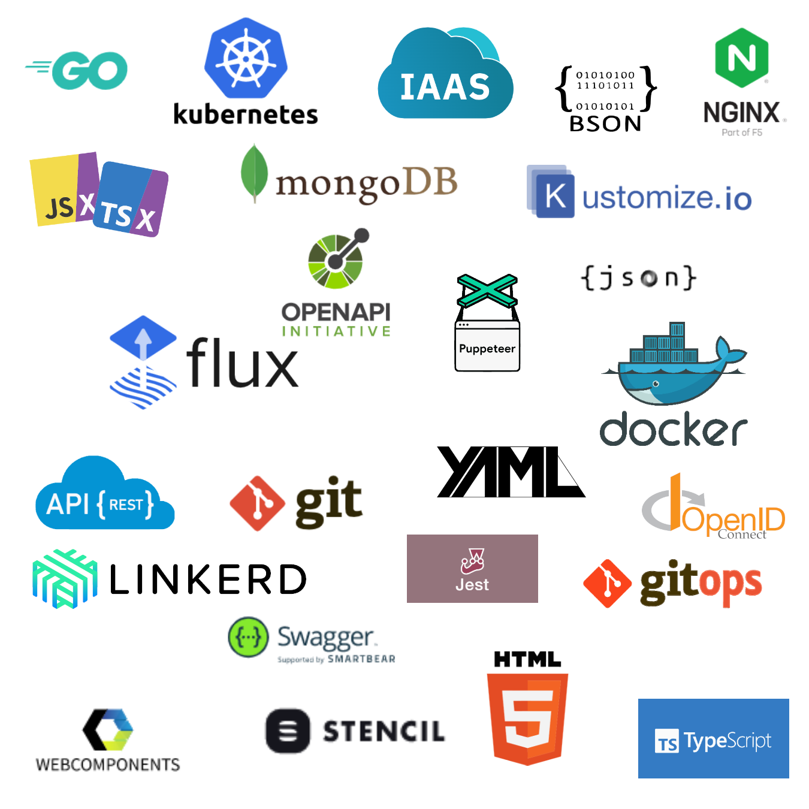

# Úvod

_Vývoj webových aplikácií v prostredí Cloud_ pokrýva oblasť vývoja softvérových
aplikácií, ktoré sú určené pre nasadenie v prostredí verejných dátových a výpočtových
centier, všeobecne označovaných ako _Cloud_. Špecifickým prvkom vývoja takýchto
aplikácií je, že aplikácia je ku koncovým používateľom typicky dodávaná priamo z dátového centra, a tiež, že práca vývojového tímu sa sústredí na všetky
aspekty aplikácie:

* Vývoj používateľského prostredia pre internetové prehliadače alebo mobilné zariadenia.
* Vývoj obchodných pravidiel a databáz na strane servera.
* Návrh a udržiavanie vhodnej infraštruktúry pre nasadenie aplikácie.
* Nasadenie a sledovanie činností vyvíjanej aplikácie.

V praxi sa tento
spôsob vývoja označuje ako _full-stack development_, alebo sa tiež označuje termínom _DevOps_.

Tento text je určený ako skriptá k cvičeniam z predmetu s rovnakým názvom pre študentov
inžinierskeho štúdia informačných technológií. Predpokladom pre jeho štúdium sú
zvládnuté základy programovacích jazykov a operačných systémov.

Agilný spôsob vývoja, ktorý je v súčasnosti typickým spôsobom organizácie softvérových
tímov, sa zameriava na čo najrýchlejšie získanie spätnej väzby od skutočných zákazníkov.
To vyžaduje spôsob vývoja, ktorý v prvom rade uprednostňuje dodanie funkčného produktu,
hoci limitovaného v oblasti čŕt alebo v robustnosti systému. Podobným spôsobom je
štruktúrovaná aj táto učebnica. V prvých častiach sa sústredí na vývoj funkčných,
ale limitovaných webových aplikácií a ich nasadenie, ktorých funkcionalita je postupne
rozširovaná o ďalšie prvky, či už v oblasti funkcionality, správy dát, robustnosti,
alebo zabezpečenia a údržby systému. Podstatná časť látky je podávaná vo forme,
ktorá zodpovedá myšlienkam agilného vývoja, vývoja formou mikro-služieb
(_microservices_) a v duchu pravidiel vyjadrených v manifeste
[_The twelve factor app_][twelves].

Oblasť technológií a nástrojov pre vývoj aplikácií pre Cloud - data centrá je široká
a rýchlo sa vyvíjajúca, nie je možné ju úplne pokryť v jednej učebnici. Látka sa
preto zameriava na v súčasnosti najznámejšie a najčastejšie používané technológie
a nástroje, ktoré sa ale v budúcnosti môžu stať zastaralými alebo budú nahradené
novšou technológiou. V rozsahu je tiež limitovaná časom, vyhradeným na výuku tohto
predmetu.

Cvičenia sú priebežne aktualizované. Obsahujú dve verzie cvičení:

* Angular a Asp.NET boli technológie zvolené pri pôvodnom zostavovaní predmetu v dobe, kedy docker, kubernetes a technika kontajnerizovaných aplikácií ešte len začínala.
* V súčasnosti obsahujú skriptá aj druhú verziu cvičení, založených na technológii _micro front ends_ na báze webových komponentov čo sa týka používateľského rozhrania a využitie programovacieho jazyka Go, čo sa týka implementácie aplikačnej logiky na pozadí. Väčší dôraz je tiež kladený na využitie technológie kontajnerizovaných aplikácií - _Docker_ - a ich orchestrácii na platforme _Kubernetes_.

Predmet je vytvorený a zastrešený komerčným subjektom
[Siemens Healthineers Development Center Slovakia][shsdc], ktorý vyvíja softvérové produkty v oblasti zdravotníctva. Pôvodný text pripravil Milan Unger ako vyučujúci predmetu a do jeho tvorby aktívne prispievajú a podieľajú sa na tvorbe nového aktualizovaného obsahu cvičiaci Peter Cagarda, Ivan Sládečka a Michal Ševčík.
