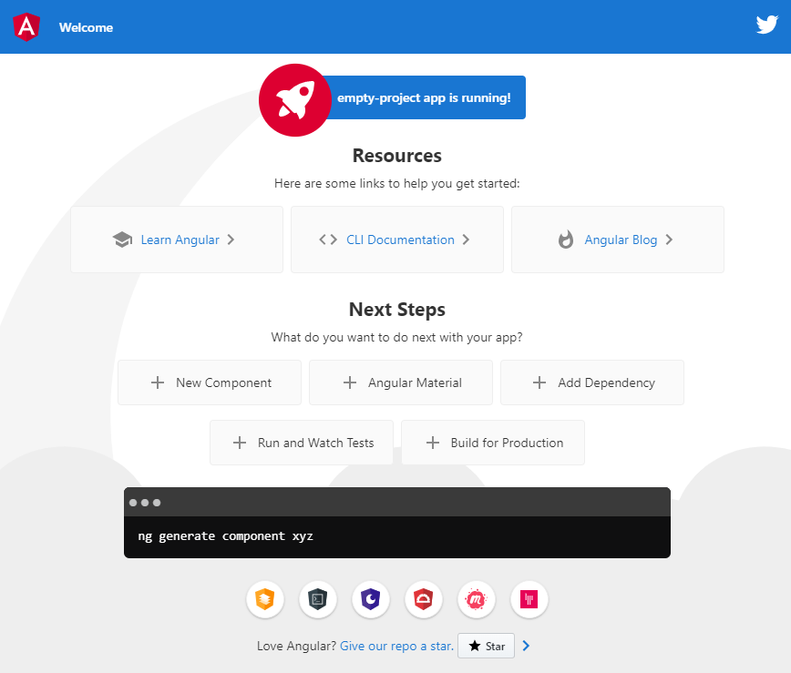
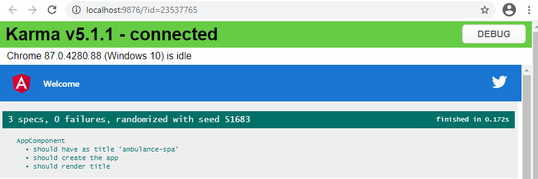

## Kostra aplikácie

1. Otvorte aplikáciu Visual Studio Code, a v nej nový terminál
  (menu `Terminal->New Terminal`)
2. V príkazovom riadku prejdite do priečinku vyhradenom pre cvičenia v tomto predmete.
3. Nainštalujte balík Angular CLI pomocou príkazu:

   ```powershell
   npm install -g @angular/cli
   ```

4. Vytvorte kostru aplikácie pomocou príkazu

   ```powershell
   ng new ambulance-spa
   ```

   Zvoľte `Strict type checking` **Yes** a  `Angular routing` **No**
   (angular routing vysvetlíme neskôr v časti *Smerovanie a navigácia
   medzi panelmi aplikácie*) a `CSS` styling. Vo vašom priečinku je teraz
   nový podpriečinok s názvom `ambulance-spa`

5. V aplikácii Visual Studio Code teraz otvorte tento podpriečinok (angular-spa) - menu
  `File->Open...` a znovu otvorte terminálové okno. Vykonajte v ňom príkaz

   ```powershell
   npm run start
   ```

   Aplikacia sa úspešne skompiluje a výstup obsahuje riadok:

   ```powershell
    ** Angular Live Development Server is listening on localhost:4200,
       open your browser on http://localhost:4200/ **
   ```

   Vo svojom internetovom prehliadači teraz otvorte stránku [http://localhost:4200/](http://localhost:4200/).
   Pokiaľ všetky predchádzajúce kroky prebehli úspešne uvidíte úvodnú stránku
   kostry vašej aplikácie.

   

V tejto chvíli máte vytvorenú kostru jednostránkovej webovej aplikácie s použitím
knižnice Angular. K tomu sme použili nástroj Angular CLI, ktorý pripravil vývojové
prostredie pre potreby typického vývoja a inicializoval git repozitár. K vývoju
aplikácie sa používaju príkazy prostredia [Node JS](https://nodejs.org/en/),
správcu balíkov knižníc [NPM](https://www.npmjs.com/), prostredia príkazového
riadku [Angular CLI](https://cli.angular.io/), ktorý na pozadí využíva kompresný
nástroj [Webpack](https://webpack.js.org/).

Vo svojom adresári nájdete súbor `package.json`, ktorý popisuje základné atribúty
projektu, ako jeho názov, meno autora, verziu, a podobne. Ďalej obsahuje zoznam
knižníc `dependencies` potrebných počas nasadenia aplikácie, a tiež zoznam knižníc
`devDependencies` potrebných počas vývoja aplikácie. Dalšou dôležitou sekciou v
tomto súbore je objekt `scripts`, ktorý popisuje príkazy často používané pri vývoji.
Tieto príkazy možno vykonať pomocou príkazu `npm run <názov-skriptu>`, a je tu možné
doplniť aj vlastné príkazy podľa potreby vývojového tímu.

Ďalším dôležitým súborom je `angular.json`. Tento súbor popisuje nastavenia projektu,
ktoré sa využívajú počas kompilácie, vývoja, a generovania komponentov projektu
s použitím nástroja _Angular CLI_. Pri bežnej práci sa najčastejšie stretnete s
potrebou nasadenia dodatočných súborov a adresárov referencovaných aplikáciou,
ktoré sú uvedené v časti `...architect.build.options.assets`.
Ďalšie dôležité časti súboru:

* `index` určuje úvodnú stránku projektu.
* `main` určuje vstupný bod programu. Typicky je vstupným bodom súbor *main.ts*,
v ktorom je naimplementovaný bootstrapping angular aplikácie. Všimnite si, že pri
bootstrappingu sa odkazujeme na základný modul aplikácie *AppModule*.

## Produkčný build

Príkazom `ng build` (alebo jeho aliasom `npm run build` zadefinovaným v súbore
`package.json`) vybuildujeme developerskú verziu produktu do adresára `dist`.

>info:> Príkaz `ng serve` (alias `npm run start`) tiež builduje aplikáciu, ale nezapisuje
> súbory do výstupného adresára.

Na zbuildovanie produkčnej verzie aplikácie použijeme príkaz `ng build --prod`.
Do adresára `dist` sa vybuilduje produkčná optimalizovaná verzia aplikácie.

Vytvoríme si alias pre produkčný build v súbore `package.json`. Do časti
_"scripts"_ pridajte riadok:

```json
"build-prod": "ng build --prod",
```

A vyskúšajte jeho funkčnosť: `npm run build-prod`.

## Automatizované testy

_Angular-CLI_ generuje pri vytváraní komponentov a služieb aj kostry ich testov.
Nachádzajú sa v súboroch s príponou .spec.ts pri každom komponente a servise.
Automatizované testy vykonajte príkazom

   ```powershell
    > ng test
   ```

  Po chvíli sa zobrazí nové okno s informáciou o vykonaných testoch.

  

  Existujúce testy sú elementárne, kontrolujúce iba či je možné vytvoriť novú
  inštanciu komponentov.

  _Angular-CLI_ stiahne a nainštaluje všetko, čo potrebujete na testovanie Angular
  aplikácie pomocou testovacej knižnice [Jasmine](https://jasmine.github.io/) a
  spúšťača testov [Karma](https://karma-runner.github.io/latest/index.html).

  >info:> Samozrejme môžte použiť aj iné knižnice a spúšťače testov (Mocha,
  Protractor, ...).
