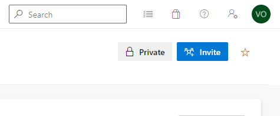
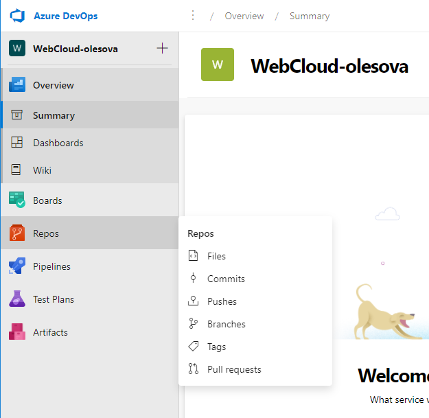
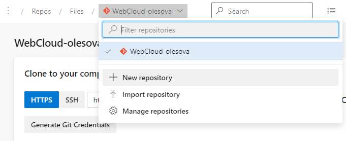
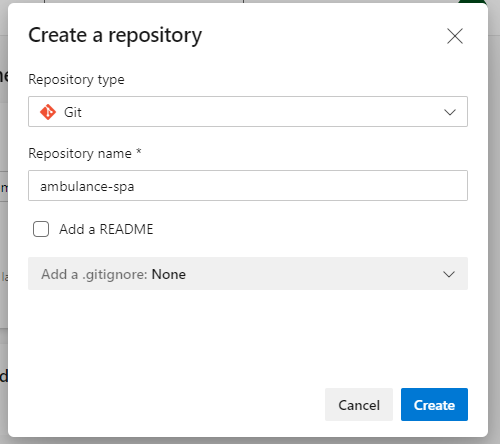
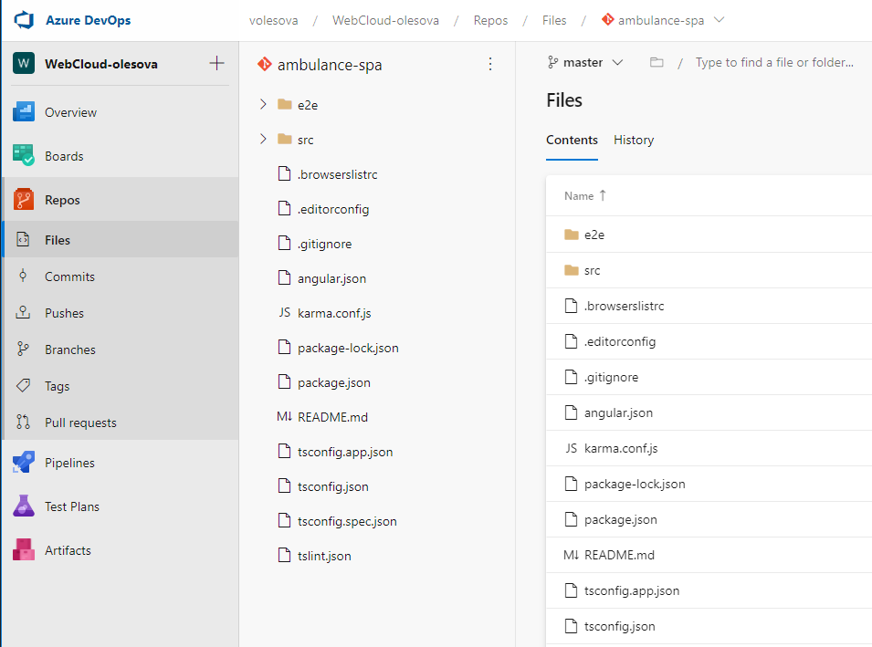

## Vytvorenie repozitára a archivácia kódu

1. Na stránke [Microsoft Azure DevOps Services](https://azure.microsoft.com/en-us/services/devops/)
  sa prihláste do svojho DevOps účtu alebo zvoľte možnosť _Start Free_ a prihláste
  sa so svojou Microsoft identitou, prípadne si novú identitu vytvorte. Následne si
  vytvorte novú organizáciu alebo použite existujúcu, v ktorej máte
  administrátorské oprávnenia.

2. Vytvorte nový privátny projekt a nazvite ho _WebCloud-<vaše priezvisko>_.

   Pridajte cvičiaceho do projektu:

   

   V paneli nástrojov zvoľte _Repos -> Files_ a na novej stránke vytvorte nové
   Git repository s názvom `ambulance-spa`

    

    

    

3. Otvorte súbor `.gitignore` a skontrolujte, že obsahuje riadok so záznamom
  `/node_modules`. Tento súbor určuje, ktoré súbory a podpriečinky sa nemajú
  archivovať, čo vo väčšine prípadov znamená súbory, ktoré je možné znovu vytvoriť
  a balíky, ktoré je možné získať z dostupných zdrojov a iných archívov
  automatizovaným spôsobom.

    ```powershell
    # See http://help.github.com/ignore-files/ for more about ignoring files.

    # compiled output
    /dist
    /tmp
    /out-tsc

    # dependencies
    /node_modules

    # IDEs and editors
    ...
    ```

    >info:> Git repozitár je už nainicializovaný vďaka príkazu ng new, ktorý automaticky vytvára git repozitár v otvorenom adresári a pridáva do repozitára všetky súbory.

    >info:> Doporučujeme nainštalovať do VisualStudia Code extension zjednodušujúcu prácu s gitom (napr. GitLens)

4. Pridajte a odovzdajte do archívu všetky lokálne súbory

    ```powershell
    git add .
    git commit -m 'initial version of ambulance waiting list'
    ```

5. Prepojíme lokány repozitár s Azure DevOps repozitárom.

   >info:> Môžete použiť príkaz vygenerovaný na stránke vášho projektu v DevOps._

    ```powershell
    git remote add origin https://dev.azure.com/<account>/WebCloud-<vaše priezvisko>/_git/ambulance-spa
    ```

   _origin_ je meno, ktorým sme označili vzdialený repozitár.

6. Synchronizujte váš lokálny repozitár so vzdialeným repozitárom. Pri výzve zadajte svoje prihlasovacie
   údaje.

  >info:> Môžte použiť príkaz vygenerovaný na stránke vášho projektu v DevOps.

    ```powershell
    git push --set-upstream origin master
    ```

    V prehliadači skontrolujte, že sú vaše súbory uložené vo vzdialenom repozitári.

    

Počas cvičení budeme používať zjednodušený vývojový proces a pracovať priamo na
vetve `master` repozitára. Pri práci v tíme sa ale odporúča používať vývojový
postup [_Fork and Pull Requests_](https://gist.github.com/Chaser324/ce0505fbed06b947d962),
ktorý je plne podporovaný aj v rámci [_Azure DevOps Services - Pull Requests_](https://docs.microsoft.com/en-us/azure/devops/repos/git/pull-requests).
Git repozitár je možné vytvoriť aj na iných serveroch, napríklad populárnych
[GitHub](https://github.com/), [GitLabs](https://about.gitlab.com/), alebo
[Bitbucket](https://bitbucket.org/). Dôležitým kritériom pri výbere je podpora
automatizovanej kontinuálnej integrácie a nasadenia, profesionálna podpora tímu,
a ľahká správa prostriedkov samotným vývojovým tímom. V kontexte tejto učebnice
budeme pracovať so službami poskytovanými na serveroch _Azure DevOps_.
