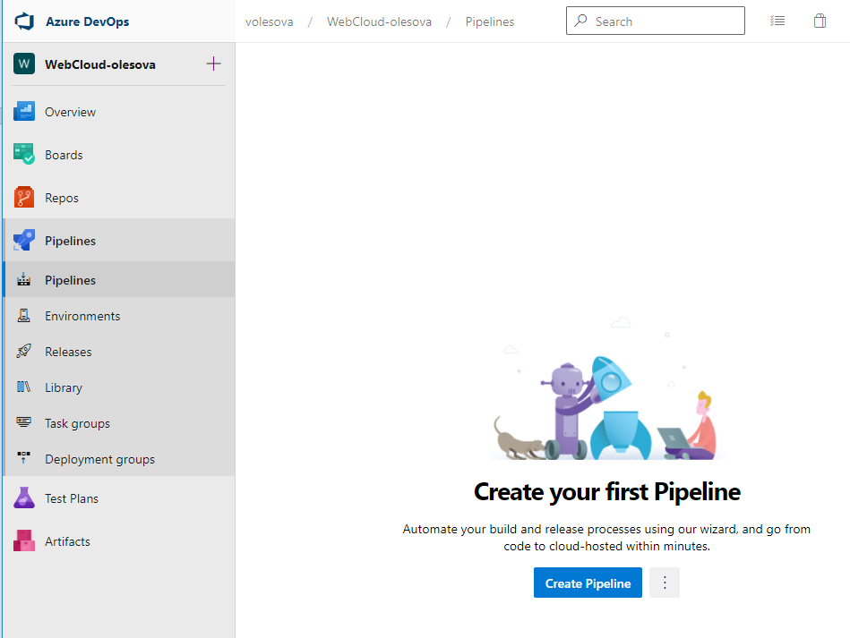
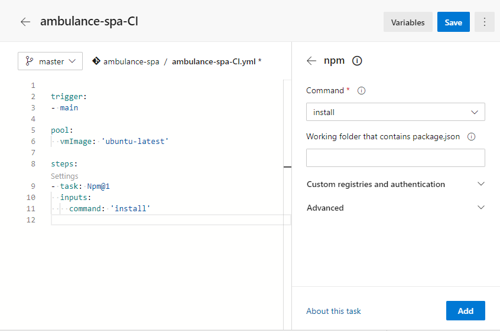
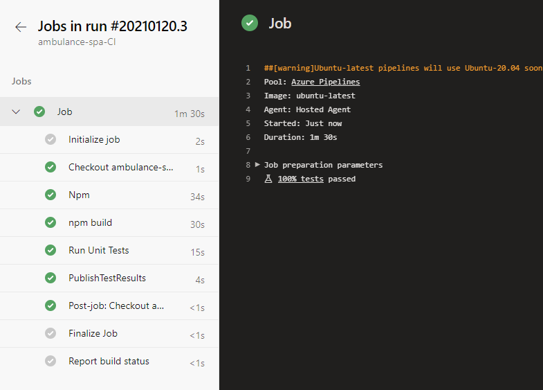
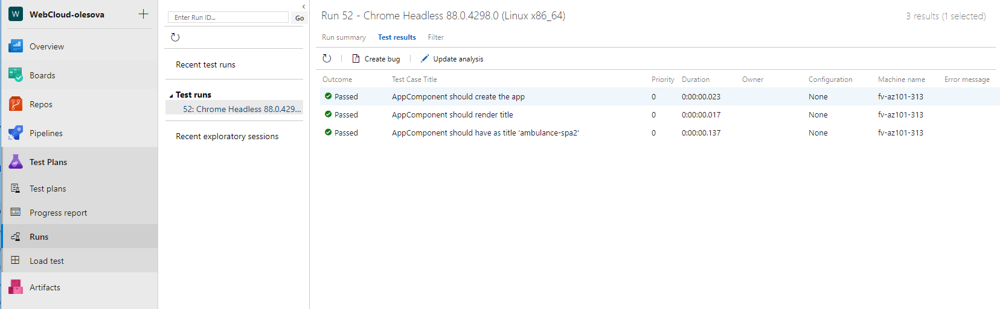
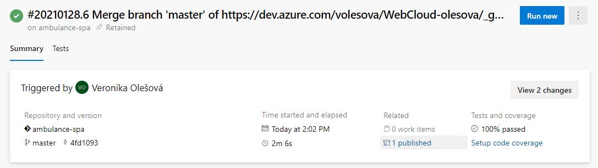

## Automatizovaná priebežná integrácia (_Continuous Integration_)

V nasledujúcich krokoch si vytvoríme build pre automatickú integráciu, aby sme
zaručili, že aplikácia bude vždy buildovateľná a testy stále zelené.

1. Pred tým, ako si vytvoríme buildovaciu *pipeline*, musíme upraviť spôsob spúšťania testov.
   Existujúce testy používajú Chrome v interaktívnom móde, ktorý nie je
   pri automatizovanej integrácii k dispozícii. Upravte preto konfiguráciu
   súboru `karma.conf.js`.

   ```js
   // Karma configuration file, see link for more information
   // https://karma-runner.github.io/1.0/config/configuration-file.html

   process.env.CHROME_BIN = require('puppeteer').executablePath();

    module.exports = function (config) {
        config.set({
            basePath: '',
            frameworks: ['jasmine', '@angular-devkit/build-angular'],
                plugins: [
                    require('karma-jasmine'),
                    require('karma-chrome-launcher'),
                    require('karma-jasmine-html-reporter'),
                    require('karma-junit-reporter'), //  <--
                    require('karma-coverage'),
                    require('@angular-devkit/build-angular/plugins/karma')
                ],
        ...
            reporters: ['progress', 'kjhtml', 'junit'],
            junitReporter: {
                outputDir: '.',
                outputFile:'test-report.xml'
            },
        ...
    ```

   a doinštalujte [Puppeteer](https://developers.google.com/web/tools/puppeteer/)
   ako ďalšiu závislosť.

   ```powershell
   npm install --save-dev puppeteer karma-junit-reporter
   ```

   Overte úspešnosť behu testov.

   ```powershell
   npm run test
   ```

   Do súboru `ambulance-spa/.gitignore` pridajte nový vzor

   ```powershell
   # See http://help.github.com/ignore-files/ for more about ignoring files.

   # compiled output
   /dist
   /tmp
   /out-tsc

   # test-reports
   **/test-report.xml
   ```

   Uložte novú verziu kódu do git archívu

   ```powershell
   git add .
   git commit -m 'prepared for CI'
   git push
   ```

2. Prejdite do svojho účtu _Microsoft Azure DevOps_
   [https://dev.azure.com/_account_](https://dev.azure.com/), do panelu
   _Pipelines -> Pipelines_ a vytvorte novú _pipeline_.

     

   >info:> Pôvodný spôsob vytvárania buildov (vyklikávaním taskov) je stále prístupný cez *Use the
   classic editor* linku naspodu stránky.

   My vytvoríme YAML build. Definícia buildu je potom súčasťou zdrojového kódu, čo prináša
   s tým súvisiace výhody: históriu, review, rollback, reuse, branching...

3. Vyberte položku `Azure Repos Git YAML`. Na ďaľšej stránke zvoľte svoj repozitár a
   nakoniec z preddefinovaných templatov vyberte `Starter pipeline`. Bude vygenerovaný
   nasledovný yaml kód:

   ```yaml
      trigger:
      - main

      pool:
        vmImage: 'ubuntu-latest'

      steps:
      - script: echo Hello, world!
        displayName: 'Run a one-line script'

      - script: |
         echo Add other tasks to build, test, and deploy your project.
         echo See https://aka.ms/yaml
        displayName: 'Run a multi-line script'
   ```

   Každá pipeline sa skladá z jedného alebo viacerých `Stage`-ov. Stage sa skladá
   z jedného alebo viacerých `Job`-ov. Stage môže byť napr. "Build this app",
   "Deploy to production". Job sa skladá z `Task`-ov, ktoré sú základnou jednotkou buildu.

   Ak máme v builde iba jeden Stage s jedným Job-om, nemusíme ich v yaml explicitne
   definovať, čo je aj náš prípad.

   >info:>  Viac detajlov a popis pre yaml schému buildov nájdete tu: [Pipeline yaml schema](https://docs.microsoft.com/en-us/azure/devops/pipelines/yaml-schema?view=azure-devops&tabs=schema%2Cparameter-schema).

   `Trigger` je nastavený na `main` vetvu, tzn. že build sa spustí pri každom komite
   do hlavnej vetvy. **Týmto je zabezpečená kontinuálna integrácia.**

   >warning:> Koncom roku 2020 sa objavili správy, že Mirosoft premenuje hlavnú vetvu z
   > `master` na `main`. Na niektorých miestach sa to prejavilo, niekde ešte nie.
   > Ak sa vaša hlavná vetva volá `master` premenujte `main` v časti `trigger`
   > na `master`.

   Ďaľšia položka - `pool` pomenúva build agenta, na ktorom sa má pipeline vykonať.

   >info:> K dispozícii máte rôzne súbory agentov, ktoré sú poskytované v rámci služby _Microsoft Azure
   > DevOps_. V bezplatnom pláne máte k dispozícii limitovaný počet minút (60 na
   > deň), počas ktorých môžte využívať týchto agentov.

   Defaultne je `pool` nastavený na `ubuntu-latest`. Môžeme (ale nemusíme) si to zmeniť
   na `windows-2019`, výsledok je v oboch prípadoch rovnaký. Z empirickej skúsenosti býva
   windows build viac ako 2-krát pomalší ako na linuxe.

4. Kliknite na `Show asisstant` vpravo hore. Vyroluje sa nám zoznam preddefinovaných
   taskov, ktoré nám uľahšia tvorbu pipeliny.

5. Premenujte pipeline na `ambulance-spa-CI.yml` a vymažte všetky tasky.

6. Ako prvý pridáme krok na nainštalovanie knižníc. V asitentovi taskov napravo si
   vyberte typ `npm`, Ponechajte pôvodné nastavenie `install` a pridajte ju tlačítkom
   `Add` do pipeliny.

   

   Vykonanie tohoto kroku zabezpečí nainštalovanie npm knižníc podľa konfigurácie
   uvedenej v súbore `package.json`. Štandardné nastavenie predpokladá, že súbor
   `package.json` je uložený v koreňovom priečinku repozitára.

7. V nasledujúcom kroku vybuildujeme náš projekt. Pridajte ďalšiu úlohu typu `npm`,
   Zmeňte príkaz, ktorý sa má vykonávať na `custom` a do poľa _Command and arguments_
   zadajte `run build-prod`. (Chceme buildovať produkčnú verziu aplikácie.) Po
   pridaní medzi naše kroky, si úlohu pomenujte `npm build` (kľúčové slovo `displayName`).

   ```yaml
   - task: Npm@1
      displayName: npm build
      inputs:
         command: 'custom'
         customCommand: 'run build-prod'
   ```

   >info:> Keďže `npm` príkaz je obyčajný príkaz z príkazového riadku, a zároveň je
   > to v tomto prípade alias pre `ng`, môže sa tento krok zapísať aj nasledovne.
   > Vyberte task typu _Command Line_ a do poľa _Script_ zadajte text **./node_modules/.bin/ng build --prod**
   >
   > Výsledný task bude vyzerať nasledovne:
   >
   > ```yaml
   > - task: CmdLine@2
   >   displayName: Build production
   >   continueOnError: true
   >   inputs:
   >      script: './node_modules/.bin/ng build --prod'
   > ```
   >

   >warning:> Používajte v príkazovom riadku iba normálne lomítko "/" a nie opačné
   > (backslash) "\\". Na linuxovom build agentovi sa príkaz s opačným lomítkom nevykoná,
   > a na windows agentovi je to jedno.

8. V ďaľšom kroku chceme vykonať unit testy. Pridajte úlohu typu _Command Line_.
   Do poľa _Script_ zadajte text

   ```powershell
   ./node_modules/.bin/ng test --watch=false --reporters=junit,progress --browsers=ChromeHeadless
   ```

   Po pridaní do pipeliny pridajte tasku meno (`displayName: Run Unit Tests`). Task
   by mal vyzerať nasledovne:

   ```yaml
   - task: CmdLine@2
      displayName: Run Unit Tests
      inputs:
         script: './node_modules/.bin/ng test --watch=false --reporters=junit,progress --browsers=ChromeHeadless'
   ```

9. V poslednom kroku uložíme výsledky testov.
   Pridajte ďalšiu úlohu typu _Publish Test Results_. Štandardné nastavenie vyhovuje
   našej konfigurácii; zmeňte iba položku `Test results files` z _\*\*/TEST-\*.xml_ na
   _\*\*/test-\*.xml_. (lebo výsledky testov sa nám ukladajú do súboru test-report.xml
   a linuxový file system je case sensitive.)

   Celá pipeline má 4 tasky:

   ```yaml
   trigger:
   - master

   pool:
     vmImage: 'ubuntu-latest'

   steps:
   - task: Npm@1
     inputs:
       command: 'install'
   
   - task: Npm@1
     displayName: npm build
     inputs:
       command: 'custom'
       customCommand: 'run build-prod'
   
   - task: CmdLine@2
     displayName: Run Unit Tests
     inputs:
      script: './node_modules/.bin/ng test --watch=false --reporters=junit,progress --browsers=ChromeHeadless'
   
   - task: PublishTestResults@2
     inputs:
       testResultsFormat: 'JUnit'
       testResultsFiles: '**/test-*.xml'
   ```

   Stlačte na tlačidlo _Save_ a spustite pipeline klikom na _Run_.
   Otvorí sa stránka zobrazujúca priebeh integrácie, kde môžete sledovať aktuálny
   stav kompilácie, prípadne si prezrieť zaznamenaný výstup vykonávaných príkazov.
   Týmto spôsobom môžete identifikovať prípadné chyby, ktoré sa prejavujú len počas
   kontinuálnej integrácie.

   

   Po chvíli zistíte, že Váš _build_ skončil úspešne. Zároveň uvidíte vo svojej schránke
   elektronickej pošty správu s oznámením o úspešnom behu integrácie.

10. Prejdite do záložky _Test Plans -> Runs_ a dvojitým kliknutím prejdite na detaily
   práve vykonaných a zverejnených testov. Časť _Test plans_ vám umožňuje mať prehľad
   o kvalite vašich testov a stabilite aplikácie.

    

11. Na záver pridáme krok na uloženie výstupu buildu (tzv. artefaktu), ktorý budeme
    potrebovať pri nasadení do cloudu. Pridajte novú úlohu _Publish Pipeline Artifact_.
    Do poľa _File or directory path_ zadajte cestu `./dist` - obsah adresára, ktorý je
    výsledkom kompilácie vykonávanej v tejto zostave. Do _Artifact name_ zadajte
    `SPA-DROP` a _Artifact publish location_ nechajte na `Azure Pipelines`.

    ```yaml
    - task: PublishPipelineArtifact@1
      inputs:
        targetPath: './dist'
        artifact: 'SPA-DROP'
        publishLocation: 'pipeline'
    ```

V tejto chvíli máte funkčnú kontinuálnu integráciu vašej web aplikácie.
Uložte zostavu, build sa pustí automaticky.

Na overenie, či funguje kontinuálna integrácia, skúste vykonať akúkoľvek zmenu v
zdrojových súboroch, napríklad doplnenie komentára a pomocou príkazov git túto
zmenu archivovať vo vzdialenom repozitári:

```powershell
git add .
git commit -m 'prepared for CI'
git push
```

Po chvíli uvidíte v záložke _Pipelines -> Pipelines_ automatické naštartovanie
integračnej zostavy. Po jej úspešnom dokončení, si môžte vo výsledkoch zostavy
prezrieť a prevziať vytvorený artefakt `SPA-DROP` a prípadne ho nasadiť do
verejného dátoveho centra. Tento artefakt je archivovaný po dobu uchovávania
výsledkov zostavy. To umožňuje vrátiť sa k poslednej funkčnej verzii aplikácie.



V tejto chvíli máme pre náš projekt nastavenú kontinuálnu integráciu. Vždy, keď
niektorý člen tímu archivuje novú verziu zdrojových súborov pre používateľské
rozhranie implementované v knižnici Angular, automaticky sa vykoná kompilácia kódu,
beh testov a vytvorenie artefaktov pre nasadenie týchto aplikácií vo verejnom
dátovom centre.
