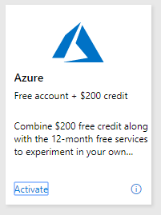
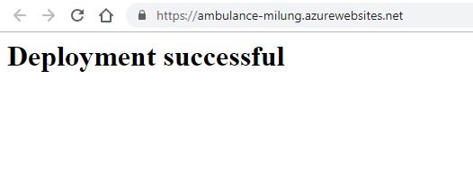

## <a name="CD"></a>Manuálne nasadenie aplikácie v Microsoft Azure

Napriek tomu, že s vývojom aplikácie sme ešte nezačali, doporučujeme už v tejto fáze
nakonfigurovať *Kontinuálne nasadenie* aplikácie. To znamená, že ju budeme môcť ukázať
potencionálnym zákazníkom a komunikovať s nimi, či aplikácia spĺňa ich očakávania
a predstavy o funkcionalite konečného diela.

Vývoj v krátkych cykloch a rýchla spätná väzba sú podstatou agilného vývoja.
Možnosť práce s reálnou aplikáciou - namiesto PowerPoint prezentácie - a možnosť
pristúpiť k aplikácii v ľubovoľnom čase, umožňuje získať relevantnú spätnú väzbu.
Naším cieľom je preto čo najskôr túto aplikáciu nasadiť do verejného dátového centra.

Najjednoduchší spôsob ako nasadiť aplikáciu, je manuálne prekopírovať súbory na miesto
v cloude. To je vhodné napr. v prípade keď nemáme k dispozícii kontinuálnu integráciu
alebo vyvíjame aplikáciu lokálne.
To si ukážeme v nasledujúcich krokoch. V ďaľšej kapitole si nakonfigurujeme Kontinuálne
nasadenie.

1. Prejdite na stránku [Visual Studio Dev Essentials](https://visualstudio.microsoft.com/dev-essentials/),
  pripojte sa k službám a aktivujte si voľný účet k _Microsoft Azure_ službám.
  Pri aktivácii budete požiadaný o údaje o kreditnej karte, nebudú ale uplatnené
  voči nej žiadne poplatky, pokiaľ sa tak explicitne nerozhodnete. Pri cvičeniach
  budeme používať len služby, ktoré sú zdarma.

   

   Po aktivácii, budete presmerovaný na stránku [https://portal.azure.com](https://portal.azure.com),
   na ktorej môžete spravovať svoje prostriedky vo verejnom dátovom centre
   _Microsoft Azure_.

2. V portáli zvoľte v ľavom paneli položku _+ Create a resource_ a zvoľte
   _Web App_.  Zadajte:

   * Meno aplikácie, napr. `ambulance-<inicialy>`. Toto meno bude použité ako
   názov servera, na ktorom bude vaša aplikácia vystavená, preto musí byť názov
   jedinečný.
   * Skupinu prostriedkov - _Resource Group_ - pomenujte `WebInCloud-Dojo`.
   Skupina prostriedkov združuje prostriedky patriace k jednej logickej aplikácii,
   a umožňuje nakladať s viacerími prostredkami ako s jedným celkom ( zrušenie,
   vytvorenie, presun medzi účtami a podobne).
   * V rámci sekcie _Instance Details_:
      * V riadku _Publish_ vyberte `Code` (neskôr si ukážeme, ako si nasadiť aplikáciu ako docker kontainer).
      * V riadku _Runtime stack_ zvoľte `.NET Core 3.1 (LTS)`.
      * Ako _Operating System_ nastavte `Windows`.
      * V riadku _Region_ zvoľte `West Europe` (dátové centrum v Holandsku).
   * Zvoľte nový aplikačný plán. Pomenujte ho `WebInCloud-DojoServicePlan` a zmeňte
   štandardné nastavenie (Standard S1) na cenovú úroveň (_Pricing Tier_) _F1 Free_.

   Potvrďte vašu voľbu a vytvorte nový prostriedok webovej aplikácie.

   

   Po chvíli sa v portáli vo vašich notifikáciach zobrazí nová správa
   _Deployment succeeded_. Zvoľte voľbu _Pin to Dashboard_ a potom
   _Go to Resource_. V prehľade webovej aplikácie (_Overview_) vidíte odkaz -
   _URL_- na novú aplikáciu. Otvorte tento odkaz v novom okne.

   

   

3. Vráťte sa do [portálu Azure](https://portal.azure.com) a v záložke _Deployment
   Center_ zvoľte metódu _FTP_ (potom click na tlačítko _Dashboard_ dole na stránke).
   Použite uvedenú URL a prístupové údaje na otvorenie FTP lokality v aplikácii
   _Windows Explorer_ (neukladajte heslo).

   

   Vytvorte lokálne na disku nový súbor _index.html_ s následovným obsahom:

   ```html
   <title>Test FTP deployment</title>
   <h1>Deployment successful</h1>
   ```

   Zmažte v priečinku `wwwroot` súbor `hostingstart.html` a skopírujte do neho náš nový súbor `index.html`.

   

   Prejdite na URL vašej aplikácie z kroku 2. Vo výsledku vidíte vašu novú
   aplikáciu obslúženú z verejného dátoveho centra.

   

    >info:> Iniciálne načítanie stránky môže byť oneskorené o niekoľko sekúnd.
    > Toto je spôsobené optimalizáciou prostriedkov v dátovom centre pre prostriedky
    > v cenovej úrovni _Free_.
