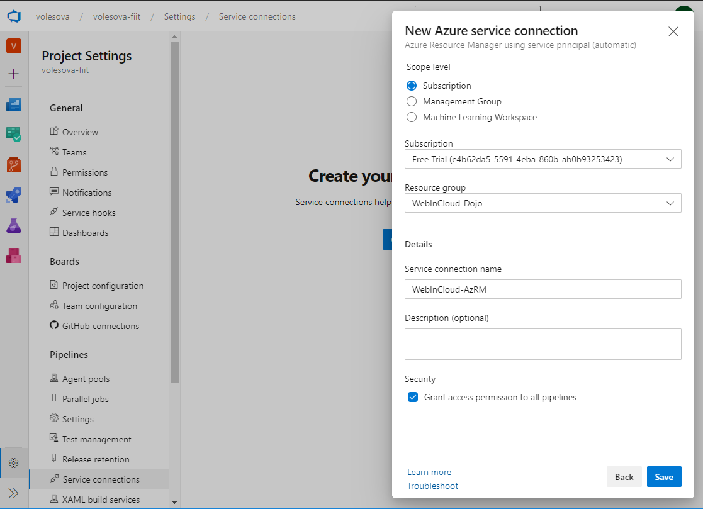

## Automatizované priebežné nasadenie a riadenie verzií (_Continual Deployment_)

1. Vytvorte nové servisné pripojenie na skupinu zdrojov `WebInCloud-Dojo`. Vo svojom
   účte _Microsoft Azure DevOps_ [https://dev.azure.com/<account>](https://dev.azure.com/),
   prejdite do projektu `WebCloud-<vaše priezvisko>` a následne do panelu _Project Settings
   -> Service Connections_.

   Prepojenie na externé služby stačí vykonať len raz, potom sú k dispozícii aj pre
   ostatných používateľov, podľa nastavenia prístupu k danému prepojeniu. Zvoľte
   _Create service connection_ a v zobrazenom dialógovom okne vyberte položku
   _Azure Resource Manager_.

   

   V nasledujúcom okne ponechajte predvolenú autentifikačnú metódu `Service principal (automatic)`.
   V tejto chvíli budete vyzvaný na prihlásenie sa do vašeho _Microsoft Azure_ konta. (_Pokiaľ máte
   v prehliadači aktívne blokovanie vyskakovacích okien, povoľte ich pre túto stránku._)

   Po prihlásení sa uvidíte v dialógovom okne pole _Scope level_ s vybranou položkou `Subscription`,
   ktorú nemeníme. V poli _Subscription_ zvoľte príslušné predplatné, v ktorom ste vytvorili skupinu
   zdrojov (_Resource Group_) pre tieto cvičenia. Následne rozbaľte zoznam v poli _Resource Group_ a
   zvoľte skupinu zdrojov s názvom `WebInCloud-Dojo`. Do poľa _Service Connection Name_ zadajte názov
   `WebInCloud-AzRM` a pole _Grant access permission to all pipelines_ ponechajte
   začiarknuté. Výber potvrďte stlačením tlačidla _Save_.

   

2. Prejdite do panelu _Pipelines->Releases_ a stlačte tlačidlo _New pipeline_.
   Zvoľte šablónu _Azure App Service deployment_ a stlačte tlačidlo _Apply_.

   

   Na ďalšej stránke potom pomenujte novú fázu (_stage_) ako `Continuous deployment`.

   

3. Stlačte na blok s nápisom _Add an artifact_. V zobrazenom dialógu zvoľte v sekcii
   _Source type_ položku _Build_, v poli _Project_ vyberte `WebCloud-<vaše priezvisko>`,
   v poli _Source (build pipeline)_ vyberte `ambulance-spa-CI`, v poli _Default version_
   vyberte `Latest`, a do poľa _Source Alias_ zadajte `SPA-DROP`. (_Source alias
   nemusí byť zhodný z názvom artefaktu v integračnej zostave_). Nakoniec stlačte tlačidlo _Add_.

   

   Stlačte na ikonu _Continuous deployment trigger_ (blesk) v rohu bloku _SPA Drop_
   a prepnite ho do stavu _Enabled_

   

4. Stlačte na odkaz úloh v bloku vytvorenej fázy (text _1 job, 1 task_) a prejdite
   na stránku editovania zostavy úloh tejto fázy.

   Kliknite na prvú položku _Continuous deployment_ a v poli _Azure subscription_ vyberte
   položku `WebInCloud-AzRM`, ktorú ste vytvorili v bode 1. V poli _App service name_
   potom vyberte webovú aplikáciu, ktorú ste nasadili v predchádzajúcej kapitole.

   

   Premenujte zostavu (_Agent Job_) na `SPA deployment job`, potom do nej pomocou tlačidla
   _+ Add a task..._ pridajte úlohu typu _Download Build Artifacts_ a posunte ju na prvé miesto.
   V poli _Download artifacts produced by_ zvoľte možnosť _Specific build_, v poli
   _Project_ vyberte `WebCloud-<vaše priezvisko>`, v poli _Build pipeline_ vyberte `ambulance-spa-CI`,
   zaškrtnite voľbu _When appropriate..._. V poli _Artifact name_ zadajte `SPA-DROP`.

   

   Ak tam nebola pridaná automaticky, pridajte do zostavy _Spa deployment job_ úlohu typu
   _Deploy Azure App Service_. Táto úloha nám umožní nasadiť našu webovú aplikáciu do verejného
   dátového centra Microsoft Azure. V poli _Package or folder_ zadajte
   `$(System.DefaultWorkingDirectory)/SPA-DROP/SPA-DROP/ambulance-spa`
   (_Môžete stlačiť na tlačidlo s troma bodkami, a vybrať adresár artefaktu._). V sekcii
   _Additional Deployment Option_ zaškrtnite možnosť _Select deployment method_ a potom _Take App Offline_.

   

5. Zmeňte názov zostavy na `CD pipeline` a uložte ju stlačením tlačidla _Save_.

   

   V tejto chvíli máte vytvorenú zostavu pre priebežné nasadenie SPA aplikácie.
   Po každom úspešnom behu zostavy priebežnej integrácie, a publikovaní nového
   artefaktu tejto zostavy, sa tento artefakt automaticky nasadí do verejného
   dátoveho zdroja.
  
6. Prejdite opäť do záložky _Pipeline_ a v bloku _Continuous deployment_ stlačte
   na ľavý ovál (_Pre-deployment conditions_).
   V zobrazenom dialógovom okne zvoľte spúšťač _After release_ a povoľte voľbu _Artifact
   filters_. Následne rozbaľte zoznam _+ Add_ a vyberte artifakt `SPA-DROP`. Vo
   filtri nastavte pole _Type_ na hodnotu _Include_ a pole _Build branch_ na
   hodnotu `master`.

   

7. Vedľa tlačidla `Save` sa po uložení aktivuje tlačidlo `Create Release` (v zobrazenom
   okne ponecháme stage na predvolenom `Automated trigger`) a stlačte tlačidlo `Create`.

   

   V ľavom navigačnom paneli prejdite na záložku _Pipelines -> Releases_. V tomto
   zobrazení môžte sledovať vykonávané a predchádzajúce vydané verzie. Stlačte
   na práve vytváranú verziu, počkajte kým sa ukončí.

   Prejdite do záložky _Pipeline_, v ktorej môžte vidieť súhrnne detaily o tejto verzii.

   

   Skontrolujte, že vaša aplikácia je stále dostupná a pracuje správne.

    >info:> Táto verzia (_Release_) bola odštartovaná manuálne, odteraz ale každý
    > úspešný build SPA artefaktu vytvorí novú verziu a nasadí ju do
    > datacentra Microsoft Azure.
  
   Overíme si, či je naša CD konfigurácia v poriadku. Zmeňte v kóde aplikácie napr. súbor
   app.component.html, komitnite zmenu a synchronizujte
   s remote repository. Spustí sa CI build kontinuálnej integrácie a po ňom aj deployment.

8. V tejto chvíli máte kompletnú konfiguráciu pre priebežnú integráciu a nasadenie
   vášej aplikácie. Typicky je automatizované nasadenie limitované na vývojarské
   verzie (tzv. _canary builds_), produkčné systémy často vyžadujú aj manuálne zásahy,
   kontrolu kvality, či správne načasovanie zverejnenia novej verzie. _Microsoft
   Azure Pipelines_ umožňujú ďalšiu (semi-)automatizáciu kontrolu verzií a ich
   systematické riadenie. Viď napríklad obrázok nižšie, kde je zobrazený zjednodušený
   vymyslený proces pre automatické nasadenie, manuálnu kontrolu kybernetickej bezpečnosti
   a následné automatizované nasadenie do rôznych produkčných systémov.

   
