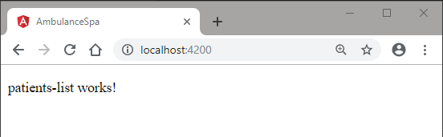
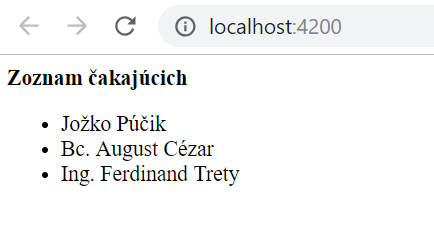

## Komponent _Poradie pacientov_

Teraz vytvoríme náš prvý komponent, ktorý bude zobrazovať poradie čakajúcich.
Predpokladáme, že máme k dispozícii zoznam pacientov, ktorý vizualizujeme na
stránke. Neskôr si tento komponent vizuálne prispôsobíme pomocou knižnice
_Angular Materials_.

1. Pokiaľ ste tak ešte nespravili, spustite vývojový server príkazom:

    ```powershell
    npm run start
    ```

2. Vygenerujte nový komponent pomocou príkazu

    ```powershell
    ng generate component patients-list
    ```

3. Otvorte najprv súbor `src\app\app.component.html` a upravte ho:
    ```html
    <app-patients-list></app-patients-list>
    ```
    V prehliadači by ste mali vidieť obnovenú stránku aplikácie

    

4. V priečinku `src/app` je vytvorený nový podpriečinok s názvom `patients-list`.
  V tomto podpriečinku vytvorte nový súbor s názvom `waiting-entry-model.ts` a nasledovným obsahom:
    ```ts
    export interface WaitingEntryModel {
        name: string;
        patientId: string;
        waitingSince: Date;
        estimatedStart: Date;
        estimatedDurationMinutes: number;
        condition: string;
    }
    ```

5. V tom istom priečinku vytvorte súbor `patients-list-mock.ts` s nasledovným obsahom:
    ```ts
    import { WaitingEntryModel } from './waiting-entry-model';

    export class PatientsListMock {
        private static readonly MINUTE = 60 * 1000;
        public static patients: WaitingEntryModel[] =
            [{
                name: 'Jožko Púčik',
                patientId: '10001',
                waitingSince: new Date(Date.now() - 10 * PatientsListMock.MINUTE),
                estimatedStart: new Date(Date.now() + 65 * PatientsListMock.MINUTE),
                estimatedDurationMinutes: 15,
                condition: 'Kontrola'
            }, {
                name: 'Bc. August Cézar',
                patientId: '10096',
                waitingSince: new Date(Date.now() - 30 * PatientsListMock.MINUTE),
                estimatedStart: new Date(Date.now() + 30 * PatientsListMock.MINUTE),
                estimatedDurationMinutes: 20,
                condition: 'Teploty'
            }, {
                name: 'Ing. Ferdinand Trety',
                patientId: '10028',
                waitingSince: new Date(Date.now() - 72 * PatientsListMock.MINUTE),
                estimatedStart: new Date(Date.now() + 5 * PatientsListMock.MINUTE),
                estimatedDurationMinutes: 15,
                condition: 'Bolesti hrdla'
            }];
    } 
    ```
    Tento mock sme úmyselne dali do zvláštneho súboru, jeho obsah simuluje návratovú hodnotu zo servera, ktorý ešte nemáme k dispozícii.

6.  Otvorte súbor `patients-list.component.ts` a upravte ho do podoby:

    ```ts
    import { Component, OnInit } from '@angular/core';
    import { Observable, of } from 'rxjs';
    import { WaitingEntryModel } from './waiting-entry-model';
    import { PatientsListMock } from './patients-list-mock';

    @Component({
        selector: 'app-patients-list',
        templateUrl: './patients-list.component.html',
        styleUrls: ['./patients-list.component.css']
    })
    export class PatientsListComponent implements OnInit {
        public readonly patients: Observable<WaitingEntryModel[]>;

        constructor() {
            this.patients = of(PatientsListMock.patients);
        }

        ngOnInit(): void {}
    }
    ```

    Atribút `selector` definuje meno elementu, ktorý budeme používať pri vizualizácii
    tohto komponentu, atribút `templateUrl`, a atribút `styleUrl` odkazujú na súbory,
    v ktorých je definovaná šablóna html a definícia štýlov pre tento komponent.
    V tejto fáze projektu využijeme lokálnu náhradu zoznamu čakajúcich. Vopred
    predpokladáme, že tento zoznam bude poskytovaný asynchrónnym spôsobom.

7. Otvorte súbor `patients-list.component.html` a upravte ho do nasledujúcej podoby:

    ```html
    <div class='patients-list'>Zoznam čakajúcich</div>
    <ul>
        <li *ngFor="let entry of (patients | async)">
            {{entry.name}}
        </li>
    </ul>
    ```

    V tejto šablóne sme využili direktívu `*ngFor` pre zobrazenie zoznamu čakajúcich.
    Výstup je jednoduchý, našim cieľom je ale vytvoriť rozhranie, ktoré je používateľsky
    atraktívne. Jednou možnosťou je upraviť CSS štýl, ktorý komponent využíva:

8. Upravte súbor `patients-list.component.css`:

    ```css
    .patients-list {
        font-weight: bold;
    }
    ```

    V tomto stave sme získali výstup v podobe:

    

9. Spustite a skontrolujte funkčnosť testov:
    ```powershell
    ng test
    ```
    Výsledkom sú spadnuté testy. V súbore `app.component.spec.ts` pridajte `PatientsListComponent` do deklarácií testovacieho modulu. 
    Vymažte posledný test. Spustite testy.

10. Komitnite vaše zmeny do repozitára a synchronizujte so vzdialeným repozitárom. 
Skontrolujte, či boli vaše zmeny úspešne zbuildované a nasadené na Azure.

Pokiaľ by sme chceli ďalej zlepšovať vizuálnu podobu, môžme použiť niektorú z
existujúcich knižníc pre responsive design, ako napríklad
[Bootstrap](https://getbootstrap.com/). V našom prípade využijeme knižnicu
[Angular Material](https://material.angular.io/).