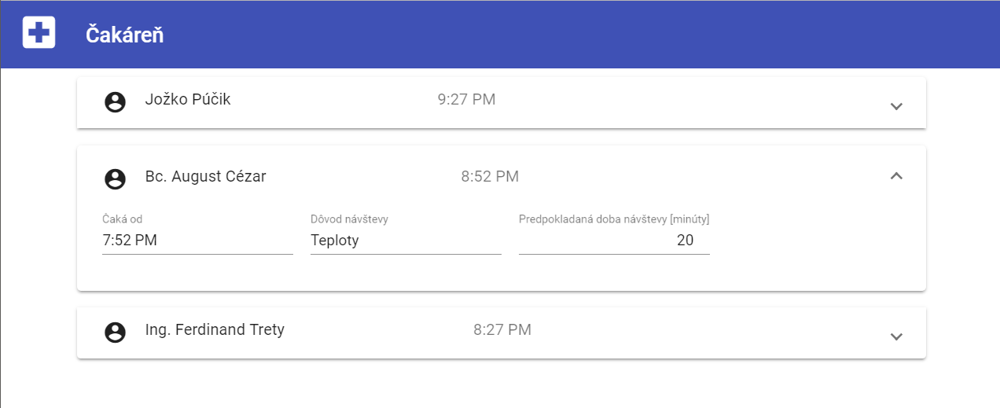
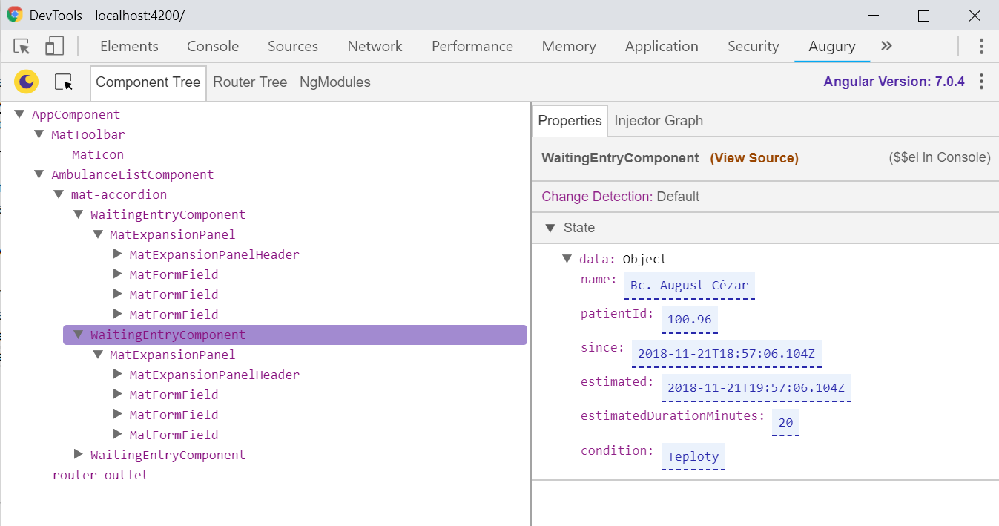

## Použitie knižnice _Angular Material_

Knižnica [Angular Material](https://material.angular.io/) poskytuje elementy
(komponenty) pre aplikácie založené na knižnici Angular, dodržiavajúce princípy
responzívneho rozhrania v štýle [Material Design](https://material.io/)

1. Nainštalujte knižnicu _Angular Material_, a podporu pre ovládanie dotykovými gestami:

    >info:> Postupujte podľa popisu nižšie, ktorý je odvodený od postupu uvedenom
    > na stránke [Angular Material - Getting Started](https://material.angular.io/guide/getting-started).

    ```powershell
    ng add @angular/material
    ```

    Zvoľte tému _indigo-pink_, podporu pre typografiu, a podporu pre animácie

    ```powershell
    ? Choose a prebuilt theme name, or "custom" for a custom theme: Indigo/Pink
        [ Preview: https://material.angular.io?theme=indigo-pink ]
    ? Set up global Angular Material typography styles? Yes
    ? Set up browser animations for Angular Material? Yes
    ```

     >info:> Ak vám doteraz bežal vývojový server, je potrebné ho reštartovať, aby boli správne načítané nové balíky. Ukončite (Ctrl + C) bežiaci skript, a nanovo spustite

     ```powershell
     npm run start
     ```

2. Pridajte lištu aplikácie do aplikačného komponentu. Doplňte referenciu na modul
   [MatToolbarModule](https://material.angular.io/components/toolbar/overview) a
   [MatIconModule](https://material.angular.io/components/icon/overview) v súbore
   `src/app/app.module.ts`:

   ```ts
   ...
   import { MatToolbarModule } from '@angular/material/toolbar';
   import { MatIconModule } from '@angular/material/icon';

   @NgModule({
   ...
   imports: [ ... MatToolbarModule, MatIconModule],
   ...
   })
   export class AppModule { }
   ```

   a upravte súbor `src\app\app.component.html`:

   ```html
   <mat-toolbar color="primary">
       <mat-icon>local_hospital</mat-icon><span>Čakáreň</span>
   </mat-toolbar>
   <div class="app-content">
       <app-patients-list></app-patients-list>
   </div>
   ```

   a súbor `src\app\app.component.css`:

   ```css
   mat-toolbar mat-icon {
       margin-top: -.5em;
       margin-right: 2ex;
       font-size: 200%;
   }

   .app-content { margin: .5em; }
   ```

3. Upravte zoznam čakajúcich s použitím modulu [MatExpansionModul](https://material.angular.io/components/expansion/overview).

   V súbore `src/app/app.module.ts` doplňte referenciu na tento modul:

   ```ts
   ...
   import { MatToolbarModule } from '@angular/material/toolbar';
   import { MatIconModule } from '@angular/material/icon';
   import { MatExpansionModule } from '@angular/material/expansion';
   import { MatFormFieldModule } from '@angular/material/form-field';
   import { MatInputModule } from '@angular/material/input';

   @NgModule({
   ...
   imports: [ ... MatToolbarModule, MatIconModule, MatExpansionModule,
       MatFormFieldModule, MatInputModule],
   ...
   })
   export class AppModule { }
   ```

   Prejdite na dokumentáciu modulu: [MatExpansionModul](https://material.angular.io/components/expansion/overview). Prezrite si možnosti jeho využitia, ako aj ďalšie dostupné komponenty. Takto môžete postupovať vždy, keď budete hľadať vhodný komponent pre vašu aplikáciu. Úpravou príkladu použitia modulu [MatExpansionModul](https://material.angular.io/components/expansion/overview) získame nasledujúci kód, ktorý použite v súbore `src/app/patients-list/patients-list.component.html`

   ```html
   <mat-accordion [multi]="true">
   <mat-expansion-panel *ngFor="let entry of (patients | async)">
       <mat-expansion-panel-header>
       <mat-panel-title>
           <mat-icon>account_circle</mat-icon>
           <span>{{entry.name}}</span>
       </mat-panel-title>
       <mat-panel-description>
           {{ entry.estimatedStart | date:'shortTime' }}
       </mat-panel-description>
       </mat-expansion-panel-header>
       <mat-form-field>
       <input matInput
               placeholder="Čaká od"
               [value]="entry.waitingSince|date:'shortTime'"
               readonly>
       </mat-form-field>

       <mat-form-field>
       <input matInput
               placeholder="Dôvod návštevy"
               [value]="entry.condition"
               readonly>
       </mat-form-field>

       <mat-form-field>
       <input matInput
               placeholder="Predpokladaná doba návštevy [minúty]"
               type="number"
               [value]="entry.estimatedDurationMinutes"
               readonly>
       </mat-form-field>
   </mat-expansion-panel>
   </mat-accordion>
   ```

   a súbor `src\app\patients-list\patients-list.component.css`:

   ```css
   mat-accordion {
       width: 800px;
       display: block;
       margin: auto;
   }

   mat-panel-title {
      width: 50%;
   }

   mat-expansion-panel-header mat-icon, mat-form-field { margin-right: 1rem; }

   input[type=number] { text-align: right; }
   ```

   Pokiaľ ste postupovali podľa vyššie uvedeného popisu, mali by ste mať teraz
   funkčný zoznam čakajúcich pacientov v štýle _Material Design_:

   

   Skontrolujte, či bežia testy. Po spustení zistíte, že testy sú červené. Na opravu treba doplniť do testov príslušné importy.

   >info:> Chybové hlásenie, ktoré sa objaví pri spustení testov, vám pomôže zistiť, ktoré importy chýbajú.

   Momentálne je kontainer komponent - zoznam pacientov -  a prezentačný komponent
   pre jednotlivé záznamy prepojený. Ďalším krokom je oddelenie prezentačného komponentu.
   To umožní lepšie oddelenie funkcionality spojenej so získavaním údajov, od
   funkcionality zobrazovania jednotlivých údajov.

   Predtým, než prejdeme na ďalší krok, komitnite a pushnite zmeny. Overte, že nasadená aplikácia je funkčná a obsahuje vaše zmeny.

4. Vytvorte nový komponent:

   ```powershell
   ng generate component waiting-entry
   ```

   Presunte súbor waiting-entry-model.ts do adresára `src/app/model/` a upravte importy v súboroch
   `src/app/patients-list/patients-list.component.ts` a `src/app/patients-list/patients-list-mock.ts`.

   Upravte súbor `src/app/waiting-entry/waiting-entry.component.ts`.

   ```ts
   import { Component, Input } from '@angular/core';
   import { WaitingEntryModel } from '../model/waiting-entry-model';

   @Component({
     selector: 'app-waiting-entry',
     templateUrl: './waiting-entry.component.html',
     styleUrls: ['./waiting-entry.component.css']
   })
   export class WaitingEntryComponent {
     @Input()
     public data: WaitingEntryModel | undefined; // vsimnite si tento zapis -> strict
   }
   ```

   Zo súboru `src/app/patients-list/patients-list.component.html` vyjmite časť s elementom `<mat-expansion-panel>` a
   premiestnite ju do súboru `src/app/waiting-entry/waiting-entry.component.html`.
   Po úprave vyzerajú súbory následovne:

   `src/app/patients-list/patients-list.component.html`:

   ```html
   <mat-accordion [multi]="true">
       <ng-container *ngFor="let entry of (patients | async)">
           <app-waiting-entry [data]="entry"></app-waiting-entry>
       </ng-container>
   </mat-accordion>
   ```

   >info:> Použitie elementu `<ng-container>` nie je nevyhnutné a je použitý
   > len pre ilustráciu. Samotný element nie je obsiahnutý vo výsledku, respektíve
   > tam je len ako komentár, zatiaľ čo jeho obsah sa vykreslí do výsledného výstupu
   > HTML stránky.

   `src/app/waiting-entry/waiting-entry.component.html`:

   ```html
    <mat-expansion-panel>
        <mat-expansion-panel-header>
        <mat-panel-title>
            <mat-icon>account_circle</mat-icon>
            <span>  {{data?.name}} </span>
        </mat-panel-title>
        <mat-panel-description>
            {{data?.estimatedStart | date:'shortTime'}}
        </mat-panel-description>
        </mat-expansion-panel-header>
        <mat-form-field>
        <input matInput
                placeholder="Čaká od"
                [value]="data?.waitingSince|date:'shortTime'"
                readonly>
        </mat-form-field>

        <mat-form-field>
        <input matInput
                placeholder="Dôvod návštevy"
                [value]="data?.condition"
                readonly>
        </mat-form-field>

        <mat-form-field>
        <input matInput
                placeholder="Predpokladaná doba návštevy [minúty]"
                type="number"
                [value]="data?.estimatedDurationMinutes"
                readonly>
        </mat-form-field>
    </mat-expansion-panel>
   ```

   Všimnite si, že zatiaľ čo kontainer `PatientsListComponent` získava údaje asynchrónnym spôsobom
   pomocou typu `Observable`, prezentačný komponent `WaitingListEntry` získal
   údaje ako vstupný parameter `data`, anotovaný dekorátorom `@Input()`, čo mu
   umožňuje priradiť údaje v html šablóne pomocou atribútu s rovnakým názvom.

   Upravte style sheet súbory:
   `src/app/waiting-entry/waiting-entry.component.css`:

   ```css
   mat-expansion-panel-header mat-icon, mat-form-field { margin-right: 1rem; }

   input[type=number] { text-align: right; }

   mat-panel-title {
     width: 50%;
   }
   ```

   `src/app/patients-list/patients-list.component.css`:

   ```css
   mat-accordion {
       width: 800px;
       display: block;
       margin: auto;
   }
   ```

   Vaša aplikácia by mala byť naďalej funkčná. Opravte červené testy:

   `src/app/waiting-entry/waiting-entry.component.spec.ts`:
   Treba doplniť príslušné importy a namokovať vstupný parameter `data`.

   ```ts
    import { async, ComponentFixture, TestBed } from '@angular/core/testing';
    import { WaitingEntryComponent } from './waiting-entry.component';
    import { MatIconModule } from '@angular/material/icon';
    import { MatExpansionModule } from '@angular/material/expansion';
    import { MatFormFieldModule } from '@angular/material/form-field';
    import { MatInputModule } from '@angular/material/input';
    import { BrowserAnimationsModule } from '@angular/platform-browser/animations';

    describe('WaitingEntryComponent', () => {
        let component: WaitingEntryComponent;
        let fixture: ComponentFixture<WaitingEntryComponent>;

        beforeEach(async(() => {
            TestBed.configureTestingModule({
            imports: [
                MatExpansionModule,
                MatIconModule,
                MatFormFieldModule,
                MatInputModule,
                BrowserAnimationsModule
            ],
            declarations: [ WaitingEntryComponent ]
            })
            .compileComponents();
        }));

        beforeEach(() => {
            fixture = TestBed.createComponent(WaitingEntryComponent);
            component = fixture.componentInstance;
            component.data = {
                patientId: '78987',
                name: 'Test Kralovic',
                waitingSince: new Date(2018, 12, 25, 10, 32),
                estimatedStart: new Date(2018, 12, 25, 11, 15),
                estimatedDurationMinutes: 13,
                condition: 'Testovanie'
            };
            fixture.detectChanges();
        });

        it('should create', () => {
            expect(component).toBeTruthy();
        });
    });
   ```

   `src/app/patients-list/patients-list.component.spec.ts`:

   >info:> Pri nízko-úrovňových testoch často vytvárame zástupné inštancie vnorených komponentov a použitých
   > služieb (**v tomto prípade `WaitingEntryStubComponent` ako náhrada `WaitingEntryComponent`**). Ich samotnú funkcionalitu
   > môžeme upravovať podľa účelu testov, snažíme sa ale testovať vždy každý komponent samostatne, bez vplyvu chýb,
   > ktoré môžu vzniknúť v reálne použitých vnorených komponentoch. Tu a priori predpokladáme, že tieto sú funkčné a
   > správajú sa v súlade s ich špecifikáciou. V iných prípadoch môže byť zasa výhodné použiť reálne komponenty, pokiaľ
   > nám to zjednoduší vývoj, a pokiaľ nepredpokladáme, že sa tieto komponenty budú aktívne meniť počas vývoja.

   ```ts
    import { ComponentFixture, TestBed } from '@angular/core/testing';
    import { PatientsListComponent } from './patients-list.component';
    import { MatIconModule } from '@angular/material/icon';
    import { MatExpansionModule } from '@angular/material/expansion';
    import { MatFormFieldModule } from '@angular/material/form-field';
    import { MatInputModule } from '@angular/material/input';
    import { BrowserAnimationsModule } from '@angular/platform-browser/animations';
    import { Component, Input } from '@angular/core';
    import { WaitingEntryModel } from '../model/waiting-entry-model';

    @Component({selector: 'app-waiting-entry', template: ''})
    class WaitingEntryStubComponent {
        @Input()
        data: WaitingEntryModel[] = [];
    }

    describe('PatientsListComponent', () => {
        let component: PatientsListComponent;
        let fixture: ComponentFixture<PatientsListComponent>;

        beforeEach(() => {
            TestBed.configureTestingModule({
            imports: [
                MatExpansionModule,
                MatIconModule,
                MatFormFieldModule,
                MatInputModule,
                BrowserAnimationsModule
            ],
            declarations: [ PatientsListComponent, WaitingEntryStubComponent ]
            })
            .compileComponents();
        });

        beforeEach(() => {
            fixture = TestBed.createComponent(PatientsListComponent);
            component = fixture.componentInstance;
            fixture.detectChanges();
        });

        it('should create', () => {
            expect(component).toBeTruthy();
        });
    });
   ```

   `src/app/app.component.spec.ts`:

   Rovnako ako vyššie, pridajte `WaitingEntryStubComponent` a jeho typ aj medzi deklarácie `AppComponent`.

   Keď sú testy zelené, komitnite do git-u a pushnite zmeny na devops repozitár. Overte, že nasadená aplikácia je funkčná a obsahuje vaše zmeny.

5. Nainštalujte do aplikácie Google Chrome rozšírenie [Augury](https://chrome.google.com/webstore/detail/augury/elgalmkoelokbchhkhacckoklkejnhcd).
  Prejdite na stránku vašej aplikácie [http://localhost:4200](http://localhost:4200).
  Otvorte panel s nástrojmi vývojára (`F12`) a prejdite na záložku _Augury_.

   Tento panel Vám umožní prehľadným spôsobom sledovať štruktúru komponentov, ktoré
   sú práve zobrazené vo vašej Angular aplikácii, prípadne interaktívne meniť parametre
   jednotlivých komponentov.

   
