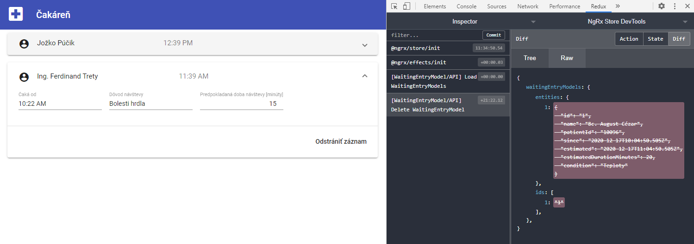

## Správa aplikačného stavu s knižnicou ngrx

Aby sme mohli naplniť požiadavky používateľa, budeme musieť do aplikácie pridávať
ďalšie vstupy. Zároveň predpokladáme, že stav aplikácie - zoznam čakajúcich - je
ovplyvňovaný viacerými používateľmi súčasne. V ďalšom kroku preto zahrnieme do aplikácie
knižnicu [ngrx](https://ngrx.io/guide/store), ktorá nám pomôže spravovať stav aplikácie
efektívnym a prehľadným spôsobom.

1. Nainštalujte balíky (packages) z knižnice NgRx:
   ```powershell
   npm install @ngrx/store --save
   npm install @ngrx/effects --save
   npm install @ngrx/entity --save
   ```

   Vytvorte nový adresár pre Store a v ňom podadresár waiting-entry-model:
   `/src/app/store/waiting-entry-model`

   Váš existujúci súbor s interfacom `WaitingEntryModel` premiestnite do nového adresára
   a premenujte ho na `waiting-entry-model.model.ts`. Adresár `src\app\model` môžete odstrániť. 

   Do interfacu je potrebné pridať `id`, čo je povinná property každého modelu, ktorý chceme
   použiť v rámci `ngrx` stavu:
   ```ts
   export interface WaitingEntryModel {
     id: string | undefined;
     ...
   }
   ```

   Pridajte member `id` tam, kde chýba.

   Opravte referencie v súboroch:
   - `src/app/patients-list/patients-list.component.ts`
   - `src/app/patients-list/patients-list.component.spec.ts`
   - `src/app/patients-list/patients-list-mock.ts`
   - `src/app/waiting-entry/waiting-entry.component.ts`
   - `src/app/app.component.spec.ts`

2. Podobne ako Redux môže byť knižnica NgRx/Store použitá na správu toku údajov v celej aplikácii - odosielajú sa akcie, na ktoré reagujú reducery
   a tie aktualizujú stav úložiska. Na inicializáciu stavu aplikácie si potrebujeme vytvoriť hlavné stavebné bloky (Store, Actions, Reducers a Effects)
   využívajúce základné koncepty:
   * `Akcie` opisujú unikátne udalosti, ktoré sú odosielané z komponentov a zo služieb
   * Zmeny stavu sú spracované čistými funkciami nazývanými `reducery`, ktoré na základe aktuálneho stavu a najnovšej akcie vypočítajú nový stav.
   * `Selectory` sú čisté funkcie používané na výber, odvodenie a zostavenie jednotlivých stavov.
   * K stavu sa pristupuje pomocou úložiska (Store), ktorý je pozorovateľným stavom (Observable) a je pozorovateľom akcií (Observer).

   Na nasledujúcom obrázku vidíme diagram reprezentujúci tok stavu aplikácie (prevzaté z https://ngrx.io/guide/store):
     

   * Vytvorte si nový súbor `/src/app/store/waiting-entry-model/waiting-entry-model.actions.ts`
   obsahujúci [akcie](https://ngrx.io/guide/store/actions) popisujúce jedinečné udalosti, ktoré sa
   odosielajú z komponentov a služieb:
     ```ts
     import { createAction, props } from '@ngrx/store';
     import { WaitingEntryModel } from './waiting-entry-model.model';

     export const loadWaitingEntryModels = createAction(
       '[WaitingEntryModel] Load WaitingEntryModels',
       props<{ waitingEntryModels: WaitingEntryModel[] }>()
     );
     ```

     Funkcia `createAction` nám vytvorí akciu, ktorej popis (type) je uvedený v prvom argumente. Druhý argument určuje dodatočné metadáta potrebné pre
     spracovanie akcie – v našom prípade bude akcia niesť informáciu o všetkých čakajúcich pacientoch (WaitingEntryModel[]).

   * Ďalším súborom, ktorý treba vytvoriť, je `/src/app/store/waiting-entry-model/waiting-entry-model.reducer.ts`.
   [Reducer](https://ngrx.io/guide/store/reducers) je zodpovedný za spracovanie prechodov z jedného stavu
   do druhého na základe nami definovaných funkcií.
     ```ts
     import { createReducer, on } from '@ngrx/store';
     import { EntityState, EntityAdapter, createEntityAdapter } from '@ngrx/entity';
     import { WaitingEntryModel } from './waiting-entry-model.model';
     import * as WaitingEntryModelActions from './waiting-entry-model.actions';

     export const waitingEntryModelsFeatureKey = 'waitingEntryModels';

     export interface State extends EntityState<WaitingEntryModel> {
       // additional entities state properties
     }

     export const adapter: EntityAdapter<WaitingEntryModel> = createEntityAdapter<WaitingEntryModel>();

     export const initialState: State = adapter.getInitialState({
       // additional entity state properties
     });

     export const reducer = createReducer(
       initialState,
       on(WaitingEntryModelActions.loadWaitingEntryModels,
         (state, action) => adapter.setAll(action.waitingEntryModels, state)
       ),
     );
     ```
     
     Pre pohodlnejšiu manipuláciu záznamov používame [Entity adapter](https://ngrx.io/guide/entity). Metóda `createEntityAdapter`
     vytvorí generický adaptér pre manipuláciu záznamov typu WaitingEntryModel. Okrem vyššie použitej metódy `setAll` nám
     adaptér poskytuje mnoho [ďalších metód](https://ngrx.io/guide/entity/adapter#adapter-collection-methods) na vykonávanie
     operácií nad daným typom kolekcie.

     Vytvorenie reducera sa uskutoční pomocou funkcie `createReducer`, ktorá na vstupe očakáva počiatočný stav úložiska
     a nami definované prechodové funkcie "on(...)". Ak sa v aplikácii odošle akcia typu _loadWaitingEntryModels_, tento reducer
     ju odchytí a vykoná asociovanú funkciu _(state, action) => adapter.setAll(action.waitingEntryModels, state)_. Každá reducer
     funkcia má na vstupe aktuálny stav úložiska (_state_) a akciu (_action_), ktorá udalosť vyvolala. Pomocou metódy _setAll_
     nastavíme stav úložiska tak, aby obsahoval dáta poskytnuté našou akciou.

   * Reducer vytvorený v predošlom kroku a všetky budúce reducery budeme zoskupovať v súbore
   `/src/app/store/index.ts` pomocou alias typu _ActionReducerMap_, ktorý mapuje stav na zodpovedajúci
   reducer. Vytvorte tento súbor s nasledujúcim obsahom:
     ```ts
     import {
       ActionReducerMap
     } from '@ngrx/store';
     import * as fromWaitingEntryModel from './waiting-entry-model/waiting-entry-model.reducer';
    
     export interface AmbulanceState {
       [fromWaitingEntryModel.waitingEntryModelsFeatureKey]: fromWaitingEntryModel.State;
     }
      
     export const reducers: ActionReducerMap<AmbulanceState> = {
       [fromWaitingEntryModel.waitingEntryModelsFeatureKey]: fromWaitingEntryModel.reducer,
     };
     ```

   * Spracovanie externých údajov a interakcií nám umožnia efekty ([Effects](https://ngrx.io/guide/effects)),
   ktoré využívame na zníženie zodpovednosti komponentov. Vytvorte nový adresár a súbor
   `/src/app/effects/app.effects.ts` s obsahom:
     ```ts
     import { Injectable } from '@angular/core';
     import { Actions, ROOT_EFFECTS_INIT, ofType, createEffect } from '@ngrx/effects';
     import { loadWaitingEntryModels } from '../store/waiting-entry-model/waiting-entry-model.actions';
     import { map } from 'rxjs/operators';
     import { PatientsListMock } from '../patients-list/patients-list-mock';
     
     @Injectable()
     export class AppEffects {
       
       constructor(private actions$: Actions) { }
       
       init$ = createEffect(() => this.actions$.pipe(
         ofType(ROOT_EFFECTS_INIT),
         map(_ => loadWaitingEntryModels({ waitingEntryModels: PatientsListMock.patients }))));
     }
     ```
     
     Služba `Actions` poskytuje prúd udalostí (Observable) všetkých odoslaných akcií v aplikácii. Efect `init$` je prihlásený
     na tento prúd a reaguje len na akciu typu `ROOT_EFFECTS_INIT`, ktorá je vyvolaná na začiatku inicializácie aplikácie (modulu).
     V momente, keď obdržíme túto akciu, môžeme vykonať počiatočné načítanie všetkých čakajúcich pacientov pomocou
     vyvolania akcie `loadWaitingEntryModels`.

     `Map` je [operátor](https://rxjs-dev.firebaseapp.com/api/operators/map), ktorý aplikuje definovanú funkciu na každú emitovanú hodnotu zo zdroja Observable a následne odosiela výsledné
     hodnoty taktiež ako Observable.

     Knižnica NgRx je založená na knižnici `RxJS`, ktorá umožňuje vytváranie asynchrónnych programov a programov založených na
     udalostiach pomocou pozorovateľných sekvencií (Observables). Základné koncepty definované v tejto knižnici (Observable, Subscription, 
     Operators, ...) budú pravidelne využívané v našej aplikácii, preto je dôležité porozumieť ich významu. Oficiálna dokumentácia
     knižnice RxJS môže byť nápomocná: https://rxjs-dev.firebaseapp.com/guide/overview

   * Vytvorené moduly je potrebné importovať v `/src/app/app.module.ts`:
     ```ts
     ...
     import { WaitingEntryComponent } from './waiting-entry/waiting-entry.component';

     import { StoreModule } from '@ngrx/store';
     import { reducers } from './store';
     import { EffectsModule } from '@ngrx/effects';
     import { AppEffects } from './effects/app.effects';

     ...
     imports: [
       ...
       StoreModule.forRoot(reducers), EffectsModule.forRoot([AppEffects])
     ],
     ...
     ```

   Vyššie uvedenými krokmi by mal byť stav aplikácie (Store) správne inicializovaný a mal by obsahovať
   definovaných pacientov. Stav aplikácie si vieme pozrieť a debugovať pomocou balíku
   [Store Devtools](https://ngrx.io/guide/store-devtools), ktorý si treba nainštalovať:
   ```powershell
   npm install @ngrx/store-devtools --save
   ```

   V `app.module.ts` si ho naimportujeme:
   ```ts
   ...
   import { StoreDevtoolsModule } from '@ngrx/store-devtools';
   import { environment } from '../environments/environment';

   ...
   imports: [
     ...
     !environment.production ? StoreDevtoolsModule.instrument() : []
   ],
   ...
   ```

   Stiahnite si a nainštalujte rozšírenie prehliadača [Redux Devtools](https://github.com/zalmoxisus/redux-devtools-extension/).

   Spustite aplikáciu a otvorte ju v prehliadači [http://localhost:4200](http://localhost:4200):
   ```powershell
   npm run start
   ```
   
   Otvorte panel s nástrojmi vývojára (`F12`) a prejdite na záložku _Redux_.
   Tento panel Vám umožní sledovať akcie vykonávané v rámci vašej aplikácie a zmeny stavu, ktoré
   s nimi súvisia. V prípade neočakávaných výsledkov je tento nástroj veľmi účinný na odhalenie
   chyby v logike programu.
   
   

   Pokiaľ máte funkčný build a zelené testy, komitnite zmeny do gitu.

3. V tomto kroku napojíme aplikačný stav na naše komponenty prostredníctvom selektorov.
[Selektory](https://ultimatecourses.com/blog/ngrx-store-understanding-state-selectors) sú funkcie
používané na získanie segmentov zo stavu aplikácie.

   * Pridajte selector na získanie zoznamu pacientov do `index.ts`:
     ```ts
     ...
     export const selectPatientsList = (state: AmbulanceState) : fromWaitingEntryModel.State => state[fromWaitingEntryModel.waitingEntryModelsFeatureKey];
     ```

   * Entity adapter poskytuje predpripravené selektory, ku ktorým môžeme pristúpiť pomocou funkcie
   _getSelectors_. Upravte súbor `waiting-entry-model.reducer.ts` aby obsahoval nasledujúci kód:
     ```ts
     ...
     export const {
       selectIds,
       selectEntities,
       selectAll,
       selectTotal,
     } = adapter.getSelectors();
     ```

   * Konštruktor v `patients-list.component.ts` upravíme následovne:
     ```ts
     ...
     import { Store, select } from '@ngrx/store';
     import { Observable } from 'rxjs';

     import { AmbulanceState, selectPatientsList } from '../store';
     import * as fromWaitingEntry from '../store/waiting-entry-model/waiting-entry-model.reducer';
     ...
     constructor(private store: Store<AmbulanceState>) {
       this.patients = store.pipe(
         select(selectPatientsList),
         select(fromWaitingEntry.selectAll));
     }
     ...
     ```

     _select_ nám vráti výber (slice) údajov zo stavu aplikácie zabalených do Observable. Funkcia _pipe()_
     je použitá na prepojenie viacerých _selectov_ a zabezpečí ich sekvenčné vykonanie.
     
     Pomocou _AsyncPipe_, ktorá sa nachádza v príslušnom HTML, sa prihlásime na odber a tým zabezpečíme
     vykresľovanie aktuálneho zoznamu pacientov z aplikačného stavu:
     ```html
     <ng-container *ngFor="let entry of (patients | async)">
     ```

   * Do súborov `patients-list.component.spec.ts` a `app.component.spec.ts` dodajte stub na `Store`, ktorý
   vyžaduje `PatientsListComponent` v konštruktore:
     ```ts
     ...
     import { Store } from '@ngrx/store';
     import { AmbulanceState } from '../store';
     import { EMPTY } from 'rxjs'; 
     
     const storeStub: Partial<Store<AmbulanceState>> = {
       pipe: () => EMPTY
     };
     
     ...
     providers: [{ provide: Store, useValue: storeStub }] 
     ...
     ```

     Stub je kontrolovateľná náhrada za existujúcu závislosť v systéme. Pomocou stubu môžete svoj kód
     otestovať bez toho, aby ste sa priamo zaoberali závislosťou.

   Submitnite zmeny do repozitára a pushnite do cloudu.

4. Teraz rozšírime funkcionalitu o možnosť vymazania záznamu.

   * Do súboru `waiting-entry-model.actions.ts` pridajte nový typ akcie:
     ```ts
     ...
     export const deleteWaitingEntryModel = createAction(
       '[WaitingEntryModel] Delete WaitingEntryModel',
       props<{ id: string }>()
     );
     ```
     
     a vo `waiting-entry-model.reducer.ts` definujeme novú prechodovú funkciu:
     ```ts
     on(WaitingEntryModelActions.deleteWaitingEntryModel,
       (state, action) => adapter.removeOne(action.id, state)
     ),
     ```

   * Do HTML šablóny `waiting-entry.component.html` doplňte kód:
     ```html
     <mat-expansion-panel>
       ...
       <mat-action-row>
         <button mat-button (click)="delete.emit(data)">Odstrániť záznam</button>
       </mat-action-row>
     </mat-expansion-panel>
     ```
     
     Element `mat-action-row` nám umožnil pridať tlačidlo `Odstrániť záznam` na nový riadok.

     Upravte prezentačný komponent `waiting-entry.component.ts`:
     ```ts
     import { Component, Input, Output, EventEmitter } from '@angular/core';
     ...
     export class WaitingEntryComponent {
       @Output()
       public delete = new EventEmitter<WaitingEntryModel>();
       ...
     }
     ```
     
     Horeuvedenými zmenami sme pridali nové tlačítko. Po jeho stlačení sa emituje `delete` event.
     
     Všimnite si, že vzhľad novopridaného tlačidla nezodpovedá štandardnému designu `Angular Material`.
     V súbore `src\app\app.module.ts` doplňte _import_ modulu `MatButtonModule`. Pridaním tohto modulu
     sme dosiahli štandardný `Angular Material` vzhľad.

   * Na stlačenie tlačidla musí zareagovať komponent, ktorý obsluhuje zoznam pacientov.
     Upravte šablónu `patients-list\patients-list.component.html`
     ```html
     ...
         <app-waiting-entry [data]="entry" (delete)="onDelete($event)"></app-waiting-entry>
     ...
     ```
     
     V súbore `patients-list\patients-list.component.ts` doplňte metódu `onDelete`:
     ```ts
     import { deleteWaitingEntryModel } from '../store/waiting-entry-model/waiting-entry-model.actions';
     ...
     export class PatientsListComponent implements OnInit {
       ...
       onDelete(entry: WaitingEntryModel): void {
         if (entry.id) {
           this.store.dispatch(deleteWaitingEntryModel({ id: entry.id }));
         }
       }
     }
     ```

     V tejto metóde odošleme akciu `deleteWaitingEntryModel` spolu s identifikátorom záznamu, ktorý chceme vymazať.
     Na danú akciu počúva reducer, ktorý zavolá funkciu `removeOne` definovanú adapterom a záznam z úložiska odstráni.
     
   Pokiaľ teraz v aplikácii stlačíte tlačidlo _Odstrániť záznam_, záznam sa automaticky odstráni
   zo zoznamu a z úložiska stavu aplikácie.
    
   
   Skontrolujte funkčnosť testov, submitnite a pushnite zmeny.
