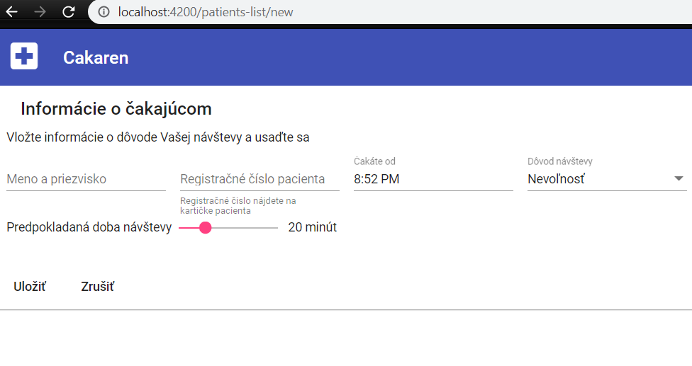
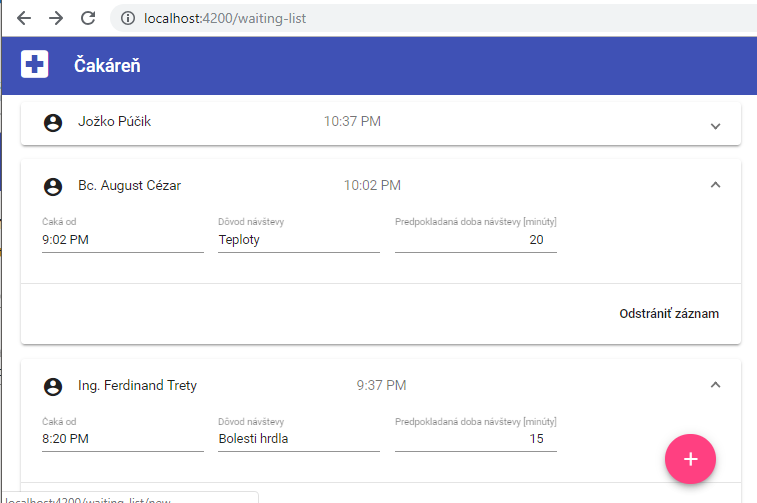

## Komponent _WaitingEntryEditor_

V tejto kapitole dokončíme implementáciu komponentu na pridávanie a editovanie pacienta.



1. Upravte súbor `src\app\waiting-entry-editor\waiting-entry-editor.component.html`:

   ```html
   <mat-card>
       <mat-card-header>
           <mat-card-title>Informácie o čakajúcom</mat-card-title>
       </mat-card-header>
       <mat-card-content>
            <p>
            Vložte informácie o dôvode Vašej návštevy a usaďte sa
            </p>
            <ng-container *ngIf="data$ | async as data">
            <mat-form-field>
                <input matInput placeholder="Meno a priezvisko"
                    [(ngModel)]="data.name">
            </mat-form-field>
            <mat-form-field>
                <input matInput placeholder="Registračné číslo pacienta" type="number"
                    [(ngModel)]="data.patientId">
                <mat-hint>Registračné čislo nájdete na kartičke pacienta</mat-hint>
            </mat-form-field>
            <mat-form-field>
                <input matInput placeholder="Čakáte od"
                    [value]="data.waitingSince|date:'shortTime'" readonly>
            </mat-form-field>

            <mat-form-field>
                <mat-select placeholder="Dôvod návštevy" [(value)]="data.condition">
                <mat-option *ngFor="let condition of knownConditions$|async"
                            [value]="condition.display">
                    {{condition.display}}
                </mat-option>
                </mat-select>
            </mat-form-field>

            <p>
                <span>Predpokladaná doba návštevy</span>
                <span class='slider-with-label'>
                <mat-slider placeholder="Predpokladaná doba návštevy [minúty]"
                            min="5" max="60" step="5" thumbLabel="true"
                            [value]="data.estimatedDurationMinutes"
                            (valueChange)="data.estimatedDurationMinutes=$event ? $event : 20">
                </mat-slider>
                {{data.estimatedDurationMinutes}} minút
                </span>
            </p>
            </ng-container>
        </mat-card-content>
        <mat-card-actions>
            <button mat-button>Uložiť</button>
            <button mat-button>Zrušiť</button>
        </mat-card-actions>
    </mat-card>
    ```

2. V súbore `src\app\app.module.ts` pridajte závislosť na `MatCardModule`,
   `MatSelectModule`, `MatSliderModule` a `FormsModule`. Všimnite si, že od tohto okamihu nám padajú testy.
   Opravte padajúce testy pridaním `MatCardModule`,
   `MatSelectModule`, `MatSliderModule` a `FormsModule`.

3. Upravte súbor `src\app\waiting-entry-editor\waiting-entry-editor.component.ts`:

   ```ts
    import { Component, OnInit } from '@angular/core';
    import { WaitingEntryModel } from '../store/waiting-entry-model/waiting-entry-model.model';
    import { Observable } from 'rxjs';

    @Component({
        selector: 'app-waiting-entry-editor',
        templateUrl: './waiting-entry-editor.component.html',
        styleUrls: ['./waiting-entry-editor.component.css']
        })
    export class WaitingEntryEditorComponent implements OnInit {

        public data$: Observable<WaitingEntryModel> | undefined;
        public readonly knownConditions$: Observable<Array<{ concept: string, display: string }>> | undefined;

        constructor() { }

        ngOnInit(): void {  }
    } 
    ```

   Momentálne stránka zobrazuje len hlavičku.

   Testy sú stále zelené. Komitnite a pushnite zmeny do repozitára.

4. V prvom kroku implementácie editora nebudeme uvažovať nového pacienta. Začneme editovaním existujúceho.
   V komponente `WaitingEntryEditor` upravíme metódu `OnInit`:

   ```ts
    import { Component, OnInit } from '@angular/core';
    import { WaitingEntryModel } from '../store/waiting-entry-model/waiting-entry-model.model';
    import { Observable, of } from 'rxjs';
    import { ActivatedRoute } from '@angular/router';
    import { Store, select } from '@ngrx/store';
    import { AmbulanceState, selectPatientsList } from '../store';
    import { map, switchMap } from 'rxjs/operators';
    import * as fromWaitingEntryModel from '../store/waiting-entry-model/waiting-entry-model.reducer';

    @Component({
    selector: 'app-waiting-entry-editor',
    templateUrl: './waiting-entry-editor.component.html',
    styleUrls: ['./waiting-entry-editor.component.css']
    })
    export class WaitingEntryEditorComponent implements OnInit {

        public data$: Observable<WaitingEntryModel> | undefined;
        public readonly knownConditions$: Observable<Array<{ concept: string, display: string }>> | undefined;

        constructor(
            private readonly route: ActivatedRoute,
            private readonly store: Store<AmbulanceState> ) { }

        public ngOnInit() {
            this.data$ = this.route.paramMap.pipe(
            map(_ => String(_.get('id'))),
            switchMap(
                id => this.store.pipe(
                    select(selectPatientsList),
                    select(fromWaitingEntryModel.selectEntities),
                    select(entities => entities[id] ?? {} as WaitingEntryModel))));
        }
    }
    ```

    Operátor _map_ slúži na mapovanie "normálnych" hodnôt do ľubovoľného formátu, aký potrebujete. Návratová hodnota
    bude opäť zabalená do Observable, takže ju môžete naďalej používať vo svojom dátovom toku.
    
    Ak potrebujete pracovať s vnoreným Observable, je jednoduchšie použiť _mergeMap_, _switchMap_ alebo _concatMap_.
    `MergeMap` sa typicky používa ak chceme jednoducho zlúčiť údaje do jedného Observable, `switchMap` ak potrebujeme
    zlúčiť údaje ale zaujíma nás iba najnovšia hodnota a `concatMap` slúži taktiež na zlúčenie údajov no navyše
    zachová aj ich poradie.
    Detailnejšie vysvetlenie týchto operátorov je možné nájsť na stránke https://blog.angular-university.io/rxjs-higher-order-mapping/

    Po týchto úpravách treba opraviť padajúci test. Upravte `src\app\waiting-entry-editor\waiting-entry-editor.component.spec.ts`:

   ```ts
    ...
    import { Store } from '@ngrx/store';
    import { AmbulanceState } from '../store';
    import { EMPTY } from 'rxjs';
    import { RouterTestingModule } from '@angular/router/testing';
    const storeStub: Partial<Store<AmbulanceState>> = {
    pipe: () => EMPTY
    };
    ...
      imports: [
        MatCardModule,
        MatSelectModule,
        MatSliderModule,
        FormsModule,
        RouterTestingModule
      ],
      providers: [{ provide: Store, useValue: storeStub }]
    ...
    ```

   Testy sú teraz zelené. Komitnite a pushnite zmeny do repozitára.

5. V ďalšom kroku doplníme položky do zoznamu "Dôvod návštevy". V komponente `WaitingEntryEditor` doplňte do konštruktora
   zoznam položiek:

   ```ts
    this.knownConditions$ = of([
        { concept: 'folowup', display: 'Kontrola' },
        { concept: 'nausea', display: 'Nevoľnosť' },
        { concept: 'fever', display: 'Teploty' },
        { concept: 'ache-in-throat', display: 'Bolesti hrdla' }
    ]); 
    ```

6. Upravíme súbor `src\app\waiting-entry-editor\waiting-entry-editor.component.css`:

    ```css
    mat-expansion-panel-header mat-icon, mat-form-field { margin-right: 1rem; }
    input[type=number] { text-align: right; }
    ```

7. Ďalej si naimplementujeme možnosť pridania nového pacienta.
   V komponente `WaitingEntryEditor` pridajte premennú:

    ```ts
    private newEntryPlaceholder: WaitingEntryModel = {
        id: undefined,
        name: '',
        patientId: '',
        waitingSince: new Date(Date.now()),
        estimatedStart: new Date(Date.now()),
        estimatedDurationMinutes: 20,
        condition: 'Nevoľnosť'
    }; 
    ```

   a upravte metódu `ngOnInit`:

    ```ts
    ngOnInit() {
        this.data$ = this.route.paramMap.pipe(
        map(_ => String(_.get('id'))),
        switchMap(
            id => (id === 'new')
            ? of(this.newEntryPlaceholder)
            : this.store.pipe(
            select(selectPatientsList),
            select(fromWaitingEntryModel.selectEntities),
            select(entities => entities[id] ?? {} as WaitingEntryModel))));
    }
    ```

    Prejdite na stránku [http://localhost:4200/patients-list/new](http://localhost:4200/patients-list/new),
    respektíve [http://localhost:4200/patients-list/1](http://localhost:4200/patients-list/1)
    a skontrolujte funkčnosť novej stránky vašej aplikácie.

    

    Skontrolujte funkčnosť testov, komitnite a pushnite zmeny.

    V tomto stave sa naša jednostránkova aplikácia správa ako keby bola obsluhovaná
    z rôznych stránok, v skutočnosti ale nedochádza ku komunikácii so serverom
    a navigácia je zabezpečovaná priamo v prostredí internetového prehliadača.
    Ďalej si ukážeme ako túto navigáciu realizovať pomocou odkazov a akcií v aplikácii.

8. Pridáme tlačidlo `+`, ktoré nám umožní pridávať nového pacienta.
   Do šablóny `src\app\patients-list\patients-list.component.html` pridajte
   nové tlačidlo typu `mat-fab`

   ```html
   ...
   <a mat-fab [routerLink]="['/patients-list', 'new']" class="add-new"><mat-icon>add</mat-icon></a>
   ```

    a upravte súbor `src\app\patients-list\patients-list.component.css`

   ```css
   mat-accordion {
       width: 800px;
       display: block;
       margin: auto;
   }

   .add-new {
       position: absolute;
       right: 48px;
       bottom: 32px;
   }
   ```

9. V šablóne `src\app\waiting-entry-editor\waiting-entry-editor.component.html`
   pridajte na tlačidlo _Zrušiť_ navigáciu do zoznamu čakajúcich.

   ```html
   ...
   <mat-card-actions>
       <button mat-button>Uložiť</button>
       <button mat-button [routerLink]="['/patients-list']">Zrušiť</button>
   </mat-card-actions>
   ...
   ```

   Skontrolujte funkčnosť testov, komitnite a pushnite zmeny.

    Ako ste si už všimli, navigáciu medzi stránkami možeme vykonať priradením
    hodnoty atribútu `routerLink`. Hodnota tohto atribútu je interpretovaná
    implementáciou `RouterModule`, a porovnávaná s hodnotami uvedenými v zozname
    `routes`, ktorý bol použitý pri inicializácii tohto modulu. Zoznam routes
    priraďuje každej ceste komponent, ktorý sa použije na vizualizáciu stránky,
    a ktorého obsah bude zobrazený na stránke v oblasti šablóny vyznačenej elementom
    `<router-outlet></router-outlet>`. V ďalšej časti ukážeme ako vykonať
    presmerovanie stránky v kóde komponentu.

    
