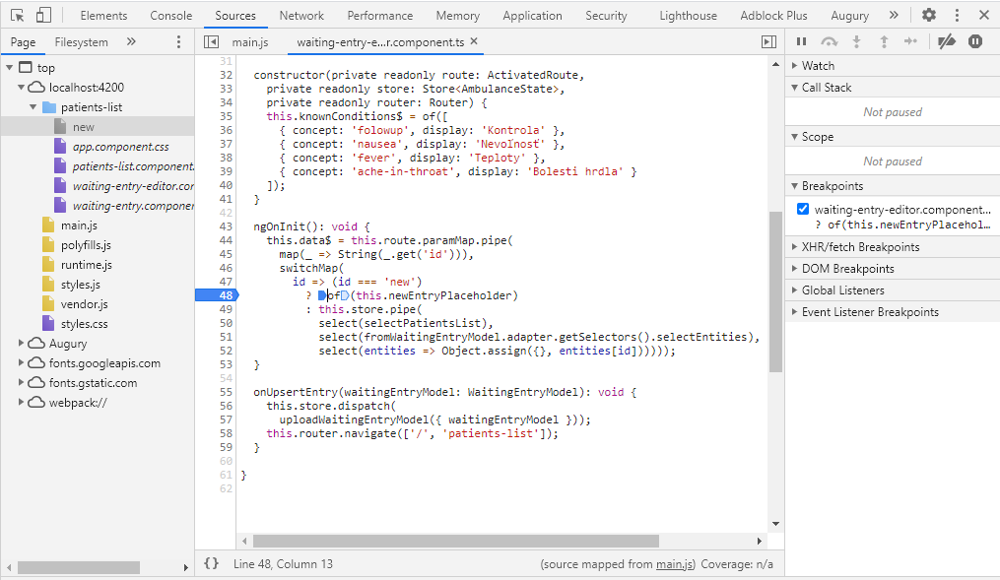
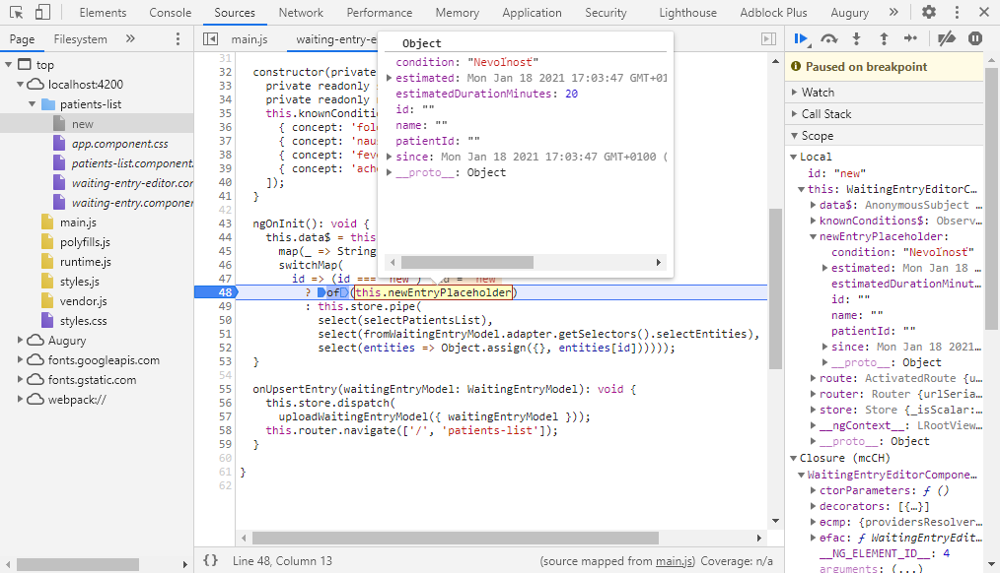

## Ladenie aplikácie

V tomto kroku si ukážeme ako ladiť aplikáciu v _Nástrojoch vývojára_.

Ladenie aplikácie si odskúšame v rámci pridávania nového pacienta.
Údaje zobrazované v komponente `WaitingEntryEditorComponent` sa inicializujú
v metóde `onInit` tejto triedy.

V prehliadači Google Chrome v paneli _Nástroje vývojara -> Sources_ vyhľadajte
súbor `waiting-entry-editor.component.ts`. Môžete na to použiť klávesovú skratku
`Ctrl+P`, cesta k súboru musí byť
`webpack:///./src/app/waiting-entry-editor/waiting-entry-editor.component.ts`.

Umiestnite bod prerušenia do metódy `ngOnInit`

Vytvorte novú položku - pri prerušení pokračujte stlačením klávesu `F8`, a potom
vytvorte ďalšiu novú položku, teraz ale pri prerušení nepokračujte.  Pokiaľ
teraz podržíte myš nad kódom (_hover_) `this.newEntryPlaceholder`
zobrazí sa vám hodnota tejto premennej. V pravom paneli potom možte urobiť
inšpekciu ďalších lokálnych premenných a prechádzať zásobníkom vnorených funkcií.

>home_work:> Bližšie sa oboznámte s funkcionalitou debuggera v paneli nástrojov,
> možnosťami krokovania aplikácie, inšpekcie premenných a zásobníku volaní.
> Skombinujte to s používaním panelu _Redux_ a _Augury_.