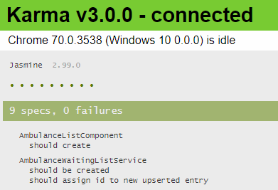

## Vytvorenie nového testu

Ďalej si ukážeme postup pri vytváraní nového testu. Predpokladajme - alebo 
definujme - že špecifikácia služby
`AmbulancePatientsListService` vyžaduje aby sa pri volaní metódy `upsertEntry` s novým
záznamom bez špecifikovaného `id` tento záznam uložil a aby sa mu v takom prípade
priradilo nové `id`.

1. V súbore `src\app\services\ambulance-patients-list.service.spec.ts` vytvorte skeleton
   nového testu:

    ```ts
    it(`should assign id to new upserted entry`, () => {
      // given
  
      // when
  
      // then
  
    });
    ```

    Takáto kostra je odvodená od postupu vytvárania testov technikou TDD.
    Základom tohto postupu je, že sa najprv zameriame na vytvorenie
    podmienky v časti _then_. Tá určuje čo je cieľom nášho testu - aký výsledok
    špecifikácia očakáva. V našom prípade očakávame, že id nového záznamu bude
    nenulová definovaná hodnota:

    ```ts
    it(`should assign id to new upserted entry`, () => {
      // given

      // when

      // then
      expect(result.id).toBeTruthy();
    });
    ```
    Pravdaže v tomto kroku je premenná `result` ešte neznáma, preto sa ďalej
    zameriame na to ako - _when_ - túto hodnotu získame:

    ```ts
    it(`should assign id to new upserted entry`, () => {
      // given

      // when
      const result = service.upsertEntry(ambulanceId, newEntry);

      // then
      expect(result.id).toBeTruthy();
    });
    ```

    Nakoniec vytvoríme kontext testu - _given_ - ktorý určuje, za akých podmienok
    sa má špecifikácia overiť:

    ```ts
    it(`should assign id to new upserted entry`, () => {
      // given
      const ambulanceId = 'testAmbulance';
      const newEntry: WaitingEntryModel = {
        name: `Test Patient`,
        patientId: '12345',
        condition: `tested`,
        estimatedStart: new Date(Date.now()),
        estimatedDurationMinutes: 5,
        waitingSince: new Date(Date.now()),
        id: undefined
      };
  
      // when
      const result = service.upsertEntry(ambulanceId, newEntry);
  
      // then
      expect(result.id).toBeTruthy();
    });
    ```

    V tomto kroku ale vidíme, že result vlastne nie je typu `WaitingEntryModel`.
    Existuje niekoľko spôsobov ako v aplikácii Angular [testovať asynchrónnu funkcionalitu](https://angular.io/guide/testing-components-scenarios#component-with-async-service).
    V tejto situácii si vystačíme s prístupom štandardným pre testy založené na
    nástroji [Jasmine](https://jasmine.github.io/tutorials/async) a ošetríme naše
    volanie pomocou konštrukcie `async`/`await`

    ```ts
    it(`should assign id to new upserted entry`, async () => {
      // given
      const ambulanceId = 'testAmbulance';
      const newEntry: WaitingEntryModel = {
        name: `Test Patient`,
        patientId: '12345',
        condition: `tested`,
        estimatedStart: new Date(Date.now()),
        estimatedDurationMinutes: 5,
        waitingSince: new Date(Date.now()),
        id: undefined
      };
  
      // when
      const result: WaitingEntryModel
        = await service.upsertEntry(ambulanceId, newEntry).toPromise();
  
      // then
      expect(result.id).toBeTruthy();
    });
    ```

    V testoch sa snažíme explicitne definovať, aké typy používame a očakávame.
    Takýto prístup nám pomôže odhaliť chyby spôsobené zmenou definície týchto typov
    už počas kompilácie (transpilácie) programu. Po uložení a skompilovaní vidíme
    vo výpise testov úspešný beh nového testu:

    

    Momentálne sme testovali už existujúcu metódu, takže zatiaľ sa o TDD prístup
    nejedná. TDD vyžaduje, aby náš test bol najprv neúspešný - _red_ - a splnený
    len po vykonaní nevyhnutných zmien.

    _Úloha_: Vyskúšajte zameniť očakávanie výsledku na `expect(undefined).toBeTruthy();`
    a overte tým, že váš test je skutočne funkčný.

    _Úloha_: Zoznámte sa so spôsobmi testovania asynchrónnych metód uvedenými
    na stránke  [Angular Testing - Component with async service](https://angular.io/guide/testing-components-scenarios#component-with-async-service)
    a [Jasmine - Asynchronous Work](https://jasmine.github.io/tutorials/async)

2. Pridajte ďalší test na overenie skutočnosti, že po pridaní nového prvku je
   počet prvkov väčší o jedna.  Začnite kostrou testu:

    ```ts
    it(`should add new entry into all waiting entries`, async () => {
      // given
  
      // when
  
      // then
  
    });
    ```

    Definujte, čo je očakávaným výsledkom testu

    ```ts
    it(`should add new entry into all waiting entries`, async () => {
      // given
  
      // when
  
      // then
      expect(result.length).toEqual(originalLength + 1);
    });
    ```

    Všimnite si,
    že získanie výsledného zoznamu je uvedené v sekcii _then_, táto operácia totiž
    nie je súčasťou špecifikácie, ktorú overujeme, ale len spôsobom overenia
    výslednej podmienky - _post condition_ - tejto špecifikácie.

    ```ts
    it(`should add new entry into all waiting entries`, async () => {
      // given
  
      // when
      await service.upsertEntry(ambulanceId, newEntry).toPromise();
  
      // then
      const result: WaitingEntryModel[]
        = await service.getAllPatientsEntries(ambulanceId).toPromise();
  
      expect(result.length).toEqual(originalLength + 1);
    });
    ```

    A nakoniec vytvorte context pre overenie špecifikácie:

    ```ts
    it(`should add new entry into all waiting entries`, async () => {
      // given
      const ambulanceId = 'testAmbulance';
      const newEntry: WaitingEntryModel = {
        name: `Test Patient`,
        patientId: '12345',
        condition: `tested`,
        estimatedStart: new Date(Date.now()),
        estimatedDurationMinutes: 5,
        waitingSince: new Date(Date.now()),
        id: undefined
      };
  
      const originalLength
        = (await service.getAllPatientsEntries(ambulanceId).toPromise())
        .length;
  
      // when
      await service.upsertEntry(ambulanceId, newEntry).toPromise();
  
      // then
      const result: WaitingEntryModel[]
        = await service.getAllPatientsEntries(ambulanceId).toPromise();
  
      expect(result.length).toEqual(originalLength + 1);
    });
    ```

    >info:> Pre rôzne aspekty špecifikácie vždy vytvárame nové testy. Nesnažte
    > sa ich kombinovať do jedného testu, keďže to pri zložitejších situáciách znižuje
    > prehľad o tom, čo je špecifikáciou a čo len vedľajším efektom testu.
    > Systematické dodržiavanie štruktúry testu umožňuje použiť automatizované testy
    > ako zdroj špecifikácie, respektíve mapovať existujúcu špecifikáciu na
    > automatizované testy a tým zjednodušiť regresné overenie funkcionality počas
    > vývoja nových verzií aplikácie.
