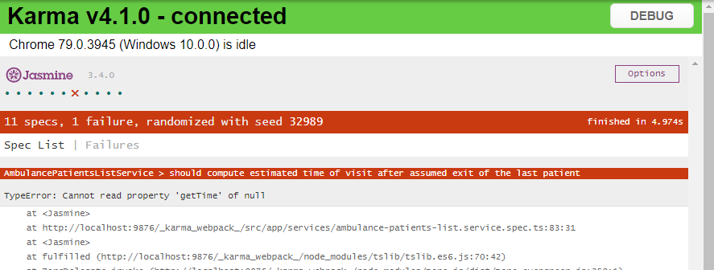

## Automatizovaný test technikou _Test Driven Development_

Technika _Test Driven Developmnet_ umožňuje zefektívniť vývoj profesionálnych
softvérovych systémov. Automatizovaný test tu slúži ako prostriedok na definíciu
špecifikácie systému/subjektu testovania, a pomáha vytvoriť program spôsobom,
ktorý sa primárne zameriava na splnenie zadanej špecifikácie pri súčasnej regresii
ostatných požiadaviek a špecifikácií, obsiahnutých v už existujúcich automatizovaných
testoch. Na prvý pohľad sa môže technika TDD javiť ako náročnejšia, vzhľadom na nutnosť
neustáleho vytvárania automatizovaných testov. Realita softvérového vývoja ale ukazuje,
že väčšina úsilia pri vývoji aplikácií je investovaná do opráv a korekcií funkcionality
systému, náprav chýb spôsobených nesprávnou implementáciou zadanej špecifikácie,
a regresných chýb zavedených do existujúcej funkcionality počas vývoja nových funkcií
aplikácie. Tieto problémy je možné adresovať pomocou sady dobre definovaných
automatizovaných testov. TDD umožňuje v rovnakom čase adresovať vytvorenie a
porozumenie požadovanej špecifikácie, definíciu špecifikácie v technickej forme zápisu,
vytvorenie dobre testovateľného kódu a vytvorenie kvalitnej sady automatizovaných
testov, zameraných na testovanie požadovanej funkcionality. Dodatočné vytváranie
testov vedie často len k testovaniu vedľajších efektov behu programu, bez skutočného
overenia požadovanej funkcionality systému.

1. Pri vytváraní nového záznamu sme sa doteraz nezaoberali problémom výpočtu
   predpokladanej doby, kedy sa čakajúci pacient dostane do ambulancie. Špecifikujme
   teraz, že táto hodnota musí byť väčšia alebo rovná dobe kedy sa predpokladá,
   že posledný pacient opustí ambulanciu, a že má byť zaokrúhlená nahor na najbližší
   päť-minútový interval.

2. V súbore `src\app\ambulance-patients-list.service.spec.ts` vytvorte kostru testu:

    ```ts
    it(`should compute estimated time of visit after assumed exit of the last patient`,
      async () => {
      // given

      // when

      // then

    });
    ```

    a doplňte očakávaný výsledok testu:

    ```ts
    it(`should compute estimated time of visit after assumed exit of the last patient`,
      async () => {
      // given

      // when

      // then
      expect(result.estimatedStart).toBeGreaterThanOrEqual(estimatedExitOfLastPatient);
    });
    ```
    Teraz doplňte spôsob, ako sa k tomuto výsledku dopracujeme. V tomto prípade
    naša funkcia už existuje - metóda `upsertEntry`, v iných prípadoch spôsob
    vyvolania funkcionality definuje potreba overiť správnosť jej výsledku.

    ```ts
    it(`should compute estimated time of visit after assumed exit of the last patient`,
      async () => {
      // given

      // when
      const result = await service.upsertEntry(ambulanceId, newEntry).toPromise();

      // then
      expect(result.estimatedStart).toBeGreaterThanOrEqual(estimatedExitOfLastPatient);
    });
    ```

    Nakoniec musíme pripraviť východzie podmienky pre vykonanie tohto testu a zároveň
    opravíme typ pre vykonanie kontroly výsledku. Tu predpokladáme našu
    _a priori_ znalosť, že pri vytváraní služby inicializujeme zoznam troma
    čakajúcimi, s časom príchodu relatívnym k `Date.now()`. V ďaľších cvičeniach
    potom upravíme test pre potreby komunikácie so serverom.

    ```ts
    it(`should compute estimated time of visit after assumed exit of the last patient`,
      async () => {
      // given
      const ambulanceId = 'testAmbulance';
      const newEntry: WaitingEntryModel = {
        name: `Test Patient`,
        patientId: '12345',
        condition: `tested`,
        estimatedStart: new Date(Date.now()),
        estimatedDurationMinutes: 5,
        waitingSince: new Date(Date.now()),
        id: undefined
      };
  
      const allEntries: WaitingEntryModel[]
         = await service.getAllPatientsEntries(ambulanceId).toPromise();
  
      const MINUTE = 60 * 1000;
      const estimatedExitOfLastPatient: Date
        = allEntries.reduce((previous: Date, current: WaitingEntryModel) => {
            const exitTime = new Date(current.estimatedStart.getTime()
                                      + current.estimatedDurationMinutes * MINUTE);
            return previous > exitTime ? previous : exitTime;
        }, new Date(0));
  
      // when
      const result = await service.upsertEntry(ambulanceId, newEntry).toPromise();
  
      // then
      expect(result.estimatedStart.getTime()).toBeGreaterThanOrEqual(estimatedExitOfLastPatient.getTime());
    });
    ```

    Po uložení a kompilácii vidíme vo výsledku testov, že tento test je neúspešný.
    Toto je očakávaný výsledok a nevyhnutná podmienka pre správny TDD cyklus:

        - vytvoríme test pre neexistujúci kód;
        - test je červený, pretože táto funkcionalita ešte neexistuje alebo
          nepracuje podľa očakávaní;
        - opravíme kód tak, aby bol test zelený.

    

3. Doplňte požadovanú funkcionalitu a využite k tomu knižnicu lodash:

    V príkazovom okne, v priečinku vašej aplikácie vykonajte príkaz pre pridanie
    balíka lodash a jeho podporu pre jazyk TypeScript

    ```powershell
    npm install --save lodash
    npm install --save-dev @types/lodash
    ```

    V súbore `src\app\ambulance-patients-list.service.ts` upravte metódu `upsertEntry`

    ```ts
    ...
    import * as lodash from 'lodash';
    ...
    public upsertEntry(ambulanceId: string, entry: WaitingEntryModel)
      : Observable<WaitingEntryModel> {
      entry = Object.assign({}, entry); // create clone to avoid mutation of input
      entry.estimatedStart = lodash.max(
        PatientsListMock.patients.map(element => new Date(element.estimatedStart.getTime()
                                    + element.estimatedDurationMinutes * PatientsListMock.MINUTE)))
                                    ?? new Date(Date.now());
  
      if (!entry.id) {
        entry.id = `${PatientsListMock.patients.length + 1}`;
        PatientsListMock.patients.push(entry);
      } else {
        PatientsListMock.patients = PatientsListMock.patients.map(
          element => (element.id !== entry.id) ? element : entry);
      }
  
      return of(entry).pipe(delay(250));
    }
    ```
    V tomto okamihu nám neprejde kompilácia, property MINUTE v triede `PatientsListMock` je privátna. Zmeňte jej prístupový modifikátor na public.

    Po skompilovaní máme naše testy opäť zelené.

4. Doplňte ďalší test, ktorý bude kontrolovať, že náš kód zaokrúhľuje predpokladaný
   čas návštevy na celé päť-minútové intervaly. Vytvorte kostru testu

    ```ts
    it(`should provide estimated visit time rounded to five minutes`,
      async () => {
      // given
  
      // when
  
      // then
    });
    ```

    Zadajte očakávaný výsledok

    ```ts
    it(`should provide estimated visit time rounded to five minutes`,
      async () => {
      // given
  
      // when
  
      // then
      expect(result.estimatedStart.getTime() % (5 * MINUTE)).toEqual(0);
    });
    ```

    Ďalej doplňte funkcionalitu, ktorú testujeme

    ```ts
    it(`should provide estimated visit time rounded to five minutes`,
      async () => {
      // given
  
      // when
      const result = await service.upsertEntry(ambulanceId, newEntry).toPromise();

      // then
      expect(result.estimatedStart.getTime() % (5 * MINUTE)).toEqual(0);
    });
    ```

    a nakoniec doplňte kontext testu:

    ```ts
    it(`should provide estimated visit time rounded to five minutes`,
      async () => {
      // given
      const ambulanceId = 'testAmbulance';
      const newEntry: WaitingEntryModel = {
        name: `Test Patient`,
        patientId: '12345',
        condition: `tested`,
        estimatedStart: new Date(Date.now()),
        estimatedDurationMinutes: 5,
        waitingSince: new Date(Date.now()),
        id: undefined
      };

      const MINUTE = 60 * 1000;
  
      // when
      const result = await service.upsertEntry(ambulanceId, newEntry).toPromise();

      // then
      expect(result.estimatedStart.getTime() % (5 * MINUTE)).toEqual(0);
    });
    ```

    V tomto kroku je náš test červený.

5. Doplňte funkcionalitu do metódy `upsertEntry` v súbore
   `src\app\ambulance-patients-list.service.ts`. Použitie funkcie `Math.floor`
   je úmyselné.

    ```ts
    public upsertEntry(ambulanceId: string, entry: WaitingEntryModel)
        : Observable<WaitingEntryModel> {
      entry = Object.assign({}, entry); // create clone to avoid mutation of input
      const estimatedExitTimesOfPatients = PatientsListMock.patients.map(element => {
          // round to upper 5 minutes
          const estimatedExitOfLastPatient = Math.floor((element.estimatedStart.getTime()
                                                        + element.estimatedDurationMinutes * PatientsListMock.MINUTE)
                                                        / (5 * PatientsListMock.MINUTE))
                                                        * (5 * PatientsListMock.MINUTE);
  
          return new Date(estimatedExitOfLastPatient);
        });

      entry.estimatedStart = lodash.max(estimatedExitTimesOfPatients) ?? new Date(Date.now());
  
      if (!entry.id) {
        entry.id = `${PatientsListMock.patients.length + 1}`;
        PatientsListMock.patients.push(entry);
      } else {
        PatientsListMock.patients = PatientsListMock.patients.map(
          element => (element.id !== entry.id) ? element : entry);
      }
  
      return of(entry).pipe(delay(250));
    }
    ```

    V tomto kroku je nový test úspešný.
    Naimplementovanou funkcionalitou sme ovplyvnili vypočítaný čas vstupu pacienta do ambulancie 
    dôsledkom čoho by test _`should compute estimated time
    of visit after assumed exit of the last patient`_ nemal prejsť. V závislosti od použitého hardvéru 
    sa môže stať, že bude test zelený. Je to spôsobené tým, že framework `Jasmine` 
    púšťa testy asynchrónne, následkom čoho je __statické__ pole pacientov v rámci jedného testu ovplyvňované 
    súčasným behom iného testu.
    V súbore `..\services\ambulance-patients-list.service.ts` pridajte členskú premennú:

    ```ts
    patients: WaitingEntryModel[] = Object.assign([], PatientsListMock.patients); 
    ```

    a nahraďte všetky volania `PatientsListMock.patients` volaním `this.patients`.

    V tomto momente je test  _`should compute estimated time
    of visit after assumed exit of the last patient`_ červený.
    Síce sme úspešne
    splnili novú špecifikáciu, že očakávaná doba návštevy má byť zaokrúhlená na
    päť minút, porušili sme ale požiadavku, že táto hodnota musí byť väčšia ako
    očakávaný odchod predchádzajúceho pacienta. Táto situácia je pri vývoji
    softverových aplikácií bežná, najmä pri rastúcej komplexite a meniacom sa
    vývojovom tíme, a pri rýchlych vývojových cykloch, ktoré sú pre vývoj aplikácií
    v cloude typické. Častokrát sa takéto chyby odhalia len tesne pred očakávaným
    nasadením, alebo sú odhalené až zákazníkom počas používania aplikácie.
    Dôsledné dodržavanie techniky _Test Driven Development_ preto umožňuje tieto
    situácie odhaliť ešte pred prvým odovzdaním nového kódu.

    Opravte chybu a použitie v predchádzajúcej metóde namiesto funkcie `Math.floor`
    funkciu `Math.ceil`. Overte, že test je po tejto úprave úspešný.

    Submitnite a pushnite zmeny do repozitára.
