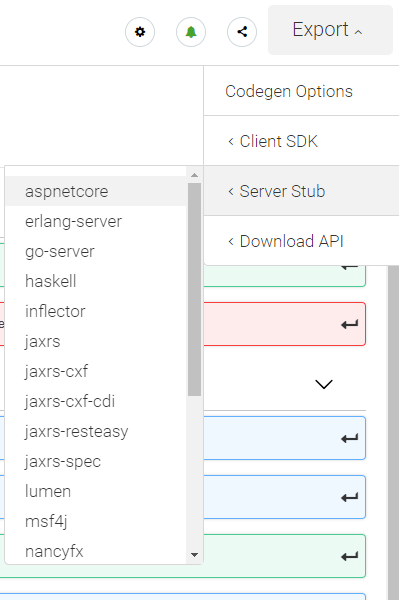

## Implementácia web služby s ASP.NET Core 5.0

1. Vygenerujte zo špecifikácie API kostru implementácie servera. Zvoľte tlačidlo
  _Export -> Server Stub -> aspnetcore_ a uložte vygenerovaný ZIP súbor.

    

    V súborovom systéme prejdite do priečinku kde sa nachádza priečinok `ambulance-spa`
    a vedľa neho vytvorte nový priečinok `ambulance-webapi` a v ňom priečinok
    `ambulance-api`. Rozbaľte do `ambulance-api`  obsah
    priečinku `aspnetcore-server-generated.zip\src\IO.Swagger` umiestneného vo
    vygenerovanom ZIP súbore. Pridajte adresár `ambulance-webapi` ako nový priečinok do Visual
    Studio Code - _File -> Add Folder to Workspace_.

2. Premenujte súbor `IO.Swagger.csproj` na `ambulance-api.csproj` a upravte jeho
  obsah tak, aby zodpovedal naším požiadavkám:

    ```xml
    <Project Sdk="Microsoft.NET.Sdk.Web">
      <PropertyGroup>
        <Description>Ambulance API</Description>
        <Copyright>Milan Unger</Copyright>
        <TargetFramework>net5.0</TargetFramework>
        <GenerateDocumentationFile>true</GenerateDocumentationFile>
        <PreserveCompilationContext>true</PreserveCompilationContext>
        <AssemblyName>ambulance-api</AssemblyName>
        <PackageId>ambulance-api</PackageId>
      </PropertyGroup>
      <ItemGroup>
        <PackageReference Include="Swashbuckle.AspNetCore" Version="5.5.1"/>
        <PackageReference Include="Swashbuckle.AspNetCore.SwaggerGen" Version="5.5.1"/>
        <PackageReference Include="Swashbuckle.AspNetCore.SwaggerUI" Version="5.5.1"/>
        <PackageReference Include="Swashbuckle.AspNetCore.Annotations" Version="5.5.1" />
        <PackageReference Include="Swashbuckle.AspNetCore.Newtonsoft" Version="5.5.1"/>
      </ItemGroup>
      <ItemGroup>
        <DotNetCliToolReference
          Include="Microsoft.VisualStudio.Web.CodeGeneration.Tools" Version="2.0.*"/>
      </ItemGroup>
    </Project>
    ```

    V ďalších krokoch už budeme používať na zavedenie nových knižníc výhradne nástroj
    `dotnet`. Pri väčších alebo dlhodobejších projektoch je zaujímavejšie použitie
    nástroja [openapi-generator](https://github.com/OpenAPITools/openapi-generator),
    ktorý je častejšie obnovovaný, má podporu pre novšie verzie knižníc a umožňuje
    úpravu šablón pre generovanie súborov. Pri vhodnom nastavení prostredia a šablón
    potom možno dosiahnuť opakované generovanie a obnovu kódu pri prípadnej zmene
    API špecifikácie.

    >info:> Naše API je relatívne malé, alternatívou by bolo vytvorenie
    > projektu pomocou príkazu `dotnet new webapi ambulance-api`. V takom prípade
    > by sme ale museli ručne vytvoriť celý datový model a ovládače API volaní.

3. Otvorte súbor `Startup.cs` a v metóde `ConfigureServices` zakomentujte nasledujúci riadok,
   inak pri spustení programu vybehne exception:

   ```cs
   TermsOfService = new Uri("")
   ```

4. Otvorte príkazový riadok a prejdite do priečinku `ambulance-api` a vykonajte príkazy

    ```powershell
    dotnet restore
    dotnet build
    dotnet watch run
    ```

    >info:> V skutočnosti je dostatočné vykonať posledný príkaz, ktorý
    > automaticky vyvolá podľa potreby predchádzajúce dva. Uvedený postup nám ale
    > umožní lepšie zistiť zdroj prípadnych chýb, pokiaľ ste pri prepisovaní
    > urobili preklep.

    V prehliadači otvorte stránku [http://localhost:5000/swagger](http://localhost:5000/swagger),
    po presmerovaní sa zobrazí špecifikácia api. Prejdite na stránku [http://localhost:5000/`<username>`/AmbulanceWaitingList/1.0.0/waiting-list/dentist-warenova](http://localhost:5000),
    a skontrolujte funkčnosť implementácie.

    >info:> Port, na ktorom váš server naštartuje je definovaný v súbore
    > `Properties/launchSettings.json`

5. Prejdime si teraz štruktúru vygenerevaného programu. Súbor `Program.cs`
   obsahuje vstupný bod programu `Program.Main()`. Jeho jedinou úlohou je
   odovzdať riadenie a vstupné argumenty implementácii triedy `IWebHost`, ktorá
   zabezpečuje obsluhu vstupno/výstupných volaní na sieťovom rozhraní počítača.
   Štandardný _builder_ používa triedu `Startup` na nastavenie základných parametrov
   výpočtového prostredia.

   Súbor `Startup.cs` obsahuje implementáciu tejto triedy. Tá obsahuje dve
   dôležité metódy - `Startup.Configure()`, ktorá konfiguruje jednotlivé vrstvy
   spracovania - middleware- HTTP volaní, ktoré obohacujú/spracuvávajú vstupné
   HTTP požiadavky. V tejto konfigurácii máme k dispozícii niekoľko vrstiev:

   * _MVC_, ktoré implementuje návrhový vzor _Model-View-Controller_. V prípade
   WebApi, sa bude jednať len o _Model_ a _Controller_.
   * _DefaultFiles_, a _StaticFiles_ zabezpečuje obsluhu požiadaviek tradičným
   spôsobom hosťovania HTML stránok pomocou statických súborov.
   * _Swagger_ a _SwaggerUI_ slúžia na renderovanie API špecifikácie, pokiaľ
   používateľ pristúpi k serveru bez správneho použitia API.
   
   Druhá metóda `Startup.ConfigureService()` potom registruje všetky služby -
   centrálne triedy implementujúce logiku programu. Tieto služby potom možno
   získať prostredníctvom inverzného riadenia ako parametre ostatný stavebných
   prvkov (tried) implementácie rozhrania `IWebHost`. Asi najzaujímavejšou triedou
   je služba `SwaggerGen`, ktorá je konfigurovaná pomocou volania metódy
   `AddSwaggerGen`.

   Priečinok `Models` obsahuje definíciu tried reprezentujúcich dátový model
   služby. Všetky triedy majú predpripravenú podporu serializácie a porovnávania
   ekvivalencie inštancií.

   Priečinok `Controllers` potom obsahuje obslužný kód pre jednotlivé metódy
   nášho API. Každá metóda obsahuje anotáciu `Route`, ktorá určuje cestu, ktorú
   daná metóda obsluhuje, a anotáciu `SwaggerOperation`, ktorá slúži na
   generovanie API špecifikácie z kódu. Všimnite si že všetky metódy sú náležite
   okomentované, a že niektoré metódy vracajú ukážkové dáta, zatiaľ čo iné
   vyvolajú výnimku `NotImplementedException`.

6. Pred samotnou implementáciou logiky web služby, vykonajte základné úpravy kódu.
  V celom projekte vyhľadajte text `IO.Swagger` a nahraďte ho textom `eu.incloud.ambulance` 
  >warning:>V súbore Dockerfile túto zmenu nerobte. Posledný riadok má byť `ENTRYPOINT ["dotnet", "ambulance-api.dll"]`.
  Ďalej vyhľadajte text `/<username>/AmbulanceWaitingList/1.0.0` a nahraďte ho
  textom `/api`. Môžete využiť skratku VS Code `ctrl + shift + h`.

    >info:> basePath sme mohli takto špecifikovať už pri editácii súboru na
    > stránke [Swagger Hub](https://app.swaggerhub.com/home).

    Pokiaľ ste prerušili beh programu `dotnet watch run`, tak znovu vykonajte
    tento príkaz na príkazovom riadku. Prejdite na stránku
    [http://localhost:5000/swagger](http://localhost:5000/swagger) a
    [http://localhost:5000/api/waiting-list/dentist-warenova](http://localhost:5000/api/waiting-list/dentist-warenova).
    Overte, že pôvodná funkčnosť zostala zachovaná.
