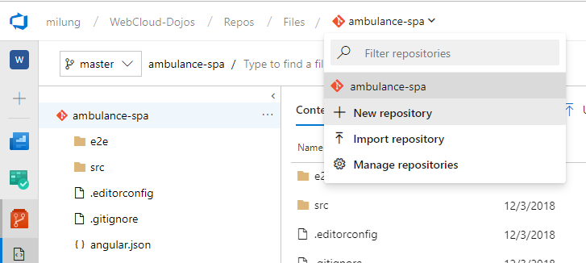

## Archivácia kódu

V ďalšom kroku vytvoríme archív pre zdrojový kód webovej služby 

Prihláste do svojho účtu v [Microsoft Azure DevOps Services](https://azure.microsoft.com/en-us/services/devops/)
a prejdite do projektu _WebCloud-<vaše priezvisko>_. Vytvorte nový git repozitár a nazvite ho `ambulance-webapi`.



Otvorte okno príkazového riadku a prejdite do priečinku `ambulance-webapi`.
Zadajte nasledujúce príkazy za účelom inicializácie Git repozitára

```powershell
git init
git remote add origin https://dev.azure.com/<account>/WebCloud-<vaše priezvisko>/_git/ambulance-webapi
```

Skontrolujte, či je _bin_ a _obj_ adresár gitom ignorovaný. Ak nie, upravte súbor `ambulance-webapi/.gitignore` do podoby

```bash
**/bin
**/obj
```

a archivujte váš kód pomocou príkazov

```powershell
git add .
git commit -m 'initial version of api'
git push --set-upstream origin master
```
