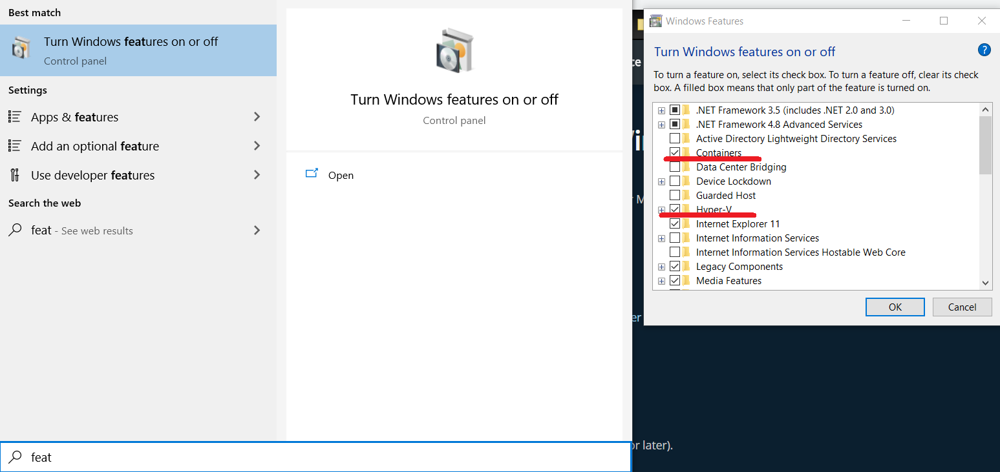
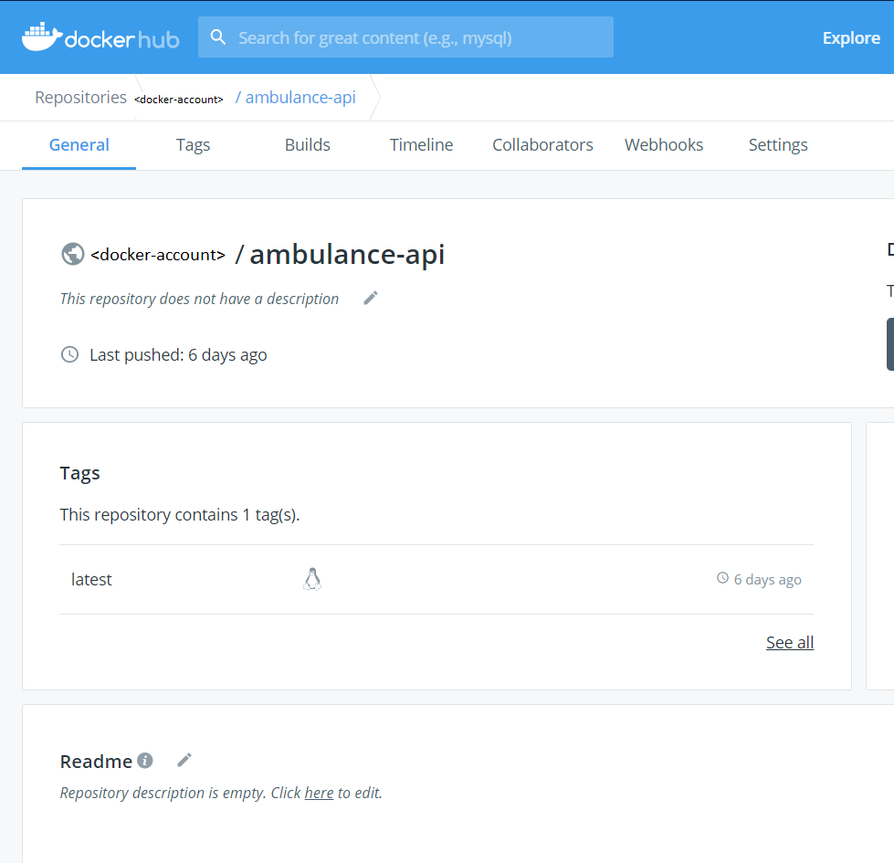

## Kontajnerizovanie aplikácie - webového api

Podarilo sa nám vytvoriť funkčné webové API a projekt, ktorý obsahuje testy.
Pred tým, než aplikáciu nasadíme, zabezpečíme jej kontajnerizáciu prostredníctvom
technológie Docker.

Jednou z hlavných výhod kontajnerizovanej aplikácie je jej ľahké (a do veľkej miery
jednodné naprieč poskytovateľmi) nasadenie.

### Príprava na cvičenie - inštalácia Docker

* Nainštalovať Docker a Kubernetes. Postupujte podľa návodu na 
[https://docs.docker.com/install/](https://docs.docker.com/install/).
* Vytvoriť účet na stránke [Docker Hub](https://hub.docker.com/).

### Požiadavky Windows

* OS Windows 10 64-bit: Pro, Enterprise alebo Education.
* Aktivovaná virtualizácia v bios/uefi a Hyper-V a Containers  
    

### Vytvorenie obrazu (image) aplikácie webového api

1. Prejdite do adresára `ambulance-api` a otvorte súbor `Dockerfile` (bol vygenerovaný Swagger-om).
    Skontrolujte obsah súboru a upravte verzie .NET obrazov:

    ```docker
    FROM mcr.microsoft.com/dotnet/sdk:5.0 AS build-env
    WORKDIR /app

    ENV DOTNET_CLI_TELEMETRY_OPTOUT 1

    # copy csproj and restore as distinct layers
    COPY *.csproj ./
    RUN dotnet restore

    # copy everything else and build
    COPY . ./
    RUN dotnet publish -c Release -o out

    # build runtime image
    FROM mcr.microsoft.com/dotnet/aspnet:5.0
    WORKDIR /app
    COPY --from=build-env /app/out .
    ENTRYPOINT ["dotnet", "ambulance-api.dll"]
    ```

    >info:> Teraz vykonajte príkaz z bodu 2 nižšie a potom si vysvetlíme obsah súboru,
    > lebo počas vykonávania príkazu sa (prvý krát) sťahuje množstvo dát (>500MB).

    Všimnite si, že sa v tomto prípade jedná o viac-krokové vytvorenie obrazu - _multistage build_.
    Počas prvého kroku použijeme ako základnú vrstvu obraz `mcr.microsoft.com/dotnet/sdk:5.0`,
    ktorý nám umožní vygenerovať artifakty projektu z jeho zdrojového kódu. Najprv
    kopírujeme iba súbor `*.csproj` (`ambulance-api.csproj`) a zavoláme príkaz
    `dotnet restore`. Tento príkaz vytvorí novú vrstvu v Union File System,
    používanom Docker. Pri ďalšom vytváraní obrazu z tohto súboru `Dockerfile`
    systém detekuje, či došlo k zmenám v súbore `ambulance-api.csproj`, a pokiaľ
    nie, tak použije vrstvu vygenerovanú počas predchádzajúceho behu.

    Následne skopírujeme zvyšné súbory a pomocou príkazu `dotnet publish` vygenerujeme
    artefakty pre zverejnenie aplikácie. Tu si všimnite, že vytvárame explicitne
    verziu _Release_.

    Počas druhého kroku použijeme ako základnú vrstvu obraz `mcr.microsoft.com/dotnet/aspnet:5.0`,
    určený pre beh aplikácií ASP.NET Core 5.0. Nastavíme premennú prostredia a určíme,
    že adresár `/app/out` sa má pripájať ku kontajneru z hosťovského prostredia.
    Následne skopírujeme artefakty vytvorené počas prvého kroku a určíme vstupný
    proces a jeho parametre pre beh kontajneru.

2. Uložte súbor `Dockerfile`. V príkazovom riadku prejdite do adresára `ambulance-api` a vykonajte príkaz

    ```ps
    docker build -t ambulance-api:latest .
    ```

    >info:> Ak build padne s chybou obsahujúcou _"System.Exception: In process
    > hosting is not supported for AspNetCoreModule. Change the AspNetCoreModule
    > to at least AspNetCoreModuleV2"_, zmeňte v súbore `web.config` _modules_
    > atribút na `modules="AspNetCoreModuleV2`.

    Po jeho úspešnom behu naštartujte kontajner s namapovaním portu 8089 na port
    kontajnera 5000, na ktorom by mal počúvať náš web server.

    ```ps
    docker run --name ambulance-api-instance -p 8089:5000 ambulance-api:latest
    ```

    V konzole by sa Vám malo zobraziť podobné hlásenie:

    ```ps
    Hosting environment: Production
    Content root path: /app
    Now listening on: http://[::]:5000
    Application started. Press Ctrl+C to shut down.
    ```

    Zobrazí sa však, že aplikácia počúva na porte 80:

    ```ps
    Now listening on: http://[::]:80
    ```

    To znamená, že počúva na porte 80 a definícia portu v súbore `launchSettings.json`
    je v tomto prípade ignorovaná.

    Teraz máme dve možnosti:
    * Naštartujeme kontainer s parametrom `-p 8089:80`
    * Definujeme port v súbore `Program.cs`.

    V druhom prípade, upravte metódu `CreateWebHostBuilder` nasledovne:

    ```cs
    public static IWebHostBuilder CreateWebHostBuilder(string[] args) =>
    WebHost.CreateDefaultBuilder(args)
        .UseStartup<Startup>()
        .UseUrls("http://*:8080");
    ```

    Zmenili sme port na 8080, aby sme videli, že to funguje. Hviezdička v url
    adrese znamená, že server odpovie na požiadavku z akejkoľvek
    adresy. Keby sme zadali `.UseUrls("http://localhost:8080")`, pri spustení
    z docker kontainera by server neodpovedal, lebo docker adresu _localhost_ interne
    premapuje na niečo iné.

    Zmažte inštanciu docker kontajnera, vybuildujte nový docker image a spustite kontajner:

    ```ps
    docker stop ambulance-api-instance
    docker rm ambulance-api-instance
    docker build -t ambulance-api:latest .
    docker run --name ambulance-api-instance -p 8089:8080 ambulance-api:latest
    ```

    Výpis po spustení kontainera by mal byť nasledovný:

    ```ps
    Hosting environment: Production
    Content root path: /app
    Now listening on: http://[::]:8080
    Application started. Press Ctrl+C to shut down.
    ```

    Vo webovom prehliadači znova zadajte adresu `http://localhost:8089/swagger`. Mal by
    sa zobraziť popis nášho API ako sme ho zadefinovali vo swaggeri.
    Po zadaní adresy `http://localhost:8089/api/waiting-list/dentist-warenova` sa
    ukáže náš príklad zadefinovaný vo swaggeri.

### Publikovanie obrazu pomocou Docker Hub

1. Doteraz sme používali iba lokálne dostupný obraz kontajneru. Pokiaľ ho chcete
    použiť v ľubovoľnom prostredí, najprv ho označte svojím repozitárom:

    ```docker
    docker tag ambulance-api:latest <docker-account>/ambulance-api:latest
    ```

    Pokiaľ nie ste prihlásený do svojho repozitára, tak sa prihláste, napríklad
    pomocou príkazu docker login:

    ```docker
    docker login
    ```

    Obraz zverejníte pomocou príkazu:

    ```docker
    docker push <docker-account>/ambulance-api:latest
    ```

    Po prihlásení do Docker Hub by ste mali v zozname repozitárov vidieť nový repozitár
    `<docker-account>/ambulance-api:latest`.
    

V tejto chvíli máte plne kontajnerizovanú verziu webového api pripravenú na použitie.
Obraz webovej služby sa nachádza v repozitári Docker Hub, ktorý bude v ďalšej časti cvičení
dôležitý pri automatickej priebežnej integrácií a automatickom priebežnom nasadení.
