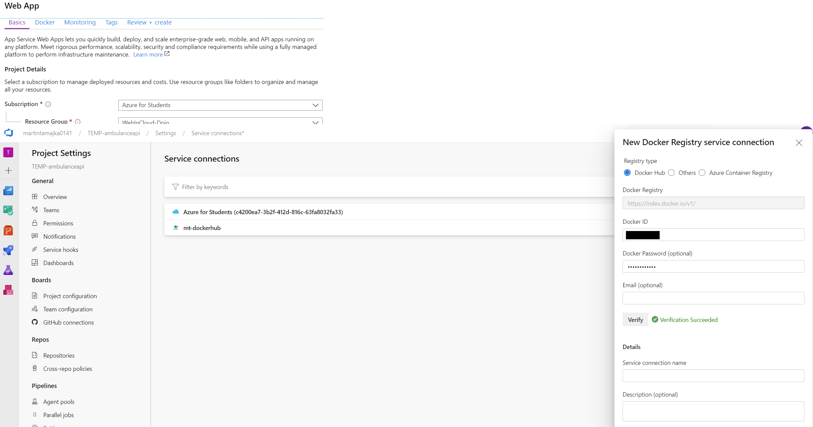

## Automatická priebežná integrácia (_Continuous Integration, CI_)

V tejto kapitole využijeme [_Azure Pipelines_](https://docs.microsoft.com/en-us/azure/devops/pipelines/get-started/what-is-azure-pipelines?view=azure-devops)
na automatizáciu integrácie našej webovej služby. V kontexte našej webovej služby
bude automatická integrácia zahŕňať:

* Nainštalovanie potrebných knižníc rámca .NET Core,
* zostavenie (_build_) aplikácie,
* zostavenie testovacieho projektu,
* spustenie testov,
* zostavenie docker image,
* publikovanie docker image na službu [_Docker Hub_](https://hub.docker.com/).

Všimnite si, že priebežná integrácia v sebe nezahŕňa nasadenie webovej služby.

<!-- Predpoklady:
* dockerizovaná appka
* účet na dockerhube
* appka v AzureGit
* štruktúra: ambulance-webapi/ambulance-api, ambulance-webapi/ambulance-api.tests
-->

### Servisné pripojenie

Vytvoríme servisné pripojenie na Docker Hub. Prihláste sa do svojho účtu v
[Microsoft Azure DevOps Services](https://azure.microsoft.com/en-us/services/devops/)
a prejdite do projektu _WebCloud-<vaše priezvisko>_. V ľavom paneli kliknite na ikonu
nastavenie (ozubené koliečko) a vyberte _Service connections_. Následne
kliknite na _New Service Connection_ a vyberte možnosť `Docker Registry`.
Ako _Registry type_ vyberte `Docker Hub`. Zadajte svoje Docker ID a
prihlasovacie heslo do Docker Hub. Kliknite na Verify. Ako _Service connection
name_ zadajte `dockerhub-connection`. Kliknite na _Verify and save_.


### CI pipeline

Nakonfigurujeme CI pipeline s použitím Azure Pipelines. Prihláste sa do svojho
účtu v [Microsoft Azure DevOps Services](https://azure.microsoft.com/en-us/services/devops/)
a prejdite do projektu _WebCloud-<vaše priezvisko>_. V ľavom paneli kliknite na _Pipelines
-> Pipelines_ a následne na _New Pipeline_.

> Podobne ako v prípade SPA, aj tu použijeme YAML. (Pozn. Pre tých, čo majú radšej
> pôvodný spôsob je stále možnosť použiť klasický editor: Dole kliknite na
> _Use the classic editor_).

Zvoľte možnosť _Azure Repos Git YAML_, ako repozitár zvoľte _ambulance-webapi_
a v ďaľšom kroku ako šablónu (_template_) zvoľte _Starter pipeline_.
Bude vygenerovaný jednoduchý yaml template.

Rovnako ako v prípade prvej pipeliny pre SPA aj tu bude pipeline obsahovať
iba jeden _stage_ a jeden _job_, čiže by sme ich mohli z definície vynechať a
rovno písať _steps_. Ale teraz si ukážeme ako vyzerá pipeline aj s nimi.

Najprv premenujte pipeline na `ambulance-webapi-CI`.

1. Vymažte celý obsah pipeliny a vypíšte jej začiatok, zatiaľ bez stepov:

    ```yaml
    trigger:
    - master

    stages:
    - stage: BuildAndPublish
      displayName: Build and Publish docker image
      jobs:  
      - job: BuildAndPublish
        displayName: Build and Publish docker image
        pool:
          vmImage: 'ubuntu-latest'
        steps:
    ```

   CI trigger je nastavený na hlavnú vetvu `master`. Definujeme si jednu _stage_
   s jedným _jobom_. _Agent pool_ pre build job sme nastavili na `ubuntu-latest`.
   Podobne ako v prípade prvej pipeline možeme použiť aj build agentov s windows
   systémom `windows-2019`, ktoré sú ale pomalšie.

2. Kliknite na Show asisstant vpravo hore. Vyroluje sa nám zoznam preddefinovaných
   taskov, ktoré nám uľahčia tvorbu pipeliny.

3. V task assitante vyhľadajte úlohu typu `Use .Net Core`, v poli _Package to
   install_ zvoľte `SDK (contains runtime)` a do poľa _Version_ vložte `5.0.x`.
   Pridajte task do yaml a pomenujte ho.

   ```yaml
    - task: UseDotNet@2
      displayName: Use .NET core 5.0
      inputs:
        packageType: 'sdk'
        version: '5.0.x'
   ```

4. Pridajte úlohu typu _.NET Core_, v poli _Command_ zvoľte voľbu `restore`,
   a v poli _Path to project(s)_ zadajte `**/*.csproj`. Pridajte task do yaml a
   pomenujte ho.

   ```yaml
    - task: DotNetCoreCLI@2
      displayName: Dotnet restore
      inputs:
        command: 'restore'
        projects: '**/*.csproj'
        feedsToUse: 'select'
   ```

5. Vložte ďalšiu úlohu typu _.NET Core_, v poli _Command_ zvoľte možnosť `build`,
   v poli _Path to project(s)_ zadajte `ambulance-api/ambulance-api.csproj`,
   a v poli _Arguments_ zadajte text `--configuration Release --no-restore`.
   Pridajte úlohu do yaml a nazvite ju `dotnet build sources`.

   ```yaml
    - task: DotNetCoreCLI@2
      displayName: Dotnet build sources
      inputs:
        command: 'build'
        projects: 'ambulance-api/ambulance-api.csproj'
        arguments: '--configuration Release --no-restore'
   ```

6. Vložte ďalšiu úlohu typu _.NET Core_, v poli _Command_ zvoľte možnosť `build`,
   v poli _Path to project(s)_ zadajte `ambulance-api.tests/ambulance-api.tests.csproj`,
   a v poli _Arguments_ zadajte text `--configuration Release --no-restore`.
   Pridajte úlohu do yaml a nazvite ju `dotnet build tests`.

   ```yaml
    - task: DotNetCoreCLI@2
      displayName: Dotnet build tests
      inputs:
        command: 'build'
        projects: 'ambulance-api.tests/ambulance-api.tests.csproj'
        arguments: '--configuration Release --no-restore'
   ```

7. Vložte ďalšiu úlohu typu _.NET Core_, v poli _Command_ zvoľte možnosť `test`,
   v poli _Path to project(s)_ zadajte `ambulance-api.tests/ambulance-api.tests.csproj`,
   a v poli _Arguments_ zadajte text `--configuration Release --no-build`.
   Pridajte úlohu do yaml a nazvite ju `dotnet run tests`.

   ```yaml
    - task: DotNetCoreCLI@2
      displayName: Dotnet run tests
      inputs:
        command: 'test'
        projects: 'ambulance-api.tests/ambulance-api.tests.csproj'
        arguments: '--configuration Release --no-build'
        testRunTitle: 'ambulance-api-ut'
   ```

8. Vložte úlohu typu _Docker_. Vyplňte ju nasledovne:
   * _Container Registry_ : `dockerhub-connection`
   * _Container repository_ : `<VASE_DOCKERHUB_ID>/ambulance-api`
   * _Command_ : `build`
   * _Docker File_ : `ambulance-api/Dockerfile`
   * _Tags_ : `latest`
  
   Pridajte úlohu do yaml a nazvite ju `Docker build`.

    ```yaml
    - task: Docker@2
      displayName: Docker build
      inputs:
        containerRegistry: 'dockerhub-connection'
        repository: 'cagardap/ambulance-api'
        command: 'build'
        Dockerfile: 'ambulance-api/Dockerfile'
        tags: 'latest'
    ```

9. Pridajte poslednú úlohu typu _Docker_. Vyplňte ju nasledovne:
   * _Container Registry_ : `dockerhub-connection`
   * _Container repository_ : `<VASE_DOCKERHUB_ID>/ambulance-api`
   * _Command_ : `push`
   * _Tags_ : `latest`
  
   Pridajte úlohu do yaml a nazvite ju `Docker push`.

   ```yaml
    - task: Docker@2
      displayName: Docker push
      inputs:
        containerRegistry: 'dockerhub-connection'
        repository: 'cagardap/ambulance-api'
        command: 'push'
        tags: 'latest'
   ```

   >info:> Kompletné yaml je uvedené nižšie.

10. Stlačte tlačidlo _Save & run_ a overte, že táto zostava prebehne úspešne. Máme
    hotovú CI pipeline pre webapi projekt, pri každom kommite sa zostava spustí a
    mailom nás bude informovať o úspechu či neúspechu buildu.

>warning:> Zostavu, a teda aj yaml súbor sme vytvorili na master repositári na devops
> stránke. Nezabudnite si zmeny synchronizovať do lokálneho repozitára na počítač.

### Kompletné yaml pre webapi CI pipeline

```yaml
trigger:
- master

stages:
- stage: Build
  displayName: Build and Publish docker image
  jobs:  
  - job: Build
    displayName: Build
    pool:
      vmImage: 'ubuntu-latest'
    steps:
    - task: UseDotNet@2
      displayName: Use .NET core 5.0
      inputs:
        packageType: 'sdk'
        version: '5.0.x'
    - task: DotNetCoreCLI@2
      displayName: Dotnet restore
      inputs:
        command: 'restore'
        projects: '**/*.csproj'
        feedsToUse: 'select'
    - task: DotNetCoreCLI@2
      displayName: Dotnet build sources
      inputs:
        command: 'build'
        projects: 'ambulance-api/ambulance-api.csproj'
        arguments: '--configuration Release --no-restore'
    - task: DotNetCoreCLI@2
      displayName: Dotnet build tests
      inputs:
        command: 'build'
        projects: 'ambulance-api.tests/ambulance-api.tests.csproj'
        arguments: '--configuration Release --no-restore'
    - task: DotNetCoreCLI@2
      displayName: Dotnet run tests
      inputs:
        command: 'test'
        projects: 'ambulance-api.tests/ambulance-api.tests.csproj'
        arguments: '--configuration Release --no-build'
        testRunTitle: 'ambulance-api-ut'
    - task: Docker@2
      displayName: Docker build
      inputs:
        containerRegistry: 'dockerhub-connection'
        repository: 'cagardap/ambulance-api'
        command: 'build'
        Dockerfile: 'ambulance-api/Dockerfile'
        tags: 'latest'
    - task: Docker@2
      displayName: Docker push
      inputs:
        containerRegistry: 'dockerhub-connection'
        repository: 'cagardap/ambulance-api'
        command: 'push'
        tags: 'latest'
```
