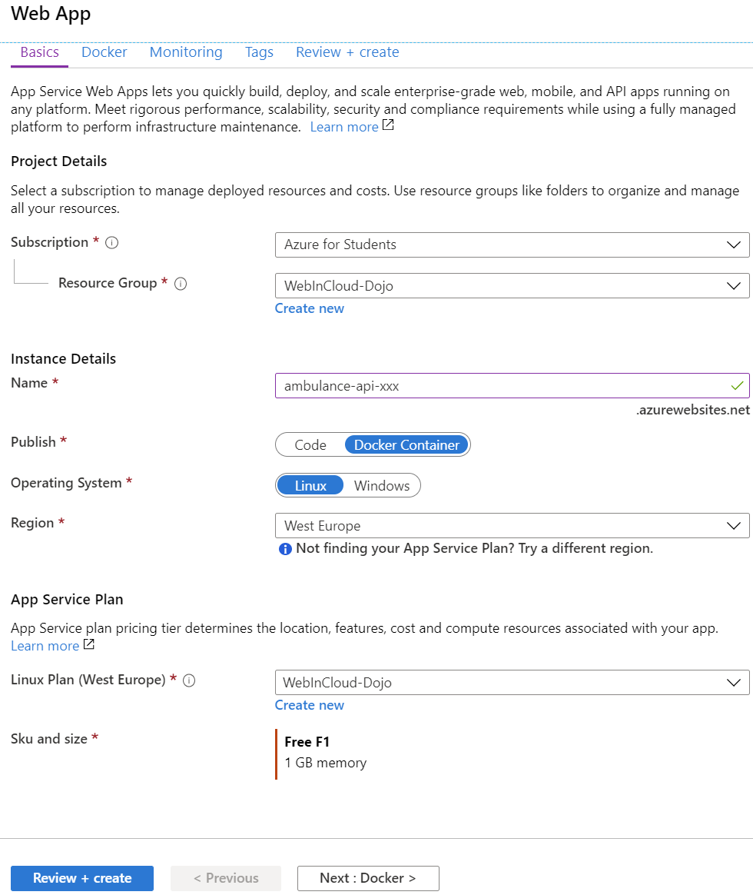
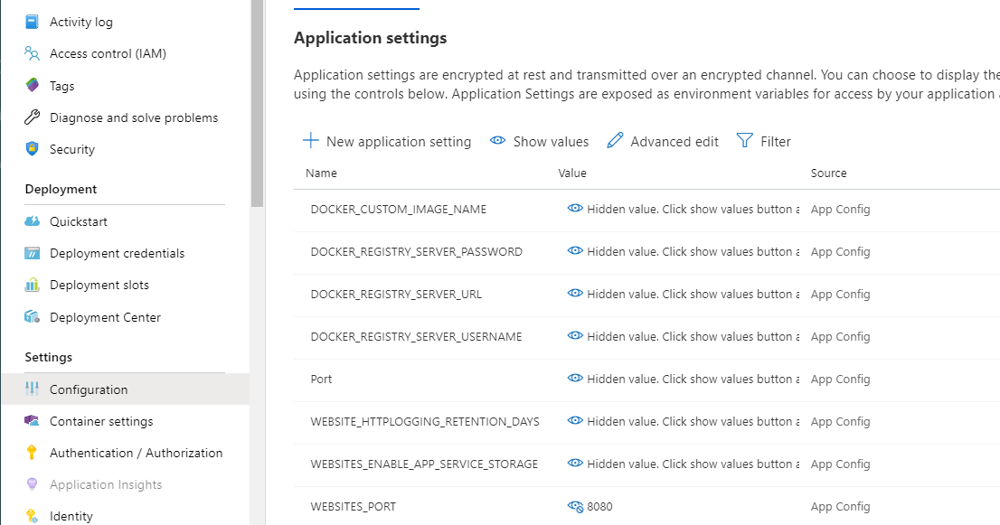

## Automatické priebežné dodanie (_Continuous delivery, CD_)

Výsledkom predchádzajúcej časti je obraz našej kontajnerizovanej aplikácie
nahraný v repozitári Docker Hub.

V tejto kapitole využijeme Azure Pipelines na automatizáciu priebežného dodania
našej webovej služby. Priebežné dodanie budeme chápať ako automatické nasadenie
našej aplikácie, vďaka čomu bude služba (webové api) dostupná bez toho, aby ju
vývojár musel ručne nasadzovať. V kontexte našej webovej služby bude automatické
nasadenie zahŕňať:

* Vytvorenie webovej aplikácie pre kontajnerové aplikácie prostredníctvom Azure Portal.
* Konfigurácia Release Pipeline v Azure DevOps.

### Webová aplikácia pre kontajnerové aplikácie

1. Prejdite na stránku [https://portal.azure.com](https://portal.azure.com).
    V portáli zvoľte v ľavom paneli položku _Create a resource_ a zvoľte `Web App 
    for Containers`. Kliknite na _Create_. Zadajte:

    * Subscription
    * Skupinu prostriedkov - _Resource Group_ - vyberte existujúcu skupinu `WebInCloud-Dojo`.
    * Meno aplikácie, napr. `ambulance-api-<inicialy>`. Toto meno bude použité ako
    názov servera, na ktorom bude vaša aplikácia vystavená, preto musí byť názov
    jedinečný.
    * Publish - `Docker Container`
    * Operating system - `Linux`
    * Region - `West Europe`
    * Zvoľte aplikačný plán `WebInCloud-Dojo`.

    Potvrďte vašu voľbu (_Review + Create_) a vytvorte nový prostriedok webovej aplikácie.

    >info:> Pokiaľ sa vám po stlačení tlačidla _Review + Create_ objaví chybová
    >hláška, bude zrejme nutné vytvoriť novú _Resource Group_.

    

    Po chvíli sa v portáli vo vašich notifikáciách zobrazí nová správa
    _Deployment succeeded_. Zvoľte voľbu _Pin to Dashboard_ a potom
    _Go to Resource_.

2. Naše webapi počúva na porte 8080. Webovej aplikácii to nastavíme nasledovne.
V ľavej časti vyberte v časti `Settings` položku `Configuration`. Na pravej
strane potom v časti `Application settings` zadajte pre premennú
`WEBSITES_PORT` hodnotu _8080_.

   

3. V prehľade webovej aplikácie (_Overview_) vidíte odkaz -
_URL_- na novú aplikáciu. Otvorte tento odkaz v novom okne. Mala by vás privítať
defaultná stránka web aplikácie na Azure.

### Release pipeline s použitím Azure Pipelines

1. Prihláste sa do svojho účtu v [Microsoft Azure DevOps Services](https://azure.microsoft.com/en-us/services/devops/)
a prejdite do projektu _WebCloud-<vaše priezvisko>_. V ľavom paneli kliknite na
_Pipelines -> Releases_ a následne na _New Pipeline_.

2. Vyberte možnosť _Azure App Service Deployment_ a kliknite na `Apply`.
   Premenujte stage - zadajte do `Stage name` hodnotu _Deploy from Docker Hub
   to Azure_.

3. Premenujte pipeline na `Webapi CD pipeline`.

4. Ako prvé potrebujeme nastaviť trigger na spustenie releasu. Máme dve možnosti.
   * Prvá možnosť je naviazať ho na koniec CI buildu.
   * Výsledkom CI buildu je docker image nasadený na _Docker Hub_. Druhá možnosť
     je preto naviazať trigger na moment vytvorenia novej verzie docker image na
     _Docker Hub_.

     Ukážeme si prvú možnosť. V časti Artifacts kliknite na `+ Add`
     * `Source Type` zvoľte _Build_
     * `Project` vyberte súčasný projekt
     * `Source` vyberte _ambulance-webapi-CI_
     * Zvyšné polia nechajte nezmenené.
  
     Kliknite na `Add`.

    _Trigger_ automatického priebežného nasadenia, t.j. aby sa release pipeline
    spustila automaticky po dokončení CI pipeline nastavíme nasledovne. Kliknite
    na ikonku blesku v časti _Artifacts_ a nastavte `Continuous deployment trigger`
    do stavu _Enabled_.

5. Ďalej potrebujeme nakonfigurovať kroky automatického priebežného nasadenia.
   V časti _Stages -> Deploy from Docker Hub to Azure_ kliknite na
   _1 job, 1 task_ a nastavte:

   * `Azure subscription` vyberte váš subscription.
   * `App type` zvoľte _Web App for Containers (Linux)_
   * `App service name` vyberte _ambulance-api-<vase-inicialy>_
   * `Registry or Namespace` zadajte váš "docker-account"
   * `Repository` na hodnotu _ambulance-api_.

   Ako prvý krok pipeliny potrebujeme nasadiť docker image z _Docker Hub_
   do azure Web applikácie, ktorú sme vytvorili v úvode tejto kapitoly. Kliknite
   na prvý krok `Deploy Azure App Service`. V pravej časti je vačšina položiek
   predvyplnená, len do poľa `Tag` zadajte _latest_. Ak položky nie sú
   vyplnené, vyplňte ich podľa zoznamu vyššie.

   Po nakopírovaní docker image musíme azure web applikáciu reštartovať.
   Pridáme dva kroky - jeden na stop a druhý na štart servisu.

   * Kliknite na tlačítko `+` pri `Run on agent` a pridajte nový krok
    `Azure App Service manage`. Do poľa `Name` zadajte hodnotu
   _Stop service_, vyberte váš Azure subscription. Ako `Action` zadajte
   _Stop App Service_. V poli `App service name` vyberte _ambulance-api-[vase-inicialy]_.  

   * Znova pridajte krok `Azure App Service manage`. Do poľa `Name` zadajte hodnotu
   _Start service_, vyberte váš Azure subscription. Ako `Action` zadajte
   _Start App Service_. V poli `App service name` vyberte _ambulance-api-[vase-inicialy]_.

   Uložte pipeline stlačením `Save`.

6. V tomto okamihu máte kompletne nakonfigurovanú automatickú priebežnú
   integráciu (CI) a automatické priebežné nasadenie alebo dodanie (CD).
   Ich funkčnosť môžete vyskúšať buď tak, že vykonáte nejakú zmenu v aplikácií
   a vykonáte `push` novej verzie na server, alebo priamo v Azure DevOps spustením
   CI pipeliny: `Pipelines -> Pipelines -> ambulance-webapi-CI -> Run pipeline`.

   Po skončení CI buildu by sa mal automaticky spustiť CD pipeline.

7. Keď build dobehne, vyskúšajte pristúpiť na adresu nasadeného webapi z
   prehliadača: `https://ambulance-api-<inicialy>.azurewebsites.net/swagger/index.html`.
   Stránka by mala zobraziť swagger definíciu našeho webapi.

8. Vyskúšame ešte jedno z POST api. Pustite aplikáciu Postman a vytvorte nový POST
   request s menom `Create ambulance` na adresu `https://ambulance-api-<inicialy>.azurewebsites.net/api/waiting-list/practitioner-bobulova`
s telom:

   ```json
   {
       "id": "practitioner-bobulova",
       "name": "Ambulancia všeobecného lekára Dr. Bobulová",
       "roomNumber": "211 - 2.posch",
       "predefinedConditions": [
           {
               "code": "folowup",
               "value": "Kontrola",
               "estimatedDurationMinutes": 15
           },
           {
               "code": "nausea",
               "value": "Nevoľnosť",
               "estimatedDurationMinutes": 45,
               "reference": "https://zdravoteka.sk/priznaky/nevolnost/"
           },
           {
               "code": "fever",
               "value": "Teploty",
               "estimatedDurationMinutes": 20,
               "reference": "https://zdravoteka.sk/priznaky/   zvysena-telesna-teplota/"
           },
           {
               "code": "ache-in-throat",
               "value": "Bolesti hrdla",
               "estimatedDurationMinutes": 20,
               "reference": "https://zdravoteka.sk/priznaky/   bolest-pri-prehltani/"
           }
       ]
   }
   ```

   Požiadavka by mala skončiť úspešne s kódom 200.

   >warning:> Náš docker obraz neobsahuje vytvorenie diskového priestoru a preto
   > dáta nie sú uložené perzistentne.
