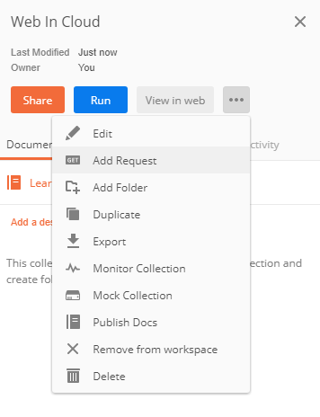
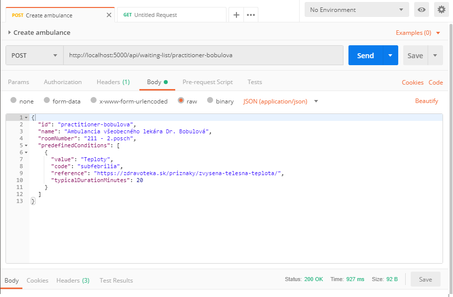
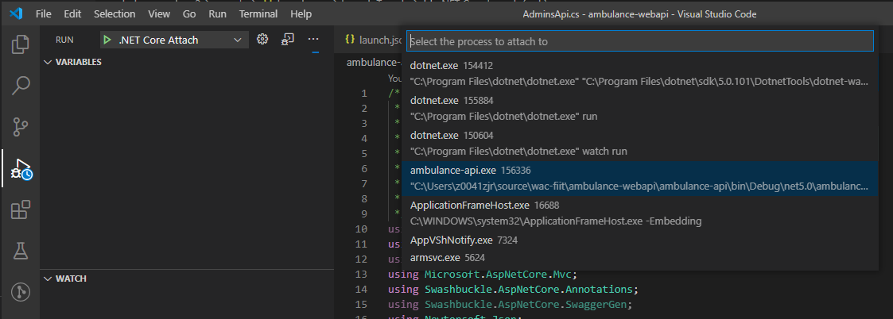
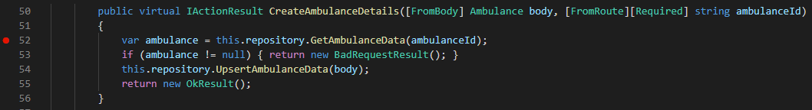

## Ladenie web služby s využitím programu Postman

Aplikácia Postman umožňuje komunikovať s ľubovoľným HTTP serverom na úrovni HTTP
protokolu a spravovať rôzne typy dotazov. Nie je to jediná aplikácia tohto typu,
medzi ďalšie patrí [Telerik Fiddler](https://www.telerik.com/fiddler) alebo všeobecne
známy a široko dostupný nástroj príkazového riadku [cURL](https://curl.haxx.se/).
V prípade, že používate Visual Studio Code, pozrite si tiež rozšírenie
[REST Client](https://marketplace.visualstudio.com/items?itemName=humao.rest-client).
Použitie týchto aplikácií umožňuje testovať funkcionalitu vlastných web služieb
alebo služieb tretích strán bez nutnosti použitia klientskej aplikácie, ktorá by
mohla do procesu zaviesť vlastné chyby a limitácie. Na rozdiel od typickej
funkcionality internetového prehliadača, umožňujú tieto aplikácie špecifikovať
obsah údajov a hlavičiek odosielaných na server.

Pre podrobnejšiu analýzu komunikácie na nižších vrstvách sieťového protokolu
možno použiť populárnu aplikáciu [WireShark](https://www.wireshark.org/). Jej
funkcionalitou sa ale nebudeme v tomto predmete zaoberať.  

1. Otvorte aplikáciu Postman a vytvorte novú kolekciu, nazvite ju _Web In Cloud_.
  V menu potom vyberte voľbu _Add Request_, a pomenujte novú požiadavku ako _Create
  ambulance_.

    

2. Zvoľte typ požiadavky `POST`, _URL_ zadajte  `http://localhost:8080/api/waiting-list/practitioner-bobulova`.
  Prejdite na záložku _Body_, zvoľte formát dát _raw_ a vyberte typ obsahu
  (_Content-Type_) ako `JSON (application/json)`. Do tela požiadavky zapíšte údaje
  o novej aplikácii:

    ```json
    {
      "id": "practitioner-bobulova",
      "name": "Ambulancia všeobecného lekára Dr. Bobulová",
      "roomNumber": "211 - 2.posch",
      "predefinedConditions": [
        {
          "value": "Teploty",
          "code": "subfebrilia",
          "reference": "https://zdravoteka.sk/priznaky/zvysena-telesna-teplota/",
          "typicalDurationMinutes": 20
        }
      ]
    }
    ```

    Nakoniec zvoľte tlačidlo _Save_ a uložte túto požiadavku.

3. Pokiaľ ste predtým zastavili váš server, opäť ho naštartuje príkazom
  `dotnet watch run`

4. Stlačte tlačidlo _Send_. V časti odozvy požiadavky by ste mali vidieť reťazec
  _Status: 200 OK_. (Pokiaľ tomu tak nie je prejdite nižšie na časť o ladení programu).

    

5. Vo Visual Studio Code kliknite na _Run_ ikonu v ľavom bočnom paneli. Ak ladanie zatial nemáte
  nakonfigurované, v zobrazenom okne uvidíte možnosti konfigurácie. Kliknite na tlačidlo
  _Run and Debug_, zvoľte _.NET Core_ ako vaše prostredie a projekt _ambulance-api_. Automaticky sa
  vygeneruje konfiguračný súbor `launch.json`. 

    Zo zoznamu Run príkazov vyberte voľbu _.NET Core Attach (ambulance-api)_ a zvoľte tlačidlo
    _Start Debugging_ (zelený trojuholník). V zobrazenom zozname .NET aplikácii
    vyberte Váš server (bude zobrazovať _ambulance-api.exe <cesta ku vašemu projektu>_).
    Prejdite do súboru `Controllers\AdminsApi.cs`, do metódy `CreateAmbulanceDetails`
    a nastavte v nej bod prerušenia - _pravé tlačidlo myši -> Add Breakpoint_

    

    

    Prejdite do programu Postman a znovu odošlite požiadavku stlačením tlačidla
    _Send_. Vráťte sa do programu Visual Studio Code a odkrokujte činnosť programu.
    Sledujte stav premenných v paneli na ľavej strane. Za normálnych okolností by
    teraz mala požiadavka skončiť s hodnotou _400 - Bad Request_. Upravte požiadavku
    a vyskúšajte odkrokovať vytvorenie ďalšej ambulancie.

6. Prejdite do programu Postman a zmeňte parameter _id_ v __tele__ požiadavky.
   Znovu odošlite požiadavku stlačením tlačidla _Send_. Vráťte sa do programu
   Visual Studio Code a odkrokujte činnosť programu. Odhalili ste chybu?
   Zamyslite sa, ako ju opraviť.
