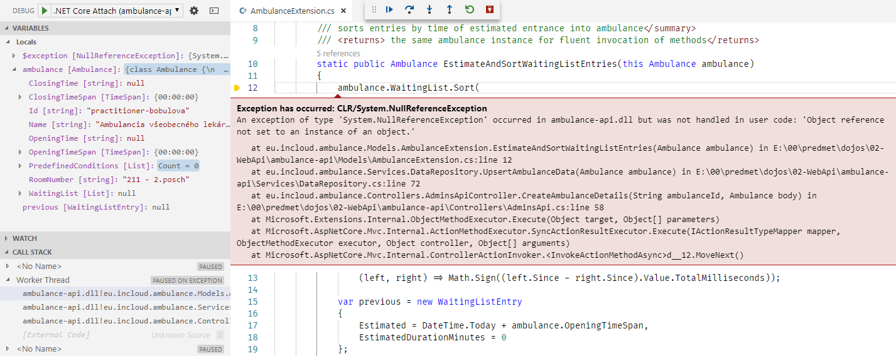

## Automatizované testy

V tejto časti si ukážeme spôsob vytvárania automatizovaných unit testov technikou
 _Test Driven Development_. Našim cieľom je naimplementovať funkcionalitu, ktorá
 zabezpečí správny výpočet predpokladaného času vstupu pacienta do ambulancie.

1. Premenujte súbor `ambulance-api.tests/UnitTest1.cs` na súbor `ambulance-api.tests/AmbulanceExtensionTest.cs`.
    Nastavte projekt
    `ambulance-api.tests` ako aktívny C# projekt - stlačte na meno projektu
    v stavovom riadku a vyberte projekt `ambulance-api.tests`.  

2. Prvá požiadavka na funkcionalitu je, že prvý pacient môže vstúpiť do
  ambulancie najskôr v čase otvorenia ambulancie. Upravte obsah súboru
  `AmbulanceExtensionTest.cs` a pripravte kostru testu:

    ```csharp
    using Microsoft.VisualStudio.TestTools.UnitTesting;

    namespace eu.incloud.ambulance.Models
    {
        [TestClass]
        public class AmbulanceExtensionTest
        {
            [TestMethod]
            public void PatientBeforeOpeningHours_WillNotEnterBeforeOpeningAmbulance()
            {
                // given

                // when

                // then
            }
        }
    }
    ```

    Zadajte podmienku úspešného testu. Predpokladáme, že `openingTime` bude typu
    [TimeSpan](https://docs.microsoft.com/en-us/dotnet/api/system.timespan?view=net-5.0),
    preto od vlastnosti `EstimatedStart` odpočítavame dátum `DateTime.Today`.

    ```csharp
            ...
            // then
            Assert.IsTrue(
                (ambulance.WaitingList[0].EstimatedStart - DateTime.Today) >= openingTime,
                "first patient cannot enter before opening time" );
        }
        ...
    ```

    Zadajte akým spôsobom dôjde k výpočtu:

    ```csharp
            ...
            // when
            ambulance.EstimateAndSortWaitingListEntries();

            // then
            Assert.IsTrue(
                (ambulance.WaitingList[0].EstimatedStart - DateTime.Today) >= openingTime,
                "first patient cannot enter before opening time" );
        }
    ```

    a nakoniec prípravu kontextu pre vykonanie testu:

    ```csharp
            ...
            // given
            var openingTime = new TimeSpan(8,0,0);

            var ambulance = new Ambulance
            {
                OpeningTime = "08:00",
                WaitingList = new List<WaitingListEntry>
                {
                    new WaitingListEntry
                    {
                        Id = "test",
                        PatientId = "test-patient",
                        Name = "Patient Test",
                        WaitingSince = DateTime.Today + new TimeSpan(6, 32, 0),
                        EstimatedStart = DateTime.Today + new TimeSpan(5, 0, 0)
                                                        // any time after opening
                    }
                }
            };

            // when
            ambulance.EstimateAndSortWaitingListEntries();

            // then
            Assert.IsTrue(
                (ambulance.WaitingList[0].EstimatedStart - DateTime.Today) >= openingTime,
                "first patient cannot enter before opening time" );
        }
    ```

    V tomto momente je test nekompilovateľný - očakávame nový atribút `OpeningTime`
    triedy `Ambulance` a jej novú metódu `EstimateAndSortWaitingListEntries()`,
    ktoré ešte neexistujú.

3. Doplňte nové vlastnosti triedy do súboru `ambulance-api\Models\Ambulance.cs`.
   Postupné vylepšovanie funkcionality a refaktoring je súčasťou techniky TDD.
   Vzhľadom na jednoduchosť týchto metód (a limitovaný čas), tieto metódy budeme
   testovať len práve vytváraným testom.

    ```csharp
    ...
    public List<Condition> PredefinedConditions { get; set; }

    /// <summary>
    /// Gets or Sets OpeningTime.!-- Format is "HH:MM"
    /// </summary>
    [DataMember(Name="openingTime")]
    public string OpeningTime { get; set; }

    /// <summary> Provides OpeningTime as TimeSpan value. Not serialized </summary>
    [BsonIgnore]
    [IgnoreDataMember]
    public TimeSpan OpeningTimeSpan
    {
        get => this.ParseTimeSpan(this.OpeningTime);
        set => this.OpeningTime = this.FormatTimeSpan(value);
    }

    private TimeSpan ParseTimeSpan(string value)
    {
        if (string.IsNullOrWhiteSpace(value)) { return default(TimeSpan); }

        var segments = value.Split(':');
        if (segments.Length >= 2)
        {
            int.TryParse(segments[0], out int hours);
            int.TryParse(segments[1], out int minutes);
            return new TimeSpan(hours, minutes, 0);
        }
        return new TimeSpan();
    }

    private string FormatTimeSpan(TimeSpan value) => $"{value.Hours}:{value.Minutes}";

    /// <summary>
    /// Returns the string presentation of the object
    /// </summary>
    /// <returns>String presentation of the object</returns>
    public override string ToString()
    {
        var sb = new StringBuilder();
        sb.Append("class Ambulance {\n");
        sb.Append("  Id: ").Append(Id).Append("\n");
        sb.Append("  Name: ").Append(Name).Append("\n");
        sb.Append("  RoomNumber: ").Append(RoomNumber).Append("\n");
        sb.Append("  Opens: ").Append(OpeningTime).Append("\n");
        sb.Append("  WaitingList: ").Append(WaitingList).Append("\n");
        sb.Append("  PredefinedConditions: ").Append(PredefinedConditions).Append("\n");
        sb.Append("}\n");
        return sb.ToString();
    }
    ...
    ```

    Všimnite si, že serializovaná vlastnosť `OpeningTime` je
    typu `string`. Formát Json priamo  nepodporuje `TimeSpan` typ. Pre
    uľahčenie práce sme preto zaviedli alternatívnu vlastnosť `OpeningTimeSpan`,
    ktorá konvertuje pôvodné hodnoty do/z typu `string`. Túto
    vlastnosť sme ale vylúčili zo serializácie typu `Ambulance` použitím atribútov
    `BsonIgnore` (LiteDB) a `IgnoreDataMember` (JSONSerializer).

    Pozrite si tiež špecifikáciu API navigáciou na
    [http://localhost:8080/swagger](http://localhost:8080/swagger). Nová vlastnosť je automaticky
    zdokumentovaná, čo zabezpečuje knižnica _Swashbuckle_.

4. Do súboru `ambulance-api.tests\AmbulanceExtensionTest.cs` doplňte deklaráciu
   extension metódy jazyka C# pre typ `Ambulance`. Pri vývoji technikou _TDD_ sa
   snažíme novú funkcionalitu vyvinúť a otestovať v tom istom súbore ako ju testujeme,
   a až následne ju premiestníme do cieľového súboru a projektu. Nie vždy to je ale
   možné alebo vhodné. Pri rozhodovaní sa, kde zmeny realizovať, sa v zásade riadime
   len efektivitou vývoja novej funkcionality.

    ```csharp
    namespace eu.incloud.ambulance.Extensions
    {
        static class AmbulanceExtension
        {
            /// <summary> (re)computes estimated entrance into ambulance and
            /// sorts entries by time of estimated entrance into ambulance</summary>
            /// <returns> the same ambulance instance for fluent invocation of methods</returns>
            static public Ambulance EstimateAndSortWaitingListEntries(this Ambulance ambulance)
            {
                return ambulance;
            }
        }
    }
    ```

    V tejto chvíli je náš test kompilovateľný.

5. V príkazovom okne, v priečinku `ambulance-api.tests` vykonajte príkaz

    ```powershell
    dotnet watch test
    ```

    Po chvíli sa zobrazí výpis

    ```powershell
    Total tests: 1. Passed: 0. Failed: 1. Skipped: 0.
    Test Run Failed.
    ```

6. V súbore `ambulance-api.tests\AmbulanceExtensionTest.cs` upravte metódu `EstimateAndSortWaitingListEntries`

    ```csharp
    static public Ambulance EstimateAndSortWaitingListEntries(this Ambulance ambulance)
    {
        foreach (var entry in ambulance.WaitingList)
        {
            entry.EstimatedStart = DateTime.Today + ambulance.OpeningTimeSpan;
        }
        return ambulance;
    }
    ```
    Po uložení máme na výpise príkazového riadku zobrazený úspešný beh:

    ```powershell
    Total tests: 1. Passed: 1. Failed: 0. Skipped: 0.
    Test Run Successful.
    ```
    Pri technike _TDD_ implementujeme len nevyhnutné operácie pre úspešné splnenie
    testov. Týmto spôsobom zabezpečujeme, že do logiky programu nezanesieme funkcionalitu
    alebo náhodné chyby, ktoré nie sú pokryté automatizovanými testami.

    Archivujte vaše zmeny do vzdialeného repozitára.

7. Pokračujeme ďalším testom, ktorým overíme, že pacient nemôže vstúpiť do ambulancie
  skôr, ako sa prihlásil v čakárni. Začnite kostrou aplikácie, následne overovacou
  podmienkou

    ```csharp
    ...
    public class AmbulanceExtensionTest
    {
        [TestMethod]
        public void PatientBeforeOpeningHours_WillNotEnterBeforeOpeningAmbulance()
        {...}

        [TestMethod]
        public void PatientInWaitingRoom_WillNotEnterBeforeOwnArrival()
        {
            // given

            // when

            // then
            Assert.IsTrue(
                ambulance.WaitingList[0].EstimatedStart >= ambulance.WaitingList[0].WaitingSince,
                "patient cannot enter ambulance before his arrival" );
        }
    ```

    Doplňte spôsob výpočtu

    ```csharp
    ...
        [TestMethod]
        public void PatientInWaitingRoom_WillNotEnterBeforeOwnArrival()
        {
            // given

            // when
            ambulance.EstimateAndSortWaitingListEntries();

            // then
            Assert.IsTrue(
                ambulance.WaitingList[0].EstimatedStart >= ambulance.WaitingList[0].WaitingSince,
                "patient cannot enter ambulance before his arrival" );
        }
    ```

    A nakoniec doplňte kontext - všimnite si neskorší čas vo vlastnosti `WaitingSince`

    ```csharp
    ...
        [TestMethod]
        public void PatientInWaitingRoom_WillNotEnterBeforeOwnArrival()
        {
            // given
            var openingTime = new TimeSpan(8,0,0);

            var ambulance = new Ambulance
            {
                OpeningTime = "08:00",
                WaitingList = new List<WaitingListEntry>
                {
                    new WaitingListEntry
                    {
                        Id = "test",
                        PatientId = "test-patient",
                        Name = "Patient Test",
                        WaitingSince = DateTime.Today + new TimeSpan(9, 40, 0),
                        EstimatedStart = DateTime.Today + new TimeSpan(5, 0, 0)
                                                    // any time before opening
                    }
                }
            };

            // when
            ambulance.EstimateAndSortWaitingListEntries();

            // then
            Assert.IsTrue(
                ambulance.WaitingList[0].EstimatedStart >= ambulance.WaitingList[0].WaitingSince,
                "patient cannot enter ambulance before his arrival" );
        }
    ```

    Po uložení vidíme, že náš test je neúspešný. Najjednoduchším spôsobom splnenia
    tohto testu by bolo prepísať ho do podoby

    ```csharp
        static public Ambulance EstimateAndSortWaitingListEntries(this Ambulance ambulance)
        {
            foreach (var entry in ambulance.WaitingList)
            {
                entry.EstimatedStart = entry.WaitingSince;
            }
            return ambulance;
        }
    ```

    Takýto postup nám ale pokazí predchádzajúci test - viď prepočítané výsledky
    testov v konzole - preto musíme nájsť alternatívne riešenie,
    ktoré bude spĺňať všetky doterajšie požiadavky. Upravte funkciu do tvaru

    ```csharp
        static public Ambulance EstimateAndSortWaitingListEntries(this Ambulance ambulance)
        {
            foreach (var entry in ambulance.WaitingList)
            {
                entry.EstimatedStart = DateTime.Today + ambulance.OpeningTimeSpan;
                if (entry.EstimatedStart < entry.WaitingSince)
                {
                    entry.EstimatedStart = entry.WaitingSince;
                }
            }
            return ambulance;
        }
    ```

    Tentoraz je test úspešný.

    Archivujte vaše zmeny do vzdialeného repozitára.

8. Bolo by vhodné vyskúšať ten istý test s iným parametrom príchodu pacienta.
  Jednou možnosťou je napísanie úplne nového testu so zmeneným kontextom - časť _given_,
  čo by ale bolo neefektívne. Namiesto toho použijeme parametrizovaný test. Upravte
  triedu testov `AmbulanceExtensionTest` do tvaru

    ```csharp
    ...
    [TestClass]
    public class AmbulanceExtensionTest
    {

        [DataTestMethod]
        [DynamicData("SinglePatientScenarios")]
        public void PatientBeforeOpeningHours_WillNotEnterBeforeOpeningAmbulance(Ambulance ambulance)
        {
            // given
            // taken from dynamic data

            // when
            ambulance.EstimateAndSortWaitingListEntries();

            // then
            Assert.IsTrue(
                (ambulance.WaitingList[0].EstimatedStart - DateTime.Today) >= ambulance.OpeningTimeSpan,
                "first patient cannot enter before opening time");
        }

        [DataTestMethod]
        [DynamicData("SinglePatientScenarios")]
        public void PatientInWaitingRoom_WillNotEnterBeforeOwnArrival(Ambulance ambulance)
        {
            // given
            // taken from dynamic data

            // when
            ambulance.EstimateAndSortWaitingListEntries();

            // then
            Assert.IsTrue(
                ambulance.WaitingList[0].EstimatedStart >= ambulance.WaitingList[0].WaitingSince,
                "patient cannot enter ambulance before his arrival");
        }

        static public IEnumerable<object[]> SinglePatientScenarios
        {
            get
            {
                var ambulances =  new Ambulance[]
                {
                    new Ambulance
                    {
                        OpeningTime = "08:00",
                        WaitingList = new List<WaitingListEntry>
                        {
                            new WaitingListEntry
                            {
                                Id = "test",
                                PatientId = "test-patient",
                                Name = "Patient Test",
                                WaitingSince = DateTime.Today + new TimeSpan(9, 40, 0),
                                EstimatedStart = DateTime.Today + new TimeSpan(5, 0, 0)
                            }
                        }
                    },
                    new Ambulance
                    {
                        OpeningTime = "08:00",
                        WaitingList = new List<WaitingListEntry>
                        {
                            new WaitingListEntry
                            {
                                Id = "test",
                                PatientId = "test-patient",
                                Name = "Patient Test",
                                WaitingSince = DateTime.Today + new TimeSpan(6, 32, 0),
                                EstimatedStart = DateTime.Today + new TimeSpan(5, 0, 0)
                            }
                        }
                    },
                    new Ambulance
                    {
                        OpeningTime = "08:00",
                        WaitingList = new List<WaitingListEntry>
                        {
                            new WaitingListEntry
                            {
                                Id = "test",
                                PatientId = "test-patient",
                                Name = "Patient Test",
                                WaitingSince = DateTime.Today + new TimeSpan(10, 32, 0),
                                EstimatedStart =
                                    DateTime.Today + new TimeSpan(11, 0, 0)
                            }
                        }
                    }
                };
                return ambulances.Select( _ => new object[] { _ });
            }
        }
    }
    ...
    ```

    Po uložení tejto verzie systém ohlási osem úspešnych testov (_v skutočnosti
    ich je len šesť, dva testy sú len úspešným vyvolaním dynamických testov_).
    Kolekciu `SinglePatientScenarios` môžme využívať aj pri ďalších testoch.

    Archivujte vaše zmeny do vzdialeného repozitára.

9. Ďalšou funkcionalitou je overenie, že vstup nasledujúceho pacienta do ordinácie je neskôr,
  ako predpokladaný odchod predchádzajúceho pacienta. Vytvorte nový test:

    ```csharp
        [TestMethod]
        public void FirstPatientLeavesAmbulance_NextPatientEntersJustAfterwards()
        {
            // given

            // when

            // then

        }
    ```

    a doplňte kontrolu výsledku:
    ```csharp
        [TestMethod]
        public void FirstPatientLeavesAmbulance_NextPatientEntersJustAfterwards()
        {
            // given

            // when

            // then  
            WaitingListEntry previous = null;
            foreach (var next in result)
            {
                if (previous == null)
                {
                    previous = next;
                    continue;
                }
                Assert.IsTrue(
                    previous.EstimatedStart
                    + TimeSpan.FromMinutes(previous.EstimatedDurationMinutes ?? 15)
                    <= next.EstimatedStart);
            }
        }
    ```

10. Pokračujeme so spôsobom vykonania testu:

    ```csharp
    ...
            // when
            ambulance.EstimateAndSortWaitingListEntries();
            var result = ambulance.WaitingList;
    ...
    ```

    a pripravíme kontext pre vykonanie testu

    ```csharp
            // given
            var ambulance = new Ambulance
            {
                OpeningTime = "08:00",
                WaitingList = new List<WaitingListEntry>
                {
                    new WaitingListEntry
                    {
                        Id = "A",
                        PatientId = "test-patient-A",
                        Name = "Patient Test A",
                        WaitingSince = DateTime.Today + new TimeSpan(9, 40, 0),
                        EstimatedStart = DateTime.Today + new TimeSpan(5, 0, 0)
                    },
                    new WaitingListEntry
                    {
                        Id = "B",
                        PatientId = "test-patient",
                        Name = "Patient Test",
                        WaitingSince = DateTime.Today + new TimeSpan(7, 20, 0),
                        EstimatedDurationMinutes = 25
                    }
                }
            };
    ```

    Po uložení vidíte vo výpise testov 1 neúspešne vykonaný test- (_pokiaľ ste
    zavreli terminál, opäť vykonajte príkaz `dotnet watch test` v priečinku `ambulance-api.tests`_)

    ```powershell
    Total tests: 9. Passed: 8. Failed: 1. Skipped: 0.
    Test Run Failed.
    ```

11. Vykonajte nevyhnutné úpravy v metóde `EstimateAndSortWaitingListEntries`:

    ```csharp
    static public Ambulance EstimateAndSortWaitingListEntries(this Ambulance ambulance)
    {
        ambulance.WaitingList.Sort(
            (left, right) => Math.Sign((left.WaitingSince - right.WaitingSince).Value.TotalMilliseconds));

        var previous = new WaitingListEntry
        {
            EstimatedStart = DateTime.Today + ambulance.OpeningTimeSpan,
            EstimatedDurationMinutes = 0
        };

        foreach (var entry in ambulance.WaitingList)
        {
            entry.EstimatedStart
                = previous.EstimatedStart
                + TimeSpan.FromMinutes(previous.EstimatedDurationMinutes ?? 15);

            if (entry.EstimatedStart < entry.WaitingSince)
            {
                entry.EstimatedStart = entry.WaitingSince;
            }
            previous = entry;
        }

        return ambulance;
    }
    ```

    Po uložení testu vidíme vo výstupe, že všetky testy sú vykonané úspešne.

    Archivujte vaše zmeny do vzdialeného repozitára.

    >home_work:> Samostatne doplňte ďaľšie scénare testu a prepracujte túto metódu
    > na `DynamicTestMethod`.

12. V tejto chvíli predpokladáme, že je naša nová funkcionalita - rozširujúca metóda
  `EstimateAndSortWaitingListEntries` - pripravená v produkčnej kvalite a môže byť
  zaintegrovaná do produkčného kódu. Vytvorte nový súbor
  `ambulance-api\Extensions\AmbulanceExtension.cs` a presuňte do neho triedu
  `AmbulanceExtension` zo súboru `ambulance-api.tests\AmbulanceExtensionTest.cs`.

    ```csharp
    using System;

    namespace eu.incloud.ambulance.Extensions
    {
        static class AmbulanceExtension
        {
            ...
        }
    }
    ```

    Keď uložíte súbor `ambulance-api.tests\AmbulanceExtensionTest.cs` - po odstránení
    triedy `AmbulanceExtension` - zistíte, že projekt `ambulance-api.tests` nie je
    kompilovateľný. Dôvodom je chýbajúci `using` a to, že videľnosť triedy `AmbulanceExtension` je nastavená
    ako `internal`. Nemáme ale záujem túto viditeľnosť zmeniť, namiesto toho povolíme
    viditeľnosť interných typov z projektu (z _assembly_) `ambulance-api`, v projekte
    `ambulance-api.tests`. Vytvorte súbor `ambulance-api\AssemblyInfo.cs`

    ```csharp
    using System.Runtime.CompilerServices;

    [assembly: InternalsVisibleTo("ambulance-api.tests")]
    ```

    Po uložení a kompilácií test projektu (je možné, že budete musieť prerušiť beh
    programu `dotnet watch test` a znova ho vykonať) uvidíte opätovne vykonané testy,
    ktoré by mali byť stále všetky úspešné.

    >info:> Vo všeobecnosti `InternalsVisibleTo` nie je vhodné používať,
    > s výnimkou viditeľnosti typov v prípade unit testov a niektorých veľmi špecifických
    > prípadov. Použitie viditeľnosti interných typov medzi produkčnými _assemblies_
    > typicky indikuje problémy v návrhu softvérového riešenia.

13. Dokončite integráciu novej funkcionality. V súbore `ambulance-api\Services\DataRepository.cs`
    upravte nasledujúce metódy a doplňte chýbajúci using

    ```csharp
    ...
    public Ambulance GetAmbulanceData(string ambulanceId)
    {
        var collection = this.liteDb.GetCollection<Ambulance>(AMBULANCES_COLLECTION);
        var ambulance = collection.FindById(ambulanceId);
        if (ambulance != null)
        {
            ambulance.EstimateAndSortWaitingListEntries();
        }
        return ambulance;
    }

    public Ambulance UpsertAmbulanceData(Ambulance ambulance)
    {
        ambulance.EstimateAndSortWaitingListEntries();
        ...
    }
    ...
    ```

    Spustite testy a skontrolujte, že sa všetky úspešne vykonali. Archivujte vaše zmeny do vzdialeného repozitára.

14. Pokiaľ je váš vývojový server zastavený, opätovne vykonajte príkaz
    `dotnet watch run` v priečinku `ambulance-api`. Potom v aplikácii _Postman_
    overte funkcionalitu. Odošlite novú _Post_ požiadavku
    na URL `http://localhost:8080/api/waiting-list/practitioner-vestonicky`,
    s telom typu `application/json`:

    ```json
    {
        "id": "practitioner-vestonicky",
        "name": "Ambulancia všeobecného lekára Dr. Vestonický",
        "roomNumber": "212 - 2.posch",
        "predefinedConditions": []
    }
    ```

    Odozva servera je _500 Internal Server Error_, pri ďalšom ladení programu zistíte,
    že dôvodom je neinicializovaná vlastnosť `WaitingList` pri volaní funkcie `EstimateAndSortWaitingListEntries`.

    

    Keď sme zistili bod, v ktorom je potrebné vykonať zmenu (takzvaný _inflection
    point_), postupujeme pri odstraňovaní chyby opäť metódou TDD. Vytvorte skeleton
    testu v súbore `ambulance-api.tests\AmbulanceExtensionTest.cs` a vytvorte
    cieľovú podmienku

    ```csharp
    [TestMethod]
    public void TestEstimation_AcceptsNullOrEmptyWaitingList()
    {
        /// given

        /// when

        /// then
        Assert.AreNotEqual(null, result);
    }
    ```

    Ďalej doplňte spôsob vyvolania funkcionality

    ```csharp
        /// when
        var result = ambulance.EstimateAndSortWaitingListEntries().WaitingList;
    ```

    a inicializáciu kontextu pre vykonanie testu

    ```csharp
        /// given
        var ambulance = new Ambulance {
            Id = "test-ambulance",
            Name = "Test Ambulance",
            RoomNumber = "212",
            PredefinedConditions = new List<Condition>()
        };
    ```

    Uložte a vykonajte test - test je neúspešný (červený), tak ako vyžaduje TDD
    cyklus. Všimnite si ale 2 veci:
     - Vystihuje názov testu testovanú funkcionalitu?
     - Test spadol nie kvôli nesplnenej podmienke v _Asserte_, ale kvôli výnimke pri volaní metódy `EstimateAndSortWaitingListEntries`.
    
    Zamyslite sa, ako by to malo byť správne.
    
    Opravte funkcionalitu v súbore `ambulance-api\Extensions\AmbulanceExtension.cs`

    ```csharp
    ...
    using System.Collections.Generic;
    ...
        static class AmbulanceExtension
        {
            /// <summary>...</summary>
            /// <returns>...</returns>
            static public
            Ambulance EstimateAndSortWaitingListEntries(this Ambulance ambulance)
            {
                if (ambulance.WaitingList == null)
                {
                    ambulance.WaitingList = new List<WaitingListEntry>();
                }
            ...
    ```

    Po uložení je náš nový test úspešný - a predchádzajúca funkcionalita zachovaná,
    čo sme overili ostatnými, už existujúcimi testami.

    Archivujte vaše zmeny do vzdialeného repozitára.

>info:> V tomto cvičení sme použili rozširujúcu metódu - _extension method_ -
> za účelom implementácie
> novej funkcionality `EstimateAndSortWaitingListEntries`. Pomocnú vlastnosť `OpeningTimeSpan`
> sme pritom implementovali priamo v tele pôvodnej triedy. Neexistuje
> jednoznačný názor, kedy implementovať rozširujúce metódy. V zásade sa riadime pravidlami
> na zachovanie kohézie pôvodnej triedy a tiež tým, aby pôvodná trieda nebola "preplnená"
> funkcionalitou. Dôležitá je aj otázka testovateľnosti. Rozširujúce metódy sa vo všeobecnosti
> ťažko nahradzujú zástupnými implementáciami ( anglicky  _mocks_ alebo _stubs_), preto
> je dôležité sa v rozširujúcich metódach obmedziť len na údaje dostupné na rozširovanom
> type a na funkcionalitu, ktorá nevyžaduje množstvo externých závislostí. 
> Pokiaľ daný typ vytvárame sami, máme na mysli akým spôsobom bude daný typ
> používaný v typických prípadoch a akým spôsobom bude používaný v špeciálnych
> prípadoch a podľa toho posúdime, či rozšírime samotný pôvodný typ alebo radšej použijeme
> rozširujúce metódy, ktoré budú dostupné len pre špeciálne prípady.
> Pokiaľ chceme rozšíriť abstrakciu už existujúceho typu, zvážime,
> či je rozširujúca metóda vhodným spôsobom rozšírenia abstrakcie alebo či radšej 
> zavedieme kompletne novú
> abstrakciu, ktorá bude pôvodnú abstrakciu zapúzdrovať (pozri tiež [Inheritence
> by Delegation](https://refactoring.guru/replace-inheritance-with-delegation)).
> V každom prípade sa snažíme vyhnúť vytváraniu takzvaných "pomocných" tried
> (_Helper_, _Manager_), ktorým zvyčajne chýba reprezentácia v cieľovej doméne a
> často sú len zbierkou náhodne zoskupených funkcií.
