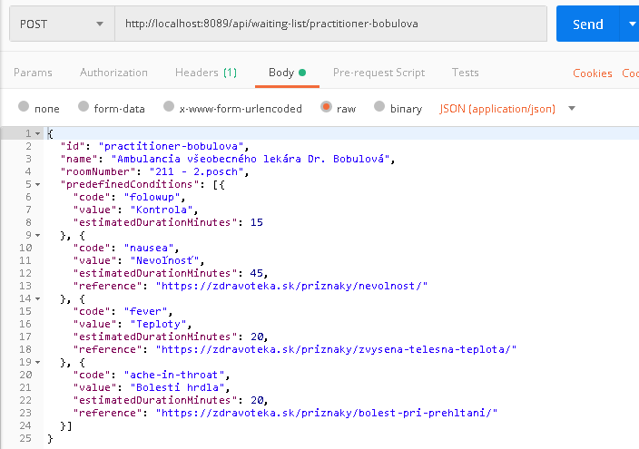
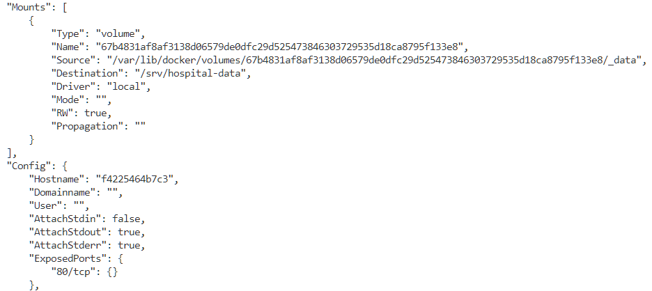

## Kontajnerizované aplikácie

V prvom kroku naše dve aplikácie zabalíme do Docker kontajnera. V prípade back-end Web API
budeme zároveň poskytovať možnosť namapovať databázu ambulancií a zoznamu čakajúcich
perzistentným spôsobom.

1. Prejdite do adresára `ambulance-api` a otvorte súbor `Dockerfile`. Upravte tento súbor do podoby

    ```docker
    FROM mcr.microsoft.com/dotnet/sdk:5.0 AS build-env
    WORKDIR /app

    # Copy csproj and restore as distinct layers
    COPY *.csproj ./
    RUN dotnet restore

    # Copy everything else and build
    COPY . ./
    RUN dotnet publish -c Release -o out

    # Build runtime image
    FROM mcr.microsoft.com/dotnet/aspnet:5.0
    WORKDIR /app

    # place of the database file ...
    ENV DATA_REPOSITORY_DB /srv/hospital-data/ambulance-api.litedb

    # which folder is mounted as a persistent volume
    VOLUME /srv/hospital-data

    COPY --from=build-env /app/out .

    ENTRYPOINT ["dotnet", "ambulance-api.dll"]
    ```

    Všimnite si, že sa v tomto prípade jedná o viac-krokové vytvorenie obrazu - _multistage build_. Počas prvého kroku použijeme ako základnú vrstvu obraz `mcr.microsoft.com/dotnet/sdk:5.0`, ktorý nám umožní vygenerovať artifakty projektu z jeho zdrojového kódu. Najprv kopírujeme iba súbor `*.csproj` (`ambulance-api.csproj`) a zavoláme príkaz `dotnet restore`. Tento príkaz vytvorí novú vrstvu v Union File System, používanom Docker. Pri ďalšom vytváraní obrazu z tohto súboru `Dockerfile` systém deteguje, či došlo k zmenáv v súbore `ambulance-api.csproj`, a pokiaľ nie, tak použije vrstvu vygenerovanú počas predchádzajúceho behu. 

    Následne skopírujeme zvyšné súbory a pomocou príkazu `dotnet publish` vygenerujeme artefakty pre zverejnenie aplikácie. Tu si všimnite, že vytvárame explicitne verziu _Release_. 

    Počas druhého kroku použijeme ako základnú vrstvu obraz `mcr.microsoft.com/dotnet/aspnet:5.0`, určený pre beh aplikácií ASP.NET Core 5.0. Nastavíme premennú prostredia a určíme že adresár `/app/out` sa má pripájať ku kontajneru z hosťovského prostredia. Následne skopírujeme artefakty vytvorené počas prvého kroku a určíme vstupný proces a jeho parametre pre beh kontajneru. 

2. Uložte súbor `Dockerfile`. V príkazovom riadku prejdite do adresára `ambulance-api` a vykonajte príkaz

    ```ps
    docker build -t ambulance-api:latest .
    ```

    Po jeho úspešnom behu naštartujte kontajner s namapovaním portu 8089 na port kontajnera 8080

    ```ps
    docker run --name ambulance-api-instance -p 8089:8080 ambulance-api:latest
    ```
    V konzole by sa Vám malo zobraziť podobné hlásenie:

    ```ps
    Hosting environment: Production
    Content root path: /app
    Now listening on: http://[::]:8080
    Application started. Press Ctrl+C to shut down.
    ```

    Prejdite do aplikácie Postman a podobne ako v predchádzajúcich cvičeniach vytvorte novú ambulanciu

    

    Následne overte funkcionalitu pomocou HTTP požiadavky (v Postman aplikácii alebo v prehliadači)

    ```curl
    GET http://localhost:8089/api/waiting-list/practitioner-bobulova
    ```

3. Máme vytvorenú novu inštanciu kontajnera, jej perzistentné údaje sú pripojené z hosťovského prostredia, čo môžme overiť vykonaním príkazu v novom okne príkazového riadku

    ```ps
    docker inspect ambulance-api-instance
    ```

    V pomerne detailnom výpise potom môžme nájsť sekciu, ktorá určuje kde sú jednotlivé _VOLUME-s_ pripojené. 

    

    >info:> Na systéme Windows je cesta uvedené v premennej "Source" obsiahnutá na disku 
    > virtuálneho zariadenia, ktoré sa typicky nachádza v priečinku 
    > `C:\Users\Public\Documents\Hyper-V\Virtual hard disks`

    Po vymazaní práve bežiacej inštancie a vytvorení novej inštancie príkazmi
    
    ```ps
    docker rm -f ambulance-api-instance
    docker run --name ambulance-api-instance -p 8089:8080 ambulance-api:latest
    ```

    a po opätovnom navigovaní sa na adresu `http://localhost:8089/api/waiting-list/practitioner-bobulova`
    vidíme, že nová inštancia používa nový volume. V skutočnosti predchádzajúci volume 
    stále existuje, čo môžete overiť príkazom `docker volume ls`, nebol ale explicitne 
    pripojený k novej inštancii. 

    Vytvorte nový docker volume príkazom 

    ```ps
    docker volume create hospital-volume
    ```

    Následne odstráňte  a znovu vytvorte inštanciu kontajnera, teraz s pripojeným
    novo vytvoreným zväzkom

    ```ps
    docker rm -f ambulance-api-instance
    docker run -d --name ambulance-api-instance -p 8089:8080 -v hospital-volume:/srv/hospital-data ambulance-api:latest
    ```

    Opäť vytvorte novú ambulanciu HTTP POST príkazom ako bolo uvedené v bode 2. Ak teraz vymažete inštanciu kontajnera a znovu ju vytvoríte podľa predchádzajúcich
    inštrukcií, Vaše údaje zostanú zachované, čo môžete overiť navigovaním sa 
    na stránku `http://localhost:8089/api/waiting-list/practitioner-bobulova`. 

4. Podobným spôsobom vytvoríme aj kontajner pre našu frontend aplikáciu. Pred tým ale musíme upraviť
spôsob akým získavame adresu nášho Web API. Doteraz sme to realizovali prostredníctvom nastavení 
v príslušnom súbore v adresári `environments.ts`, v zmysle [12Factor Apps](http://12factor.net) a
vzhľadom na funkcionalitu kontajnerov ju ale chceme riadiť premennými prostredia. Premenné prostredia
ale nie sú k dispozícii v prehliadači, preto túto funkcionalitu budeme simulovať špeciálnym spôsobom. 

    Otvorte súbor `ambulance-spa\src\app\ambulance-patients-list.service.ts` a upravte konštruktor a funkciu 
    `baseUrl()` do tvaru

    ```ts
    ...
    @Injectable({ providedIn: 'root' })
    export class AmbulancePatientsListService {

        private ambulanceQueryParam: string | undefined;

        constructor(private httpClient: HttpClient, activatedRoute: ActivatedRoute) {
            activatedRoute.queryParams.subscribe(params => {
            this.ambulanceQueryParam = params['ambulanceId'];
            });
        }

        private get baseUrl() {
            const baseUrl = (window as any).WaitingListConfig.apiBaseUrl || environment.apiBaseUrl || '/api';
            const ambulance = this.ambulanceQueryParam || environment.ambulanceId || 'ambulance';
            return `${baseUrl}/waiting-list/${ambulance}`;
        }
        ...
    ```

    Tu sme nahradili načítanie `baseUrl` zo súboru `config.js`, a `ambulanceId` inicializujeme z parametrov URL. 

    V súbore `ambulance-spa\src\index.html` pridajte referenciu na súbor `config.js` 

    ```html
    <!doctype html>
    <html lang="en">
      <head>
        <meta charset="utf-8">
        <title>AmbulanceSpa</title>
        <base href="/">
        <script type="text/javascript" src="config.js"></script>
    ...
    ```

    a v adresári `ambulance-spa\src` vytvorte prázdny súbor `config.js`. Tento súbor budeme neskôr v kontajneri dynamicky vytvárať na základe premenných prostredia. Zároveň umožníme dynamicky zmeniť aj adresu `<base href="/">` čo využijeme v prípadoch, že naša aplikácia je hosťovaná pod inou cestou ako je koreňový adresár. 

5. V adresári `ambulance-spa` vytvorte súbor `Dockerfile` s nasledujúcim obsahom

    ```dockerfile
    FROM node as build-env

    WORKDIR /app
    # bring in layer with packages
    COPY package.json package-lock.json ./
    RUN npm ci

    # copy all sources - make sure your node_modules are part of .dockerignore
    COPY . .

    # build production version of application
    RUN npm run ng build -- --prod --output-path=dist

    # now create nginx server
    FROM nginx:alpine

    # Remove default nginx website
    RUN rm -rf /usr/share/nginx/html/*

    ENV API_BASE_URI /api
    ENV BASE_HREF /

    # Copy nginx config to serve refresh pages
    COPY nginx.conf /etc/nginx/

    # copy artifacts from build-env
    COPY --from=build-env /app/dist /usr/share/nginx/html

    ENTRYPOINT \
        original='<base href="/">' && replacement="<base href='${BASE_HREF}'>" && \
        sed "s|${original}|${replacement}|g" -i /usr/share/nginx/html/index.html && \
        echo "window.WaitingListConfig = { apiBaseUrl: '${API_BASE_URI}' }; " >> /usr/share/nginx/html/config.js && \
        nginx -g 'daemon off;'
    ```
    Podobne ako pri api kontajneri, aj tu začíname krokom pre vytvorenie artefaktov, v ktorom najprv nainštalujeme všetky závislosti, a neskôr vytvoríme produkčnú verziu nášho používateľského rozhrania. 
    Následny krok je potom založený na obraze HTTP servera NGINX, ktorý je veľmi efektívnym serverom, dnes 
    široko využívaným v rôznych produkčných systémoch. Všimnite si, že v ňom najprv preddefinujeme premenné prostredia `API_BASE_URI` a `BASE_REF`, ktoré neskôr používame pri príkazoch `ENTRYPOINT`. 

    Príkazy v riadku `ENTRYPOINT` sa vykonávajú až pri štarte kontajnera, ich efekt sa tedá prejaví vo vrstve špecifickej pre danú inštanciu kontajnera. Tým pádom priradenie premenných pri štarte kontajnera má efekt 
    aj na správanie sa danej inštancie. Konkrétne, pomocou príkazu `sed` prepíšeme záznam `<base href="/">` v súbore `index.html`, čo nám dovolí obsluhovať našu aplikáciu z ľubovoľnej cesty na virtuálnom serveri. Tiež dynamicky generujeme obsah súboru `config.js`, konkrétne v ňom špecifikujeme obsah premennej `window.WaitingListConfig.apiBaseUrl`

    Ďalej vytvorte súbor  `.dockerignore` s obsahom
    ```
    node_modules
    dist
    .vscode
    ```

    ktorý zabezpečí, že sa pri vytvárani obrazu kontajnera do neho nekopírujú súbory z adresára `node_modules`.

    V tom istom adresári vytvorte súbor `nginx.conf`

    ```nginx
    events {
        worker_connections  1024;
    }

    http {
        sendfile off;
        server {
            listen 80;
            root /usr/share/nginx/html;
            include /etc/nginx/mime.types; 
            index  index.html;

            location / {
                try_files $uri /index.html;
            }

            #Static File Caching. All static files with the following extension will be cached for 1 day
            location ~* .(jpg|jpeg|png|gif|ico|css|js)$ {
                expires 1d;
            }
        } 
    }
    ```

    Tento súbor je konfiguráciou pre server NGINX, optimalizovaný pre potreby Angular aplikácií. Špecifikuje, že naša aplikácia bude počúvať na porte 80, a pri obsluhe HTTP požiadaviek - sekcia `location /` najprv overí, či súbor zodpovedajúci URI existuje - napríklad statické súbory skriptov alebo iných Angular _asset_-ov. Pokiaľ tomu tak nie je naviguje požiadavku na súbor index.html, v rámci ktorého sa rozbehne naša Angular aplikácia, a jej `Router` správne obslúži URI tejto HTTP požiadavky. 

6.  Vytvorte nový obraz kontajnera pomocou príkazu 

    ```ps
    docker build -t ambulance-spa:latest .
    ```

    Následne vytvorte jeho novú inštanciu pomocou príkazu

    ```ps
    docker run --name ambulance-spa-instance --env API_BASE_URI="http://localhost:8089/api" -p 8088:80 ambulance-spa
    ```

    a v svojom prehliadači prejdite na stránku `http://localhost:8088/?ambulance-id=practitioner-bobulova`. Zobrazí sa Vám prázdny zoznam čakajúcich v ktorom môžete vytvárať nové položky. Pri reštartovaní aplikácie
    sa Vám zároveň uchováva stav systému vďaka pripojenému zväzku. 

7. Posledným kontajnerom, ktorý vytvoríme, je obraz pre našu API bránu, ktorú budeme realizovať formou NGINX reverse proxy. Samotný obraz použijeme až pri nasadení našich mikro-služieb v prostredí Kubernetes. 

    V adresári, v ktorom máte uložené projekty ostatných mikroslužieb, vytvorte nový adresár `reverse-proxy`. 

    Vytvorte v ňom súbor `nginx.conf` s nasledujúcim obsahom

    ```nginx
    worker_processes 4;

    events { worker_connections 1024; }

    http {    
        sendfile off;

        server {
            listen 80;  
            resolver kube-dns.kube-system; 
            resolver_timeout 5s;

            location = / { 
                return 301 $scheme://$http_host/ambulancie/cakaren?ambulanceId=practitioner-bobulova;
            } 

            location ~ /ambulancie/cakaren(/.*)? { 

                set $service "waiting-list-spa" ;
                proxy_pass http://$service.${CLUSTER_SUBDOMAIN}$1?$args;
                proxy_redirect off;
            } 

            location ~ /api/waiting-list(/.*)? { 

                set $service "waiting-list-api" ;
                proxy_pass http://$service.${CLUSTER_SUBDOMAIN}/api/waiting-list$1?$args;
                proxy_redirect off;
            }  
        }
    }
    ```

    Špecifikom tejto konfigurácie je, že používa dynamické rozlišovanie doménových mien pomocou priradených premenných `$service` s využitím služby _kube-dns_, ktorá je štandardne dostupná v rámci kubernetes klastra. Alternatívne riešenie s _upstream_ server deklaráciami by nefungovalo spoľahlivo, vzhľadom na nedefinované poradie dostupnosti jednotlivých služieb. Ďalej pri prístupe na lokáciu `/` sa zašle prehliadaču inštrukcia aby sa navigoval na lokáciu čakárne Dr. Bobulovej. V praxi by sme používateľa navigovali na úvodnú stránku. 

    Ďalšia sekcia obsluhuje stránky ambulancií. Využíva regulárny výraz na získanie ID ambulancie, ktoré potom použije pri internom presmerovaní požiadavky na príslušnú službu nasadenú do Kubernetes clustra. Posledná sekcia podobným spôsobom presmeruváva požiadavky na obsluhu WEB API. 

    NGINX vyžaduje aby názvy serverov, na ktoré ma smerovať svoje požiadavky, boli plne špecifikované pomocou takzvaných _FQDN - Fully Qualified Domain Names_. V tomto prípade predpokladáme, že všetky kubernetes služby budú deklarované v priestore `hospital` a že systém kubernetes používa štandardné doménové mená pre internú virtuálnu sieť. Umožňujeme ale špecifikovať príslušnú subdoménu pomocou premenných prostredia.  

    Nakoniec v adresári `reverse-proxy` vytvorte súbor `Dockerfile` s nasledujúcim obsahom 

    ```Dockerfile
    FROM nginx:latest
    
    COPY nginx.conf /etc/nginx/nginx.template

    EXPOSE 80

    ENV CLUSTER_SUBDOMAIN svc.cluster.local

    CMD envsubst "\$CLUSTER_SUBDOMAIN" < /etc/nginx/nginx.template > /etc/nginx/nginx.conf && \
        exec nginx -g 'daemon off;'
    ```
    Všimnite si, že pred samotným štartom nginx servera, nahradíme v konfigurácii obsah premenných `$CLUSTER_SUBDOMAIN`.

    V príkazovom riadku prejdite do adresára `reverse-proxy` a pomocou nasledujúceho príkazu vytvorte obraz kontajnera

    ```ps
    docker build -t hospital-gateway:latest .
    ```


