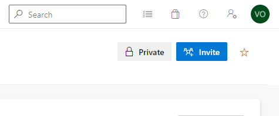
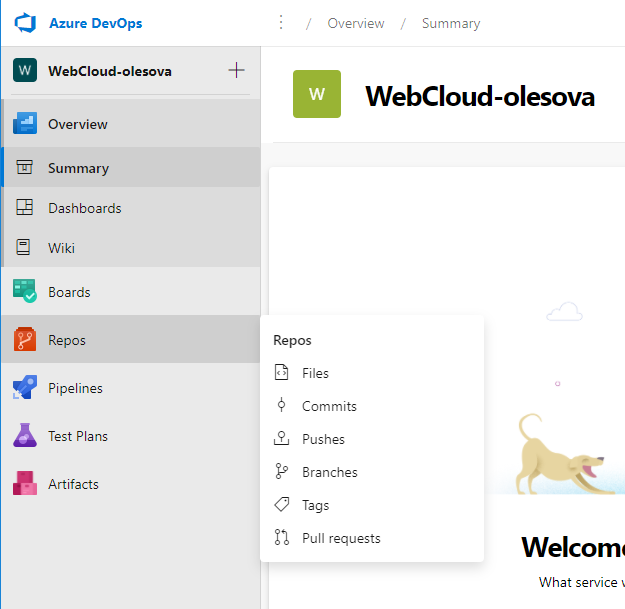
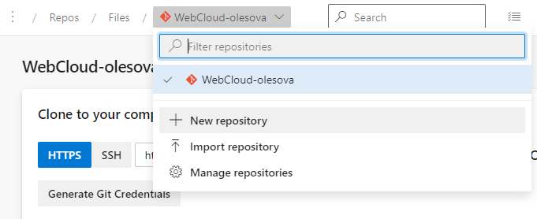
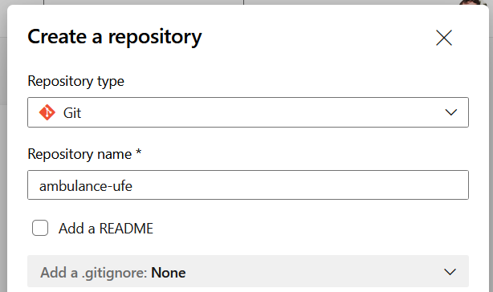
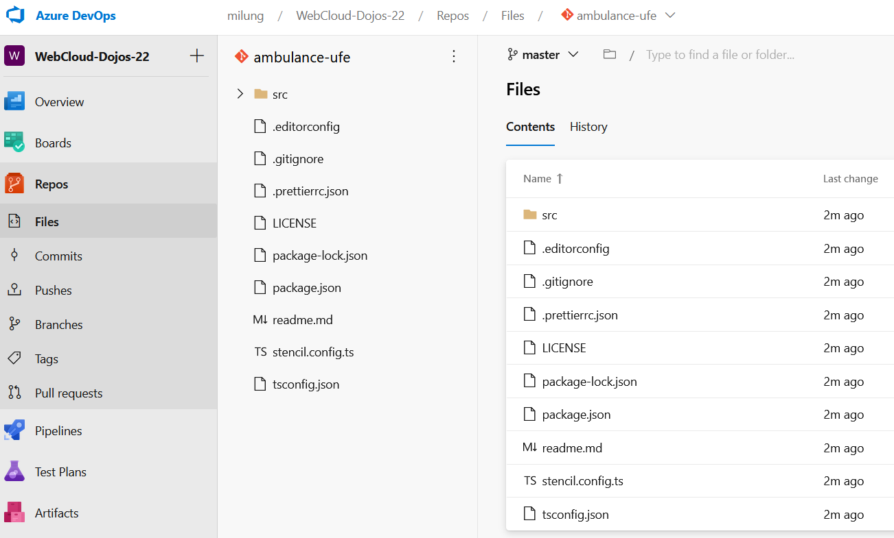

## Vytvorenie repozitára a archivácia kódu

1. Na stránke [Microsoft Azure DevOps Services][azure-devops]
  sa prihláste do svojho DevOps účtu alebo zvoľte možnosť _Start Free_ a prihláste
  sa so svojou Microsoft identitou, prípadne si novú identitu vytvorte. Následne si
  vytvorte novú organizáciu alebo použite existujúcu, v ktorej máte
  administrátorské oprávnenia.

2. Vytvorte nový privátny projekt a nazvite ho _WebCloud-<vaše priezvisko>_.

    Pridajte cvičiaceho do projektu:

    

    V paneli nástrojov zvoľte _Repos -> Files_ a na novej stránke vytvorte nové
    Git repository s názvom `ambulance-ufe`

    

    

    

3. Vo VS Code prejdite do priečinka `.../ambulance-list` a inicializujte lokálny git repozitár príkazom:

    ```ps
    git config --global init.defaultBranch main
    git init
    ```
 
    >info:> Prvým príkazom sme zmenili nastavenie názvu hlavnej vetvy z `master` na `main`.

4. Otvorte súbor `.../ambulance-list/.gitignore` a skontrolujte, že obsahuje riadky so záznamom
  `node_modules/`, `dist/`, `www/`, `loader/`. Tento súbor určuje, ktoré súbory a podpriečinky sa nemajú archivovať, čo vo väčšine prípadov znamená súbory, ktoré sú vytvárané počas kompilácie zdrojových súborov a balíky, ktoré je možné získať z dostupných zdrojov a iných archívov
  automatizovaným spôsobom.

    ```ps
    dist/
    www/
    loader/ 
    ...
    node_modules/
    ...
    ```

5. Pridajte a odovzdajte do archívu všetky lokálne súbory

    ```ps
    git add .
    git commit -m 'initial version of ambulance waiting list web component'
    ```

6. Prepojíme lokány repozitár s Azure DevOps repozitárom.

    >info:> Môžete použiť príkaz vygenerovaný na stránke vášho projektu v DevOps.

    ```ps
    git remote add origin https://dev.azure.com/<account>/WebCloud-<vaše priezvisko>/_git/ambulance-ufe
    ```

    _origin_ je meno, ktorým sme označili vzdialený repozitár.

7. Synchronizujte váš lokálny repozitár so vzdialeným repozitárom. Pri výzve zadajte svoje prihlasovacie údaje.

    >info:> Môžete použiť príkaz vygenerovaný na stránke vášho projektu v DevOps.

    ```ps
    git push --set-upstream origin main
    ```

    V prehliadači skontrolujte, že sú vaše súbory uložené vo vzdialenom repozitári.

    

Počas cvičení budeme používať zjednodušený vývojový proces a pracovať priamo na
vetve `main` repozitára. Pri práci v tíme sa ale odporúča používať vývojový
postup [_Fork and Pull Requests_](https://gist.github.com/Chaser324/ce0505fbed06b947d962),
ktorý je plne podporovaný aj v rámci [_Azure DevOps Services - Pull Requests_](https://docs.microsoft.com/en-us/azure/devops/repos/git/pull-requests).

Git repozitár je možné vytvoriť aj na iných serveroch, napríklad populárnych
[GitHub][github], [GitLabs][gitlab], alebo
[Bitbucket][bitbucket]. Dôležitým kritériom pri výbere je podpora
automatizovanej kontinuálnej integrácie a nasadenia, profesionálna podpora tímu
a ľahká správa prostriedkov samotným vývojovým tímom. V kontexte tejto učebnice
budeme pracovať so službami poskytovanými na serveroch _Azure DevOps_.
