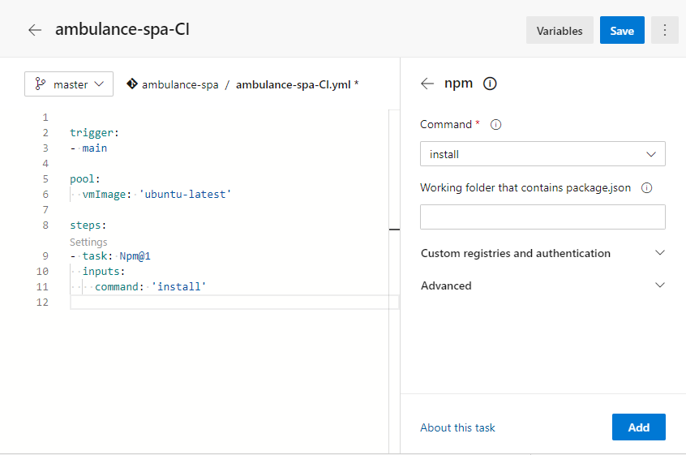
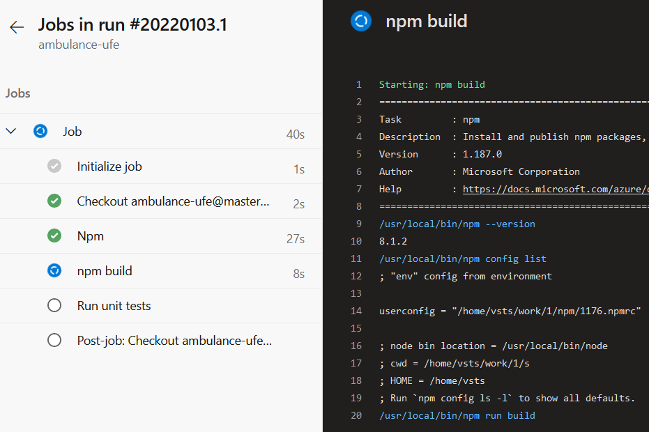

## Automatizovaná priebežná integrácia (_Continuous Integration_)

V nasledujúcich krokoch si vytvoríme build pre automatickú integráciu, aby sme
zaručili, že vytvorenie funkčnej aplikácie zo zdrojového kódu je možné aj mimo nášho vývojového prostredia.

1. Pred tým, ako si vytvoríme buildovaciu _pipeline_, musíme upraviť náš zdrojový kód pre automatické vykonávanie testov. [Stencil JS](https://stenciljs.com) využíva na testovanie knižnicu [Jest](https://jestjs.io/), zatiaľ ale nemá plnú podporu pre nový štandard definovania [JavaScript Modulov](https://developer.mozilla.org/en-US/docs/Web/JavaScript/Guide/Modules) _(verzia 27.4)_ a je nutné vykonať niektoré úpravy pre funkčnosť automatizovaných testov.  

    V tejto chvíli si pomôžeme zadefinovaním globálneho skriptu `.../ambulance-list/ src/utils/global.ts` do ktorého umiestníme načítanie problematických modulov:
 
    ```ts
    import '@material/mwc-list'; 
    import '@material/mwc-icon';
 
    export default function() { // or export default async function()
       // components initialization code
    }  
    ```
 
    a  súbor `.../ambulance-list/stencil.config.ts` upravíme tak, aby obsahoval  referenciu na tento globálny skript:
 
    ```ts
    ... 
    export const config: Config = {
      globalScript: 'src/utils/global.ts',
      ...
    }
    ```
 
    a nakoniec v súbore `.../ambulance-list/src/components/<pfx>-ambulance-wl-list/ <pfx>-ambulance-wl-list.tsx` odstránime riadky s importom `@material/mwc-...`  modulov
 
    ```ts
    import { Component, Host, h } from '@stencil/core';
 
    @Component({
       tag: '<pfx>-ambulance-wl-list',
       styleUrl: '<pfx>-ambulance-wl-list.css',
       shadow: true,
    })
    export class <Pfx>AmbulanceWlList {
       ...
    ```
 
    >warning:> Touto úpravou sme problém skôr obišli ako odstránili,  pravdepodobne by bolo možné v danej verzii nájsť takú konfiguráciu Jest JS, kde  by sme uvedené importy mohli použiť. Pre jednoduchosť riešenia sme využili tento  postup.

2. V ďalšom kroku upravíme jednotkový test v súbore `.../ambulance-list/src/components/<pfx>-ambulance-wl-list/test/<pfx>-ambulance-wl-list.spec.tsx`:

    ```ts
    import { newSpecPage } from '@stencil/core/testing';
    import { <Pfx>AmbulanceWlList } from '../<pfx>-ambulance-wl-list';
 
    describe('<pfx>-ambulance-wl-list', () => {
       it('renders', async () => {
          const page = await newSpecPage({
             components: [<Pfx>AmbulanceWlList],
             html: `<<pfx>-ambulance-wl-list></<pfx>-ambulance-wl-list>`,
          });
          const items = page.root.shadowRoot.querySelectorAll("mwc-list-item");
          expect(items.length).toEqual(3);
       });
    });
    ```

    >warning:> V tomto cvičení sa testovaniu venujeme len okrajovo, skôr z pohľadu ako  automatizovať kontinuálnu integráciu. Testy sú preto len ukážkové a ich pridaná  hodnota nízka. Napriek tomu je nutné pri reálnom projekte venovať  automatizovaným testom značnú pozornosť, prednostne metódou [Test Driven  Development][tdd]. Pri ignorovaní tvorby automatizovaných a spoľahlivých testov je nutné predpokladať  navýšenie nákladov na údržbu a inováciu softvérového projektu, ktoré sú v  dôsledku zanedbania tvorby automatizovaných testov v praxi násobne vyššie než  typické náklady na proaktívnu tvorbu automatizovaných testovacích sád.  Nedostatok automatizovaných testov sa neprejavuje len vo vzniku neočakávaných  chýb ale tiež v zhoršenej kvalite dizajnu a zníženej interoperabilite medzi  jednotlivými súčasťami celého softvérového diela.

3. Overíme, že naša testovacia sada je funkčná a prechádza bez chýb vykonaním príkazu v priečinku `.../ambulance-list`:

    ```ps
    npm test
    ```
 
    a následne archivujeme naše zmeny príkazmi
 
    ```ps
    git add .
    git commit -m "unit tests"
    git push
    ```

4. Prejdite do svojho účtu _Microsoft Azure DevOps_ [https://dev.azure.com/_account_][AZURE-DEVOPS], do panelu _Pipelines -> Pipelines_ a vytvorte novú _pipeline_.

     

   Vytvoríme takzvaný YAML build. Definícia buildu je potom súčasťou zdrojového kódu, čo prináša
   s tým súvisiace výhody: históriu, review, rollback, reuse, branching...

5. Stlačte na tlačidlo _Create Pipeline_ a vyberte položku `Azure Repos Git YAML`. Na ďalšej stránke zvoľte svoj repozitár a
   nakoniec z preddefinovaných šablón vyberte `Starter pipeline`. Bude vygenerovaný
   nasledovný yaml kód:

    ```yaml
       trigger:
       - main
 
       pool:
         vmImage: 'ubuntu-latest'
 
       steps:
       - script: echo Hello, world!
         displayName: 'Run a one-line script'
 
       - script: |
          echo Add other tasks to build, test, and deploy your project.
          echo See https://aka.ms/yaml
         displayName: 'Run a multi-line script'
    ```
 
    Každá pipeline sa skladá z jedného alebo viacerých stupňov - _Stage_-ov. Stage  sa skladá
    z jedného alebo viacerých zadaní - _Job_-ov. Stage môže byť napr. "Build this  app",
    "Deploy to production". Job sa skladá z krokov alebo úloh - _Task_-ov, ktoré sú  základnou jednotkou buildu.
 
    Ak máme v builde iba jeden Stage s jedným Job-om, nemusíme ich v yaml explicitne
    definovať, čo je aj náš prípad.
 
    >info:>  Viac detailov a popis pre yaml schému buildov nájdete tu: [Pipeline yaml  schema](https://docs.microsoft.com/en-us/azure/devops/pipelines/yaml-schema?view=azure-devops&tabs=schema%2Cparameter-schema).
 
    Spúšťač našej kontinuálnej integrácie - _Trigger_ je nastavený na `main` vetvu,  tzn. že sa vykoná pri každom zverejnení našich zmien v git repozitári. **Týmto  je zabezpečené, že môžeme hovoriť o kontinuálnej integrácii.** Jej ďalšími  predpokladmi je časté zverejňovanie čiastkových zmien vývojármi a rýchla spätná  väzba o výsledku integrácie, čo v tomto prípade zabezpečuje platforma Azure  DevOps.
 
    >warning:>  V roku 2020 Microsoft začal s prechodom pomenovania hlavnej vetvy z  `master` na `main`. Na niektorých miestach sa to prejavilo, niekde ešte nie. Ak  sa vaša hlavná vetva volá `master` premenujte `main` v časti `trigger` na  `master`. Teoreticky je možné nastaviť ľubovoľnú vetvu ako hlavnú - alebo  `default` - v správe vetví repozitára, prípadne možno mať kontinuálnu integráciu  prepojenú s ľubovoľnou vetvou - napríklad pokiaľ chceme kontinuálne integrovať  na vetve, v ktorej pripravujeme novú verziu systému nezávisle od kontinuálnej  integrácie aktuálnej verzie.
 
    Ďalšia položka - `pool` pomenúva build agenta, na ktorom sa má pipeline vykonať.
 
    >info:> K dispozícii máte rôzne súbory agentov, ktoré sú poskytované v rámci služby  _Microsoft Azure
    > DevOps_. V bezplatnom pláne máte k dispozícii limitovaný počet minút (60 na
    > deň), počas ktorých môžte využívať týchto agentov.
 
    V štandardnej konfigurácii je `pool` nastavený na `ubuntu-latest`. Môžeme (ale  nemusíme) si to zmeniť
    na `windows-2019`, výsledok je v oboch prípadoch rovnaký. Z empirickej  skúsenosti býva
    windows build viac ako 2-krát pomalší než build na linuxe.

6. Kliknite na _Show assistant_ vpravo hore. Vyroluje sa nám zoznam preddefinovaných
   úloh, ktoré nám uľahčia tvorbu pipeliny.

   Premenujte pipeline na `ambulance-ufe-CI.yaml` a vymažte všetky kroky - elementy objektu  `steps`.

7. Ako prvý pridáme krok na nainštalovanie knižníc. V asistentovi taskov napravo si
   vyberte typ `npm`, Ponechajte pôvodné nastavenie `install` a pridajte ho tlačidlom
   `Add` do pipeliny.

    
 
    Vykonanie tohoto kroku zabezpečí nainštalovanie npm knižníc podľa konfigurácie
    uvedenej v súbore `package.json`. Štandardné nastavenie predpokladá, že súbor
    [`package.json`](https://docs.npmjs.com/cli/v8/configuring-npm/package-json) je uložený v  koreňovom priečinku repozitára.
 
    >info:> Aby nedochádzalo k neočakávaným zmenám kvôli zmene minoritných verzií knižníc, je súčasťou  archívu aj súbor [`package-lock.json`](https://docs.npmjs.com/cli/v8/configuring-npm/package-lock-json), ktorý uzamyká špecifické verzie jednotlivých knižníc tak, aby bola integrácia  totožná vo všetkých prostrediach.

8. V nasledujúcom kroku zintegrujeme náš projekt. Pridajte ďalšiu úlohu typu `npm`.
   Zmeňte príkaz, ktorý sa má vykonávať, na `custom` a do poľa _Command and arguments_
   zadajte `run build` (chceme buildovať produkčnú verziu aplikácie). Po
   pridaní medzi naše kroky, si úlohu pomenujte `npm build` (kľúčové slovo `displayName`).

    ```yaml
    - task: Npm@1
       displayName: npm build
       inputs:
          command: 'custom'
          customCommand: 'run build'
    ```
 
    >info:> Keďže `npm` príkaz je obyčajný príkaz z príkazového riadku a zároveň je
    > to v tomto prípade alias pre vykonanie príkazu stencil, môže sa tento krok zapísať aj tak, že 
    > vyberiete task typu _Command Line_ a do poľa _Script_ zadáte text `./node_modules/.bin/stencil  build --docs`
    >
    > Výsledný task bude vyzerať nasledovne:
    >
    > ```yaml
    > - task: CmdLine@2
    >   displayName: Build production
    >   continueOnError: true
    >   inputs:
    >      script: './node_modules/.bin/stencil build --docs'
    > ```
    >
 
    >warning:>Používajte v príkazovom riadku iba normálne lomítko "/" a nie opačné (backslash) "\\".  Na linuxovom build agentovi sa príkaz s opačným lomítkom nevykoná, na windows agentovi je typ  lomítka zameniteľný.

9. V ďalšom kroku chceme vykonať unit testy. Pridajte ďalšiu úlohu typu `npm`.
   Zmeňte príkaz, ktorý sa má vykonávať na `custom` a do poľa _Command and arguments_
   zadajte `test`. Po
   pridaní medzi naše kroky si úlohu pomenujte `Run Unit Test` (kľúčové slovo `displayName`).

    ```yaml
    -  task: Npm@1
       displayName: Run Unit Tests
       inputs:
          command: 'custom'
          customCommand: 'test'
    ```

10. Celá pipeline má teraz 3 úlohy:

    ```yaml
    trigger:
    - master
 
    pool:
      vmImage: ubuntu-latest
 
    steps:
    - task: Npm@1
      inputs:
        command: 'install'
    
    - task: Npm@1
      displayName: npm build
      inputs:
         command: 'custom'
         customCommand: 'run build'
 
    - task: Npm@1
      displayName: Run unit tests
      inputs:
         command: 'custom'
         customCommand: 'test'
    ```

    Stlačte na tlačidlo _Save_ a spustite pipeline klikom na _Run_.
    Otvorí sa stránka zobrazujúca priebeh integrácie, kde môžete sledovať aktuálny
    stav kompilácie, prípadne si prezrieť zaznamenaný výstup vykonávaných príkazov.
    Týmto spôsobom môžete identifikovať prípadné chyby, ktoré sa prejavujú len počas
    kontinuálnej integrácie.

      >info:> Ak pri builde dostanete error _No hosted parallelism has been purchased
      > or granted. To request a free parallelism grant, please fill out the
      > following form https://aka.ms/azpipelines-parallelism-request_, znamená to, že
      > musíte Microsoft požiadať o pridelenie grantu na využívanie voľných build
      > agentov. Vyplňte a pošlite formulár na danej stránke. Viac detailov [tu](https://devblogs.microsoft.com/devops/change-in-azure-pipelines-grant-for-private-projects/)

     

     Po chvíli zistíte, že Váš _build_ skončil úspešne. Zároveň uvidíte vo svojej  schránke
     elektronickej pošty správu s oznámením o úspešnom behu integrácie. Po každom  zverejnení vašich  zmien - _commit_ + _push_ - sú vaše zmeny automaticky  zintegrované a sada testov zároveň  indikuje, že požiadavky na funkcionalitu sú  splnené. Znovu pripomíname dôležitosť vhodnej a na  funkcionalitu zameranej testovacej sady, najmä pri tímovom spôsobe vývoja.

11. Nová pipeline je v skutočnosti reprezentovaná novým YAML súborom `ambulance-ufe-CI.yaml`, ktorý je súčasťou archívu verzií zdrojového kódu. Zosynchronizujeme preto náš lokálny repozitár nasledujúcimi príkazmi:

    ```ps
    git fetch
    git pull
    ```

    Po vykonaní týchto príkazov môžete uvedený súbor nájsť a upravovať aj vo svojom lokálnom repozitári.
