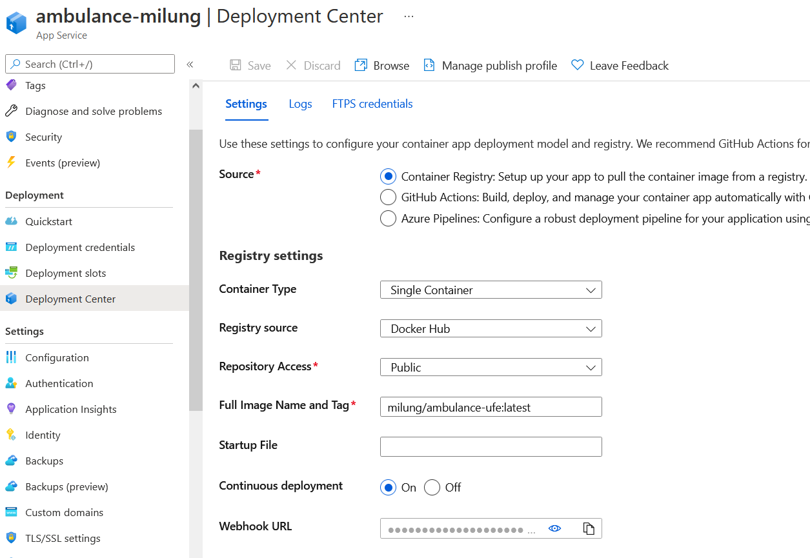
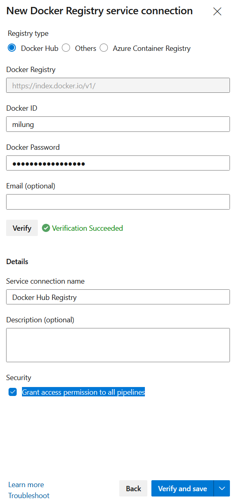

## Polo-automatické nasadenie (automatická aktualizácia docker obrazu z dockerhub)

V predchádzajúcej časti sme manuálne nasadili kontajnerizovanú web aplikáciu na
Azure cloud. Teraz si ukážeme jednoduchý spôsob, ako nastaviť, aby sa aplikácia automaticky
aktualizovala, keď sa zmení jej docker obraz na Docker Hube.

1. Vráťte sa do portálu [Azure][azure-portal], do vašej web aplikácie a
   v záložke _Deployment Center_ prepnite voľbu _Continuous deployment_ na `On` a
   skopírujte hodnotu z políčka _Webhook URL_. Uložte nastavenie stlačením tlačidla _Save_:

    
 
    Prejdite na stránku [Docker Hub][docker-hub], otvorte detaily vášho obrazu
    `ambulance-ufe` a prejdite do záložky _Webhooks_. Vytvorte nový webhook, pomenujte ho
    _Azure WebApp_ a ako URL nastavte hodnotu skopírovanú z Azure portálu.
 
    
 
    Týmto nastavením sme zabezpečili, že kedykoľvek sa do registra Docker Hub zapíše nový
    obraz s označením `<your-account>/ambulance-ufe:latest`, webová služba vytvorená na
    platforme Microsoft Azure automaticky získa najnovší obraz kontajnera s týmto
    označením.

2. Do _CI pipeline_ pridáme krok na zverejnenie novej verzie docker obrazu po úspešnom
   builde. Predtým ale musíme umožniť spojenie Azure Devops portálu do DockerHub.

    Prejdite na stránku Azure DevOps do projektu `WebCloud-Dojos` a na spodnej časti
    stránky zvoľte záložku _Project settings_. Potom na zobrazenej stránke zvoľte záložku _Service
    connections_ a zvoľte tlačidlo _Create service connection_, vyberte voľbu _Docker
    Registry_ a stlačte _Next_.
 
    V zobrazenom formulári zvoľte _Registry type_ na hodnotu `Docker Hub`, vložte svoje  prihlasovacie údaje pre stránku Docker Hub. Pomenujte novú _Service Connection_ ako `Docker Hub  Registry`, označte _Grant access permission to all pipelines_ a tlačidlom _Verify and save_  potvrďte svoju voľbu.
 
    

3. Otvorte súbor `.../ambulance-list/ambulance-ufe-CI.yaml` a pridajte na jeho koniec ďalšiu úlohu pre automatizované vytvorenie a zverejnenie docker obrazu počas kontinuálnej integrácie:

    Pre intel/amd procesory:
    
    ```yaml
    ...
    - task: Docker@2
      inputs:
          containerRegistry: 'Docker Hub Registry'
          repository: '<your-account>/ambulance-ufe'
          command: 'buildAndPush'
          Dockerfile: 'Dockerfile'
          tags: |
             1.0.0-$(Build.BuildId)
             latest
             dev-latest
    ```
    
    >$apple:> Pre arm64 (mac) respektíve pre simultánne vytvorenie obrazu pre viacero architektúr:
    > 
    > ```yaml
    > -  task: CmdLine@2
    >    displayName: Buildx and Push docker image
    >    inputs:
    >       script: |
    >          docker buildx create --use
    >          docker buildx build --platform linux/amd64,linux/arm64 \
    >             -t <your-account>/ambulance-ufe:latest \
    >             -t <your-account>/ambulance-ufe:dev-latest \
    >             -t <your-account>/ambulance-ufe:1.0.0-$(Build.BuildId) \
    >             --push \
    >             .
    > ```
   
    Všimnite si, že tento príkaz umožňuje zverejnenie obrazu s rôznymi označeniami verzie   obrazu    (`tags`). Pri kontinuálnej integrácii by sme pri reálnom projekte asi nepoužili  verziu    `latest`, ktorá by tým bola príliš nestabilnou, pre potreby cvičenia je ale vhodná.  Čo sa týka    Docker Hub registra, je image uložený len raz, ale sú mu priradené rozne značky -  _tag_-y -    podľa nášho zadania. V skutočnosti je každá vrsta s rovnakým hash kódom uložená v  registri len    raz a prípadne prepoužitá medzi rôznymi obrazmi.

4. Zverejnite zmeny zdrojového kódu príkazmi:

    ```ps
    git add .
    git commit -m "docker file"
    git push
    ```

    Na stránke Azure DevOps vášho projektu môžete overiť beh pipeline, ktorá teraz obsahuje aj krok pre zverejnenie docker obrazu. Po jej ukončení si môžete overiť aj stav obrazu na stránke Docker Hub, kde môžete vidieť nové označenia verzie - _tags_ - pre váš image.

    Týmto spôsobom sme vlastne zabezpečili kontinuálne nasadenie tejto webovej aplikácie do prostredia Azure. Našim cieľom je ale vytvoriť aplikáciu technikou mikro Front End a nasadiť ju do prostredia Kubernetes s využitím [GitOps](https://www.gitops.tech/) techniky. Tento postup si ukážeme v nasledujúcej kapitole.
