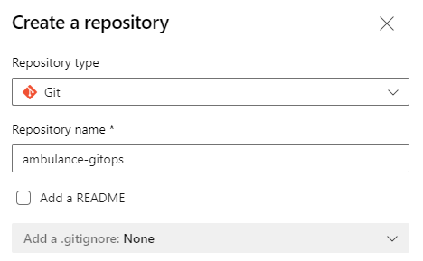
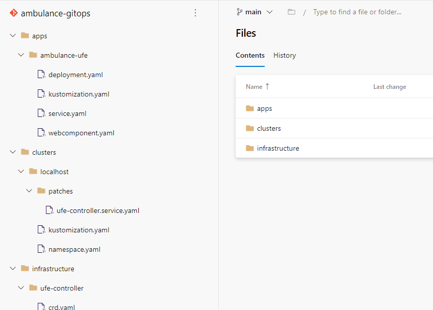

## Archivácia konfigurácie infraštruktúry

Podmienkou GitOps a súčasne predpokladom na to, aby fungoval Flux je, aby bola
konfigurácia infraštruktúry v git repozitári. V predchádzajúcej časti sme
vytvorili adresár _webcloud-gitops_, ktorý obsahuje popis kubernetes infraštruktúry
nášho projektu. Ten si teraz archivujeme.

1. Na stránke [Microsoft Azure DevOps Services][azure-devops]
  sa prihláste do svojho DevOps účtu, v rámci projektu _WebCloud-<vaše priezvisko>_
  vyberte v paneli nástrojov _Repos -> Files_ a na novej stránke vytvorte nové
  Git repository s názvom `ambulance-gitops`. V menu odznačte _Add a README_ a
  vyberte _None_ pre _.gitignore_ súbor a stlačte `Create`.

   

2. V príkazovom riadku prejdite do priečinka `webcloud-gitops` a inicializujte lokálny git repozitár príkazom:

    ```ps
    git init
    ```

3. Pridajte a odovzdajte do archívu všetky lokálne súbory

    ```ps
    git add .
    git commit -m 'initial version of gitops folder'
    ```

4. Prepojíme lokálny repozitár s Azure DevOps repozitárom.

    >info:> Môžete použiť príkaz vygenerovaný na stránke vášho projektu v DevOps.

    ```ps
    git remote add origin https://dev.azure.com/<account>/WebCloud-<vaše priezvisko>/_git/ambulance-gitops
    ```

   _origin_ je meno, ktorým sme označili vzdialený repozitár.

5. Synchronizujte váš lokálny repozitár so vzdialeným repozitárom. Pri výzve zadajte svoje prihlasovacie údaje.

    >info:> Môžte použiť príkaz vygenerovaný na stránke vášho projektu v DevOps.

    ```ps
    git push --set-upstream origin main
    ```

    V prehliadači skontrolujte, že sú vaše súbory uložené vo vzdialenom repozitári.

    
