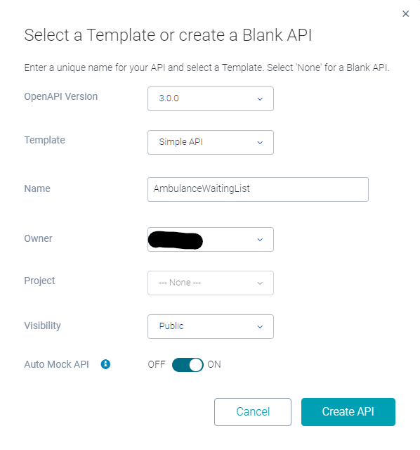
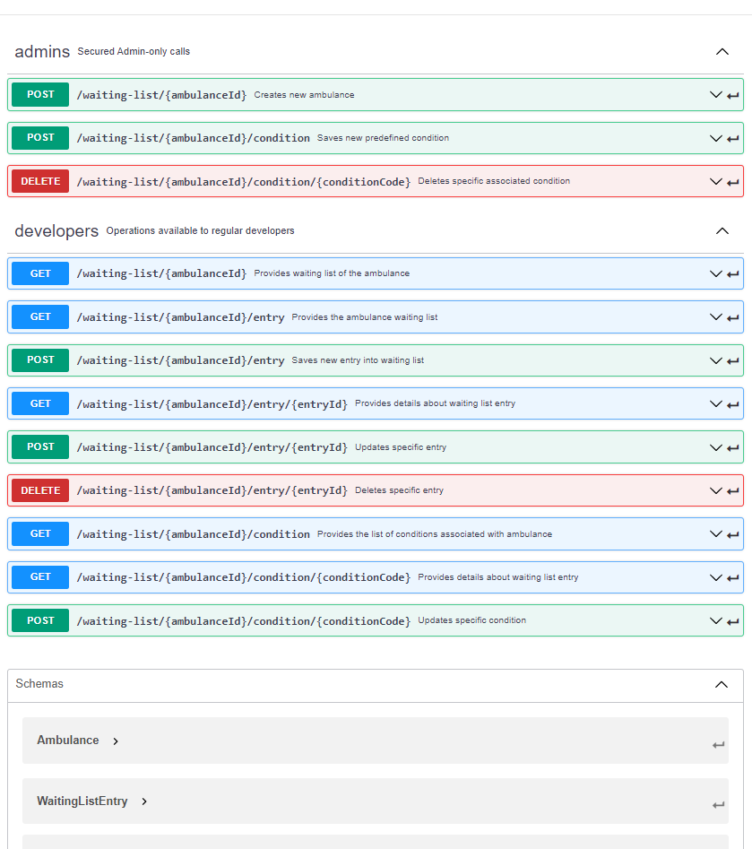
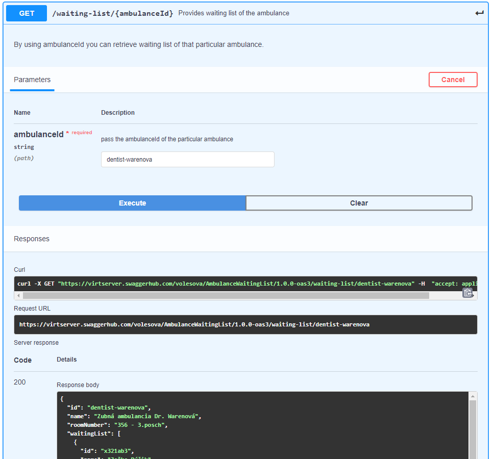

# Návrh API špecifikácie

Z dôvodu jednoduchšej integrácie používateľského rozhrania s WEB API využijeme techniku [_API First Design_][api-first]. Na technickú realizáciu nám poslúžia nástroje [openapi-generator] a [Swagger Hub]. Tieto nám umožňujú vygenerovať ako serverovú tak aj klientskú časť API.

1. V prehliadači otvorte stránku [Swagger Hub], prihláste sa a
prejdite na časť _My Hub_. Zvoľte položky _Create New -> Create New API_.
Zvoľte _OpenAPI Version_ "3.0.0", _Template_ "Simple API", _Name_ "AmbulanceWaitingList",
_Visibility_ podľa vlastného uváženia, _Auto Mock API_ "ON"

   

   Po vytvorení API uvidíte v prehliadači špecifikáciu jednoduchého predpripraveného API.

   Vymažte vygenerovaný obsah YAML definície a nahraďte ho nasledujúcim:

    ```yaml
    openapi: 3.0.0
    servers:
      - description: SwaggerHub Api Auto Mocking
        url: https://virtserver.swaggerhub.com/<user_name>/AmbulanceWaitingList/1.0.0
    info:
      description: Ambulance Waiting List management for Web-In-Cloud system
      version: "1.0.0"
      title: Waiting List Api
      contact:
        email: aa@bb.com
      license:
        name: CC BY 4.0
        url: 'https://creativecommons.org/licenses/by/4.0/'
    tags:
      - name: ambulanceAdmins
        description: Secured Admin-only calls
      - name: ambulanceDevelopers
        description: Operations available to regular developers
    paths:
      '/waiting-list/{ambulanceId}':
        get:
          tags:
            - ambulanceDevelopers
          summary: Provides waiting list of the ambulance
          operationId: getAmbulanceDetails
          description: |
            By using ambulanceId you can retrieve waiting list of that particular
            ambulance.
          parameters:
            - in: path
              name: ambulanceId
              description: pass the ambulanceId of the particular ambulance
              required: true
              schema:
                type: string
          responses:
            '200':
              description: array of the waiting list entries
              content:
                application/json:
                  schema:
                    $ref: '#/components/schemas/Ambulance'
                  examples:
                    response:
                      value:
                        id: dentist-warenova
                        name: Zubná ambulancia Dr. Warenová
                        roomNumber: 356 - 3.posch
                        waitingList:
                          - id: x321ab3
                            name: Jožko Púčik
                            patientId: 460527-jozef-pucik
                            waitingSince: '2038-12-24T10:05:00.000Z'
                            estimatedStart: '2038-12-24T10:35:00.000Z'
                            estimatedDurationMinutes: 15
                            condition:
                              value: Teploty
                              code: subfebrilia
                              reference: 
                                'https://zdravoteka.sk/priznaky/   zvysena-telesna-teplota/ '
                          - id: x321ab4
                            name: Ferdinand Trety
                            patientId: 780907-ferdinand-tre
                            waitingSince: '2038-12-24T10:25:00.000Z'
                            estimatedStart: '2038-12-24T10:50:00.000Z'
                            estimatedDurationMinutes: 25
                            condition:
                              value: Nevoľnosť
                              code: nausea
                              reference: 'https://zdravoteka.sk/priznaky/nevolnost/'
                        predefinedConditions:
                          - value: Teploty
                            code: subfebrilia
                            reference: >-
                              https://zdravoteka.sk/priznaky/zvysena-telesna-teplota/
                            typicalDurationMinutes: 20
                          - value: Nevoľnosť
                            code: nausea
                            reference: 'https://zdravoteka.sk/priznaky/nevolnost/'
                            typicalDurationMinutes: 45
                          - value: Kontrola
                            code: followup
                            typicalDurationMinutes: 15
                          - value: Administratívny úkon
                            code: administration
                            typicalDurationMinutes: 10
                          - value: Odber krvy
                            code: blood-test
                            typicalDurationMinutes: 10
            '404':
              description: Ambulance with such ID does not exists
        post:
          tags:
            - ambulanceAdmins
          summary: Creates new ambulance
          operationId: createAmbulanceDetails
          description: Stores new ambulance.
          parameters:
            - in: path
              name: ambulanceId
              description: pass the ambulanceId of the particular ambulance
              required: true
              schema:
                type: string
          responses:
            '200':
              description: ambulance create
            '403':
              description: Ambulance with such ID already exists
          requestBody:
            content:
              application/json:
                schema:
                  $ref: '#/components/schemas/Ambulance'
            description: Ambulance template
            required: true
      '/waiting-list/{ambulanceId}/entries':
        get:
          tags:
            - ambulanceDevelopers
          summary: Provides the ambulance waiting list
          operationId: getWaitingListEntries
          description: By using ambulanceId you get list of entries in ambulance    witing  list
          parameters:
            - in: path
              name: ambulanceId
              description: pass the id of the particular ambulance
              required: true
              schema:
                type: string
          responses:
            '200':
              description: value of the waiting list entries
              content:
                application/json:
                  schema:
                    type: array
                    items:
                      $ref: '#/components/schemas/WaitingListEntry'
                  examples:
                    response:
                      value:
                        - id: x321ab3
                          name: Jožko Púčik
                          patientId: 460527-jozef-pucik
                          waitingSince: '2038-12-24T10:05:00.000Z'
                          estimatedStart: '2038-12-24T10:35:00.000Z'
                          estimatedDurationMinutes: 15
                          condition:
                            value: Teploty
                            code: subfebrilia
                            reference: >-
                              https://zdravoteka.sk/priznaky/zvysena-telesna-teplota/
                        - id: x321ab4
                          name: Ferdinand Trety
                          patientId: 780907-ferdinand-tre
                          waitingSince: '2038-12-24T10:25:00.000Z'
                          estimatedStart: '2038-12-24T10:50:00.000Z'
                          estimatedDurationMinutes: 25
                          condition:
                            value: Nevoľnosť
                            code: nausea
                            reference: 'https://zdravoteka.sk/priznaky/nevolnost/'
            '404':
              description: Ambulance with such ID does not exists
      '/waiting-list/{ambulanceId}/entry':
        post:
          tags:
            - ambulanceDevelopers
          summary: Saves new entry into waiting list
          operationId: storeWaitingListEntry
          description: Use this method to store new entry into the waiting list.
          parameters:
            - in: path
              name: ambulanceId
              description: pass the id of the particular ambulance
              required: true
              schema:
                type: string
          responses:
            '200':
              description: >-
                Value of the waiting list entry with re-computed estimated time of
                ambulance entry
              content:
                application/json:
                  schema:
                    $ref: '#/components/schemas/WaitingListEntry'
            '400':
              description: Missing mandatory properties of input object.
            '404':
              description: Ambulance with such ID does not exists
          requestBody:
            content:
              application/json:
                schema:
                  $ref: '#/components/schemas/WaitingListEntry'
            description: Waiting list entry to store
            required: true
      '/waiting-list/{ambulanceId}/entry/{entryId}':
        get:
          tags:
            - ambulanceDevelopers
          summary: Provides details about waiting list entry
          operationId: getWaitingListEntry
          description: >-
            By using ambulanceId and entryId you can details of particular entry
            item ambulance.
          parameters:
            - in: path
              name: ambulanceId
              description: pass the id of the particular ambulance
              required: true
              schema:
                type: string
            - in: path
              name: entryId
              description: pass the id of the particular entry in the waiting list
              required: true
              schema:
                type: string
          responses:
            '200':
              description: value of the waiting list entries
              content:
                application/json:
                  schema:
                    $ref: '#/components/schemas/WaitingListEntry'
            '404':
              description: Ambulance or Entry with such ID does not exists
        post:
          tags:
            - ambulanceDevelopers
          summary: Updates specific entry
          operationId: updateWaitingListEntry
          description: Use this method to update content of the waiting list entry.
          parameters:
            - in: path
              name: ambulanceId
              description: pass the id of the particular ambulance
              required: true
              schema:
                type: string
            - in: path
              name: entryId
              description: pass the id of the particular entry in the waiting list
              required: true
              schema:
                type: string
          responses:
            '200':
              description: >-
                value of the waiting list entry with re-computed estimated time of
                ambulance entry
              content:
                application/json:
                  schema:
                    $ref: '#/components/schemas/WaitingListEntry'
            '403':
              description: >-
                Value of the entryID and the data id is mismatching. Detail s are
                provided in the response body.
            '404':
              description: Ambulance or Entry with such ID does not exists
          requestBody:
            content:
              application/json:
                schema:
                  $ref: '#/components/schemas/WaitingListEntry'
            description: Waiting list entry to update
            required: true
        delete:
          tags:
            - ambulanceDevelopers
          summary: Deletes specific entry
          operationId: deleteWaitingListEntry
          description: Use this method to delete the specific entry from the   waiting   list.
          parameters:
            - in: path
              name: ambulanceId
              description: pass the id of the particular ambulance
              required: true
              schema:
                type: string
            - in: path
              name: entryId
              description: pass the id of the particular entry in the waiting list
              required: true
              schema:
                type: string
          responses:
            '200':
              description: Item deleted
            '404':
              description: Ambulance or Entry with such ID does not exists
      '/waiting-list/{ambulanceId}/condition':
        get:
          tags:
            - ambulanceDevelopers
          summary: Provides the list of conditions associated with ambulance
          operationId: getConditions
          description: By using ambulanceId you get list of predefined conditions
          parameters:
            - in: path
              name: ambulanceId
              description: pass the id of the particular ambulance
              required: true
              schema:
                type: string
          responses:
            '200':
              description: value of the predefined conditions
              content:
                application/json:
                  schema:
                    type: array
                    items:
                      $ref: '#/components/schemas/Condition'
                  examples:
                    response:
                      value:
                        - value: Teploty
                          code: subfebrilia
                          reference: 'https://zdravoteka.sk/priznaky/    zvysena-telesna-teplota/'
                          typicalDurationMinutes: 20
                        - value: Nevoľnosť
                          code: nausea
                          reference: 'https://zdravoteka.sk/priznaky/nevolnost/'
                          typicalDurationMinutes: 45
                        - value: Kontrola
                          code: followup
                          typicalDurationMinutes: 15
                        - value: Administratívny úkon
                          code: administration
                          typicalDurationMinutes: 10
                        - value: Odber krvy
                          code: blood-test
                          typicalDurationMinutes: 10
            '404':
              description: Ambulance with such ID does not exists
        post:
          tags:
            - ambulanceAdmins
          summary: Saves new predefined condition
          operationId: storeCondition
          description: Use this method to associate new predefined condition with   the   ambulance
          parameters:
            - in: path
              name: ambulanceId
              description: pass the id of the particular ambulance
              required: true
              schema:
                type: string
          responses:
            '200':
              description: Value was stored
            '400':
              description: Missing mandatory properties of input object.
            '404':
              description: Ambulance with such ID does not exists
          requestBody:
            content:
              application/json:
                schema:
                  $ref: '#/components/schemas/Condition'
            description: Associated condition
            required: true
      '/waiting-list/{ambulanceId}/condition/{conditionCode}':
        get:
          tags:
            - ambulanceDevelopers
          summary: Provides details about given condition
          operationId: getCondition
          description: >-
            By using ambulanceId and conditionCode you can get details of associated
            predefined condition.
          parameters:
            - in: path
              name: ambulanceId
              description: pass the id of the particular ambulance
              required: true
              schema:
                type: string
            - in: path
              name: conditionCode
              description: pass the code of the particular condition
              required: true
              schema:
                type: string
          responses:
            '200':
              description: value of the requested condition
              content:
                application/json:
                  schema:
                    $ref: '#/components/schemas/Condition'
            '404':
              description: Ambulance with such ID or Condition with such code does    not  exists
        post:
          tags:
            - ambulanceDevelopers
          summary: Updates specific condition
          operationId: updateCondition
          description: >-
            Use this method to update content of the associated predefined
            condition.
          parameters:
            - in: path
              name: ambulanceId
              description: pass the id of the particular ambulance
              required: true
              schema:
                type: string
            - in: path
              name: conditionCode
              description: pass the code of the particular condition
              required: true
              schema:
                type: string
          responses:
            '200':
              description: Value updated
            '403':
              description: >-
                Value of the conditionCode and the code in data are mismatching.
                Details are provided in the response body.
            '404':
              description: Ambulance with such
          requestBody:
            content:
              application/json:
                schema:
                  $ref: '#/components/schemas/Condition'
            description: Condition to update
            required: true
        delete:
          tags:
            - ambulanceAdmins
          summary: Deletes specific associated condition
          operationId: deleteCondition
          description: >-
            Use this method to delete the specific condition from the list of
            associated predefined conditions for this ambulance
          parameters:
            - in: path
              name: ambulanceId
              description: pass the id of the particular ambulance
              required: true
              schema:
                type: string
            - in: path
              name: conditionCode
              description: pass the code of the particular condition
              required: true
              schema:
                type: string
          responses:
            '200':
              description: Item deleted
            '404':
              description: Ambulance with such ID or Condition with such code does    not  exists
    components:
      schemas:
        Ambulance:
          type: object
          required:
            - id
            - name
            - roomNumber
          properties:
            id:
              type: string
              example: dentist-warenova
              description: Unique identifier of the ambulance
            name:
              type: string
              example: Zubná ambulancia Dr. Warenová
              description: Human readable display name of the ambulance
            roomNumber:
              type: string
              example: 356 - 3.posch
            waitingList:
              type: array
              items:
                $ref: '#/components/schemas/WaitingListEntry'
            predefinedConditions:
              type: array
              items:
                $ref: '#/components/schemas/Condition'
        WaitingListEntry:
          type: object
          required:
            - id
            - patientId
            - waitingSince
            - estimatedDurationMinutes
          properties:
            id:
              type: string
              example: x321ab3
              description: Unique id of the entry in this waiting list
            name:
              type: string
              example: Jožko Púčik
              description: Name of patient in waiting list
            patientId:
              type: string
              example: 460527-jozef-pucik
              description: Unique identifier of the patient known to Web-In-Cloud    system
            waitingSince:
              type: string
              format: date-time
              example: '2038-12-24T10:05:00Z'
              description: Timestamp since when the patient entered the waiting list
            estimatedStart:
              type: string
              format: date-time
              example: '2038-12-24T10:35:00Z'
              description: Estimated time of entering ambulance. Ignored on post.
            estimatedDurationMinutes:
              type: integer
              format: int32
              example: 15
              description: >-
                Estimated duration of ambulance visit. If not provided then it will
                be computed based on condition and ambulance settings
            condition:
              $ref: '#/components/schemas/Condition'
        Condition:
          description: 'Describes disease, symptoms, or other reasons of patient   visit'
          required:
            - value
          properties:
            value:
              type: string
              example: Teploty
            code:
              type: string
              example: subfebrilia
            reference:
              type: string
              format: url
              example: 'https://zdravoteka.sk/priznaky/zvysena-telesna-teplota/'
              description: Link to encyclopedical explanation of the patient's    condition
            typicalDurationMinutes:
              type: integer
              format: int32
              example: 20
    ```

  V pravom paneli teraz máte popísanú špecifikáciu vášho API. Obsahuje všeobecný
    popis API, autora api, licenciu, popis metód - ciest k API funkciám, a dátový
    model využívaný pri práci s týmto API. Všimnite si, ako sa  `example` hodnoty
    používajú v popise odozvy danej metódy.

  

  Použitím _Auto Mocking_ voľby, sme získali možnosť vyskúšať ako sa naše API správa. Táto možnosť nám umožňuje zverejniť API ešte pred tým než máme pripravenú jeho
    implementáciu. To dovoľuje začať prácu na častiach aplikácie, ktoré toto API
    budú používať, a získať relevantnú spätnú väzbu ohľadom použiteľnosti API.
    Tento postup znižuje náklady na zmenové konanie API, najmä v prípadoch kedy
    implementácia API a jeho použitie je distribuované medzi rozličné tímy.
  
  Na odskúšanie tejto funkcionality je potrebné do nami zmenenej YAML definície
  špecifikovať `url` mockup serveru. V sekcii `servers` na začiatku yaml vymeňte <user_name> za svoje používateľské meno:

    ```yaml
    servers:
      - description: SwaggerHub Api Auto Mocking
        url: https://virtserver.swaggerhub.com/<user_name>/AmbulanceWaitingList/1.0.0
    ```

  Uložte zmeny kliknutím na tlačidlo `SAVE`.

2. Rozbaľte detaily metódy `GET /waiting-list/{ambulanceId}` a zvoľte tlačidlo
  `Try it out`. Do vstupného poľa `ambulanceId` zadajte ľubovoľnú hodnotu
  a stlačte tlačidlo execute. Po vykonaní volania sa zobrazia reálne odozvy servera,
  vrátane HTTP hlavičiek. Skopírujte text z poľa `Request URL` a prejdite v novom
  okne prehliadača na uvedené URL. Ako môžete vidieť, mockup server poskytuje požadované
  odozvy. Naša API špecifikácia môže byť použitá na jednoduché testovanie nášho API.

  

  V tomto kroku máme našu špecifikáciu API pripravenú a môžeme ju použiť na vygenerovanie API klienta prípadne servera.
