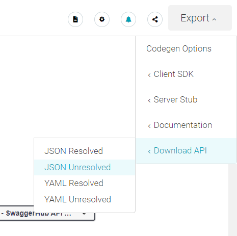
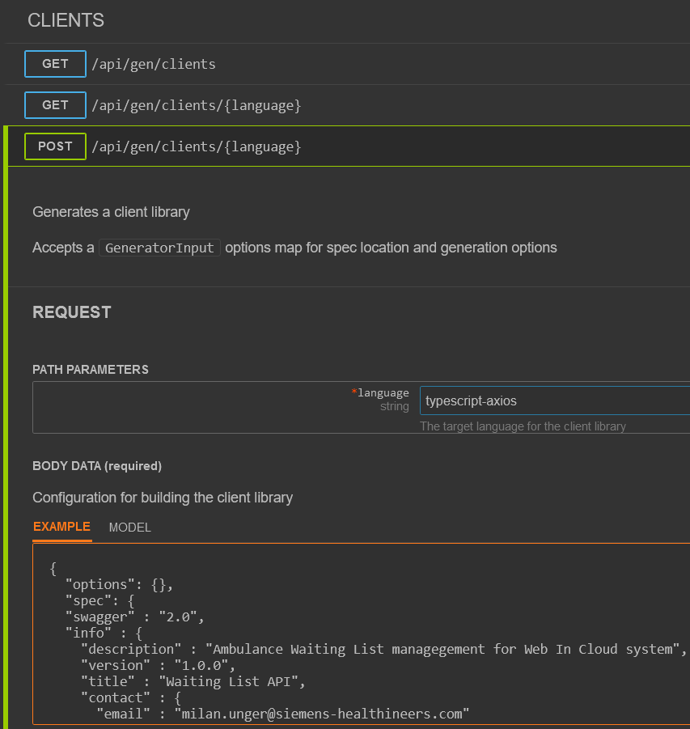

## Vygenerovanie klientského API

V časti [Cvičenie 2: WEB API v jazyku Go](../02.WebApi-Go/000-README.md) budeme integrovať klienta s WEB API. Integráciu je možné riešiť rôznymi spôsobmi:

* Implementáciou služieb klasickým vývojovým spôsobom a nastavením fixnej adresy web api v kóde. Tento spôsob má tú nevýhodu, že pri zmene API musíme meniť implementáciu web api ako aj implementáciu klienta v našom web komponente

* Vygenerovanie WEB API klienta z OpenAPI špecifikácie a vytvorenie balíčka znovupoužiteľnej knižnice registrovanej vo verejnom alebo privátnom registry. URL api je možné nastaviť ako parameter konštrukcie klienta. Tento prístup je asi ideálnym spôsobom, najmä v prípadoch kedy predpokladáme existenciu viacerých klientov.

* Vygenerovanie WEB API klienta z OpenAPI špecifikácie pre potreby konkrétneho projektu. Tento prístup je vhodný najmä pre menej štandardné situácie a v prípadoch kedy predpokladáme existenciu len jedného, alebo niekoľko málo klientov.

My budeme postupovať posledným z uvedených spôsobov, ktorý zároveň vytvára predpoklady na prípadné vytvorenie balíčka knižnice pre opätovné použitie.

### Vytvorenie TypeScript klienta

1. Na generovanie kódu pre prístup k API znovu použijeme nástroj [openapi-generator]. [Online verzia openapi-generatora][openapi generator online] ([Alternativa](http://api-latest-master.openapi-generator.tech/index.html)) vyžaduje špecifikáciu v JSON formáte. V špecifikácii vášho API na stránke [Swagger Hub] zvoľte tlačidlo  _Export -> Download API -> JSON Unresolved_ a uložte vygenerovaný json súbor.

   

   Potom na stránke [OpenAPI Generator Online] použite API v časti `CLIENTS`: `POST /api/gen/clients/{language}`. Ako `Path Parameters` zadajte framework `typescript-axios` a do textového bloku `Body data`, `EXAMPLE` vložte:

    ```json
    {
      "options": {},
      "spec": 
      <OBSAH JSON SUBORU VYGENEROVANEHO NA STRANKE SWAGGERHUB>@_insert_@
    }
    ```

   Následne stlačte tlačidlo `TRY` a z vygenerovanej linky si stiahnite zip súbor, ktorý obsahuje kostru programu.

   

2. Náš vygenerovaný klient využíva knižnicu [Axios], preto ju najprv nainštalujeme. Na príkazovom riadku prejdite do priečinka `.../ambulance-list` a vykonajte príkaz

    ```ps
    npm install --save axios
    ```

3. Vytvorte adresár `.../ambulance-list/src/api` a rozbaľte v ňom obsah komprimovaného súboru, ktorý ste stiahli v kroku 2 (zoberte iba súbory s príponou `ts`).

   Adresár `.../ambulance-list/src/api` teraz obsahuje 5 súborov s implementáciou HTTP klienta Axios. Najdôležitejší pre nás je súbor `api.ts`, ktorého súčasťou sú:
   * Triedy reprezentujúce model, ktorý zároveň slúži aj na komunikáciu: Ambulance, Condition a WaitingListEntry.
   * Klientský API servis: AmbulanceAdminsApi a AmbulanceDevelopersApi.

4. Synchronizujte zmeny so vzdialeným repozitárom.
