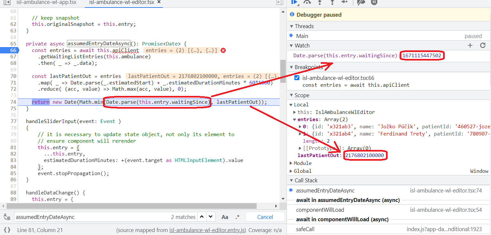
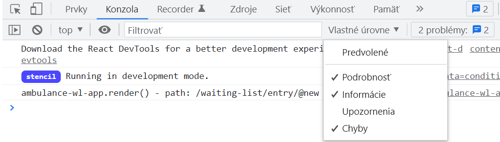

## Ladenie aplikácie

V tomto kroku si ukážeme, ako ladiť aplikáciu v _Nástrojoch vývojára_.

1. Ladenie aplikácie si odskúšame v rámci pridávania nového pacienta. V súbore
   `.../ambulance-list/src/components/ambulance-wl-editor/ambulance-wl-editor.tsx`
   Upravte funkciu `componentWillLoad` nasledovne:

    ```tsx
    async componentWillLoad() {       
     this.ambulanceConditions = await this.developerApiClient
       .getConditions(this.ambulance)
       .then( _ => _.data);
 
     if(this.isNewEntry) {
       // preinitialize new entry
       this.entry = {        
         name: "",
         patientId: "",
         waitingSince: new Date().toISOString(),
         estimatedDurationMinutes: this.ambulanceConditions[0].typicalDurationMinutes, 
         condition: this.ambulanceConditions[0]
       } as WaitingListEntry
       this.entry.estimatedStart = (await this.assumedEntryDateAsync()).toISOString();
     } else {
       this.entry = await this.developerApiClient
         .getWaitingListEntry(this.ambulance, this.entryId)
         .then( _ => _.data);
     }
 
     // keep snapshot 
     this.originalSnapshot = this.entry;
    }
    ```

   Pridajte novú funkciu `assumedEntryDateAsync`:

    ```tsx
      private async assumedEntryDateAsync(): Promise<Date> {
        const entries = await this.developerApiClient
          .getWaitingListEntries(this.ambulance)
          .then( _ => _.data);
        @_empty_line_@
        const lastPatientOut = entries
          .map( _ => Date.parse(_.estimatedStart) + _.estimatedDurationMinutes * 60*1000)
          .reduce( (acc, value) => Math.max(acc, value), 0);
        @_empty_line_@
        return new Date(Math.min(Date.parse(this.entry.waitingSince), lastPatientOut));
      }
    ```

   Pridajte zobrazenie predpokladaného času vstupu:

    ```tsx
      render() {
        return (
          <Host>
           ...
            <mwc-textfield icon="watch_later" disabled
                           label="Čakáte od" 
                           value={this.isoDateToLocale(this.entry?.waitingSince)}>
            </mwc-textfield>
            <mwc-textfield icon="login" disabled @_add_@
                           label="Predpokladaný čas vyšetrenia"  @_add_@
                           value={this.isoDateToLocale(this.entry?.estimatedStart)}> @_add_@
            </mwc-textfield> @_add_@
           ...
      }
    ```

   Súbor uložte a pokiaľ nemáte naštartovaný vývojový server, naštartujte ho príkazom
   `npm run start` a prejdite na stránku [http://localhost:3333/ambulance-wl](http://localhost:3333/ambulance-wl). Stlačte na tlačidlo _'+'_.
   Na obrazovke vidíte upravený editor.

2. Všimnite si, že predpokladaný čas vstupu je rovnaký ako čas príchodu pacienta. Vzhľadom k tomu, že existujúci pacienti (viď swagger) majú odhadovaný čas vstupu v roku 2038, nemožno očakávať, že nový pacient sa vstúpi do ambulancie okamžite po príchode do čakárne.

   Pravdepodobne už viete v čom spočíva problém,
   ale teraz si ukážeme prístup, ako problém odhaliť pomocou ladiacich nástrojov.

   V prvej časti cvičenia sme v súbore `.../ambulance-list/stencil.config.ts` uviedli nastavenie `sourceMap: true`,
   ktoré zabezpečuje vygenerovanie takzvanej mapy zdrojového kódu - _source map_, ktorá prehliadaču umožňuje
   referovať práve vykonávaný kód z kompilovaného javascript súboru do originálneho súboru.

   V prehliadači stlačte tlačidlo _F12_ alebo v menu otvorte položku _Ďalšie nástroje -> Nástroje pre vývojárov_ (aktuálny názov a
   klávesová skratka sa môžu medzi prehliadačmi líšiť, tu uvádzame postup pre prehliadač [Google Chrome](https://www.google.com/chrome/)).
   Otvorte záložku `Zdroje`  a v navigačnom paneli otvorte položku `localhost:3333/build/src/components/<pfx>-ambulance-wl-editor/<pfx>-ambulance-wl-editor.tsx`.
   Vyhľadajte funkciu `assumedEntryDateAsync` a kliknutím na číslo prvého riadku funkcie nastavte bod prerušenia. Implicitne predpokladáme,
   že výpočet doby vstupu musí byť nesprávny, keďže zobrazovaná hodnota nezodpovedá realite.

3. Opätovne načítajte stránku stlačením klávesy _F5_. Prehliadač zastane na bode prerušenia, ktorý sme nastavili v predchádzajúcom bode a v pravom paneli sa zobrazia informácie o stavu výpočtu v tomto bode. Postupným stláčaním tlačidla F10 odkrokujte program až na posledný riadok funkcie. Všímajte si, ako sa menia hodnoty v pravom paneli v záložke _Rozsah_ (_Scope_). Zároveň pridajte nový výraz sledovania v pravom paneli (stlačte ikonu '+' v riadku _Sledovanie_ (_Watch_)):

    `Date.parse(this.entry.waitingSince)` -  kópia výrazu použitá v poslednom riadku funkcie (vyjadruje čas vstupu nového pacienta do čakárne)

    Porovnajte čas vstupu nového pacienta do čakárne s časom `lastPatientOut` (čas odchodu posledného pacienta z ambulancie) - na obrázku označené červeným. Po preskúmaní výrazu `Math.min(Date.parse(this.entry.waitingSince), lastPatientOut)` zistíme, že sme omylom použili operátor `min` namiesto operátora `max`.

    

    Preskúmajte aj ďalšie prvky rozhrania pre ladenie programu. Na vrchu nástroja sú ovládacie prvky pre krokovanie programu (vyznačené žltým prekrytím na obrázku). V okne si môžme prezrieť hodnoty jednotlivých premenných, viditeľných v rozsahu bodu prerušenia programu. Tiež vidíme zásobník volaní, pomocou ktorého môžme vyhodnotiť rozsahy nadradené súčasnému rozsahu.

4. Opravte chybu v súbore `.../ambulance-list/src/components/<pfx>-ambulance-wl-editor/<pfx>-ambulance-wl-editor.tsx` - nahraďte operátor `min` operátorom `max` a znovu načítajte stránku. Odstráňte bod prerušenia z programu a overte, že vypočítaná hodnota zodpovedá realite.

5. Nástroje ladenia fungujú v prostredí, kde je k dispozícii ako kompilovaný kód, tak aj zdrojový kód. Táto podmienka nie je splnená v produkčnom nastavení. Aby bolo možné detekovať príčinu prípadných chýb, respektíve zreprodukovať situáciu, ktorá v produkčnom nasadení viedla k vzniku chyby, býva zvykom doplniť kód o záznamy vykonávania programu - tzv. logging. My si ukážeme, ako vypísať cestu, ktorú sa snaží obslúžiť komponent `<pfx>-ambulance-wl-app`. Otvorte súbor `.../ambulance-list\src\components\<pfx>-ambulance-wl-app\<pfx>-ambulance-wl-app.tsx` a upravte funkciu `render()`

    ```tsx
    render() {
         console.debug("<pfx>-ambulance-wl-app.render() - path: %s", <Pfx>AmbulanceWlApp.Router.activePath);
         return (
         ...
    ```
  
   Súbor uložte. Prejdite do prehliadača, v nástrojoch vývojára zvoľte záložku _Konzola_ a v rozbalovacom zozname predvolených úrovní zvoľte aj možnosť _Podrobnosti_ - _Debug_. Znovu načítajte stránku. Na výstupe konzoly vidíte výpis funkcie `console.debug()`.

   

   K dispozícii máme ešte funkcie `console.log()`, `console.information()`, `console.warning()`, a `console.error()`, prípadne môžme použiť niektorú z mnohých knižníc venujúcim sa vytváraniu záznamov z vykonávania programu. V každom prípade treba tieto metódy vhodne používať - príliš časté volanie týchto metód môže zbytočne zneprehľadniť výpis v konzole, použitie logov bez príslušnej informácie o stave programu (typicky entry/exit záznamy) môžu byť neužitočné pre pochopenie príčin zlyhania, posielanie záznamov na server zas môže zbytočne zaťažiť prenosové pásmo, ktoré má používateľ k dispozícii.

6. Archivujte vaše zmeny do vzdialeného repozitára.
