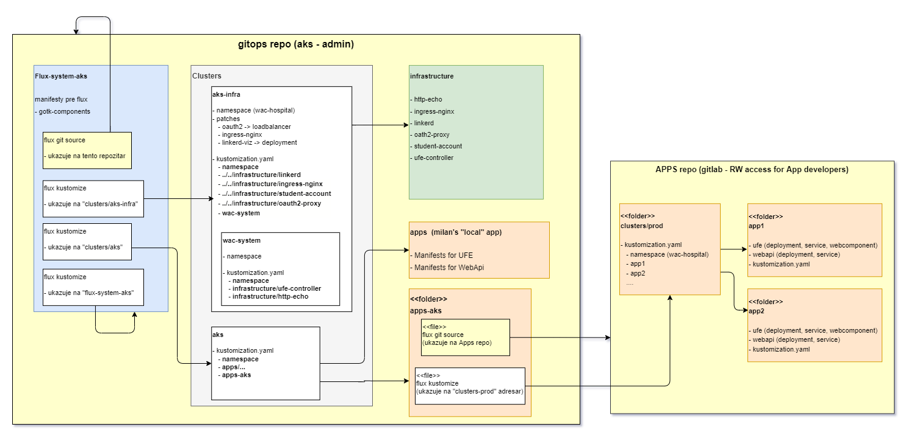

## Nasadenie Flux a aplikácie na AKS

>info:> Táto kapitola nie je súčasť cvičení predmetu WAC. Je tu ako referencia, ako sme postupovali pri nasadzovaní Fluxu a celej aplikácie na AKS. Kto má chuť, čas a kubernetes klaster na cloude, môže si to vyskúšať.

Nasledujú veľmi stručne popísané kroky, ako sme nasadili [Flux] na [AKS]. Je to zjednodušený spôsob, ako riadiť nasadenie z viacerých tímov (študentov) pomocou GitOps. Na internete nájdete návody, ako je to odporúčané robiť s väčším prihliadnutím na bezpečnosť (napr. [https://github.com/fluxcd/flux2-multi-tenancy](https://github.com/fluxcd/flux2-multi-tenancy)).

- Uvedené príkazy sú väčšinou veľmi konkrétne pre náš prípad. Nezabudnite zmeniť mená komponentov a iné špecifické údaje pre váš prípad.

- (Privátny) Repozitár obsahujúci nižšie spomínané konfigurácie sa nachádza tu: [https://milung@dev.azure.com/milung/WebCloud-Dojos-22/_git/ambulance-gitops](https://milung@dev.azure.com/milung/WebCloud-Dojos-22/_git/ambulance-gitops). Adresárová štruktúra v ňom je komplikovanejšia, ako tu popisovaná, lebo navyše obsahuje aj _lokálny_ flux setup.

- Výsledná aplikácia je [prístupná tu][common-cluster]

>info:> Náš _GitOps_ git repozitár je na azure devops. Niektoré príkazy môžu byť pre iných poskytovateľov repozitárov iné, napr. pre [Github], [Gitlab] ...

Kroky sú bez podrobnejšieho popisu, predpokladá sa, že čitateľ má skúsenosti s Fluxom.

Na konci kapitoly je obrázok znázorňujúci tu opisované adresáre a ich vzájomné vzťahy.

1. Nastaviť správny kontext pre kubectl.

    ```ps
    kubectl config get-contexts
    kubectl config use-context <ten správny>
    ```

2. (Pre istotu) Odinštalovať Flux z aktuálneho klastra

    ```ps
    flux uninstall
    ```

3. Pripraviť git repozitár s odporúčanou adresárovou štruktúrou
    - clusters/aks (alebo _staging_ alebo _prod_...)
    - flux-system-aks
    - infrastructure-aks
  
4. Nainštalovať Flux

    ```ps
    > flux check
    > flux install --components-extra=image-reflector-controller,image-automation-controller --export > .\flux-system-aks\gotk-components.yaml
    > kubectl apply -f .\flux-system-aks\gotk-components.yaml
    > flux check
    ```

5. Vygenerovať personal access token (PAT) s RW prístupom na kód na devops projekte, kde sa nachádza repozitár.

6. Flux - vytvoriť git source ukazujúci na repo (použite svoj PAT).

    ```bash
    > flux create source git amb-gitops-milung-repo --git-implementation=libgit2 --url=https://milung@dev.azure.com/milung/WebCloud-Dojos-22/_git/ambulance-gitops --branch=master --username=git --password=<PAT> --interval=60s

    > flux export source git amb-gitops-milung-repo > ./flux-system-aks/amb-gitops-milung-repo.yaml
    ```

7. Flux - vytvoriť kustomization na adresár `flux-system-aks`. To zabezpečí priebežný deployment tam uložených manifestov - flux konfigurácie.

    ```bash
    > flux create kustomization fluxsystem-aks-kustomization --source=amb-gitops-milung-repo --path="./flux-system-aks" --prune=true --interval=2m

    > flux export kustomization fluxsystem-aks-kustomization > .\flux-system-aks\fluxsystem-aks-kustomization.yaml
    ```

    Komitnite a pushnite zmeny.

8. Flux - vytvoriť kustomization na clusters/aks-infra. To zabezpečí priebežný deployment "infraštruktúry".

    Najprv treba zmazať "infraštrukturálne" objekty, ktoré boli predtým vytvorené manuálne.

    ```bash
    kubectl delete -k ./clusters/aks-infra
    ```

    Niektoré objekty, napr. secrety nie sú uložené v git repozitári. Treba ich manuálne nasadiť. V našom prípade je to __secret pre oauth0__ (uložený lokálne u Milana).

    Potom môžeme vytvoriť spomínanú kustomization:

    ```bash
    > flux create kustomization aks-infra-kustomization --source=amb-gitops-milung-repo --path="./clusters/aks-infra" --prune=true --interval=2m
    
    > flux export kustomization aks-infra-kustomization > .\flux-system-aks\aks-infra-kustomization.yaml
    ```

    Teraz urobte komit a push.

9. Flux - vytvoriť kustomization na clusters/aks. Tam sú referencované aplikácie, ktoré chceme deploynúť na klaster. Kustomization súbor v _aks_ adresári referencuje adresáre _.\apps_ a _.\apps-aks_. V prvom je "lokálna" Milanova aplikácia. V druhom bude linka na študentské aplikácie (krok 10 nižšie).

    Ak boli predtým niektoré objekty vytvorené manuálne, najprv ich treba zmazať.

    ```bash
    kubectl delete -k .\clusters\aks
    ```

    Potom môžeme vytvoriť spomínanú kustomization:

    ```bash
    > flux create kustomization cluster-aks-kustomization --source=amb-gitops-milung-repo --path="./clusters/aks" --prune=true --interval=2m

    > flux export kustomization cluster-aks-kustomization > .\flux-system-aks\cluster-aks-kustomization.yaml
    ```

    Urobte komit a push.

10. Vytvoriť nový git repozitár, ktorý bude zdieľaný so študentami a kde budú uložené manifesty na aplikácie - __AppRepo__. Odporúčam [gitlab.com](https://about.gitlab.com/), ktorý má v bezplatnej verzii podporu rôznych druhov používateľov, nastaviteľné review pre komity a ďalšie...

    Štruktúra adresárov:
    - clusters/prod
      - kustomization.yaml  

        ```yaml
        apiVersion: kustomize.config.k8s.io/v1beta1
          kind: Kustomization
          resources:
            - ../../pc-ambulance
            # sem pridávajte ďalšie aplikácie

          namespace: wac-hospital
        ```

    - pc-ambulance
      - pc-ambulance-ufe (manifests)
      - pc-ambulance-webapi (manifests)
      - kustomization.yaml
    - druha-aplikacia  
    ...

11. Vytvoriť nový flux source smerujúci na nový repozitár a jeho yaml dať do `./apps-aks` (milanove repo)

    Je viacej spôsobov ako vytvoriť flux source ku __privátnemu__ git repozitáru. V prípade Azuru sme použili PAT (private access token), ďalšia možnosť je uviesť svoje meno a heslo, ale to má nevýhodu v tom, že flux si ich uloží do `secretu` v k8s klastri a každý, kto má na to právo by si ich mohol prečítať. Tretia možnosť je vygenerovať asymetrický ssh kľúč a použiť ho.

     Inšpirované gitlabom ([https://docs.gitlab.com/ee/ssh/index.html](https://docs.gitlab.com/ee/ssh/index.html)):
    - Ak máte nainštalovaný `ssh` verziu väčšiu ako 8.1, vygenerujte kľúče nasledovným príkazom (pri otázke na _passphrase_ nezadajte nič):

      ```bash
      ssh-keygen.exe -t ed25519 -C "moj ed25519 kluc"
      ```

      Boli vygenerované dva kľúče (public a private) a uložené do `c:/Users/<user>/.ssh`

    - Pridajte verejný kľúč na [gitlab](https://about.gitlab.com/) do užívateľského konta, pod ktorým bol vytvorený repozitár, podľa návodu na [https://docs.gitlab.com/ee/ssh/index.html#add-an-ssh-key-to-your-gitlab-account](https://docs.gitlab.com/ee/ssh/index.html#add-an-ssh-key-to-your-gitlab-account).

    - Vytvorte flux git-source objekt ukazujúci na nový repozitár `apps-repo` (nahraďte `cestu` a `user`) a jeho manifest uložte do nášho _gitops_ repozitára (milanove repo).

      ```bash
      > flux create source git apps-repo --url=ssh://git@gitlab.com/<cesta ku git repozitaru> --branch=main --interval=1m --ssh-key-algorithm=ed25519 --private-key-file=c:/Users/<user>/.ssh/id_ed25519

      > flux export source git apps-repo > ./apps-aks/apps-repo.yaml (milanove repo)
      ```

12. Vytvoriť flux kustomizáciu na nový repozitár (`apps-repo`) na adresár `./clusters/prod`. Tam sa budú pridávať manifesty na aplikácie študentov. Manifest uložte do nášho _gitops_ repozitára.

    ```bash
    > flux create kustomization apps-prod-kustomization --source=apps-repo --path="./clusters/prod" --prune=true --interval=2m

    > flux export kustomization apps-prod-kustomization > ./apps-aks/apps-prod-kustomization.yaml
    ```

13. V _gitops_ repozitári, v adresári `./apps-aks`, vytvorte (Kustomize) kustomization.yaml:

    ```yaml
    apiVersion: kustomize.config.k8s.io/v1beta1
    kind: Kustomization

    resources:
    - apps-repo.yaml
    - apps-prod-kustomization.yaml
    ```

14. V _gitops_ repozitári pridať do `./clusters/aks/kustomization.yaml` referenciu na `./apps-aks` adresár.  
=> Po tomto prepojení Flux vytvorí všetky objekty referencované cez kustomization súbory, tzn. aj aplikácie v novom repozitári (`apps-repo`). Zatiaľ tam však žiadne nie sú. :)

_Obrázok znázorňuje git repozitáre, ich adresárovú štruktúru a prepojenia medzi adresármi, ktoré rú realizované cez Kustomization.yaml alebo (flux) "git source" a "kustomization" objektami (súbormi). Niektoré krabičky sú adresáre, niektoré súbory, dúfam, že to viac pomôže ako zmätie._



### Pridanie aplikácií do `apps-repo`

Pre náš konkrétny prípad je to popísané v kapitole [Nasadenie aplikácie na produkčný kubernetes klaster](./010d-production-deployment.md)
