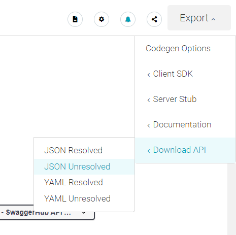
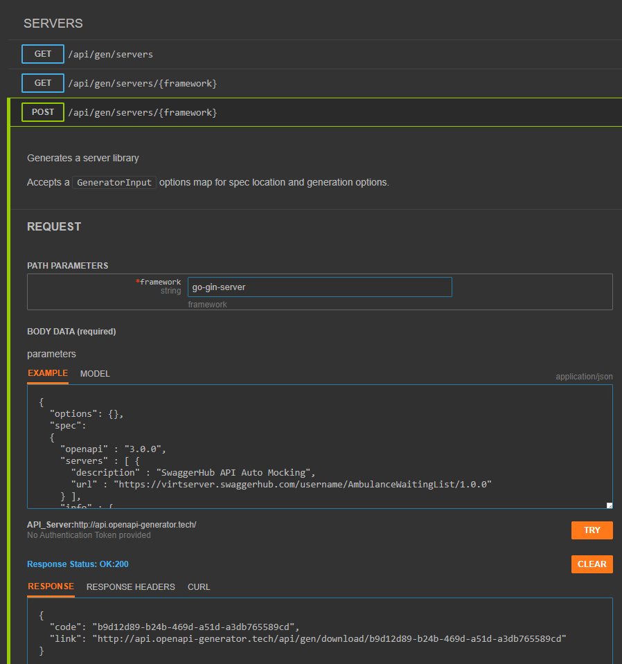

## Kostra web služby pomocou jazyka Go a web knižnice gin

1. Swagger umožňuje generovanie kostry kódu do viacerých jazykov a frameworkov (tlačidlo _Export -> Server Stub_). Poskytuje aj možnosť vygenerovať kostru pre go web server (_go-server_), avšak v súčasnej verzii používa ako web framework knižnicu `gorilla/mux`, ktorá je v maintenance móde. My na generovanie kostry kódu použijeme nástroj [openapi-generator] ([Alternativa][openapi generator online]), ktorý je častejšie obnovovaný, má podporu pre novšie verzie knižníc a umožňuje  úpravu šablón pre generovanie súborov. Pri vhodnom nastavení prostredia a šablón potom možno dosiahnuť opakované generovanie a obnovu kódu pri prípadnej zmene API špecifikácie.

   [Online verzia openapi-generatora][openapi generator online] vyžaduje špecifikáciu v JSON formáte. Na stránke _SwaggerHub_ vo vašej Waiting List API, zvoľte tlačidlo  _Export -> Download API -> JSON Unresolved_ a uložte vygenerovaný json súbor.

    

   Na stránke [OpenAPI Generator Online] použite API v časti `SERVERS`: `POST /api/gen/servers/{framework}`. Ako `Path Parameters` zadajte framework `go-gin-server` a do textového bloku `Body data`, `EXAMPLE` vložte:

    ```json
    {
     "options": {},
     "spec": 
     <OBSAH JSON SUBORU VYGENEROVANEHO NA STRANKE SWAGGERHUB>
    }
    ```

   Následne stlačte tlačidlo `TRY` a z vygenerovanej linky si stiahnite zip súbor, ktorý obsahuje kostru programu.

   

2. V súborovom systéme prejdite do priečinku, kde sa nachádza priečinok `ambulance-list` a vedľa neho vytvorte nový priečinok `ambulance-webapi`. Rozbaľte do priečinku `ambulance-webapi` obsah vygenerovaného súboru `go-gin-server-server-generated.zip` (celý obsah priečinku `go-gin-server-server`). V pracovnom priestore v aplikácii Visual Studio Code otvorte priečinok `ambulance-webapi`.

    >info:> Naše API je relatívne malé, alternatívou by bolo vytvorenie projektu pomocou štandardných príkazov jazyka Go. V takom prípade by sme ale museli ručne vytvoriť celý dátový model a ovládače API volaní.

3. Vytvoríme `go modul` a stiahneme závislosti. Otvorte príkazový riadok, prejdite do priečinku `ambulance-webapi` a vykonajte príkazy:

    ```bash
    go mod init ambulance-webapi
    go mod tidy
    ```

    Prvým príkazom inicializujeme modul, v rámci ktorého `go` vytvorí súbor `go.mod`. Druhý príkaz vytvorí súbor `go.sum` a stiahne závislosti.

4. Skôr, než si aplikáciu naštartujeme, vykonáme nasledovné úpravy kódu:
   - V hlavnom priečinku `ambulance-webapi` vytvorte priečinky `router`, `models` a `rest-api`. Tieto priečinky zodpovedajú názvom našich interných balíkov.
   - Do priečinku `router` presuňte súbor `routers.go`.
   - Do priečinku `models` presuňte súbory `model_ambulance.go`, `model_condition.go` a `model_waiting_list_entry.go`.
   - Do priečinku `rest-api` presuňte súbory `api_admins.go` a `api-developers.go`.
   - Vymažte priečinok `go`.
   - Vo všetkých súboroch zmeňte meno balíka podľa príslušného priečinku, to znamená text za kľúčovým slovom `package` sa má zhodovať s názvom priečinku. Pozor na pomlčku, ktorá nie je podporovaná v mene balíka.
   - V súbore `.../ambulance-webapi/router/routers.go` pridajte import na balík `restapi` a volania funkcií z neho, a nahraďte všetky výskyty reťazca `/<user_name>/AmbulanceWaitingList/1.0.0/` reťazcom `/api/`. Po úpravach by dotknuté časti súboru mali vyzerať následovne (upravené formátovanie):

    ```go
    package router
 
    import (
       restapi "ambulance-webapi/rest-api"  @_important_@
       "net/http"    
       "github.com/gin-gonic/gin"
     )
     ...
 
     var routes = Routes{
      {
         "Index",
         http.MethodGet,
         "/api/",
         Index,
       },
 
       {
         "CreateAmbulanceDetails",
         http.MethodPost,
         "/api/waiting-list/:ambulanceId",
         restapi.CreateAmbulanceDetails,
       },
 
       {
         "DeleteCondition",
         http.MethodDelete,
         "/api/waiting-list/:ambulanceId/condition/:conditionCode",
         restapi.DeleteCondition,
       },
 
       {
         "StoreCondition",
         http.MethodPost,
         "/api/waiting-list/:ambulanceId/condition",
         restapi.StoreCondition,
       },
 
       {
         "DeleteWaitingListEntry",
         http.MethodDelete,
         "/api/waiting-list/:ambulanceId/entry/:entryId",
         restapi.DeleteWaitingListEntry,
       },
 
       {
         "GetAmbulanceDetails",
         http.MethodGet,
         "/api/waiting-list/:ambulanceId",
         restapi.GetAmbulanceDetails,
       },
 
       {
         "GetCondition",
         http.MethodGet,
         "/api/waiting-list/:ambulanceId/condition/:conditionCode",
         restapi.GetCondition,
       },
 
       {
         "GetConditions",
         http.MethodGet,
         "/api/waiting-list/:ambulanceId/condition",
         restapi.GetConditions,
       },
 
       {
         "GetWaitingListEntries",
         http.MethodGet,
         "/api/waiting-list/:ambulanceId/entry",
         restapi.GetWaitingListEntries,
       },
 
       {
         "GetWaitingListEntry",
         http.MethodGet,
         "/api/waiting-list/:ambulanceId/entry/:entryId",
         restapi.GetWaitingListEntry,
       },
 
       {
         "StoreWaitingListEntry",
         http.MethodPost,
         "/api/waiting-list/:ambulanceId/entry",
         restapi.StoreWaitingListEntry,
       },
 
       {
         "UpdateCondition",
         http.MethodPost,
         "/api/waiting-list/:ambulanceId/condition/:conditionCode",
         restapi.UpdateCondition,
       },
 
       {
         "UpdateWaitingListEntry",
         http.MethodPost,
         "/api/waiting-list/:ambulanceId/entry/:entryId",
         restapi.UpdateWaitingListEntry,
       },
    }
    ```

   - Upravte súbor `.../ambulance-webapi/main.go` do nižšie uvedenej podoby:

      ```go
      package main

      import (
        "log"
        "ambulance-webapi/router"   @_important_@ // <== zmena z pôvodného sw "go"
      )
      
      func main() {
        log.Printf("Server started")
        router := router.NewRouter()    // <== zmena názvu balíčka
        log.Fatal(router.Run(":8080"))
      }
      ```

5. Spustíme aplikáciu z adresára `.../ambulance-webapi`

    ```bash
    go run .
    ```

   V prehliadači otvorte stránku [http://localhost:8080/api](http://localhost:8080/api),
   po presmerovaní sa zobrazí text `Hello World!`.

    >info:> Port, na ktorom váš server naštartuje je definovaný v hlavnej funkcii `main`

6. Prejdime si teraz štruktúru vygenerovaného programu. Súbor `.../ambulance-webapi/main.go`
   obsahuje vstupný bod programu, ktorým je funcia `main()`. Jej úlohou je
   naštartovať web server (volaním funkcie `router.Run`) a odovzdať riadenie frameworku
   [Gin], ktorý zabezpečuje obsluhu vstupno/výstupných volaní na sieťovom rozhraní počítača.

   V súbore `.../ambulance-webapi/routers.go` vo funkcii `NewRouter()`je vytvorený objekt `router` typu `gin.Engine`, ktorý je inicializovaný pomocou poľa štruktúr `routes`, čím je zabezpečené obslúženie REST API.

   Priečinok `.../ambulance-webapi/models` obsahuje definíciu štruktúr reprezentujúcich dátový model služby.

   Priečinok `.../ambulance-webapi/rest-api` potom obsahuje obslužný kód pre jednotlivé funkcie
   nášho API.
