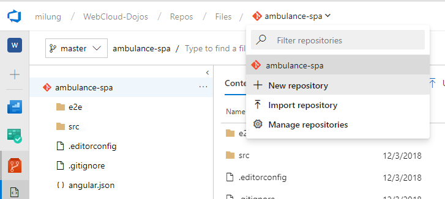
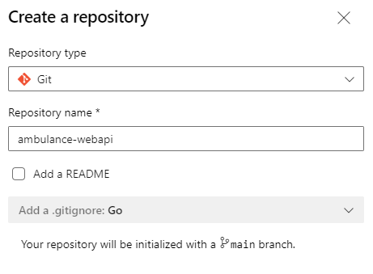

## Archivácia kódu

V ďalšom kroku vytvoríme archív pre zdrojový kód webovej služby

Prihláste sa do svojho účtu v [Microsoft Azure DevOps Services](https://azure.microsoft.com/en-us/services/devops/)
a prejdite do projektu _WebCloud-<vaše priezvisko>_. Vytvorte nový git repozitár



 a nazvite ho `ambulance-webapi`.



Otvorte okno príkazového riadku a prejdite do priečinku `.../ambulance-webapi`.
Zadajte nasledujúce príkazy za účelom inicializácie Git repozitára

```bash
git config --global init.defaultBranch main
git init
git remote add origin https://dev.azure.com/<account>/WebCloud-<vaše priezvisko>/_git/ambulance-webapi
```

>info:> Prvým príkazom sme zmenili nastavenie názvu hlavnej vetvy z `master` na `main`.

Archivujte váš kód pomocou príkazov

```bash
git pull origin main
git add .
git commit -m 'initial version of api'
git push --set-upstream origin main
```

a na stránkach Azure DevOps overte, že bol Váš repozitár aktualizovaný.
