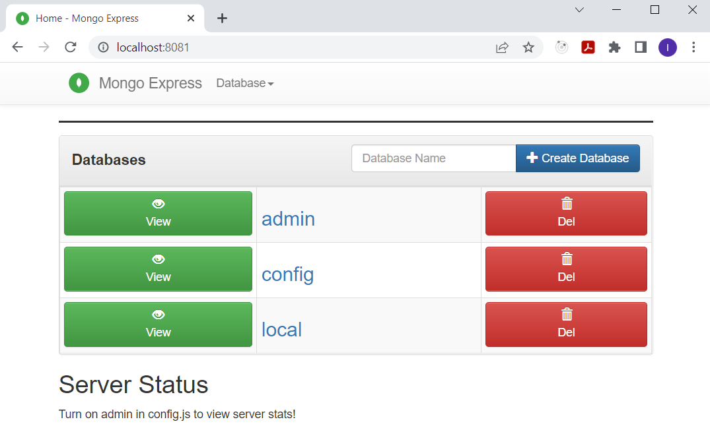

## Inštalácia a nastavenie MongoDB databázy

Na perzistenciu údajov budeme používať dokumentovú databázu [MongoDB], konkrétne jej Docker obraz. Súčasne budeme používať aplikáciu [MongoExpress], ktorá nám umožňuje spravovať pripojenú _MongoDB_ z používateľského rozhrania. Databázu urobíme prístupnú len pre používateľov s heslom, čo zodpovedá reálnemu použitiu.

1. Stiahnite si obraz kontajnera _MongoDB_ pomocou príkazu:

    ```ps
    docker pull mongo:6.0.3
    ```

    >info:> Verzia 6.0.3 bola najaktuálnejšia v čase písania skrípt.
    >
    > Zámerne nepoužívame poslednú (_latest_) verziu obrazu, aby sme predišli prípadným problémom, keby sa počas vývoja zmenilo v novej verzii mongodb správanie, prípadne API.

2. Jednou z vlastností kontajnerov je, že spolu so zaniknutím kontajnera zanikajú aj všetky dáta, ktoré sa na danú inštanciu kontajnera viažu. Aby sme mali dáta k dispozícii aj po zaniknutí a vytvorení novej inštancie kontajnera, budeme ich ukladať na trvalé úložisko tzv. `persistent docker volume`. Vykonajte príkaz:

    ```ps
    docker volume create hospital-volume
    ```

    >info:> Uvedeným príkazom Docker zabezpečí rezervovaný diskový priestor pre kontainer na vašom lokálnom disku. Tento sa bude používať počas vývoja aplikácie pred komitnutím. V kubernetes klastri použijeme `Kubernetes persistent volume`.

3. Vytvorte docker sieť typu `bridge` príkazom:

    ```ps
    docker network create -d bridge my-network
    ```

   Sieť je vyžadovaná kontajnerom _MongoExpress_, aby mohol pracovať s _MongoDB_ kontajnerom.

4. Nastavte nasledovné premenné prostredia (podľa toho, aký operačný systém používate). Uvádzame príkazy pre _PowerShell_:

    ```ps
    $env:MONGODB_USERNAME="user"
    $env:MONGODB_PASSWORD="password"
    ```

    >warning:> Odporúčame nastaviť tieto premenné prostredia ako systémové, aby príklady fungovali aj pri použití nového okna (_Visual Studio Code_, _PowerShell_, ...).

5. Naštartujte _MongoDB_ kontajner vykonaním príkazu:

    ```ps
    docker run --name mongoDB --rm --network my-network -e MONGO_INITDB_DATABASE=auth -e MONGO_INITDB_ROOT_USERNAME=$env:MONGODB_USERNAME -e MONGO_INITDB_ROOT_PASSWORD=$env:MONGODB_PASSWORD -d -p 27017:27017 -v hospital-volume:/data/db mongo:6.0.3
    ```

   Parameter `-d` znamená, že sa kontajner spustí na pozadí (nebude blokovať terminál), `-p` namapuje vonkajší port kontajnera na port, na ktorom počúva aplikácia (MongoDB), `-v` namapuje naše trvalé úložisko _hospital-volume_ na priečinok _/data/db_ kontajnera, v ktorom si MongoDB uchováva záznamy. 3 parametere `-e` nastavujú parametre prostredia.
   Posledný parameter je samotné meno obrazu.

   Overte, že vám kontajner beží (v aplikácii _Docker for Desktop_ alebo príkazom `docker ps`).

   >info:> V prípade, že databáza už existovala a bola vytvorená s iným _root user name_ a _root password_, aktuálne zadávané parametre sa ignorujú (bez chybového hlásenia!). V takom prípade je nutné odstrániť existujúcu databázu, t.j. odstrániť starý a vytvoriť nový persistent volume.

6. Stiahnite si obraz kontajnera _MongoExpress_ pomocou príkazu:

    ```ps
    docker pull mongo-express:1.0.0-alpha
    ```

7. Spustite kontajner príkazom:

    ```ps
    docker run --name mongo-express --rm --network my-network -e ME_CONFIG_MONGODB_ADMINUSERNAME=$env:MONGODB_USERNAME -e ME_CONFIG_MONGODB_ADMINPASSWORD=$env:MONGODB_PASSWORD -e ME_CONFIG_MONGODB_SERVER=mongoDB -d -p 8081:8081 mongo-express:1.0.0-alpha
    ```

    Význam parametrov sa zhoduje s popisom parametrov pre _MongoDB_ kontajner. Heslo a meno používateľa musia byť rovnaké, ako sme použili pri spúšťaní _MongoDB_ kontajnera. Parameter prostredia `ME_CONFIG_MONGODB_SERVER` sa musí zhodovať s názvom _MongoDB_ kontajnera vytvoreného v predchádzajúcích krokoch.

8. Overte, či aplikácia _MongoExpress_ funguje a či je pripojená na vašu databázu. Zadajte adresu `http://localhost:8081` do vášho prehliadača.

   