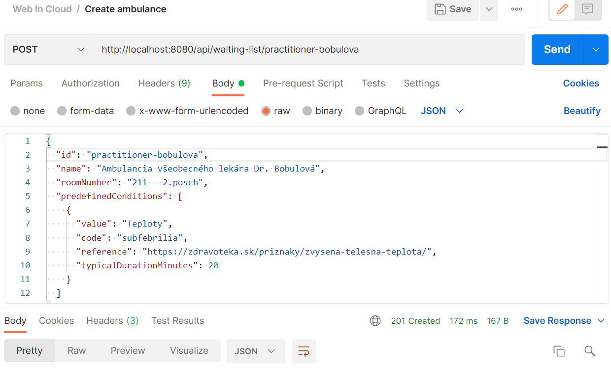

## Ladenie web služby s využitím programu Postman

Aplikácia Postman umožňuje komunikovať s ľubovoľným HTTP serverom na úrovni HTTP
protokolu a spravovať rôzne typy dotazov. Nie je to jediná aplikácia tohto typu,
medzi ďalšie patrí [Telerik Fiddler](https://www.telerik.com/fiddler) alebo všeobecne
známy a široko dostupný nástroj príkazového riadku [cURL].
V prípade, že používate Visual Studio Code, pozrite si tiež rozšírenie
[REST Client].
Použitie týchto aplikácií umožňuje testovať funkcionalitu vlastných web služieb
alebo služieb tretích strán bez nutnosti použitia klientskej aplikácie, ktorá by
mohla do procesu zaviesť vlastné chyby a limitácie. Na rozdiel od typickej
funkcionality internetového prehliadača, umožňujú tieto aplikácie špecifikovať
obsah údajov a hlavičiek odosielaných na server.

Pre podrobnejšiu analýzu komunikácie na nižších vrstvách sieťového protokolu
možno použiť populárnu aplikáciu [WireShark]. Jej
funkcionalitou sa ale nebudeme v tomto predmete zaoberať.  

### Webapi naštartované z príkazového riadku

Prvý usecase je, keď chceme otestovať aplikáciu lokálne počas vývoja, t.j. aplikácia je spustená z príkazového riadku a databáza beží v kontaineri docker for desktop.

1. Otvorte aplikáciu Postman a vytvorte novú kolekciu, nazvite ju _Web In Cloud_. Zvoľte _Add Request_ a pomenujte novú požiadavku ako _Create ambulance - developer_.

    

2. Zvoľte typ požiadavky `POST`, _URL_ zadajte  `http://localhost:8080/api/waiting-list/bobulova`.
  Prejdite na záložku _Body_, zvoľte formát dát _raw_ a vyberte typ obsahu
  (_Content-Type_) ako `JSON`. Do tela požiadavky zapíšte údaje
  o novej aplikácii:

    ```json
    {
      "id": "bobulova",
      "name": "Ambulancia všeobecného lekára Dr. Bobulová",
      "roomNumber": "211 - 2.posch",
      "predefinedConditions": [
        {
          "value": "Teploty",
          "code": "subfebrilia",
          "reference": "https://zdravoteka.sk/priznaky/zvysena-telesna-teplota/",
          "typicalDurationMinutes": 20
        },
        {
          "code": "folowup",
          "value": "Kontrola",
          "typicalDurationMinutes": 15
        },
        {
          "code": "nausea",
          "value": "Nevoľnosť",
          "typicalDurationMinutes": 45,
          "reference": "https://zdravoteka.sk/priznaky/nevolnost/"
        }
      ]
    }
    ```

    Nakoniec zvoľte tlačidlo _Save_ a uložte túto požiadavku.

3. Skontrolujte, či máte stále nastavené premenné prostredia, ktoré sme si zadefinovali pri inštalovaní mongodb. Napr. pre _PowerShell_:

    ```ps
    dir env:
    ```

    Výstup by mal obsahovať premenné `MONGODB_PASSWORD` a `MONGODB_USERNAME`.

4. Pokiaľ ste predtým zastavili váš server, opäť ho naštartuje príkazom

    ```ps
    go run .
    ```

   Uistite sa, že vám lokálne v dockeri beží `mongodb` server, prípadne aj `mongo express`. Ak nie, spustite ich:

    ```ps
    docker run --name mongoDB --rm --network my-network -e MONGO_INITDB_DATABASE=auth -e MONGO_INITDB_ROOT_USERNAME=$env:MONGODB_USERNAME -e MONGO_INITDB_ROOT_PASSWORD=$env:MONGODB_PASSWORD -d -p 27017:27017 -v hospital-volume:/data/db mongo:6.0.3
    ```

    ```ps
    docker run --name mongo-express --rm --network my-network -e ME_CONFIG_MONGODB_ADMINUSERNAME=$env:MONGODB_USERNAME -e ME_CONFIG_MONGODB_ADMINPASSWORD=$env:MONGODB_PASSWORD -e ME_CONFIG_MONGODB_SERVER=mongoDB -d -p 8081:8081 mongo-express:1.0.0-alpha
    ```

5. V aplikácii Postman stlačte tlačidlo _Send_. V časti odozvy požiadavky by ste mali vidieť reťazec _Status: 201 Created_. (Pokiaľ tomu tak nie je prejdite nižšie na časť o ladení programu).

    

   Týmto sme v databáze vytvorili novú ambulanciu. 

   Zastavte bežiacu aplikáciu.

6. Vo Visual Studio Code kliknite na _Run and Debug_ ikonu v ľavom bočnom paneli.

    > warning:> Integrálnou súčasťou Visual Studio Code _Go Extension_ je _Delve_ - aplikácia umožňujúca ladenie programov napísaných v jazyku _Go_. Môže sa stať, že sa vám po kliknutí na ikonu _Run and Debug_ objaví chybové hlásenie:

      
    
    V takom prípade treba požadovanú aplikáciu doinštalovať.

    * Ak ladenie zatiaľ nemáte  nakonfigurované, vytvorte konfiguráciu ladenia - vyberte voľbu _create a launch.json file_. V zobrazenom okne uvidíte možnosti konfigurácie. Vyberte _Go: Launch Package_.
  
        

    * V prípade, že ste súbor _launch.json_ už mali vytvorený, otvorte ho a pridajte novú konfiguráciu - kliknite na tlačidlo _Add Configuration_ a zo zobrazených možností vyberte _{} Go: Launch package_.
  
        

    V novovytvorenom súbore _launch.json_ zmeňte hodnotu parametra `program` z `"${fileDirname}"` na `"${workspaceFolder}"`. V prípade že nemáte mongo premenné nastavené ako systémové pridajte ich. Výsledná konfigurácia ladenia bude vyzerať takto:

    ```json
    {
        "name": "Launch Package",
        "type": "go",
        "request": "launch",
        "mode": "auto",
        "program": "${workspaceFolder}",
        "env": 
        {
          "MONGODB_USERNAME": "<mongomeno>",
          "MONGODB_PASSWORD": "<mongoheslo>"
        }
    }
    ```

    Ak máte vo VS otvorený worspace s celým projektom, t.j. webapi je adresár vo worskpace, musíte pridať adresár do webapi, v našom prípade: `"${workspaceFolder}/ambulance-webapi"` 

    >info:> Druhou možnosťou konfigurácie ladenia by bolo vybrať miesto položky _Launch package_ položku _Attach to local process_. V takom prípade by sme sa pripájali na bežiaci proces našej aplikácie. Tu si však treba dávať pozor, akým spôsobom aplikáciu spustíme. Bežne používaný príkaz `go run` spúšťa aplikáciu tak, že vynechá informácie potrebné k ladeniu aplikácie. Aby sme mohli využiť spôsob ladenia _Attach to local process_, musíme spustiť príkaz `go build`, ktorý do výslednej aplikácie zahrnie potrebné informácie a následne aplikáciu spustíme príkazom `ambulance-webapi.exe`. Viac detailov nájdete v článku [How to fix decoding dwarf section info at offset 0x0: too short?](https://dmaslov.dev/posts/go-run-and-debugging/)

7. Zo zoznamu Run príkazov vyberte voľbu _Launch Package_ a zvoľte tlačidlo
    _Start Debugging_ (zelený trojuholník).
    Prejdite do súboru `rest-api\api_ambulance_admins.go`, do metódy `CreateAmbulanceDetails`
    a nastavte v nej bod prerušenia - _pravé tlačidlo myši -> Add Breakpoint_

    > Ak vám Visual Studio Code hlási chybu s verziou Delve (napr. staršia verzia Delve nepodporuje novšiu verziu Go) vyberte _Go:Install/Update Tools_ z palety príkazov (Linux/Windows: Ctrl+Shift+P, Mac: Command+Shift+P). V zozname vyberiete dlv a tool sa aktualizuje.

    

    Prejdite do programu Postman a znovu odošlite požiadavku stlačením tlačidla
    _Send_. Vráťte sa do programu Visual Studio Code a odkrokujte činnosť programu.
    Sledujte stav premenných v paneli na ľavej strane. Za normálnych okolností by
    teraz mala požiadavka skončiť s hodnotou _400 - Bad Request_. Upravte požiadavku
    a vyskúšajte odkrokovať vytvorenie ďalšej ambulancie.

8. Prejdite do programu Postman a zmeňte parameter _id_ v __tele__ požiadavky.
   Znovu odošlite požiadavku stlačením tlačidla _Send_. Vráťte sa do programu
   Visual Studio Code a odkrokujte činnosť programu. Odhalili ste chybu?
   Zamyslite sa, ako ju opraviť.

    >info:> Detailný popis ladenia behu programu vo Visual Studio Code nájdete v článku [Debugging](https://github.com/golang/vscode-go/blob/master/docs/debugging.md).

9. Na skontrolovanie obsahu databázy máme viac možností:

   * Pripojte sa na MongoExpress container ([localhost:8081](http://localhost:8081)) a pozrite si obsah vašej databázy. Cez UI MongoExpress môžeme obsah databázy skoro ľubovolne meniť.

   * Naštartujte aplikáciu (`go run .`) a v prehliadači, pristúpte na GET Rest api našej aplikácie: ([http://localhost:8080/api/waiting-list/bobulova](http://localhost:8080/api/waiting-list/bobulova)). Prípadne na to isté api pristúpte cez aplikáciu Postman.
