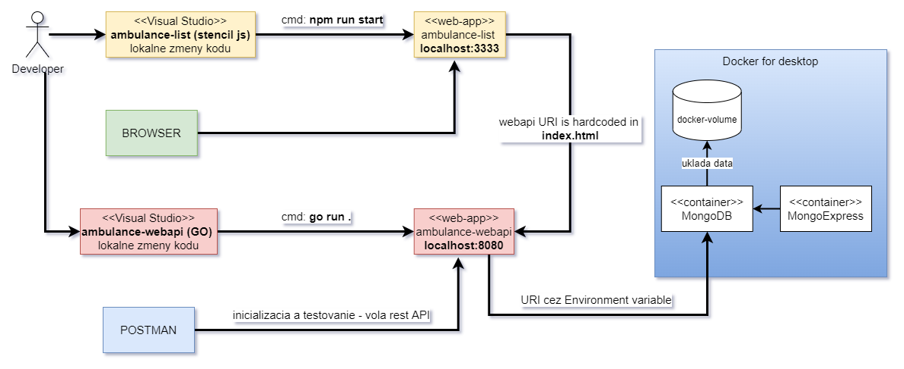
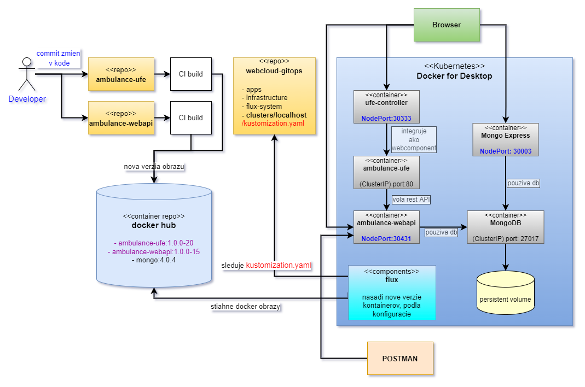

## Integrácia používateľského rozhrania s WEB API

 Požiadavky (napr. `entry`) webkomponentu sú momentálne smerované na adresu `https://virtserver.swaggerhub.com/<vaše-meno>/AmbulanceWaitingList/1.0.0/waiting-list`, čo je prednastavená cesta v špecifikácii nášho API. Túto adresu potrebujeme upraviť tak, aby smerovala na adresu určenú pri konfigurácii prostredia, do ktorého budeme systém nasadzovať.

### Úprava SPA aplikácie

 Naše web api môže počúvať na rôznych adresách. Keď ho spustíme lokálne, príkazom `go run .` beží na adrese `http://localhost:8080/api`. Túto adresu teraz musíme predať ako parameter pri vytvárani inštancie `AmbulanceDevelopersApi`. Pretože pracujeme s webkomponentami, ktoré sú integrované formou mikro-front-endu, a pretože sa adresa nášho WEB API môže meniť v závislosti od nasadenia, budeme tento parameter odovzdávať ako atribút elementov.

   Najprv si rozchodíme prepojenie frontendu a backendu v lokálnom vývojovom prostredí, tzn. oba komponenty chceme testovať hneď počas vývoja, pred komitom.

_Obrázok znázorňuje komponenty a ich prepojenie počas vývoja a testovania na lokálnom počítači._



1. Otvorte súbor `.../ambulance-list/src/components/<pfx>-ambulance-wl-list/<pfx>-ambulance-wl-list.tsx` a upravte časť vytvárajúcu inštanciu api klienta do tvaru:

    ```tsx
    ...
    private developerApiClient: AmbulanceDevelopersApi;      // <-- zmena  inicializácie
 
    @Prop({ attribute: "api-uri" })    // <-- pridaný atribút elementu
    apiUri: string = null;
  
    async componentWillLoad() {
      this.developerApiClient = new AmbulanceDevelopersApi(undefined, this. apiUri); // <-- inicializácia
      this.waitingPatients = await this.developerApiClient
        .getWaitingListEntries(this.ambulance)
        .then(_ => _.data);
    }
    ...
    ```
  
   Rovnakú zmenu vykonáme aj v súbore `.../ambulance-list/src/components/<pfx>-ambulance-wl-editor/<pfx>-ambulance-wl-editor.tsx`

    ```tsx
    ...
    private apiClient: AmbulanceDevelopersApi;      // <== zmena inicializácie
    ...
    @Prop({ attribute: "api-uri" })  // <== pridaný atribút
    apiUri: string = null;
   
    async componentWillLoad() {
      this.apiClient = new AmbulanceDevelopersApi(undefined, this.apiUri);   //  <== inicializácia
      this.ambulanceConditions = await this.apiClient
        .getConditions(this.ambulance)
        .then( _ => _.data);
    ...
    ```

   Ďalej upravíme súbor `.../ambulance-list/src/components/<pfx>-ambulance-wl-app/<pfx>-ambulance-wl-app.tsx`

    ```tsx
    -...
    @Prop({ attribute: "api-uri" }) // <== pridaný atribút
    apiUri: string = "";
 
    render() {
       console.debug("ambulance-wl-app.render() - path: %s", AmbulanceWlApp. Router.activePath);
       return (
         <Host>
           <<pfx>AmbulanceWlApp.Router.Switch>
             <Route
               path={match(this.rebase("/entry/:id"))}
               render={(params) => (
                 <<pfx>-ambulance-wl-editor
                   api-uri={this.apiUri}                 // <== pridaný atribút
                   ambulance={this.ambulance}
                   entry-id={params.id}
                   onWlChange={this.handleEditorClosed.bind(this)}
                   onDeleted={this.handleEditorClosed.bind(this)}
                   onCanceled={this.handleEditorClosed.bind(this)}
                 >
                 </<pfx>-ambulance-wl-editor>
               )}
             />
             <Route
               path={this.rebase("/")}>
               <<pfx>-ambulance-wl-list 
                 api-uri={this.apiUri}                 // <== pridaný atribút
                 ambulance={this.ambulance} 
                 onWlChange={this.handleEntrySelection.bind(this)}></ <pfx>-ambulance-wl-list>
               <mwc-fab id="add-entry" icon="add" onCLick={this.handleNewEntry. bind(this)}></mwc-fab>
             </Route>
             <Route
               path={this.rebase("")} to={this.rebase("/")}>
             </Route>
           </<pfx>AmbulanceWlApp.Router.Switch>
         </Host>
       );
    ...
    ```

   Nakoniec prejdite do súboru `.../ambulance-list/src/index.html` a pridajte nový atribút:

    ```html
    <body>
       <<pfx>-ambulance-wl-app 
          base-path="/ambulance-wl" 
          api-uri="http://localhost:8080/api"
          ambulance="bobulova">
       </<pfx>-ambulance-wl-app>
    </body>
    ```

   Naštartujte server v priečinku `.../ambulance-webapi` príkazom

    ```ps
    go run .
    ```

   a tiež klient v priečinku `.../ambulance-list` príkazom

    ```ps
    npm run start
    ```

   a prejdite na stránku [http://localhost:3333/ambulance-wl/](http://localhost:3333/ambulance-wl/). V tejto chvíli by ste mali v _Nástrojoch vývojára_ v konzole vidieť chybovú správu

    ```error
    Access to XMLHttpRequest at 'http://localhost:30431/api/waiting-list/ bobulova/entry' from origin 'http://localhost:3333' has been blocked by CORS  policy: No 'Access-Control-Allow-Origin' header is present on the requested  resource.
    ```

   Účelom prehliadača je chrániť používateľa pred škodlivým správaním sa podvodných stránok. Stránka so škodlivým obsahom sa napríklad môže snažiť pristúpiť k obsahu iného servera a takýmto spôsobom získať dôverné informácie. Prístup k inému serveru - _origin_ - je ale v niektorých prípadoch neškodlivý, napríklad ak chceme sprístupniť kolekciu obrázkov alebo (v našom prípade) keď pristupujeme k fontom zo stránok firmy _Google_. V každom prípade, prístup zo serveru - _origin_ A - na iný server - _origin_ B - musí byť explicitne povolený serverom _origin_ B v hlavičkách odpovede. Pretože náš server zatiaľ nie je integrovaný pod jednou virtuálnou doménou (rôzne porty znamenajú rôzne domény), musíme v našom WEB API povoliť takzvaný [Cross-Origin Resource Sharing (CORS)][cors].

### Cross-Origin Resource Sharing

2. Upravte súbor `...\ambulance-webapi\router\routers.go` - funkciu `NewRouter()` a pridajte aj potrebné importy:

    ```go
    ...
    import (
      "net/http"
      "time"                //  <== pridane
      cors "github.com/itsjamie/gin-cors"    //  <== pridane
      "github.com/gin-gonic/gin"
      "ambulance-webapi/rest-api"
    )
    ...
    func NewRouter() *gin.Engine {
      router := gin.Default()

      corsConfig := cors.Config{
        Origins:        "*",
        Methods:        "GET, PUT, POST, DELETE, PATCH",
        RequestHeaders: "Origin, Authorization, Content-Type",
        ExposedHeaders: "",
        MaxAge: 12 * time.Hour,
        Credentials: false,
        ValidateHeaders: false,
      }
      router.Use(cors.Middleware(corsConfig))
    ...
    ```

   V zásade sme pridali do Gin frameworku nový [_middleware_ pre obsluhu _CORS_ požiadaviek](https://github.com/gin-contrib/cors). Nastavenie je veľmi otvorené, v praxi nedoporučované. Neskôr bude náš systém chránený OIDC autentifikáciou, preto nastavenie ponecháme v tomto stave. V praxi ale dodržujte princíp minimálneho nutného prístupu.

    >home_work:> __Voliteľná úloha__: Nastavenia servera - port, CORS konfigurácia, by bolo vhodné konfigurovať premennými prostredia, prípadne voľbami na príkazovom riadku. Vyskúšajte `go` program a `Dockerfile` upraviť  tak, aby bola naša služba konfigurovateľná v súlade s princípami [12-faktorovej aplikácie][twelves]. Napríklad, vyskúšajte použiť knižnicu [viper].

3. Stiahnite novú závislosť a naštartujte server v priečinku `.../ambulance-webapi` (stále predpokladáme, že mongodb kontajner beží)

    ```ps
    go mod tidy
    go run .
    ```

   a tiež klient v priečinku `.../ambulance-list` príkazom

    ```ps
    npm run start
    ```

   a prejdite na stránku [http://localhost:3333/ambulance-wl/](http://localhost:3333/ambulance-wl/). Zoznam pacientov je prázdny, lebo pri vytváraní ambulancie cez Postmana, sme nezadali žiadnych pacientov.  

   Pridajte nového pacienta a uložte ho. Keď sa objaví v zozname pacientov, kliknite na neho a skúste ho editovať. __Zistite, prečo to nefunguje a opravte chybu.__
   (Riešenie je na konci tejto kapitoly.)

4. Po opravení chyby spustite znova klient aj server a overte, že všetko funguje ako má.

    >info:> Vyskúšajte aj správanie s neexistujúcou ambulanciou. Náš kód je zatiaľ implementovaný len pre takzvané _sunny-day-scenarios_, to znamená, že predpokladá, že nedôjde k nesprávnemu použitiu. Pri reálnom projekte sa implementačný tím musí zaoberať aj rôznymi _rainy-day-scenarios_, ktoré je nutné vhodne obslúžiť.

### Úprava testov

5. Pred archiváciou kódu musíme upraviť naše testy - doteraz používali náhradu web-api, ktorá sa nesnažila pripojiť k sieti. Teraz musíme ošetriť a simulovať spracovanie HTTP požiadaviek smerovaných na naše WEB API.

   Najprv ošetríme jednotkové testy v testovacích súboroch typu `*.spec.ts`. V prvom kroku nainštalujeme knižnicu [_axios-mock-adapter_](https://github.com/ctimmerm/axios-mock-adapter), ktorá obsahuje predpripravené testovacie náhrady API knižnice [_axios_](https://axios-http.com/docs/intro) pre testovací systém [Jest](https://jestjs.io/docs/mock-functions)

    ```ps
    npm i --save-dependencies axios-mock-adapter
    ```

   Teraz otvorte súbor `.../ambulance-list/src/components/<pfx>-ambulance-wl-list/test/<pfx>-ambulance-wl-list.spec.tsx` a upravte ho do tvaru:

    ```ts
    import { newSpecPage } from '@stencil/core/testing';
    import { <Pfx>AmbulanceWlList } from '../<pfx>-ambulance-wl-list';
    import axios from 'axios';
    import MockAdapter from "axios-mock-adapter";
          @_empty_line_@
    describe('<pfx>-ambulance-wl-list', () => {
            @_empty_line_@
      let mock;
          @_empty_line_@
      beforeAll(() => { 
        mock = new MockAdapter(axios); 
        const response = [
            {   id:  "bi101",
                name: 'Jožko Púčik',
                patientId: '10001',
                waitingSince: new Date(Date.now() - 10 * 60).toISOString(),
                estimatedStart: new Date(Date.now() + 65 * 60).toISOString(),
                estimatedDurationMinutes: 15,
                condition: {
                    code: "folowup",
                    value: "Kontrola",
                    typicalDurationMinutes: 15
                }
            }, { id:  "bi102",
                name: 'Bc. August Cézar',
                patientId: '10096',
                waitingSince: new Date(Date.now() - 30 * 60).toISOString(),
                estimatedStart: new Date(Date.now() + 30 * 60).toISOString(),
                estimatedDurationMinutes: 20,
                condition: {
                    code: "subfebrilia",
                    value: "Teploty",
                    typicalDurationMinutes: 20,
                    reference: "https://zdravoteka.sk/priznaky/ zvysena-telesna-teplota/"
                }
            }, { id:  "bi103",
                name: 'Ing. Ferdinand Trety',
                patientId: '10028',
                waitingSince: new Date(Date.now() - 72 * 60).toISOString(),
                estimatedStart: new Date(Date.now() + 5 * 60).toISOString(),
                estimatedDurationMinutes: 15,
                condition: {
                    code: "ache-in-throat",
                    value: "Bolesti hrdla",
                    typicalDurationMinutes: 20,
                    reference: "https://zdravoteka.sk/priznaky/ bolest-pri-prehltani/"
                }
            }];
        mock.onGet(`/api/waiting-list/bobulova/entries`).reply(200, response);
      });
          @_empty_line_@
      afterEach(() => { mock.reset(); }); 
      @_empty_line_@    
      it('renders', async () => {
        jest.mock('axios'); 
        const page = await newSpecPage({
          components: [<Pfx>AmbulanceWlList],
          html: `<<pfx>-ambulance-wl-list api-uri="/api" ambulance="bobulova"></ <pfx>-ambulance-wl-list>`,
        });
        const items = await page.root.shadowRoot.querySelectorAll ("mwc-list-item");
        expect(items.length).toEqual(3)
      });
    }); 
    ```

   Najdôležitejšou zmenou je použitie `MockAdapter`-a a obslúženie požiadaviek smerujúcich na naše API. Všimnite si zhodné nastavenie cesty URL pri volaní metódy `mock.onGet` a v atribútoch elementu `<pfx>-ambulance-wl-list`.

   Obdobným spôsobom je potrebné upraviť aj súbor `.../ambulance-list/src/components/<pfx>-ambulance-wl-editor/test/<pfx>-ambulance-wl-editor.spec.tsx`:

    ```ts
    import { newSpecPage } from '@stencil/core/testing';
    import { <Pfx>AmbulanceWlEditor } from '../<pfx>-ambulance-wl-editor';
    import axios from 'axios';
    import MockAdapter from "axios-mock-adapter";
    import { Condition } from '../../../api';
          @_empty_line_@
    describe('<pfx>-ambulance-wl-editor', () => {
      let mock;
          @_empty_line_@
      beforeAll(() => { 
        mock = new MockAdapter(axios); 
        const conditions: Condition[] = [
          {
              code: "folowup",
              value: "Kontrola",
              typicalDurationMinutes: 15
          },
          {
              code: "nausea",
              value: "Nevoľnosť",
              typicalDurationMinutes: 45,
              reference: "https://zdravoteka.sk/priznaky/nevolnost/"
          }
        ];
        const entries = [
          {   id:  "bi101",
              name: 'Jožko Púčik',
              patientId: '10001',
              waitingSince: new Date(Date.now() - 10 * 60).toISOString(),
              estimatedStart: new Date(Date.now() + 65 * 60).toISOString(),
              estimatedDurationMinutes: 15,
              condition: {
                  code: "folowup",
                  value: "Kontrola",
                  typicalDurationMinutes: 15
              }
          }];
        mock.onGet(`/api/waiting-list/bobulova/entries`).reply(200, entries);
        mock.onGet(`/api/waiting-list/bobulova/condition`).reply(200,  conditions);
      });
          @_empty_line_@
      afterEach(() => { mock.reset(); }); 
          @_empty_line_@
      it('display only cancel on new item', async () => {
        const page = await newSpecPage({
          components: [<Pfx>AmbulanceWlEditor],
          html: `<<pfx>-ambulance-wl-editor 
                    entry-id="@new" 
                    api-uri="/api"
                    ambulance="bobulova"
                  ></<pfx>-ambulance-wl-editor>`,
        });
        const items = await page.root.shadowRoot.querySelectorAll("mwc-button");
        var disabled = 0;
        items.forEach(_ => { if(_.getAttribute("disabled")!==null)  ++disabled; });
        expect(disabled).toEqual(2)
      });
    });
    ```

   Testy _end-2-end_ v súboroch označených ako `*.e2e.ts` je potrebné ošetriť odlišným spôsobom. Tieto testy sú vykonávané v [_headless_ prehliadači](https://en.wikipedia.org/wiki/Headless_browser), a sú vykonávané  metódou [_black-box testing_](https://en.wikipedia.org/wiki/Black-box_testing). Nemôžeme tu použiť náhrady jednotlivých knižníc a funkcií ako v prípade jednotkových testov, ale musíme [upravovať spracovanie HTTP požiadaviek](https://rag0g.medium.com/intercept-and-manipulate-requests-with-puppeteer-and-playwright-4507b4f8c23) na úrovni prehliadača. Upravte súbor `.../ambulance-list/src/components/<pfx>-ambulance-wl-list/test/<pfx>-ambulance-wl-list.e2e.ts` do tvaru

    ```ts
    import { newE2EPage } from '@stencil/core/testing';
       @_empty_line_@
    describe('<pfx>-ambulance-wl-list', () => {
      const entries = [{   
        id:  "bi101",
        name: 'Jožko Púčik',
        patientId: '10001',
        waitingSince: new Date(Date.now() - 10 * 60).toISOString(),
        estimatedStart: new Date(Date.now() + 65 * 60).toISOString(),
        estimatedDurationMinutes: 15,
        condition: {
            code: "folowup",
            value: "Kontrola",
            typicalDurationMinutes: 15
        }
      }];
          @_empty_line_@
      it('renders', async () => {       
        const page = await newE2EPage();
        await page.setRequestInterception(true);
              @_empty_line_@
        page.on('response', response => { 
          if (response.url() === 'http://localhost:3333/') { // HACK: https:// github.com/ionic-team/stencil/issues/2434#issuecomment-714776773
            (page as any).removeAllListeners('request');
          @_empty_line_@
            page.on('request', interceptedRequest => {
              const url = interceptedRequest.url();
              const base = '/api/waiting-list/bobulova';
              if(url.endsWith(`${base}/entries`)) {
                interceptedRequest.respond({
                  status: 200,
                  contentType: 'application/json',
                  body: JSON.stringify(entries)
                });
              } else interceptedRequest.continue();
          });
        }});
        await page.setContent(`<<pfx>-ambulance-wl-list 
          api-uri="/api" 
          ambulance="bobulova"
        ></<pfx>-ambulance-wl-list>`);
          @_empty_line_@
        const element = await page.find('<pfx>-ambulance-wl-list');
        expect(element).toHaveClass('hydrated');
      });
    });
    ```

   Opäť venujte pozornosť tomu, ako sme nastavili atribúty elementu `<pfx>-ambulance-wl-list` a akým spôsob obsluhujeme požiadavky smerované na naše API.

   Obdobným spôsobom upravíme súbor `.../ambulance-list/src/components/<pfx>-ambulance-wl-editor/test/<pfx>-ambulance-wl-editor.e2e.ts`.

    ```ts
    import { newE2EPage } from '@stencil/core/testing';
    import { Condition } from '../../../api';
          @_empty_line_@
    describe('<pfx>-ambulance-wl-editor', () => {
          @_empty_line_@
      const conditions: Condition[] = [{
            code: "folowup",
            value: "Kontrola",
            typicalDurationMinutes: 15
        }, {
            code: "nausea",
            value: "Nevoľnosť",
            typicalDurationMinutes: 45,
            reference: "https://zdravoteka.sk/priznaky/nevolnost/"
        }];
          @_empty_line_@
      const entries = [{   
        id:  "bi101",
        name: 'Jožko Púčik',
        patientId: '10001',
        waitingSince: new Date(Date.now() - 10 * 60).toISOString(),
        estimatedStart: new Date(Date.now() + 65 * 60).toISOString(),
        estimatedDurationMinutes: 15,
        condition: {
            code: "folowup",
            value: "Kontrola",
            typicalDurationMinutes: 15
        }
      }];
            @_empty_line_@
      it('renders', async () => {
        const page = await newE2EPage();
        await page.setRequestInterception(true);
              @_empty_line_@
        page.on('response', response => { 
          if (response.url() === 'http://localhost:3333/') { // HACK: https:// github.com/   ionic-team/stencil/issues/2434#issuecomment-714776773
            (page as any).removeAllListeners('request');
          @_empty_line_@
            page.on('request', interceptedRequest => {
              const url = interceptedRequest.url();
              const base = '/api/waiting-list/bobulova';
              if (url.endsWith(`${base}/condition`))  {
                interceptedRequest.respond({
                  status: 200,
                  contentType: 'application/json',
                  body: JSON.stringify(conditions)
                });
              } else if(url.endsWith(`${base}/entries`)) {
                interceptedRequest.respond({
                  status: 200,
                  contentType: 'application/json',
                  body: JSON.stringify(entries)
                });
              } else interceptedRequest.continue();
          });
        }});
          @_empty_line_@
        await page.setContent(
           `<<pfx>-ambulance-wl-editor 
              entry-id="@new" 
              api-uri="/api"
              ambulance="bobulova"
            ></<pfx>-ambulance-wl-editor>`);
          @_empty_line_@
        const element = await page.find('<pfx>-ambulance-wl-editor');
        expect(element).toHaveClass('hydrated');
      });
    });
    ```

   a nakoniec aj súbor `.../ambulance-list/src/components/<pfx>-ambulance-wl-app/test/<pfx>-ambulance-wl-app.e2e.ts`.

    ```ts
    import { newE2EPage } from '@stencil/core/testing';
          @_empty_line_@
    describe('<pfx>-ambulance-wl-app', () => {
            @_empty_line_@
      const entries = [{   
        id:  "bi101",
        name: 'Jožko Púčik',
        patientId: '10001',
        waitingSince: new Date(Date.now() - 10 * 60).toISOString(),
        estimatedStart: new Date(Date.now() + 65 * 60).toISOString(),
        estimatedDurationMinutes: 15,
        condition: {
            code: "folowup",
            value: "Kontrola",
            typicalDurationMinutes: 15
        }
      }];
          @_empty_line_@
      it('renders', async () => {
        const page = await newE2EPage();
        await page.setRequestInterception(true);
              @_empty_line_@
        page.on('response', response => { 
          if (response.url() === 'http://localhost:3333/') { // HACK: https:// github.com/   ionic-team/stencil/issues/2434#issuecomment-714776773
            (page as any).removeAllListeners('request');
          @_empty_line_@
            page.on('request', interceptedRequest => {
              const url = interceptedRequest.url();
              const base = '/api/waiting-list/bobulova';
              if(url.endsWith(`${base}/entries`)) {
                interceptedRequest.respond({
                  status: 200,
                  contentType: 'application/json',
                  body: JSON.stringify(entries)
                });
              } else interceptedRequest.continue();
          });
        }});
        await page.setContent(`<<pfx>-ambulance-wl-app 
          api-uri="/api" 
          ambulance="bobulova"
        ></<pfx>-ambulance-wl-app>`);
          @_empty_line_@
        const element = await page.find('<pfx>-ambulance-wl-app');
        expect(element).toHaveClass('hydrated');
      });
    });
    ```

   Teraz overte funkčnosť testov vykonaním príkazu

    ```ps
    npm run test
    ```

    >info:> Vyššie uvedený kód obsahuje viacero duplikujúcich sa častí. Pri rozsiahlejšej testovacej sade by bolo vhodné tento kód refaktorovať a vytvoriť si knižnicu pomocných funkcií pre zjednodušenie testovania. Napríklad, pokiaľ by sme nášho klienta dodávali ako znovupoužiteľný balík - SDK - bolo by vhodné pripraviť aj SDK balík pre účely efektívneho testovania.

   Archivujte zmeny do vzdialeného repozitára. _(commit, push)_

### Sprístupnenie WEB API v Kubernetes

6. Kubernetes štandardne sprístupňuje servis iba v rámci klastra. To znamená, že nie je prístupný mimo daný klaster. Teraz sprístupníme naše web api na adrese, ktorá je dostupná zo štandardných webových prehliadačov. V tomto kroku ju zverejníme na prednastavenom porte - _nodePort_.

    >info:> V tretej časti cvičenia si ukážeme ako zintegrovať jednotlivé časti subsystému pod jednou virtuálnou adresou na štandardných portoch.

    V servise pre webapi máme nastavený typ portu __ClusterIP__. Nebudeme to meniť priamo tam, lebo nechceme, aby bolo webapi voľne prístupné vo všetkých deploymentoch. Urobíme to pomocou _Kustomize_ patch-u. Vytvorte súbor `.../webcloud-gitops/clusters/localhost/patches/ambulance-webapi.service.yaml` s týmto obsahom

     ```yaml
     kind: Service
     apiVersion: v1
     metadata:
       name: <pfx>-ambulance-webapi
     spec:
       type: NodePort
       ports:
       - name: webapi-s-port
         port: 80
         protocol: TCP
         nodePort: 30431
     ```

    a upravte súbor `.../webcloud-gitops/clusters/localhost/kustomization.yaml` tak, aby obsahoval referenciu na vytvorený patch

     ```yaml
     ...
     patchesStrategicMerge:
     - patches/ufe-controller.service.yaml
     - patches/ambulance-webapi.service.yaml  # <== pridaný patch
     ...
     ```

    Odovzdajte verziu do vzdialeného archívu (_commit_, _push_).

    Uistite sa, že vám beží docker a kubernetes a v ňom naša aplikácia.

    Vyčkajte, kým Flux systém nevykoná zmenu typu služby `ambulance-webapi` na typ `NodePort`, pozorujte zmenu pomocou príkazu

     ```ps
     kubectl -n wac-hospital get services -w
     ```

    (voľba `-w` vykoná príkaz v takzvanom `watch` móde, ktorý môžete prerušiť stlačením kláves `Ctrl+C`).

7. Funkčnosť webapi na tejto adrese môžeme overiť v aplikácii Postman alebo otvorením adresy [http://localhost:30431/api/waiting-list/bobulova](http://localhost:30431/api/waiting-list/bobulova) (pokiaľ sme vytvorili záznam pre ambulanciu `bobulova`).

    >info:> Novú ambulanciu v kubernetes vytvoríte rovnako ako v kapitole [Inicializácia databázy pre Webapi bežiace v kontajneri v lokálnom kubernetes klastri](./013-postman-k8s.md).

### Integrácia μFE (prepojenie web komponentu a webapi v kubernetes)

8. Keďže je náš web komponent integrovaný ako mikro frontend, upravíme jeho deklaráciu. Otvorte súbor `.../webcloud-gitops/apps/<pfx>-ambulance-ufe/webcomponent.yaml` a upravte časť týkajúcu sa atribútov vkladaného elementu:

     ```yaml
     ...
        attributes:                   # zoznam attribútov pre vkladaný element
          - name: base-path
            value: /<pfx>-ambulance-wl/
          - name: api-uri
            value: /<pfx>-waiting-list-api
          - name: ambulance
            value: bobulova
     ...
     ```

    V tomto prípade sme atribút `api-uri` nastavili na "štandardnú" cestu, ktorá bude použitá v typických scenároch. To, ako takúto konfiguráciu webapi dosiahnuť, si ukážeme v tretej časti cvičenia.

    Pre lokálny klaster musíme cestu upraviť na `localhost:30431`. Prejdite do súboru `.../webcloud-gitops/clusters/localhost/kustomization.yaml` a na jeho koniec pridajte tzv. _inline patch_:

     ```yaml
     ...
     patchesJson6902:
     - target:
         group: fe.milung.eu
         version: v1
         kind: WebComponent 
         name: <pfx>-ambulance-ufe
       patch: |-
         - op: replace
           path: /spec/navigation/0/attributes/1/value
           value: "http://localhost:30431/api"
     ```

     >info:> Čísla v elemente `path` označujú index elementu v poli, počítaný od 0. Tzn. že očakávame `api-uri` element na druhom mieste.

     >info:> Obsah poľa `patch` možno uložiť do samostatného yaml súboru a referovať v poli `path`, viď tiež popis [patchesJson6902](https://kubectl.docs.kubernetes.io/references/kustomize/kustomization/patchesjson6902/).

    Takto upravenú konfiguráciu archivujeme - _commit_, _push_ - a počkáme na dokončenie CI/CD cyklu.

    Následne môžeme otestovať funkcionalitu pripojením sa na aplikačnú obálku našej aplikácie [http://localhost:30331].

 
>warning:> Ak máte v konzole pri requeste na `localhost:30431` chybu naznačujúcu, že sa klient nevie pripojiť na webapi kvôli zle nastavenej CSP (Content security policy), upravte súbor `webcloud-gitops\infrastructure\ufe-controller\configmap.yaml`; pridajte do časti `data` nasledovný riadok (dôležitá je časť za poslednou bodkočiarkou). Komitnite, pushnite, vyčkajte kým flux zosynchronizuje stav do klastra a potom je potrebné __reštartovať v klastri ufe-controller deployment__, aby sa zmenené premenné načítali.

  ```yaml
  HTTP_CSP_HEADER: default-src 'self' 'unsafe-inline' https://fonts.googleapis.  com/ https://fonts.gstatic.com/; font-src 'self' https://fonts.googleapis.com/   https://fonts.gstatic.com/; script-src 'nonce-{NONCE_VALUE}'; connect-src   'self' localhost:30431
  ```

>warning:> Ak máte v konzole pri requeste na `localhost:30431` chybu 400, zrejme nie je vytvorená databáza. Iniciujte ju cez Postman, ako bolo popísané v predchádzajúcej kapitole.

_Obrázok znázorňuje komponenty a ich prepojenie po nasadení na lokálny kubernetes klaster._



### Zhrnutie

Dosiahli sme stav, kedy je náš frontend integrovaný s WEB API. Musíme k nim ale pristupovať na rôznych adresách a cez neštandardné porty, čo je v praxi značne obmedzujúce a niekedy zabraňujúce v prístupe z interných sietí používateľa.

V tretej časti cvičenia (Service Mesh) nakonfigurujeme náš klaster spôsobom, aby sa javil ako jeden virtuálny server a zabezpečoval aj autentifikáciu používateľov.

Rovnako v časti _Service Mesh_ nasadíme backendové aplikácie (webapi) na produkčný klaster a prepojíme ich s web klientom.

****

## Riešenie, prečo nefunguje editácia existujúceho pacienta.

Všimnite si, že url, na ktorú nás kliknutie presmeruje, neobsahuje entry id pacienta. Router presmeruje aplikáciu na neexistujúcu adresu.

Chyba je, že pri vytváraní nového záznamu sa nepriradí záznamu žiadne Id.

Riešením je vymyslieť a priradiť jednoznačné Id. Či už na frontende alebo backende, ale Id by malo byť unikátne.

Najrýchlejšie je použiť aktuálny čas pri vytváraní záznamu na frontende. V súbore `<pfx>-ambulance-wl-editor.tsx` pridajte jeden riadok do funkcie `componentWillLoad`:

```ts
...
    if(this.isNewEntry) {
      // preinitialize new entry
      this.entry = {
        id: new Date().valueOf().toString(),  //  <== pridane
        name: "",
        patientId: "",
        waitingSince: new Date().toISOString(),
        estimatedDurationMinutes: this.ambulanceConditions[0].typicalDurationMinutes, 
        condition: this.ambulanceConditions[0]
      } as WaitingListEntry
...
```

>info:> Toto riešenie nie je úplne bezpečné, môže sa stať, že pri väčšej záťaži budú vytvorené dva záznamy v ten istý moment. Skúste vymyslieť bezpečnejšie riešenie.
