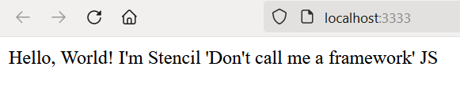
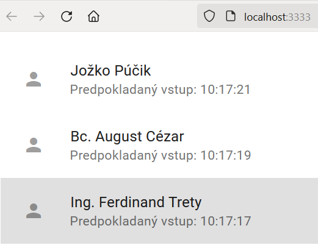

## Kostra aplikácie

V tejto kapitole vytvoríme základnu kostru našej aplikácie. Jej funkcionalita bude síce limitovaná, ale umožní nám
pripraviť si projektové prostredie s nevyhnutnou automatizáciou tak, aby sme sa pri ďalšom postupe mohli sústrediť na vývoj
a evolúciu našej aplikácie a nechali automaty vykonávať opakujúce sa kroky súvisiace s integráciou a nasadením našej aplikácie.

Pri tejto aplikácii budeme využívať knižnicu [Stencil JS][stencil], pomocou ktorej budeme vytvárať web komponenty reprezentujúce náš mikro front end. Pre detailnejšie porozumenie knižnice odporúčame preštudovať si dokumentáciu ku knižnici, ktorá je relatívne krátka a nenáročna na pochopenie. Pokiaľ sa chcete bližšie zoznámiť s technológiou web komponentov, odporúčame naštudovať si [materiály tu][webc].

1. Otvorte aplikáciu Visual Studio Code a v nej nový terminál
  (menu `Terminal->New Terminal`)

2. V príkazovom riadku prejdite do priečinku vyhradenom pre cvičenia v tomto predmete.

3. Vykonajte príkaz pre vytvorenie nového projektu založeného na StencilJS knižnici:

    ```ps
    npm init stencil
    ```

    >info:> V rámci vykonávania tohto príkazu vám budú doinštalované všetky chýbajúce knižnice.

    Ako druh projektu zvoľte `components` a ako meno `ambulance-list`. StencilJS umožňuje vytvoriť aj samostatnú SPA/PWA aplikáciu, v našom prípade máme ale záujem iba o vytvorenie
    sady webových komponentov, ktoré budeme používať v spoločnej aplikácii. Z praktického
    hľadiska je rozdiel najmä vo vytváraní konečného balíka pre nasadenie našej aplikácie/webového komponentu.

    Po ukončení príkazu je v pracovnom priečinku vytvorený nový priečinok  `ambulance-list`, ktorý obsahuje kostru aplikácie. V ňom  nájdete súbor `package.json`, ktorý popisuje základné atribúty
    projektu, ako jeho názov, meno autora, verziu, a podobne. Ďalej obsahuje zoznam
    knižníc `dependencies` potrebných počas nasadenia aplikácie, a tiež zoznam knižníc
    `devDependencies` potrebných počas vývoja aplikácie. Dalšou dôležitou sekciou v
    tomto súbore je objekt `scripts`, ktorý popisuje príkazy často používané pri vývoji.
    Tieto príkazy možno vykonať pomocou príkazu `npm run <názov-skriptu>` a je tu možné
    doplniť aj vlastné príkazy podľa potreby vývojového tímu.

    Ďalším dôležitým súborom je `stencil.config.ts`. Tento súbor popisuje nastavenia projektu,
    ktoré sa využívajú počas kompilácie, vývoja a generovania komponentov projektu. Pri inicializácii
    obsahuje najmä základné nastavenie variantov - `outputTargets` generovaných počas kompilácie projektu. Pre potreby vývoja upravte túto konfiguráciu tak, aby boli automaticky generované mapy zdrojového kódu (`sourceMaps`):

    ```ts
    ...
    export const config: Config = {
        namespace: 'ambulance-list',
        sourceMap: true,  // vložený text @_add_@
        outputTargets: [ 
    ... 
    ```

    Ďalšími vytvorenými adresármi sú adresár zdrojových súborov `src` a adresár `node_modules` obsahujúci externé knižnice/moduly, od ktorých je naša aplikácia závislá. Priečinok `node_modules` je potrebné vynechať z riadenia verzií zdrojového kódu, to znamená pridať do `.gitignore` súboru.

4. Takto vytvorená kostra programu obsahuje funkčný `Hello world` komponent. Prejdite do priečinka `ambulance-list` a zadajte príkazy

    ```ps
    npm install
    npm run start
    ```

   Prvý príkaz nainštaluje knižnice, na ktorých je náš projekt závislý a druhý príkaz spustí aplikáciu. Po chvíli môžete v prehliadači vidieť výstup tejto aplikácie

   

5. Teraz vytvoríme prvý web komponent, ktorý bude zobrazovať zoznam čakajúcich pacientov na vyšetrenie. Vizuálny dizajn vychádza zo štýlu [Material Design](https://material.io/).

    Prejdite do priečinka aplikácie `ambulance-list` a nainštalujte knižnice web komponentov pre
    Material Design:

    ```ps
    npm install -s @material/mwc-list @material/mwc-icon
    ```

    Následne vytvorte nový web komponent príkazom

    ```ps
    npm run generate
    ```

    Budete vyzvaný na zadanie mena komponentu, zvoľte meno `<iniciály>-ambulance-wl-list`. Iniciály   nahraďte svojimi iniciálami alebo iným identifikátorom, ktorý odlíši Vaše web komponenty od ostatných   cvičiacich - v texte budeme ďalej nahrádzať symbolom `<pfx>`. Potvrďte voľbu a aj nasledujúcu otázku   ohľadne ďalších súborov pre vytváraný web komponent. Teraz máte vytvorený nový web komponent v   priečinku `.../ambulance-list/src/components/<pfx>-ambulance-wl-list`

6. Otvorte súbor `.../ambulance-list/src/components/<pfx>-ambulance-wl-list/<pfx>-ambulance-wl-list.tsx` a upravte ho do nasledujúceho tvaru:
  
    ```ts
    import { Component, Host, h } from '@stencil/core';
    import '@material/mwc-list'; 
    import '@material/mwc-icon';
 
    @Component({
    tag: '<pfx>-ambulance-wl-list',
    styleUrl: '<pfx>-ambulance-wl-list.css',
    shadow: true,
    })
    export class <Pfx>AmbulanceWlList {
 
      waitingPatients: any[];
    
      private async getWaitingPatientsAsync(){
        return await Promise.resolve(
          [{
              name: 'Jožko Púčik',
              patientId: '10001',
              since: new Date(Date.now() - 10 * 60).toISOString(),
              estimatedStart: new Date(Date.now() + 65 * 60).toISOString(),
              estimatedDurationMinutes: 15,
              condition: 'Kontrola'
          }, {
              name: 'Bc. August Cézar',
              patientId: '10096',
              since: new Date(Date.now() - 30 * 60).toISOString(),
              estimatedStart: new Date(Date.now() + 30 * 60).toISOString(),
              estimatedDurationMinutes: 20,
              condition: 'Teploty'
          }, {
              name: 'Ing. Ferdinand Trety',
              patientId: '10028',
              since: new Date(Date.now() - 72 * 60).toISOString(),
              estimatedStart: new Date(Date.now() + 5 * 60).toISOString(),
              estimatedDurationMinutes: 15,
              condition: 'Bolesti hrdla'
          }]
        );
      }
    
      async componentWillLoad() {
        this.waitingPatients = await this.getWaitingPatientsAsync();
      }
    
      private isoDateToLocale(iso:string) {
        if(!iso) return '';
        return new Date(Date.parse(iso)).toLocaleTimeString()
      }
 
      render() {
        return (
          <Host>
            <mwc-list>
              { this.waitingPatients.map( entry => 
                <mwc-list-item graphic="avatar" twoline>
                  <span>{entry.name}</span>
                  <span slot="secondary">Predpokladaný vstup: {this.isoDateToLocale(entry.estimatedStart)} </span>
                  <mwc-icon slot="graphic">person</mwc-icon>
                </mwc-list-item>
              )}
            </mwc-list>
          </Host>
        );
      }
    }
    ```
 
    Metóda `getWaitingPatientsAsync()` je zatiaľ implementovaná ako náhrada prístupu k REST API  mikroslužbe a vracia statický zoznam čakajúcich. Prístup k API budeme ďalej upravovať, dôležité je si  uvedomiť, že sa bude jednať o asynchrónny prístup k vzdialenej  službe, preto hneď pracujeme s  predpokladom, že táto metóda je asynchrónna a vracia [`Promise`](https://developer.mozilla.org/en-US/ docs/Web/JavaScript/Reference/Global_Objects/Promise) (alebo takzvaný `then-able object`).
 
    Metódy `componentWillLoad()` a `render()` sú [metódami životného cyklu](https://stenciljs.com/docs/ component-lifecycle) web componentu v knižnici [Stencil JS][stencil]. Tieto metódy  (okrem `render()`) môžu vrátiť ako návratovú hodnotu objekt typu `Promise`. V našom prípade v metóde  `componentWillLoad()` načítame a zapamätáme si zoznam čakajúcich v čakárni.
 
    Samotná metóda `render()` potom slúži na vykreslenie obsahu webového komponentu. K tomu použijeme  syntax [JSX][jsx], ktorá umožňuje vkladať HTML kód priamo do  kódu webového komponentu. Element `<Host>` je špeciálny element informujúci kompilátor Stencil JS, že  ďalší obsah je uvedený v rámci hosťujúceho elementu. Elementy `mwc-list`, `mwc-icon` a ďalšie s  prefixom `mwc-` sú z knižnice webových komponentov [Material Design Web Components][md-webc]. Venujte pozornosť špeciálnemu atribútu [`slot`](https://developer.mozilla.org/en-US/docs/Web/HTML/Element/slot). Meno slotu je určené samotným webovým komponentom a  informuje ho, že element s týmto atribútom je určený pre príslušný slot - napríklad `slot="graphic"`  určuje, že element `mwc-icon` sa má zobraziť na pozícii určenej pre grafický identifikátor položky  zoznamu.
 
    Takýmto spôsobom sme zadefinovali svoj prvý web komponent.

7. Teraz prejdite do súboru `.../ambulance-list/src/index.html` a upravte ho do tvaru:

    ```html
    <!DOCTYPE html>
    <html dir="ltr" lang="en">
       <head>
          <meta charset="utf-8" />
          <meta name="viewport" content="width=device-width, initial-scale=1.0, minimum-scale=1.0, maximum-scale=5.0" />
          <link href="https://fonts.googleapis.com/css?family=Roboto:300,400,500" rel="stylesheet">
          <link href="https://fonts.googleapis.com/css?family=Material+Icons&display=block" rel="stylesheet">
          <title>Ambulance Waiting List Tester</title>
          <script type="module" src="/build/ambulance-list.esm.js"></script>
          <script nomodule src="/build/ambulance-list.js"></script>
       </head>
       <body>
          <<pfx>-ambulance-wl-list></<pfx>-ambulance-wl-list>
       </body>
    </html>
    ```

    Okrem načítania fontu pre webové ikony a fontu pre Material Design je pre nás zásadná úprava v tele   stránky, kde použijeme svoj novo vytvorený webový komponent. Pokiaľ ste si všimli anotáciu triedy pre   webový komponent:

    ```ts
    @Component({
       tag: '<pfx>-ambulance-wl-list',
       styleUrl: '<pfx>-ambulance-wl-list.css',
       shadow: true,
    })
    ```

    tak viete, že sme mu priradili novú značku (`tag`) : `<pfx>-ambulance-wl.list`. V súbore `index.html`   teraz túto značku použijeme.

    Odštartuje váš vývojový web server - pokiaľ už nie je aktívny - príkazom:.

    ```ps
    npm run start
    ```

    a prejdite do prehliadača na stránku [http://localhost:3333](http://localhost:3333). Mali by ste   vidieť stránku so zoznamom čakajúcich:

    

8. Na záver odstránime priečinok `.../ambulance-list/src/components/my-component` obsahujúci komponent vygenerovaný ako ukážku knižnicou _Stencil JS_.
