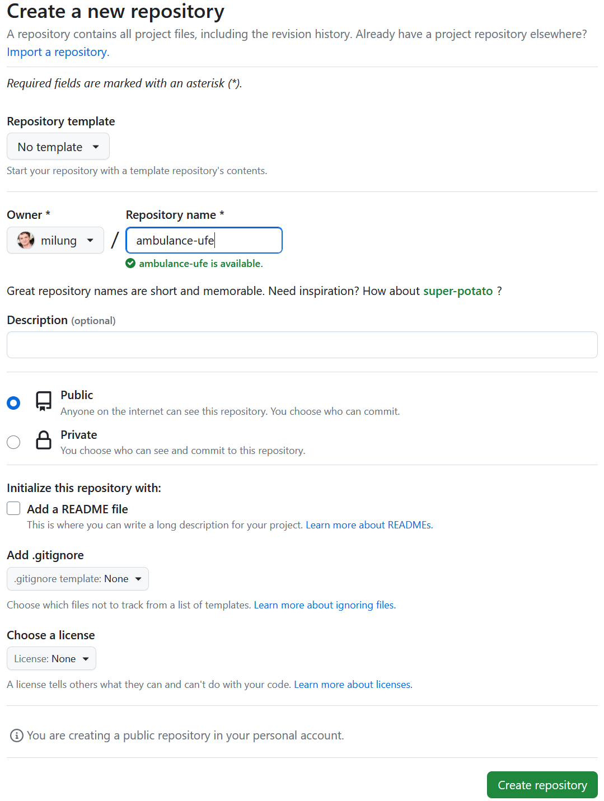
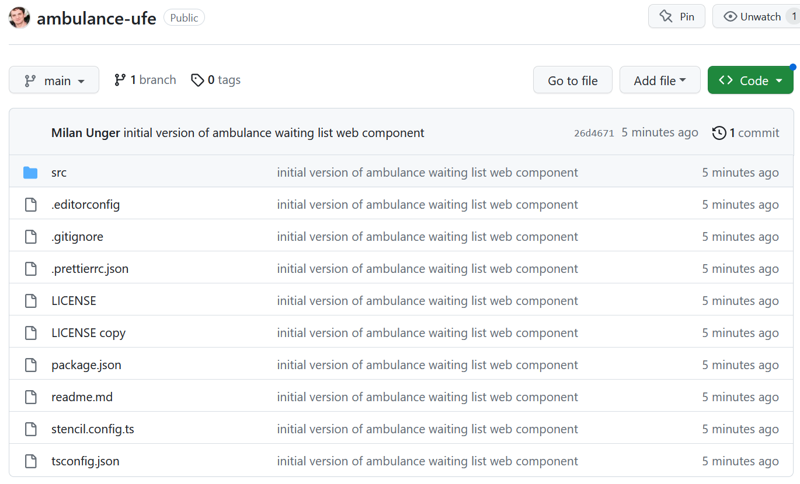

## Vytvorenie repozitára a archivácia kódu

---

```ps
devcontainer templates apply -t registry-1.docker.io/milung/wac-ufe-002
```

---

V tejto kapitole si vytvoríme nový repozitár a archivujeme kód. Využijeme na to
služby poskytované na serveroch [GitHub]. Repozitár odporúčame vytvoriť ako verejný,
nie je to ale podmienkou.

1. Na stránke [GitHub] sa prihláste do svojho účtu a v hornom panely rozbaľte tlačidlo označené
   "+" a zvoľte _New Repository_.
  

2. V zobrazenom okne zvoľte meno repozitára `ambulance-ufe`, a ostatné voľby ponechajte v pôvodonom stave.  
   Skontrolujte, že všetky možnosti v sekcii _Initialize this repository with:_ sú prázdne. Následne stlačte 
   na tlačidlo _Create repository_.

   

   Na nasledujúcej stránke máte uvedené pokyny na vytvorenie lokálneho repozitára a jeho synchronizáciu s vzdialeným repozitárom.
   V našom prípade budeme používať príkazy zobrazené v sekcii _…or push an existing repository from the command line_.

3. Pokiaľ ste zvolili vytvorenie súkromného repozitára, zvoľte na zobrazenej stránke možnosť _Invite Collaborators_
   a pridajte do repozitára cvičiacich ako spolupracovníkov, tak aby mali k repozitáru prístup.
   Tento úkon im umožní analyzovať prípadné problémy vo Vašom kóde.

4. Vo VS Code prejdite do priečinka `${WAC_ROOT}/ambulance-list` a inicializujte lokálny git repozitár príkazmi:

    ```ps
    git config --global init.defaultBranch main
    git init
    ```

    >info:> Prvým príkazom sme zmenili nastavenie názvu hlavnej vetvy na `main`.

5. Otvorte súbor `${WAC_ROOT}/ambulance-list/.gitignore` a skontrolujte, že obsahuje riadky so záznamom
  `node_modules/`, `dist/`, `www/`, `loader/`. Tento súbor určuje, ktoré súbory a podpriečinky sa nemajú archivovať, čo vo väčšine prípadov znamená súbory,
  ktoré sú vytvárané počas kompilácie zdrojových súborov a balíky, ktoré je možné získať automatizovaným spôsobom z dostupných zdrojov a iných archívov.

    ```ps
    dist/ @_important_@
    www/ @_important_@
    loader/  @_important_@
    ...
    node_modules/ @_important_@
    ...
    ```

6. Pridajte a odovzdajte do archívu všetky lokálne súbory

    ```ps
    git add .
    git commit -m 'initial version of ambulance waiting list web component'
    ```

7. Prepojíme lokány repozitár s GitHub repozitárom. V nasledujúcom príkaze zameňte `<account>` za svoje používateľské meno na GitHub.

    >info:> Môžete použiť príkaz vygenerovaný na stránke vášho repozitára v [GitHub].

    ```ps
    git remote add origin https://github.com/<account>/ambulance-ufe.git
    ```

    _origin_ je meno, ktorým sme označili vzdialený repozitár

8. Synchronizujte váš lokálny repozitár so vzdialeným repozitárom. Pri výzve zadajte svoje prihlasovacie údaje.

    >info:> Môžete použiť príkaz vygenerovaný na stránke vášho projektu v [GitHub].

    ```ps
    git push --set-upstream origin main
    ```

    V prehliadači skontrolujte, že sú vaše súbory uložené vo vzdialenom repozitári.

    

Počas cvičení budeme používať zjednodušený vývojový proces a pracovať priamo na
vetve `main` repozitára. Pri práci v tíme sa ale odporúča používať vývojový
postup [_Fork and Pull Requests_](https://gist.github.com/Chaser324/ce0505fbed06b947d962).

Git repozitár je možné vytvoriť aj na iných serveroch, napríklad populárnych
[Azure DevOps][[azure-devops]], [GitLabs][gitlab], alebo
[Bitbucket][bitbucket]. Dôležitým kritériom pri výbere je podpora
automatizovanej kontinuálnej integrácie a nasadenia, profesionálna podpora tímu
a ľahká správa prostriedkov samotným vývojovým tímom. V kontexte tejto učebnice
budeme pracovať so službami poskytovanými na serveroch [GitHub].
