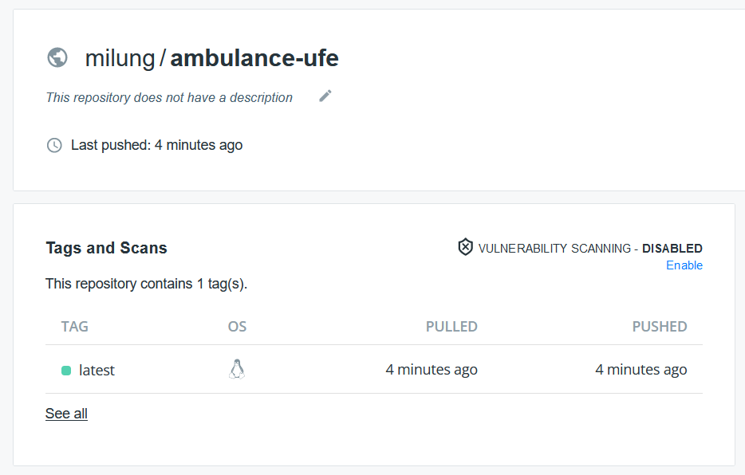

## Kontajnerizácia aplikácie

[Softvérový kontajner][containers] si možno predstaviť aj ako obraz virtuálneho zariadenia, ktorý so sebou prináša všetky knižnice a závislosti potrebné k behu programu bez toho, aby ovplyvňoval alebo bol ovplyvňovaný špecifickými požiadavkami ostatných susbsystémov prítomných na tom istom fyzickom zariadení. Na rozdiel od technológie virtuálnych počítačov ale jednotlivé kontajnery zdieľajú jadro operačného systému, čím sú menej náročné na administráciu a dostupnosť fyzických prostriedkov.

V tomto cvičení budeme používať platformu softvérových kontajnerov [Docker][docker-containers], predpokladom je nainštalovaný systém [Docker Desktop][docker-desktop] na operačnom systéme Windows a Mac, alebo docker balík na systémoch Linux.

>info:> Docker Desktop je od Januára 2022 spoplatnený pre komerčné používanie. Cena je síce prijateľná pre väčšinu komerčných využití, pokiaľ hľadáte voľnú alternatívu, môžete použiť napríklad [Rancher Desktop][rancher-desktop]

1. Softvérové kontajnery sú vytvárané z ich obrazov, čo je binárna forma reprezentujúca stav operačného systému potrebného pre beh daného programu. Obraz - _image_ -  je možné vytvoriť rôznymi spôsobmi. Najbežnejší spôsob je vytvorenie obrazu kompiláciou súboru nazývaného `Dockerfile`. V adresári `.../ambulance-list` vytvorte súbor s názvom [`Dockerfile`](https://docs.docker.com/engine/reference/builder/) a nasledujúcim obsahom

     ```dockerfile
     ### compilation stage
     FROM node:latest AS build
 
     RUN mkdir /build
     WORKDIR /build
     
     COPY package.json .
     RUN npm install 
 
     COPY . .
     RUN npm run build
 
     #### NGINX FOR Single Page Application ####
     FROM steebchen/nginx-spa
 
     COPY --from=build /build/www /app
 
     EXPOSE 80
 
     CMD ["nginx"]
     ```

     >$apple:> V prípade že máte procesor založený na architektúre arm64 (niektoré Mac) použite  miesto príkazu `FROM steebchen/nginx-spa` príkaz `FROM milung/nginx-spa`. Obraz `milung/nginx-spa`  podporuje viacero architektúr, ináč je totožný s pôvodným obrazom `steebchen/nginx-spa`. V prípade  kontinuálnej integrácii musí byť predpis tiež upravený na využitie buildx príkazu a vytváranie  multi-architecture obrazov.
 
     Tento dockerfile využíva takzvané viacstupňové vytváranie obrazov. Každý stupeň začína príkazom  `FROM <base-image>`. Obraz kontajnera je tvorený vrstvami súborového systému, kde každá nová  vrstva modifikuje obsah predchádzajúcej vrstvy viditeľný z pohľadu bežiaceho programu v takzvanej  _runtime layer_ aktívneho kontajnera. Všetky predchádzajúce vrstvy musia byť dostupné, z čoho  vyplýva, že vymazanie súboru v novej vrstve nezmenšuje konečnú veľkosť obrazu, len mení  viditeľnosť súborov. Z praktického hľadiska možno každý príkaz v súbore `Dockerfile` - napr.  `COPY` alebo `RUN` - považovať za vytvorenie novej vrstvy.
 
     V našom prípade potrebujeme systém [Node JS][nodejs] len počas kompilácie, k  vytvoreniu súborov poskytovaných webovým serverom. Samotný program bude vykonávaný webovým  prehliadačom na prostriedkoch koncového používateľa. Z toho dôvodu je prvý stupeň - identifikovaný  príkazom `FROM node:latest AS build` - takzvaný dočasný obraz, oddelený od druhého stupňa. Druhý  stupeň - začínajúci príkazom `FROM steebchen/nginx-spa` - potom predstavuje finálny obraz  kontajnera a už neobsahuje subsystém [Node JS][nodejs], ale iba webový server [NGINX][nginx], konfigurovaný pre potreby Single Page Web Application. Vzhľadom na  veľkosť priečinku `node_modules`, obsahujúceho rôzne knižnice potrebné pre kompiláciu našej  kompilácie, predstavuje tento postup značnú redukciu veľkosti výsledného obrazu. Kompilácia našej  aplikácie zo zdrojových súborov zároveň zabezpečí jej opakovateľnosť aj mimo vývojového prostredia.
 
    Tiež si všimnite, že v prvom kroku kompilácie kopírujeme len súbor `package.json` a vykonávame  príkaz `npm install`, ktorý nainštaluje všetky balíčky potrebné k behu našej aplikácie. Systém  docker pri vytváraní jednotlivých vrstiev porovná hash kód kopírovaných súborov (vrstvy po  aplikovaní príkazu `COPY`) a pokiaľ nedošlo k zmene obsahu, vynechá vytváranie nasledujúcej vrstvy  s príkazom `RUN`. Keďže zmena obsahu súboru `package.json` je zriedkavá v porovnaní s frekvenciou  zmien zdrojových súborov našej aplikácie, je inštalácia balíčkov po prvotnom vytvorení vrstvy len  znovupoužitá, čo skracuje čas kompilácie obrazu pri opakovaných behoch. V zásade sa snažíme radiť  príkazy v súbore `Dockerfile` takým spôsobom, aby sa artefakty s väčšou frekvenciou zmien  spracovávali neskôr počas behu kompilácie.

2. Vytvorte nový súbor `.../ambulance-list/.dockerignore` s obsahom

    ```plain
    dist
    www
    loader
    node_modules
    ```
 
    Počas kompilácie súboru `Dockerfile` je do vyrovnávacej pamäte rekurzívne  kopírovaný obsah aktuálneho priečinku. Súbor `.dockerignore` umožňuje  špecifikovať, ktoré súbory alebo priečinky nie sú pre kompiláciu potrebné, čo  najmä v prípade priečinka `node_modules` značne skráti čas inicializácie  kompilácie.

3. Komitnite a synchronizujte zmeny so vzdialeným repozitárom.

4. Kompilujte súbor `Dockerfile` do nového obrazu `ambulance-ufe` príkazom:

    ```ps
    docker build -t ambulance-ufe .
    ```
 
    >$apple:> V prípade že máte procesor s arm64 architektúrou a build docker obrazu končí  neúspešne s hláškou: `The chromium binary is not available for arm64.`, treba pred riadok v  Dockerfile: `COPY package.json .` pridať riadok: `ENV PUPPETEER_SKIP_CHROMIUM_DOWNLOAD true`.
 
    Inštalácia balíčkov môže byť pri prvom vykonaní tohto príkazu zdĺhavá a závislá od rýchlosti  sieťového pripojenia, v nasledujúcich kompiláciách sa ale bude vytváranie tejto vrstvy  preskakovať, pokiaľ nedôjde k zmene súboru `package.json`. Po úspešnom vykonaní príkazu môžete  naštartovať kontajner príkazom
 
    ```ps
    docker run -p 8080:80 --name ambulance-ufe-server ambulance-ufe
    ```
 
    a prejdite do webového prehliadača na stránku [http://localhost:8080](http://localhost:8080), kde  by ste mali vidieť zoznam čakajúcich pacientov.
 
    >info:> Voľba `-p 8080:80` určuje, že port `8080` hostiteľského počítača - `localhost` bude presmerovaný  na port `80` virtuálneho sieťového rozhrania bežiaceho kontajnera. Port `8080` môže byť v  niektorých prípadoch už rezervovaný iným programom. V takom prípade číslo tohto portu upravte a  prejdite na stránku so zodpovedajúcim portom.
 
    Kontajner môžete zastaviť a vymazať príkazom
 
    ```ps
    docker rm -f ambulance-ufe-server
    ```

5. Pokiaľ ešte nie ste registrovaný na stránke [Docker Hub][docker-hub], prejdite tam a zaregistrujte sa. Všimnite si, aké máte priradené používateľské meno. V ďalších príkazoch musíte zameniť vlastným používateľským menom reťazec `<your-account>`.

6. Označte obraz kontajnera novým názvom, zahrňujúcim vaše meno používateľa zo stránky Docker Hub a zverejnite ho nasledujúcimi príkazmi:

    ```ps
    docker tag ambulance-ufe <your-account>/ambulance-ufe:latest
    docker login
    docker push <your-account>/ambulance-ufe:latest
    ```
 
    >info:> Názov za dvojbodkou typicky určuje verziu obrazu kontajnera. Pokiaľ nie je uvedený, tak je  automaticky doplnený názvom `latest`. V predchádzajúcom príkaze by preto jeho uvádzanie nebolo  potrebné a príkaz kombinuje variant s explicitne aj implicitne uvedenou verziou `latest`.
 
    Na stránke [Docker Hub][docker-hub] by ste po ukončení týchto príkazov mali vidieť  váš nový obraz softvérového kontajnera
 
    
