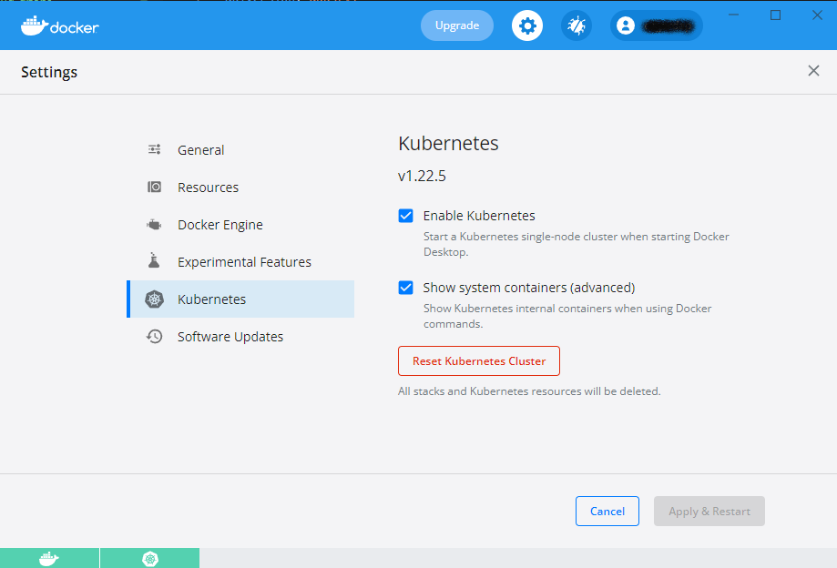
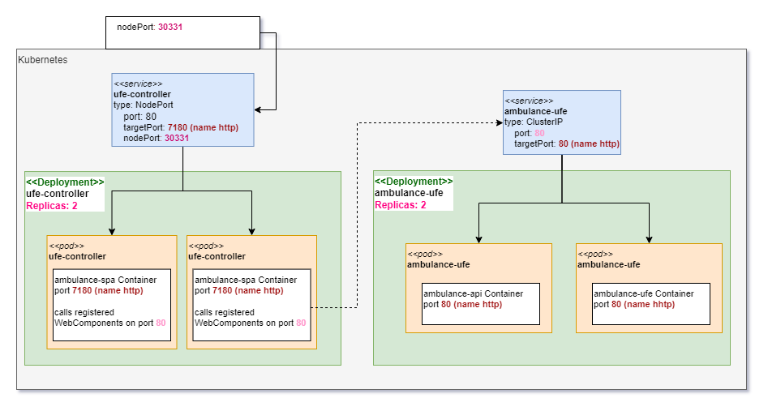

# Nasadenie do klastra kubernetes


---

```ps
devcontainer templates apply -t registry-1.docker.io/milung/wac-ufe-006
```

---

V predchádzajúcom príklade sme si predstavili jeden zo spôsobov nasadenia našej aplikácie, pri ktorom sme využili služby typu [_Platform as a Service_][paas] v dátovom centre [Microsoft Azure][azure].
Hoci je tento spôsob nasadenia aplikácie funkčný, je vhodný len pre veľmi malé projekty. Na projektoch, kde spolupracuje niekoľko tímov a kde finálne dielo pozostáva z rôznych subsystémov, je tento spôsob nedostatočný.

V tomto cvičení si ukážeme, ako nasadiť našu aplikáciu do klastra [Kubernetes] manuálne a v ďalšej časti, ako zabezpečiť kontinuálne nasadenie aplikácie technikou [GitOps] s využitím aplikácie [Flux].

Pred samotnou prácou sa uistite, že máte zapnutú podporu Kubernetes v rámci `Docker Desktop` aplikácie, viď obrázok:



1. V priečinku `${WAC_ROOT}` vytvorte nový priečinok s názvom `webcloud-gitops`. Vo VS Code pridajte tento priečinok do aktuálneho pracovného priestoru pomocou voľby menu _File->Add Folder to Workspace..._

2. V priečinku `${WAC_ROOT}/webcloud-gitops` vytvorte nasledujúcu adresárovú štruktúru:

    ```plain
    webcloud-gitops
    |
    |- apps
    |  L <pfx>-ambulance-ufe
    |
    |- infrastructure
    |  L ufe-controller
    |
    |- clusters
       L localhost
    ```

    Aplikáciu budeme nasadzovať s využitím aplikácie [kustomize] pre  riadenie konfigurácií v systéme kubernetes.  [Kustomize] je natívnou  súčasťou systému kubernetes a je tiež integrovaná do aplikácie `kubectl`. Často používanou  alternatívou k tejto aplikácii je aplikácia [Helm]. Účel použitia je pri  týchto aplikáciách rovnaký, Helm sa zameriava na techniku šablón, ktoré sú parametrizované konfiguráciou pre špecifické nasadenie. [Kustomize] šablóny odmieta, keďže nie sú priamo  nasaditeľné alebo použiteľné a pracuje na princípe prispôsobovania funkčných manifestov pomocou  čiastkových úprav - _patch_-ov - pre špecifické nasadenie. V tomto cvičení preferujeme  [Kustomize] najmä z dôvodu, že manifesty si v základnej forme zachovávajú syntaktickú a  sémantickú presnosť definovanú [Kubernetes API][k8s-api].

    Štruktúra priečinkov je hierarchická. Priečinok `clusters` bude obsahovať konfiguráciu systému  pre jednotlivé špecifické klastre, väčšinu času budeme počas cvičenia pracovať s lokálnym  klastrom označeným ako `localhost`.

    Priečinok `infrastructure` bude obsahovať komponenty systému, ktoré sa buď inštalujú typicky len raz počas životného cyklu klastra alebo sú zdieľané medzi tímami a sú potrebné k behu  ostatných subsystémov. Čo presne je súčasťou priečinku `infrastructure` sa môže líšiť prípad od prípadu, v zásade tam patria zdieľané služby s inými aplikáciami, ktoré na niektorých klastroch už sú predpripravené a nie je možné ich "preinštalovať" v rámci daného projektu/tímu, a na  iných klastroch ich treba predinštalovať, aby bola zabezpečená funkčnosť dodávanej aplikácie.

    Priečinok `apps` obsahuje komponenty systému, ktoré projektový tím zabezpečuje pre všetky  cieľové prostredia - klastre - a má ich plne pod kontrolou.

    >info:> V týchto cvičeniach používame takzvanú [_MonoRepo_](https://fluxcd.io/flux/guides/repository-structure/#monorepo) štruktúru repozitára pre priebežné nasadenie. Nie je to ale jediná možnosť, viac možností je opísaných vo [flux dokumentácii](https://fluxcd.io/flux/guides/repository-structure/).

3. V priečinku `${WAC_ROOT}/webcloud-gitops/apps/<pfx>-ambulance-ufe` vytvorte súbor `deployment.yaml` s nasledujúcim obsahom (komentáre môžete vynechať):

   ```yaml
   apiVersion: apps/v1
   kind: Deployment
   metadata:
     name: <pfx>-ambulance-ufe-deployment      # meno deployment-u od ktorého sa odvádza meno podu
   spec:
     replicas: 2 @_important_@
     selector:
       matchLabels:
           pod: <pfx>-ambulance-ufe-label    # tento riadok je len označenie štítku 
                                       # key-value pair pod=ambualnce ufe
                                       # určený pre výber podov s rovnakým štítkom
     template:                    # šablóna pre vytvorenie replík podov
       metadata:
         labels: 
           pod: <pfx>-ambulance-ufe-label    # štítky podu
       spec:
         containers:
         - name: ambulance-ufe-container # meno kontaineru - v pod-e ich môže byť viac
           image: <pfx-hub>/ambulance-ufe
           imagePullPolicy: Always
           
           ports:
           - name: http
             containerPort: 8080       # port na ktorom počúva kontajner, pomenovaný ako `http`

           resources:                  # určenie kvót pre využívané fyzické prostriedky
                                       # je dôležité pre riadenie záťaže v rámci kubernetes
                                       # klastra
               requests:               
                   memory: "32M"
                   cpu: "0.1"
               limits:
                   memory: "320M"
                   cpu: "0.3"
   ```

   Súbor `deployment.yaml` je deklaráciou nasadenia našej služby - tzv. [_workload_](https://kubernetes.io/docs/concepts/workloads/) - do klastra. Všimnite si, že požaduje nasadenie dvoch replík - čo znamená, že v klastri budú vytvorené dva _pod_-y a v rámci každého z nich bude vytvorený aj bežiaci kontajner s našou aplikáciou. Všimnite si tiež, že v šablóne pre vytvorenie podu je definovaný štítok `pod: <pfx>-ambulance-ufe-label`, ktorý je použitý v selektore pre výber podov, ktoré majú byť súčasťou tohto nasadenia. Tento štítok je použitý aj v ďalších manifestoch, ktoré budeme vytvárať. Všetky zdroje v systéme kubernetes môžu byť označené štítkami a tiež môžu byť vyhľadávané pomocou selektorov, ktoré štítky používajú. Prípony `-label`, `-deployment` a `-container` nie sú štandardnou konvenciou, sú tu uvedené najme pre lepšie sa zorientovanie ako jednotlivé názvy v manifeste súvisia.

4. Takto vytvorený manifest je funkčný a možno ho nasadiť do klastra. Predpokladáme, že máte nainštalovaný systém [kubernetes] na svojom počítači a zvolený [aktívny kontext](https://kubernetes.io/docs/tasks/access-application-cluster/configure-access-multiple-clusters/#define-clusters-users-and-contexts) pre tento klaster. To, ktorý kontext je aktívny môžete zistiť vykonaním príkazu

   ```ps
   kubectl config get-contexts
   ```

    ktorý zobrazí výsledky v podobe:

   ```plain
   CURRENT   NAME           CLUSTER           AUTHINFO 
   *         aks            aks-cluster       user-admin
             docker-desktop docker-desktop    docker-desktop
   ```

   kde znak `*` označuje práve aktívny kontext. Pokiaľ nie je aktívny vami požadovaný kontext, môžete ho zmeniť príkazom:

   ```ps
   kubectl config use-context docker-desktop
   ```

   >info:> Odporúčame nainštalovať si na svojom počítači aplikácie [kubectx], [kubens][kubectx],[OpenLens][lens] a naučiť sa ich používať pri práci s kubernetes klastrami. V cvičeniach sú uvedené len príkazy založené na [kubectl] nástroji, ktorý je súčasťou nainštalovaného [kubernetes] systému.

   Teraz prejdite do priečinka `${WAC_ROOT}/webcloud-gitops` a vykonajte príkaz

   ```ps
   kubectl apply -f apps/<pfx>-ambulance-ufe/deployment.yaml
   ```

   Následne môžete vykonať (opakovane) príkaz

   ```ps
   kubectl get pods
   ```

   a zopakovať ho až pokiaľ neuvidíte výpis v podobe

   ```plain
   NAME                                        READY   STATUS    RESTARTS   AGE
   ambulance-ufe-deployment-7f45494d6b-qj58z   1/1     Running   0          37s
   ambulance-ufe-deployment-7f45494d6b-slppc   1/1     Running   0          61s
   ```

   >build_circle:> Status môže mať dočasne aj výpis vo forme `Container Creating`. Pokiaľ stĺpec indikuje
   > nejakú chybu, opravte manifest `deployment.yaml` a znova ho aplikujte príkazom
   > `kubectl apply -f apps/<pfx>-ambulance-ufe/deployment.yaml`.

   Výpis indikuje, že v našom klastri máme teraz bežiace dva [pody](https://kubernetes.io/docs/concepts/workloads pods/) - zjednodušene dva virtuálne
   počítače pripojené k virtuálnej sieti kubernetes klastra.

5. Momentálne sú tieto pody dostupné
   len na virtuálnej sieti systému kubernetes. Pokiaľ k nim chceme pristúpiť, môžeme využiť funkciu
   [presmerovania portov](https://kubernetes.io/docs/tasks/access-application-cluster/port-forward-access-application-cluster/) z lokálneho systému na cieľový pod (prípadne _service_) aktívneho klastra. Vykonajte príkaz:

   ```ps
   kubectl port-forward <pfx>-ambulance-ufe-deployment-<your-hash> 8081:80
   ```

   a následne ak otvoríme v prehliadači stránku [http://localhost:8081](http://localhost:8081), uvidíme náš zoznam čakajúcich.

   Funkcia `port-forward` funguje aj pri vzdialených klastroch a je vhodná na ladenie podporných mikroslužieb, ktoré nie sú dostupné z externých sietí mimo klastra. V našom prípade bude zverejnená len služba integrujúca jednotlivé mikro-Front-End komponenty, čo je ukázané nižšie.

   >info:> Nástroj [kubectl] funguje ako web klient, ktorý pristupuje k [REST API]/[Kubernetes API][k8s-api] systému kubernetes. Je možné pristupovať k tomuto API aj priamo, museli by sme ale zabezpečiť správnu autenticitu a autorizáciu našich požiadaviek, ktorú nástroj [kubectl] vykonáva automaticky na základe konfigurácie štandardne uloženej v adresári `~/.kube`.

   Nakoniec zmažeme nami vytvorené zdroje pomocou príkazu:

   ```ps
   kubectl delete -f apps/<pfx>-ambulance-ufe/deployment.yaml
   ```

6. Teraz vytvorte súbor `${WAC_ROOT}/webcloud-gitops/apps/<pfx>-ambulance-ufe/service.yaml` s obsahom:

   ```yaml
   kind: Service
   apiVersion: v1
   metadata:
     name: <pfx>-ambulance-ufe   #  určuje aj záznam DNS v rámci virtuálne siete klastra
   spec:  
     selector:
       pod: <pfx>-ambulance-ufe-label     # zhoduje sa s metadata.labels šablóny pod-u
     ports:
     - name: http
       protocol: TCP
       port: 80            # port pomenovanej služby, môže sa líšiť 
                           # od portu na ktorom počúva kontajner
       targetPort: http    # viď meno portu v deployment.yaml
   ```

   Tento zdroj v systéme kubernetes deklaruje [sieťovú službu](https://kubernetes.io/docs/concepts/services-networking/service/), ktorá zároveň implementuje jednoduchý _load balancer_ pre distribúciu HTTP požiadaviek medzi dve repliky našej webovej služby a [_service discovery_](https://en.wikipedia.org/wiki/Service_discovery) založený na systéme [DNS](https://en.wikipedia.org/wiki/Domain_Name_System) - meno služby `<pfx>-ambulance-ufe` zároveň reprezentuje DNS záznam v rámci virtuálnej siete a teda naša webová služba bude interne v rámci systému kubernetes dostupná na adrese `http://<pfx>-ambulance-ufe` v rámci toho istého _namespace_ alebo na adrese `http://<pfx>-ambulance-ufe.<namespace>` z ľuboľného [_namespace_](https://kubernetes.io/docs/concepts/overview/working-with-objects/namespaces/).

7. Ďalej vytvoríme súbor `${WAC_ROOT}/webcloud-gitops/apps/<pfx>-ambulance-ufe/webcomponent.yaml` s obsahom:

   ```yaml
   apiVersion: fe.milung.eu/v1
   kind: WebComponent
   metadata: 
     name: <pfx>-ambulance-ufe
   spec:   
     module-uri: http://<pfx>-ambulance-ufe.wac-hospital/build/ambulance-list esm.js  
                        # module web komponentu pre tento mikroFE 
                        # - umiestnený v namespace wac-hospital
     navigation:
       - element: <pfx>-ambulance-wl-list    # element, ktorý bude vložený na stránku 
                                       # pri navigácii na zoznam čakajúcich
         path: <pfx>-ambulance-wl      # cesta, ktora sa zobrazi v address bare v prehliadaci, ked bude tento mikroFE aktívny
         title: Zoznam čakajúcich <pfx>      # názov mikro aplikácie
         details: Spravuje zoznam pacientov čakajúcich na vyšetrenie v ambulancii
     preload: false                    # určuje, či má byť web komponent načítaný spolu s hlavnou stránkou
     proxy: true                       # pre komponenty v rámci klastra, neprístupné na verejnej sieti 
                                       # musí byť táto hodnota nastavená na true 
     hash-suffix: v1alpha1             # voliteľný suffix pre načítanie modulu web komponentu - jeho zmenou 
                                       # sa mení názov URL pre modul a tým je možné predísť problémom 
                                       # s verziami vo vyrovnávacích pamätiach
   ```

   >warning:> Meno elementu `<pfx>-ambulance-wl-list` musí zodpovedať komponentu, ktorý sme vytvorili predtým, súbor: `${WAC_ROOT}\ambulance-ufe\src\components\<pfx>-ambulance-wl-list\<pfx>-ambulance-wl-list.tsx`

   Tento súbor je neštandardným zdrojom systému kubernetes. V ďalšom bode budeme vytvárať manifesty pre mikro-front-end _controller_, ktorý tieto zdroje obhospodáruje. V zásade tu vykonávame registráciu mikro aplikácie - webového komponentu - do hlavnej aplikačnej obálky.

8. Nakoniec vytvoríme súbor `${WAC_ROOT}/webcloud-gitops/apps/<pfx>-ambulance-ufe/kustomization.yaml`. Správa konfigurácií založená na systéme [Kustomize] využíva súbory `kustomization.yaml` ako integračný bod jednotlivých zdrojov deklarovaných v ostatných manifestoch. Pritom ostatné manifesty ostávajú stále použiteľné a možno ich priamo použiť ako argument aplikácie `kubectl`. Súbor `kustomization.yaml` je v zásade predpisom ako automatizovane _editovať_ originálne súbory pre nasadenie jednotlivých zdrojov v iných prostrediach - rozumej v iných klastroch - a tieto úpravy možno hierarchicky kumulovať. V tomto prípade ide len o vymenovanie jednotlivých manifestov a priradenie spoločných značiek.

   ```yaml
   apiVersion: kustomize.config.k8s.io/v1beta1
   kind: Kustomization
   
   resources:                  # zoznam manifestov - zdrojov,
                               # ktoré sú súčasťou tejto aplikácie
   - deployment.yaml
   - service.yaml
   - webcomponent.yaml
   
   commonLabels:               # značky priradené všetkým zdrojom tejt aplikácie
     app: <pfx>-ambulance-ufe
   ```

   V tejto chvíli ešte nebudeme našu aplikáciu nasadzovať, potrebujeme najprv pripraviť manifesty pre infraštruktúru klastra. Pokiaľ ale chceme vidieť výsledok "kustomizacie" našej aplikácie, môžeme ho získať vykonaním príkazu

   ```yaml
   kubectl kustomize ./apps/<pfx>-ambulance-ufe/
   ```

9. V tomto kroku pripravíme manifesty pre zdroje našej _infraštruktúry_. V našom prípade sa teraz jedná najmä o radič mikro-aplikácií, teda akúsi aplikačnú obálku pre zobrazovanie jednotlivých web-komponentov. Pri skúmaní súčasného stavu sme nenašli implementáciu [micro-front-end systému][micro-fe], ktorý by vhodne kombinoval technológie [Web Components][webc], [Kubernetes] a [micro-Front-Ends][micro-fe]. Táto kombinácia sa pritom javí najvhodnejšia vzhľadom na súčasné trendy vývoja, keďže vytvára priestor na samostatný vývoj jednotlivých web komponentov založený na všeobecne uznávaných štandardoch, a ktoré je možno potom nasadiť deklaratívnym spôsobom v rôznych situáciach, čo priamo zodpovedá filozofii mikro služieb. Existujúce implementácie sú napríklad [bit], alebo [single-spa], ich integrácia ale väčšinou vyžaduje úzke previazanie mikro-front-end služieb.

   Aby sme využili deklaratívne princípy Kubernetes API a nezávislosť tímov vyvíjajúcich jednotlivé mikro-aplikácie, bol pre potreby cvičenia vytvorený jednoduchý [_kubernetes controller_][k8s-controller], ktorý obsluhuje neštandardné zdroje systému kubernetes definované pomocou [_Custom Resource Definition_][k8s-crd]. Tento _controller_ nepretržite sleduje zmeny deklarovaných zdrojov - _webcomponents_ - a poskytuje ich zabudovanému webovému serveru, ktorý implementuje aplikačnú obálku. Jednotlivé webové komponenty sú potom dynamicky načítavané podľa potreby a zobrazené na základe špecifikácie v týchto neštandardných zdrojoch. _Controller_ je implementovaný v programovacom jazyku Prolog (back-end) a v jazyku Typescript (front-end) a jeho zdrojové súbory sú dostupné na [https://github.com/milung/ufe-controller](https://github.com/milung/ufe-controller). Slúži zároveň ako motivácia a ukážka rozšíriteľnosti [kubernetes api][k8s-api], ktoré sa zameriava na deklaratívny popis želaného stavu, namiesto procedurálneho popisu, ako želaný stav dosiahnuť. V cvičeniach budeme používať jeho kontajnerizovanú verziu `milung/ufe-controller:latest`.

  >info:> Nasledujúce súbory môžete tiež skopírovať zo stránky [https://github.com/milung/ufe-controller/tree/master/examples/kustomize/applications/ufe-controller/base](https://github.com/milung/ufe-controller/tree/master/examples/kustomize/applications/ufe-controller/base)

    Vytvorte súbor `.../webcloud-gitops/infrastructure/ufe-controller/deployment.yaml` s obsahom:

    ```yaml
    apiVersion: apps/v1
    kind: Deployment
    metadata:
      name: ufe-controller
    spec:
      replicas: 2
      selector:
        matchLabels:
          pod: ufe-controller
      template: 
        metadata:
          labels: 
            pod: ufe-controller
        spec:
          serviceAccountName: ufe-controller-account
          containers:
          - name: ufe-controller
            image: milung/ufe-controller
            imagePullPolicy: Always
            ports:
            - name: http
              containerPort: 7180
            env:
              - name: BASE_URL
                value: /
              - name: HTTP_PORT
                value: "7180"            
            livenessProbe:
              httpGet:
                path: /fe-config
                port: http
              initialDelaySeconds: 30
              periodSeconds: 10
            resources:
              requests:
                memory: "64M"
                cpu: "0.1"
              limits:
                memory: "320M"
                cpu: "0.3"
    ```

   Ďalej vytvorte súbor `.../webcloud-gitops/infrastructure/ufe-controller/service.yaml`

    ```yaml
    kind: Service
    apiVersion: v1
    metadata:
      name: ufe-controller
    spec:  
      selector:
        pod: ufe-controller
      ports:
      - name: http
        protocol: TCP
        port: 80
        targetPort: http
    ```

   Teraz vytvoríme definíciu neštandardných zdrojov `.../webcloud-gitops/infrastructure/ufe-controller/crd.yaml` - _Custom Resource Definition_. Táto definícia špecifikuje náš typ zdrojov formou [JSON Schémy](https://json-schema.org/).

    ```yaml
    apiVersion: apiextensions.k8s.io/v1
    kind: CustomResourceDefinition
    metadata:
      name: webcomponents.fe.milung.eu
    spec:
      group: fe.milung.eu
      versions:
        - name: v1
          served: true
          storage: true
          schema:
            openAPIV3Schema:
              type: object
              properties:
                spec:
                  type: object
                  required:
                    - module-uri
                  properties:
                    module-uri:
                      description: |
                        URI from which the module shall be accessed. The actual module is cached by the 
                        conroller, to improve performance and to avoid CORS issues. 
                      type: string
                      format: url
                    preload:
                      description: |
                        The modules are not preloaded by default but only when navigating to some of the 
                        subpaths mentioned at the `navigation` list. Setting this property to true
                        ensures that the module is loaded when application starts.
                      type: boolean
                      default: false
                    proxy: 
                      description: |
                        Specifies whether the web components loading shall be proxied by the controller. 
                        This is usefull when the web component is served from the cluster and 
                        not accessible from the outside of the cluster network. The module will be served
                        from the URL `<base controller URI>/web-components/<WebComponent name>.jsm`. 
                        This is recommended approach for the standard assumed use-case.
                      type: boolean
                      default: true
                    hash-suffix: 
                      description: |
                        A hash string to identify the particular version of the module uri in case of 
                        controller proxying it. If `proxy` property is set and `hash` property is set then 
                        the final module file name is `<WebComponent name>.<hash-suffix>.jsm` and the resource is 
                        assumed to never expire. To refresh user agents` caches, one needs to change the hash 
                        to a new unique value. 
                      type: string                     
                    contextElements: 
                      description: |
                        Components that can be displayed in special context, e.g. `ufe-app-shell` for top level
                        application shell, `my-menu-item` for the components to display in the custom menu, etc.
                      type: array
                      items: 
                        type: object
                        required: 
                        - contextNames
                        - element
                        properties:
                          contextNames:
                            details: List of context names in which this element is intended to be shown
                            type: array
                            items: 
                              type: string
                          element:
                            details: The HTML element tag name to use when navigated to the specific path
                            type: string
                            example: my-element-name
                          priority:
                            description: |
                              The priority of the navigation entry in lists. The entries with higher priority are  
                              displayed before entries with the lower priorities, if there is ordering 
                              supported by the list. Default priority is 0
                            type: number
                            default: 0
                          attributes: 
                            description: |
                              A list of key-value pairs to assign specific attributes to the element. The `name` is
                              used as the attribute name. The `value` can be any valid json type. 
                            type: array
                            items: 
                              type: object
                              required: 
                                - name
                                - value
                              properties: 
                                name: 
                                  type: string
                                value: 
                                  x-kubernetes-preserve-unknown-fields: true
                          roles:
                            type: array
                            items: 
                              type: string
                    navigation:
                      description: |
                        Components with the navigation specification may be used as sub-paths
                        and are considered as the workspaces or application on its own within
                        the composed application shell
                      type: array
                      items: 
                        type: object                        
                        required: 
                          - path
                          - title
                          - element
                        properties:
                          path:
                            description: |
                              By navigating to the specific subpath the app shell will place the `element` 
                              on the main workspace (content) of the shell
                            type: string
                            example: /my-app
                          title:
                            description: |
                              The title is used to present the links to the particular workspace or to display it in 
                              navigation lists or as a title when on the particular path
                            type: string
                            example: My Cool Embeded And Navigable App
                          priority:
                            description: |
                              The priority of the navigation entry in lists. The entries with higher priority are  
                              displayed before entries with the lower priorities, if there is ordering 
                              supported by the list. Default priority is 0
                            type: number
                            default: 0
                          details: 
                            details: |
                              Additional description to explain to the user the purpose of the component. It is shown 
                              in addition to the title in the navigation lists
                            type: string
                          element:
                            details: The HTML element tag name to use when navigated to the specific path
                            type: string
                            example: my-element-name
                          attributes: 
                            description: |
                              A list of key-value pairs to assign specific attributes to the element. The `name` is
                              used as the attribute name. The `value` can be any valid json type. 
                            type: array
                            items: 
                              type: object
                              required: 
                                - name
                                - value
                              properties: 
                                name: 
                                  type: string
                                value: 
                                  x-kubernetes-preserve-unknown-fields: true
                          icon: 
                            type: object
                            description: |
                              The optional icon to associate with the navigable component. SVG preferred. 
                            properties: 
                              mime: 
                                type: string
                              data:
                                type: string
                                format: byte 
                          roles:
                            type: array
                            items: 
                              type: string      
      scope: Namespaced
      names:
        plural: webcomponents
        singular: webcomponent
        kind: WebComponent
        shortNames:
        - webc
    ```

   Pod radiča potrebuje prístup k zdrojom typu `webcomponents`, ktoré sme definovali v predchádzajúcom súbore. V ďalšom kroku preto vytvoríme definície pre [Kubernetes RBAC](https://kubernetes.io/docs/reference/access-authn-authz/rbac/), ktoré umožnia nášmu podu pristupovať k zdrojom `webcomponents.fe.milung.eu`. V súbore
   `deployment.yaml` sme pre náš pod určili `serviceAccountName: ufe-controller-account`, začnime teda súborom `.../webcloud-gitops/infrastructure/ufe-controller/serviceaccount.yaml`

    ```yaml
    apiVersion: v1
    kind: ServiceAccount
    metadata:
      name: ufe-controller-account
    automountServiceAccountToken: true
    ```

   Vytvoríme globálnu (cez všetky _namespace_) _ClusterRole_ definujúcu oprávnenia pre  prístup k našim zdrojom v súbore `.../webcloud-gitops/infrastructure/ufe-controller/clusterrole.yaml`

    ```yaml
    apiVersion: rbac.authorization.k8s.io/v1
    kind: ClusterRole
    metadata:
      name: webcomponents-reader
    rules:
    - apiGroups: ["fe.milung.eu"]
      resources: ["webcomponents"]
      verbs: ["get", "watch", "list"]
    ```

   a v súbore `.../webcloud-gitops/infrastructure/ufe-controller/clusterrolebinding.yaml` tieto oprávnenia pripojíme k definovanému _ServiceAccount_:

    ```yaml
    apiVersion: rbac.authorization.k8s.io/v1
    kind: ClusterRoleBinding
    metadata:
      name: ufe-controller
    subjects:
    - kind: ServiceAccount
      name: ufe-controller-account
    roleRef:
      kind: ClusterRole
      name: webcomponents-reader
      apiGroup: rbac.authorization.k8s.io
    ```

   Nakoniec všetky tieto zdroje integrujeme pomocou súboru `.../webcloud-gitops/infrastructure/ufe-controller/kustomization.yaml`

    ```yaml
    apiVersion: kustomize.config.k8s.io/v1beta1
    kind: Kustomization
    
    resources:
    - crd.yaml
    - deployment.yaml
    - service.yaml
    - serviceaccount.yaml
    - clusterrole.yaml
    - clusterrolebinding.yaml
    
    commonLabels:
      app: micro-fe
    ```

6. V predchádzajúcich krokoch sme vytvorili deklarácie pre našu aplikáciu `ambulance-ufe` a pre infraštrukturálnu aplikáciu `ufe-controller`. Teraz prejdeme k deklarácii konfigurácie do špecifických prostredí - klastrov. Keďže budeme nasadzovať do nášho lokálneho kubernetes klastra, potrebujeme nasadiť obe aplikácie a vytvoriť subdoménu klastra - [_namespace_](https://kubernetes.io/docs/concepts/overview/working-with-objects/namespaces/) - do ktorých ich umiestnime.

   Vytvorte súbor `.../webcloud-gitops/clusters/localhost/namespace.yaml`

    ```yaml
    apiVersion: v1
    kind: Namespace
    metadata:
      name: wac-hospital
    ```

   a súbor `.../webcloud-gitops/clusters/localhost/kustomization.yaml`

    ```yaml
    apiVersion: kustomize.config.k8s.io/v1beta1
    kind: Kustomization
    
    resources:
    - namespace.yaml                            # namespace je tiež zdrojom pre tento klaster
    - ../../infrastructure/ufe-controller       # kustomization pre ufe-controller
    - ../../apps/<pfx>-ambulance-ufe            # kustomization pre ambulance-ufe
    
    commonLabels:
      system: wac-hospital
    
    namespace: wac-hospital     # všetky zdroje pre túto konfiguráciu 
                                # budú umiestnené v namespace "wac-hospital"
    
    patchesStrategicMerge: 
    - patches/ufe-controller.service.yaml    # úprava služby ufe-controller
    ```

   Táto "kustomization" referuje kustomize jednotlivých aplikácií a navyše špecifikuje, že použijeme úpravu zo súboru `patches/ufe-controller.service.yaml`.
   Vytvorte súbor `.../webcloud-gitops/clusters/localhost/patches/ufe-controller.service.yaml` s obsahom:

    ```yaml
    kind: Service
    apiVersion: v1
    metadata:
      name: ufe-controller
    spec:  
      type: NodePort
      ports:
      - name: http
        protocol: TCP
        port: 80
        nodePort: 30331
    ```

   Táto úprava mení typ služby `ufe-controller`, ktorá je pôvodne špecifikovaná v súbore `.../webcloud-gitops/infrastructure/ufe-controller/service.yaml`. Pôvodná špecifikácia implicitne používa typ `ClusterIP`, ktorý sprístupní službu len na internej sieti kubernetes klastra. Upravená verzia používa typ `NodePort` a nastavuje parameter `nodePort: 30331`. To znamená, že k službe `ufe-controller` možno pristúpiť na porte `30331` hostiteľského počítača klastra. Tento [strategic-merge patch](https://kubectl.docs.kubernetes.io/references/kustomize/kustomization/patchesstrategicmerge/) súbor nie je úplnou deklaráciou _Service_, obsahuje len identifikátory pre vyhľadanie konkrétneho záznamu (`kind`, `apiVersion`, `name`, `protocol`) a položky, ktoré majú byť upravené.

   >info:> Ďalším typom _service_, ktorý by sme mohli použiť je typ `LoadBalancer`. Konfigurácia tohto typu je závislá od poskytovateľa klastra, v prípade [Docker Desktop][docker-desktop] by bola služba dostupná na porte 80 nášho počítača. V tomto prípade ale možno použiť iba jednu službu typu `LoadBalancer` v rámci celého klastra. (V prípade klastrov v prostredí Azure alebo AWS, sa každej službe typu `LoadBalancer` priraďuje samostatná _verejná_ IP adresa).

7. Teraz našu konfiguráciu nasadíme do lokálneho klastra:

    ```ps
    kubectl apply -k clusters/localhost
    ```

    >build_circle:> Ak po vykonaní príkazu vidíte hlášku `unable to recognize "clusters/localhost": no matches for kind "WebComponent" in version "fe. milung.eu/v1"` vykonajte príkaz ešte raz.

   Následne overte, že sa novo vytvorené pody dostanú do stavu `Running` príkazom:
  
    ```ps
    kubectl get pods -n wac-hospital
    ```

   V prehliadači otvorte stránku [http://localhost:30331](http://localhost:30331), na ktorej uvidíte aplikačnú obálku s integrovanou mikro aplikáciou. Po stlačení na odkaz _Zoznam čakajúcich_ by ste mali vidieť nasledujúci výstup:

   


Nasledujúci obrázok znázorňuje deployment a komunikačnú schému nasadenej aplikácie.



Overili sme, že manuálne nasadenie našej aplikácie do Kubernetes klastra
funguje. V ďalšej časti si ukážeme, ako zabezpečiť kontinuálne nasadenie
s využitím aplikácie Flux.

Predtým odstránime všetky manuálne nasadené zdroje z klastra:

```ps
kubectl delete -k ./clusters/localhost
```
