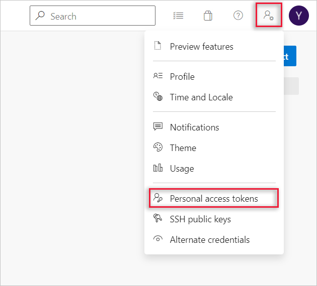
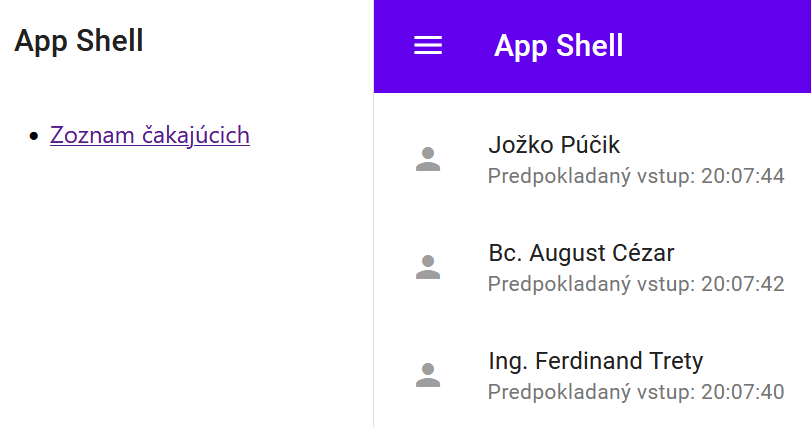

# Kontinuálne nasadenie pomocou nástroja Flux (lokálne do k8s v rámci Docker Desktop)

[Flux] patrí v súčasnosti medzi najpoužívanejšie nástroje na
kontinuálne nasadenie. Funguje na princípe _Pull Deployment_ a plne podporuje metódy
[GitOps]. V skratke, GitOps sa skladá z troch hlavných komponentov:

- IaC (Infrastructure as Code) - popis infraštruktúry (_deploymentu_) je uložený v
súboroch v git repozitári a slúži ako "jediný zdroj pravdy".
- MRs (Merge requests) - zmeny infraštruktúry sa dejú v kóde pomocou merge requestov. Typicky sa tu nastavuje povinné code review.
- CI/CD (Continuous Integration and Continuous Deployment) - automatická aktualizácia infraštruktúry je zabezpečovaná pomocou CI/CD.

[Flux] je založený na sade rozšírení [kubernetes API][k8s-api], tzv. [_Custom resources_][k8s-crd], ktoré
kontrolujú, ako sa zmeny v git repozitároch aplikujú do kubernetes klastra. Dva základné objekty, s ktorými budeme pracovať, sú:

- [`GitRepository`](https://fluxcd.io/docs/components/source/api/#source.toolkit.fluxcd.io/v1beta1.GitRepository) objekt - zrkadlí konfigurácie z daného git repozitára
- [`Kustomization`](https://fluxcd.io/docs/components/kustomize/api/#kustomize.toolkit.fluxcd.io/v1beta2.Kustomization) objekt - presne špecifikuje adresár v rámci repozitára a frekvenciu synchronizácie.

>warning:> `Flux Kustomization` objekt a `Kustomize Kustomization` objekt
> sú dva rôzne objekty. V ďalšom texte sa budú miešať, preto sa budeme na
> ne odvolávať vždy presne.

Na obrázku sú znázornené komponenty Flux.


Ukážeme si inštaláciu a konfiguráciu Flux na lokálnom kubernetes klastri, ktorý
poskytuje aplikácia Docker Desktop.

Na kubernetes klastri v dátovom centre (Azure, AWS, Google, ...) Flux nainštaluje administrátor daného klastra.

>info:> Na konci tejto kapitoly je obrázok, ktorý znázorňuje všetky komponenty tu spominané a ich vzájomné prepojenie.

## Inštalácia Flux CLI

Flux je možné nainštalovať [viacerými spôsobmi](https://fluxcd.io/docs/installation/).
My použijeme manažér SW balíkov [Chocolatey].

>$apple:> V prípade Mac OS a Linux môžeme použiť štandardného správcu balíkov. V prípade Mac OS napríklad Homebrew, použite `brew install fluxcd/tap/flux`. V tomto prípade netreba inštalovať Chocolatey.

1. Ak nemáte, nainštalujte [Chocolatey] podľa návodu na ich [stránke](https://chocolatey.org/install)
alebo zadajte nasledovný príkaz ako administrátor v Poweshell-i:

    ```ps
    Set-ExecutionPolicy Bypass -Scope Process -Force; [System.Net. ServicePointManager]::SecurityProtocol = [System.Net.ServicePointManager] ::SecurityProtocol -bor 3072; iex ((New-Object System.Net.WebClient). DownloadString('https://community.chocolatey.org/install.ps1'))
    ```

   Teraz môžeme používať utilitu `choco` z príkazového riadku na inštalovanie softvérových balíkov.

2. Zatvorte a znovu otvorte powershell (ako administrátor). Zadajte:

    ```ps
    choco install flux
    ```

   Po úspešnej inštalácii nám Flux poskytuje utilitu `flux` ako rozhranie na
   prácu z príkazového riadku. Nasledujúci príkaz vypíše verziu flux:

    ```ps
    flux -v
    ```

## Bootstraping Flux

Nasadíme Flux-ové komponenty do aktuálneho kubernetes klastra. Najprv sa vždy
uistite, že máte nastavený správny aktuálny klaster (kontext) a ak nie, zmeňte
ho na lokálny (docker-desktop).

```ps
kubectl config get-contexts
kubectl config use-context docker-desktop
```

1. V priečinku `webcloud-gitops` vytvorte priečinok `flux-system`. Vojdite do neho a vykonajte príkaz:

    ```ps
    flux install --export > gotk-components.yaml
    ```
 
    >warning:> Ak nefunguje (Chyba: _install failed: Rel: can't make..._), skúste ho
    > vykonať na disku C.  
    > POZOR, nezabudnite v tom prípade zadať celú cestu k
    > súboru, t.j. `D:\....\flux-system\gotk-components.yaml`. V niektorých   prípadoch môže byť nutné tento príkaz vykonať z privilegovaného shellu (_PowerShell->Run As Administrator_)

   Týmto príkazom sme zatiaľ Flux nenainštalovali (nenasadili) do klastra,
   iba sme vytvorili súbor `gotk-components.yaml`, ktorý obsahuje definície
   (manifesty) kubernetes objektov používaných Fluxom.

2. Nasadíme Flux do aktuálneho klastra. Vykonajte príkaz v priečinku `flux-system`:

    ```ps
    kubectl apply -f ./gotk-components.yaml
    ```

   Skontrolujte, či boli Flux radiče (_controllers_) naštartované a či je všetko v poriadku:

    ```ps
    flux check
    ```

   Ešte sa môžeme pozrieť, aké komponenty bežia v namespace `flux-system`:

    ```ps
    kubectl get all -n flux-system
    ```

   Vidíme, že boli nasadené 4 radiče bežiace v štyroch podoch - `source-controller`, `kustomize-controller`, `notification-controller` a `helm-controller`.

## Nastavenie zdojov a kustomizácií

1. Flux potrebuje prístup na repozitár, v ktorom sú/budú uložené konfigurácie (manifesty) kubernetes objektov. Najprv si vygenerujeme PAT (personal access token): prejdite na stránku `Azure DevOps`, do svojho _WebCloud_ projektu. Kliknite na ikonku postavy v pravom hornom rohu obrazovky a potom na `Personal access tokens`.

   

   Na ďalšej stránke vyberte `New Token`. Zadajte meno tokenu, napr. _Flux token_, Expiration na _Custom defined_ (dátum aspoň do konca semestra). V časti `Scopes` zadajte _Custom defined_ a vyberte iba v podčasti `Code` checkbox _Full Access_. Stlačte `Create` a __NEZABUDNITE SI ULOŽIŤ__ vygenerovaný PAT.

2. V kubernetes klastri vytvoríme zdroj - objekt typu `GitRepository`, ktorým Flux-u povieme, ktorý repozitár má sledovať. V podstate ide o jednoduchý manifest yaml, ale nemusíme ho písať sami - Flux ho vygeneruje za nás. V priečinku _webcloud-gitops_ vykonajte príkazy:

    ```ps
    $pat="<vygenerovaný personal access token>"
    $giturl="<cesta ku projektu na dev.azure.com>/_git/ambulance-gitops"
    $branch="main"
    flux create source git ambulance-gitops-repo --git-implementation=libgit2  --url=$giturl --branch=$branch --username=git --password=$pat --interval=60s 
    ```
 
    > Pokiaľ je vaša hlavná vetva nazvaná inak ako `main` - napríklad `master`,  použite príslušný názov pre hodnotu premennej `$branch`.

   Overíme si, že bol `git source` vytvorený:

    ```ps
    flux get sources all
    ```

   Vygenerujeme a uložíme si manifest do súboru - predpokladáme vykonávanie príkazu v priečinku `.../webcloud-gitops/flux-system`:

    ```ps
    flux export source git ambulance-gitops-repo > ambulance-gitops-repo.yaml
    ```

   Yaml súbor vyzerá nasledovne:

    ```yaml
    ---
    apiVersion: source.toolkit.fluxcd.io/v1beta1
    kind: GitRepository
    metadata:
      name: ambulance-gitops-repo
      namespace: flux-system
    spec:
      gitImplementation: libgit2
      interval: 1m0s
      ref:
        branch: main
      secretRef:
        name: ambulance-gitops-repo
      timeout: 20s
      url: <cesta ku projektu na dev.azure.com>/_git/ambulance-gitops
    ```

   Tento _GitRepository_ objekt s menom __ambulance-gitops-repo__ sleduje git repozitár na danej adrese (`url`) a každú minútu (`interval`) si urobí interný klon celého repozitára. Má nastavený 20s `timeout` na git operácie a na prihlásenie používa meno a heslo (PAT), uložené v `secret` objekte, ktorý bol vytvorený automaticky.

    > _Poznámka_: Odporúčame si PAT "zálohovať", v prípade, že sa niečo stane s celým klastrom a _secret_ bude vymazaný. Zálohovaný PAT použijeme v kapitole [Obnova lokálneho klastra v novom prostredí](./011b-obnovenie-klastra.md), kde si ukážeme, ako obnoviť lokálny klaster v prípade, že bol _secret_ vymazaný.

3. Vytvoríme objekt typu `Kustomization` (Flux), vysvetlenie bude neskôr:

    ```ps
    flux create kustomization ambulance-localhost-kustomization  --source=ambulance-gitops-repo --path="./clusters/localhost" --prune=true  --interval=40s
    ```

   A overíme, či bol vytvorený:

    ```ps
    flux get kustomizations
    ```

   Rovnako ako predtým, uložíme si vygenerovaný manifest do súboru:

    ```ps
    flux export kustomization ambulance-localhost-kustomization >  ambulance-localhost-kustomization.yaml
    ```

   Yaml súbor vyzerá nasledovne:

    ```yaml
    ---
    apiVersion: kustomize.toolkit.fluxcd.io/v1beta2
    kind: Kustomization
    metadata:
      name: ambulance-localhost-kustomization
      namespace: flux-system
    spec:
      interval: 40s
      path: ./clusters/localhost
      prune: true
      sourceRef:
        kind: GitRepository
        name: ambulance-gitops-repo
    ```

   Tento `Kustomization` objekt sa každých 40s (`interval`) pozrie, či sa zmenil obsah priečinka _clusters/localhost_ (`path`), prípadne súborov v ňom, v rámci repozitára, ktorý je definovaný objektom `GitRepository`. Ak áno, Flux porovná zmeny s posledným stavom a vykoná kubernetes príkazy, aby sa stav referencovaných objektov v klastri zhodoval s požadovaným stavom v priečinku. Ak v ňom nájde súbor _Kustomization.yaml_ (Kustomize type), použije iba ten.

   To znamená, že akonáhle sme vytvorili objekt `Kustomization` (flux), Flux sa pozrel do daného priečinku, našiel tam _kustomization.yaml_ (kustomize) a aplikoval ho do nášho klastra. Pozrime sa, aké objekty vytvoril v namespace __wac-hospital__.

    ```ps
    kubectl get all -n wac-hospital
    ```
  
   Výstup by mal byť podobný tomuto:

    ```plain
     NAME                                            READY   STATUS    RESTARTS   AGE
     pod/ambulance-ufe-deployment-64cfc4c9db-d46vq   1/1     Running   0          78m
     pod/ambulance-ufe-deployment-64cfc4c9db-f2cm7   1/1     Running   0          78m
     pod/ufe-controller-594bc6f989-45fjn             1/1     Running   0          78m
     pod/ufe-controller-594bc6f989-5b9jd             1/1     Running   0          78m
 
     NAME                     TYPE        CLUSTER-IP       EXTERNAL-IP   PORT (S)        AGE
     service/ambulance-ufe    ClusterIP   10.105.190.116   <none>        80/ TCP         78m
     service/ufe-controller   NodePort    10.96.155.129    <none>        80:30331/ TCP   78m
 
     NAME                                       READY   UP-TO-DATE   AVAILABLE   AGE
     deployment.apps/ambulance-ufe-deployment   2/2     2            2           78m
     deployment.apps/ufe-controller             2/2     2            2           78m
 
     NAME                                                  DESIRED   CURRENT    READY   AGE
     replicaset.apps/ambulance-ufe-deployment-64cfc4c9db   2         2          2       78m
     replicaset.apps/ufe-controller-594bc6f989             2         2          2       78m
    ```

   Pre každý z našich dvoch komponentov (ambulance-ufe a ufe-controller) boli vytvorené nasledovné objekty:
   - 1x service
   - 1x deployment
   - 1x replicaset (vytvorený automaticky pre každý deployment)
   - 2x pody (v deploymente sme mali uvedené 2 repliky)

   Zadajte do prehliadača adresu [http://localhost:30331/](http://localhost:30331/).
   Mali by ste vidieť stránku s aplikačnou obálkou s integrovanou mikro aplikáciou. Po stlačení na odkaz _Zoznam čakajúcich_ by ste mali vidieť nasledujúci výstup:

   

### Overenie funkcionality priebežného nasadenia

V princípe máme prvú verziu priebežného deploymentu hotovú. Ak sa teraz zmení niektorý z yaml manifestov vo `webcloud-gitops` repozitári (musí byť ale referencovaný z `.../webcloud-gitops/clusters/localhost` adresára), tak Flux zabezpečí, že sa zmeny automaticky prejavia aj v klastri. Vyskúšame si to.

V súbore `.../webcloud-gitops/apps/<pfx>-ambulance-ufe/deployment.yaml` zmeňte počet replík na 1, uložte zmeny a archivujte ich (_commit_ a _push_) do vzdialeného repozitára.

Po chvíli overte, že sa zmeny prejavili v klastri. Výstup nasledujúceho príkazu by mal ukazovať 1 pod s menom _ambulance-ufe-deployment_.

```ps
kubectl get pods -n wac-hospital
```
