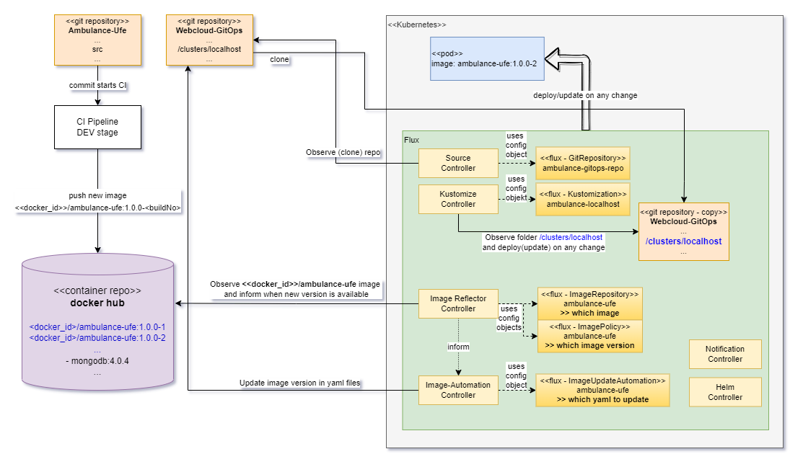

## Flux - sledovanie a aplikovanie zmien verzie docker obrazu

---

```ps
devcontainer templates apply -t registry-1.docker.io/milung/wac-ufe-008a
```

---

Teraz máme nasadenú `latest` verziu kontajnera (viď súbor `.../webcloud-gitops/apps/<pfx>-ambulance-ufe/deployment.yaml`). Keď vyrobíme novú verziu kontajnera, máme dve možnosti, ako ju automaticky nasadiť do klastra.

* Kontajner označíme jednoznačným tagom (napr. buildversion) a v rámci priebežnej integrácie pridáme krok, ktorý zmení spomínaný `deployment.yaml` a nastaví v ňom danú verziu kontajnera. Integračný krok upravený súbor _commit_-ne do repozitára, Flux zmenu zaregistruje a urobí zmeny v kubernetes klastri.
* Druhou možnosťou je, že nakonfigurujeme Flux tak, aby sledoval zmeny kontajnera na portáli DockerHub a aby zobral novú verziu, ak je k dispozícii. Flux v tom prípade sám modifikuje `deployment.yaml` a nastaví v ňom poslednú vhodnú verziu kontajnera.

Ukážeme si druhú možnosť.

Všimnite si, že princíp GitOps (_jediný zdroj pravdy je git repo_) zostáva zachovaný. Až po zmene verzie docker obrazu v yaml súbore nastane aktualizácia v klastri.

1. Podporu pre monitorovanie Docker Image Repozitára poskytuje Flux len v beta verzii a nie je nainštalovaná implicitne. Ešte raz deploynite Flux do svojho klastra s pridanými komponentami a prepíšte pôvodnú konfiguráciu. Vykonajte v priečinku `.../webcloud-gitops`:

    ```ps
    flux install --components-extra=image-reflector-controller, image-automation-controller --export > ./flux-system/gotk-components.yaml
    ```

    >build_circle:> Ak nefunguje (Chyba: _install failed: Rel: can't make..._), skúste ho
    > vykonať na disku C.  
    > POZOR, nezabudnite v tom prípade zadať celú cestu k
    > súboru, napr `C:\....\flux-system\gotk-components.yaml` a príkaz vykonajte v privilegovanom shell-i.

   Aktualizujeme Flux v aktuálnom klastri. Vykonajte príkaz:

    ```ps
    kubectl apply -f ./flux-system/gotk-components.yaml
    ```

   Skontrolujte, či boli Flux kontrolery naštartované a či je všetko v poriadku:

    ```ps
    flux check
    ```

2. Teraz nastavíme, ktorý docker obraz má Flux sledovať. Náš _ambulance-ufe_ docker obraz je verejne prístupný, tzn. že nie je treba riešiť autentifikáciu. Vytvorte súbor `.../webcloud-gitops/flux-system/ambulance-ufe-image-repo.yaml` s obsahom:

    ```yaml
    apiVersion: image.toolkit.fluxcd.io/v1beta1
    kind: ImageRepository
    metadata:
      name: ambulance-ufe
      namespace: flux-system
    spec:
      image: <vase-docker-id>/ambulance-ufe
      interval: 1m0s
    ```

    >warning:> Zameňte vase-docker-id !

   A aplikujte komponent do klustra (Fluxu):

    ```ps
    kubectl apply -f flux-system/ambulance-ufe-image-repo.yaml
    ```

3. Ďalší Flux komponent `ImagePolicy` nastavuje kritérium, podľa ktorého sa vyberie verzia docker obrazu. Vytvorte súbor `.../webcloud-gitops/flux-system/ambulance-ufe-image-policy.yaml` s obsahom:

    ```yaml
    apiVersion: image.toolkit.fluxcd.io/v1beta1
    kind: ImagePolicy
    metadata:
      name: ambulance-ufe
      namespace: flux-system
    spec:
      imageRepositoryRef:
        name: ambulance-ufe
      policy:
        semver:
          range: '^1.0.0-0'  # selects latest version matching 1.0.0-<number>
    ```

    A aplikujte komponent do klastra (Fluxu):

    ```ps
    kubectl apply -f ./flux-system/ambulance-ufe-image-policy.yaml
    ```

    Skontrolujeme, aká verzia docker obrazu bola vybraná:

    ```ps
    flux get image policy ambulance-ufe
    ```

    Výpis by mal obsahovať riadok:

    ```bash
    imagepolicy/ambulance-ufe       True    Latest image tag for '<docker_id>/ambulance-ufe' resolved to: 1.0.0-<posledne cislo buildu>
    ```

4. Upravíme všetky súbory, kde chceme aby Flux aktualizoval verziu docker obrazu. Robí sa to pridaním špeciálneho markeru `_# {"$imagepolicy": "POLICY_NAMESPACE:POLICY_NAME"}_` na riadok, ktorý sa má upravovať. V našom prípade by sme mohli upraviť súbor `.../webcloud-gitops/apps/<pfx>-ambulance-ufe/deployment.yaml` a všetko by fungovalo, ale ovplyvnilo by to všetky klastre, kde by sme ho použili (a "nepreťažili" cez Kustomize na vyššej úrovni).

    Preto upravíme súbor `.../webcloud-gitops/clusters/localhost/kustomization.yaml`. Na koniec súboru pridajte:

     ```yaml
     # the markers (comments) below, marks the lines which will be automatically  updated by flux
     images:
     - name: <docker_id>/ambulance-ufe
       newName: <docker_id>/ambulance-ufe # {"$imagepolicy":  "flux-system:ambulance-ufe:name"}
       newTag: 1.0.0-1 # {"$imagepolicy": "flux-system:ambulance-ufe:tag"}
     ```

    Týmto spôsobom cez kustomizáciu upravíme všetky miesta v referencovaných yaml súboroch, kde sa nachádza obraz `<docker_id>/ambulance-ufe`. Flux môže zmeniť meno obrazu a jeho tag. V našom prípade meno obrazu nemeníme, budeme meniť len tag.

    >info:> Súborov s markerom može byť viac, podporované sú kubernetes natívne typy (Deployment, StatefulSet, DaemonSet, CronJob) aj custom resources (Helm, Kustomize...).

5. Vytvoríme nový komponent `ImageUpdateAutomation`, kde zadefinujeme miesto, kde sa nachádzajú súbory, ktoré sa majú modifikovať. Vytvorte súbor  `.../webcloud-gitops/flux-system/ambulance-ufe-imageupdateautomation.yaml` s obsahom:

     ```yaml
     apiVersion: image.toolkit.fluxcd.io/v1beta1
     kind: ImageUpdateAutomation
     metadata:
       name: ambulance-ufe
       namespace: flux-system
     spec:
       interval: 1m0s
       sourceRef:
         kind: GitRepository
         name: ambulance-gitops-repo
       git:
         checkout:
           ref:
             branch: main
         commit:
           author:
             email: fluxcdbot@users.noreply.github.com
             name: fluxcdbot
           messageTemplate: '{{range .Updated.Images}}{{println .}}{{end}}'
         push:
           branch: main
       update:
         path: ./clusters/localhost
         strategy: Setters
     ```
 
     >warning:> Pokiaľ používate `master` vetvu alebo inú, upravte názov pri položkách `main`

    Tento objekt bude v rámci git repozitára `ambulance-gitops-repo` vo vetve `main` a priečinku `/clusters/localhost` aktualizovať všetky súbory, v ktorých nájde spomínaný marker. Súbory potom archivuje. Nová verzia repozitára bude obsahovať komentár špecifikovaný v časti `commit`.

    Archivujte zmeny a synchronizujte so vzdialeným repozitárom. Toto musíme urobiť predtým, ako aplikujeme komponent do klastra, lebo musíme dostať do repozitára zmeny kustomization.yaml z bodu 4.

    Následne aplikujte komponent do klustra:

     ```ps
     kubectl apply -f flux-system/ambulance-ufe-imageupdateautomation.yaml
     ```

    Ak máte na DockerHub novšiu verziu obrazu ako 1.0.0-1, ktorú sme špecifikovali v `.../webcloud-gitops/clusters/localhost/kustomization.yaml`, tak by sa mala po chvíli v klastri automaticky zvýšiť na poslednú. Skontroluje komity v gitops repozitári.

    Vyskúšame celý CI/CD cyklus explicitne. Zmeňte niečo v kóde `ambulance-ufe` komponentu, napr. pridajte ďalšieho pacienta do zoznamu, komitnite a synchronizujte zmeny. Po chvíli, keď prebehne CI a vytvorí sa nový obraz na DockerHub-e, skontrolujte históriu vo _webcloud-gitops_ repozitári a potom zadajte v prehliadači adresu [http://localhost:30331/](http://localhost:30331/) a pozrite zoznam pacientov.

Pre lepšie pochopenie sú na nasledujúcom obrázku znázornené komponenty spomínané v tejto kapitole a ich vzájomné prepojenie.

  

>info:> Samotný Flux sa väčšinou inštaluje s prihliadnutím na GitOps, tzn. jeho konfigurácia je uložená v git repozitári a všetky zmeny sú automaticky reflektované v klastri, v ktorom je nainštalovaný. V našej ukážke sme to nerobili, aby sme veci zbytočne nekomplikovali. V podstate by stačilo vytvoriť ešte jednu kustomizáciu (Flux), ktorá by ukazovala na priečinok `.\flux-system` a umiestniť ju do toho istého priečinku. Priečinok už obsahuje všetky potrebné konfigurácie. Následne, akákoľvek zmena v nich by bola automaticky zohľadnená v klastri.
> V rámci cvičenia si skúste túto Kustomization vyrobiť.
