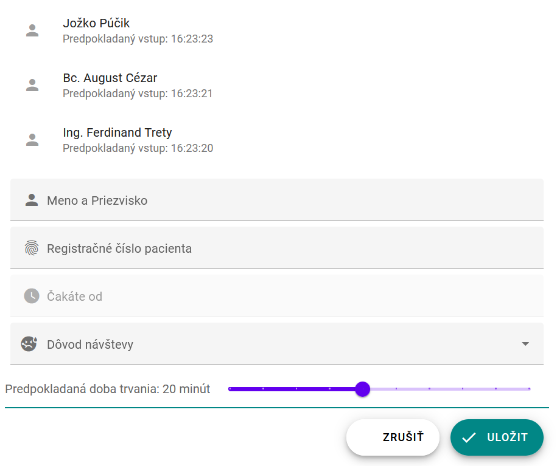

## Editor položiek a navigácia

Po úvodných krokoch, ktoré nám pomôžu automatizovať našu prácu počas ďalšieho vývoja, budeme
teraz pokračovať v implementácii funkcionality našej mikro aplikácie. V tejto časti budeme riešiť, ako pridávať a navigovať sa medzi jednotlivými položkami.

1. Vytvoríme nový komponent pre náš editor. Prejdite do priečinku `.../ambulance-list` a vykonajte nasledujúci príkaz:

     ```ps
     npm run generate
     ```

    Ako meno elementu zvolte `<pfx>-ambulance-wl-editor` a pri ďalších otázkach zvoľte predvolené možnosti. V adresári `.../ambulance-list/src/components/<pfx>-ambulance-wl-editor` máme teraz predpripravenú šablónu pre náš nový komponent.

    Ďalej nainštalujte knižnice pre nové Material Design elementy, ktoré budeme používať

     ```ps
     npm install --save-dev @material/mwc-textfield @material/mwc-select @material/ mwc-slider @material/mwc-fab @material/mwc-button
     ```

2. Upravte súbor `.../ambulance-list/src/components/<pfx>-ambulance-wl-editor/<pfx>-ambulance-wl-editor.tsx`:

    ```tsx
    import { Component, Host, h, Prop } from '@stencil/core';
    
    @Component({
      tag: '<pfx>-ambulance-wl-editor',
      styleUrl: '<pfx>-ambulance-wl-editor.css',
      shadow: true,
    })
    export class <Pfx>AmbulanceWlEditor {
    
      @Prop()
      duration: number = 15;
 
      handleSliderInput(event: Event )
      {
          this.duration = +(event.target as HTMLInputElement).value;
      }
    
      render() {
        return (
          <Host>
            <mwc-textfield icon="person" label="Meno a Priezvisko"></mwc-textfield>
            <mwc-textfield icon="fingerprint" label="Registračné číslo pacienta"></ mwc-textfield>
            <mwc-textfield icon="watch_later" label="Čakáte od" disabled></ mwc-textfield>
            <mwc-select icon="sick" label="Dôvod návštevy">
              <mwc-list-item value="folowup">Kontrola</mwc-list-item>
              <mwc-list-item value="nausea">Nevoľnosť</mwc-list-item>
              <mwc-list-item value="fever">Teploty</mwc-list-item>
              <mwc-list-item value="ache-in-throat">Bolesti hrdla</mwc-list-item>
            </mwc-select>
            <div class="duration-slider">
              <span class="label">Predpokladaná doba trvania:&nbsp; </span>
              <span class="label">{this.duration}</span>
              <span class="label">&nbsp;minút</span>
              <mwc-slider discrete withTickMarks step="5" max="45" value={this. duration} 
                oninput={this.handleSliderInput.bind(this)}></mwc-slider>
            </div>
             <div class="actions">
               <mwc-button id="delete"  icon="delete" label="Zmazať"></mwc-button>
               <span class="stretch-fill"></span>
               <mwc-button id="cancel" label="Zrušiť"></mwc-button>
               <mwc-button id="confirm" icon="save" label="Uložiť"></mwc-button>
             </div>
          </Host>
        );
      }   
    }
    ```

   V kóde si všimnite zverejnenú vlastnosť nášho elementu `duration` a spôsob, akým pri zmene hodnoty `mwc-slider` elementu túto vlastnosť nastavíme na aktuálnu hodnotu. Označenie premennej dekorátorom `@Prop` alebo `@State` zabezpečí, že sa pri zmene ich hodnoty znovu vykreslí náš element s aktuálnymi hodnotami. Neskôr obdobným spôsobom zabezpečíme prenos údajov z/do ostatných vstupných elementov.

   Ďalej upravte súbor `.../ambulance-list/src/components/<pfx>-ambulance-wl-editor/<pfx>-ambulance-wl-editor.css`:

    ```css
    :host {
      display: block;
    }
    
    mwc-textfield, mwc-select,  mwc-button {
      margin: 1ex;
      display: block;
    }
    
    .duration-slider {
      display: flex;
      align-content: space-around;
    }
    
    .duration-slider .label {
      flex: 0 0 auto;
      font-size: var(--mdc-typography-subtitle1-font-size, 1rem);  
      color: var(--mdc-text-field-label-ink-color, rgba(0, 0, 0, 0.6));
      font-family: Roboto;
      align-self: center;
    }
    
    mwc-slider {
      display: inline-block;
      flex: 1 1 auto;
      min-width: 30ex; 
    }
    
    mwc-button#cancel{ 
     --mdc-theme-primary: black;
    }
    
    .actions {
      display: flex;
      justify-content: flex-end;
    
      border-top: 2px solid var(--mdc-theme-secondary, #018786);
      padding-top: 1ex;
    }
    
    .stretch-fill {
      flex: 10 0 0;
    }
    ```

   Upravte súbor `.../ambulance-list/src/utils/global.ts` tak, aby obsahoval závislosti na nové _Material Design_ komponenty

    ```ts
    import '@material/mwc-list'; 
    import '@material/mwc-icon';
    import '@material/mwc-textfield';
    import '@material/mwc-select';
    import '@material/mwc-slider';
    import '@material/mwc-fab';
    import '@material/mwc-button';
 
    export default function() { // or export default async function()
      // components initialization code
    }
    ```

   Nakoniec prejdite do súboru `.../ambulance-list/src/index.html` a upravte telo html stránky do podoby

    ```html
    ...
    <body>
         <<pfx>-ambulance-wl-list></<pfx>-ambulance-wl-list>
         <<pfx>-ambulance-wl-editor></<pfx>-ambulance-wl-editor>
    </body>
    ...
    ```

   V priečinku `.../ambulance-list` vykonajte príkaz:

    ```ps
    npm run start
    ```

   V prehliadači otvorte stránku [http://localhost:3333/](http://localhost:3333/), na ktorej uvidíte oba vytvorené komponenty

   

    Skontrolujte funkčnosť jednotlivých elementov. Momentálne máme oba komponenty dizajnovo navrhnuté, teraz musíme naimplementovať aplikačnú logiku aplikácie. V prvom rade chceme, aby bol každý z týchto komponentov zobrazený na samostatných podstránkach (v zmysle SPA - to znamená bez načítavania stránky z web servera). Na to budeme potrebovať nový komponent, ktorý v závislosti od aktuálnej adresy stránky zobrazí príslušný komponent.

3. Aby sme umožnili navigáciu medzi našimi dvoma komponentami, použijeme knižnicu [stencil-router-v2](https://github.com/ionic-team/stencil-router-v2). V zásade sa ale len jedná o dynamické zobrazovanie jedného z uvedených komponentov v závislosti od aktuálnej lokácie. Keďže naše komponenty sú vnorené v hierarchii stránok, musíme tiež riešiť problém odstránenia základnej cesty k nášmu komponentu.

   V priečinku `.../ambulance-list` vykonajte príkaz

    ```ps
    npm install stencil-router-v2 --save-dev
    ```

   a vygenerujte nový komponent `<pfx>-ambulance-wl-app`

    ```ps
    npm run generate
    ```

   Upravte súbor `.../ambulance-list/src/components/<pfx>-ambulance-wl-app/<pfx>-ambulance-wl-app.tsx` do tvaru (nahraďte `<pfx>` vaším prefixom)

    ```tsx
    import { Component, Host, h, Prop } from '@stencil/core';
    import { createRouter, Route, match } from 'stencil-router-v2';
    
    @Component({
      tag: '<pfx>-ambulance-wl-app',
      styleUrl: '<pfx>-ambulance-wl-app.css',
      shadow: true,
    })
    export class <Pfx>AmbulanceWlApp { 
      @Prop({ attribute: "base-path" }) basePath: string = "";
      
      @Prop() ambulance: string = "";
 
      static Router;
    
      connectedCallback() { 
        <Pfx>AmbulanceWlApp.Router = <Pfx>AmbulanceWlApp.Router || createRouter();
      }
    
      // rebases path relative to base-path property
      rebase(path): string {
        if(this.basePath.endsWith("/")) {
          this.basePath = this.basePath.substring(0, this.basePath.length-1);
        }
        return this.basePath + path;
      }
    
      render() {
        return (
          <Host>
            <<Pfx>AmbulanceWlApp.Router.Switch>
              <Route
                path={match(this.rebase("/entry/:id"))}
                render={(params) => (
               <<pfx>-ambulance-wl-editor entry-id={params.id} ></ <pfx>-ambulance-wl-editor>
                )}
              />
              <Route
                path={this.rebase("/")}>
                <<pfx>-ambulance-wl-list></<pfx>-ambulance-wl-list>
              </Route>
              <Route 
                path={this.rebase("")} to={this.rebase("/")}> 
              </Route>
            </<Pfx>AmbulanceWlApp.Router.Switch>
          </Host>
        );
      }  
    }
    ```

   Ďalej upravte v súbore `.../ambulance-list/src/index.html` telo stránky do tvaru:

    ```html
    <body>
          <pfx-ambulance-wl-app base-path="/ambulance-wl/" ambulance="bobulova"></ pfx-ambulance-wl-app>
    </body>
    ```

   Pokiaľ nie je aktívny, tak naštartujte vývojový web server (`npm run start`) a v prehliadači prejdite na stránku  [http://localhost:3333/ambulance-wl](http://localhost:3333/ambulance-wl), kde uvidíte komponent so zoznamom čakajúcich. Následne prejdite na stránku  [http://localhost:3333/ambulance-wl/entry/0](http://localhost:3333/ambulance-wl/entry/0), kde uvidíte komponent editácie jednotlivých záznamov.

4. Upravte testovacie súbory tak, aby sme mohli odovzdať naše zmeny do projektu. Otvorte a upravte súbor `.../ambulance-list/src/components/<pfx>-ambulance-wl-app/test/<pfx>-ambulance-wl-app.spec.tsx` do tvaru:

    ```ts
    import { newSpecPage } from '@stencil/core/testing';
    import { <Pfx>AmbulanceWlApp } from '../<pfx>-ambulance-wl-app';
    
    describe('<pfx>-ambulance-wl-app', () => {
    
      it('renders editor', async () => {
        <Pfx>AmbulanceWlApp.Router = null;
        const page = await newSpecPage({
          url: `http://localhost/ambulance-wl/entry/@new`,
          components: [<Pfx>AmbulanceWlApp],
          html: `<<pfx>-ambulance-wl-app ambulance={this.ambulance}  base-path="/ ambulance-wl"></<pfx>-ambulance-wl-app>`,
        });
        const child = await page.root.shadowRoot.firstElementChild;
        expect(child.tagName.toLocaleLowerCase()).toEqual ("<pfx>-ambulance-wl-editor");
        
      });
    
      it('renders list', async () => {
        <Pfx>AmbulanceWlApp.Router = null;
        const page = await newSpecPage({
          url: `http://localhost/ambulance-wl/`,
          components: [<Pfx>AmbulanceWlApp],
          html: `<<pfx>-ambulance-wl-app ambulance={this.ambulance}  base-path="/ ambulance-wl"></<pfx>-ambulance-wl-app>`,
        });
        const child = await page.root.shadowRoot.firstElementChild;
        expect(child.tagName.toLocaleLowerCase()).toEqual("<pfx>-ambulance-wl-list");
        
      });
    });
    ```

   Ďalej upravte súbor `.../ambulance-list/src/components/<pfx>-ambulance-wl-editor/test/<pfx>-ambulance-wl-editor.spec.tsx`

    ```ts
    import { newSpecPage } from '@stencil/core/testing';
    import { <Pfx>AmbulanceWlEditor } from '../<pfx>-ambulance-wl-editor';
    
    describe('<pfx>-ambulance-wl-editor', () => {
      it('displays 3 buttons', async () => {
        const page = await newSpecPage({
          components: [<Pfx>AmbulanceWlEditor],
          html: `<<pfx>-ambulance-wl-editor entry-id="@new"></ <pfx>-ambulance-wl-editor>`,
        });
        const items = await page.root.shadowRoot.querySelectorAll("mwc-button");
        expect(items.length).toEqual(3);
      });
    });
    ```

   Archivujte zmeny a synchronizujte so vzdialeným repozitárom.

    >info:> Zabezpečenie prepojenia adresy stránky - URL jednotlivých záznamov - s aktuálnym záznamom, je pri vývoji _Single  Page Web Application_ dôležitý koncept. Používateľovi to umožňuje vytváranie záložiek, ku ktorým sa môže neskôr  vrátiť, alebo zdieľanie URL, ktorá ukazuje k špecifickému záznamu.
    >info:> Funkcia rebase je v tomto prípade pomerne jednoduchá, v niektorých prípadoch však môže vyžadovať použitie  regulárnych výrazov alebo dodatočnej logiky, napríklad, ak by základná cesta obsahovala variabilný index ambulancie.
