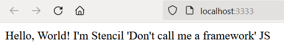

## Kostra aplikácie

---

>info:>
Šablóna pre predvytvorený kontajner ([Detaily tu](../99.Problems-Resolutions/01.development-containers.md)):  
`registry-1.docker.io/milung/wac-ufe-010`

---

V tejto kapitole vytvoríme základnú kostru našej aplikácie. Jej funkcionalita bude síce limitovaná, ale umožní nám
pripraviť si projektové prostredie s nevyhnutnou automatizáciou tak, aby sme sa pri ďalšom postupe mohli sústrediť na vývoj
a evolúciu našej aplikácie a nechali automaty vykonávať opakujúce sa kroky súvisiace s integráciou a nasadením našej aplikácie.

Pri tejto aplikácii budeme využívať knižnicu [Stencil JS][stencil], pomocou ktorej budeme vytvárať web komponenty reprezentujúce náš mikro front end. Pre detailnejšie porozumenie knižnice odporúčame preštudovať si dokumentáciu ku knižnici, ktorá je relatívne krátka a nenáročna na pochopenie. Pokiaľ sa chcete bližšie zoznámiť s technológiou web komponentov, odporúčame naštudovať si [materiály tu][webc].

1. Otvorte aplikáciu Visual Studio Code a v nej nový terminál
  (menu `Terminal->New Terminal`)

2. V príkazovom riadku prejdite do priečinku `${WAC_ROOT}` vyhradenom pre cvičenia v tomto predmete.

3. Vykonajte príkaz pre vytvorenie nového projektu založeného na StencilJS knižnici:

   ```ps
   npm init stencil
   ```

   >info:> V rámci vykonávania tohto príkazu vám budú doinštalované chýbajúce knižnice pre vytvorenie projektu.

   Ako druh projektu zvoľte `component` a ako meno `ambulance-ufe`. StencilJS umožňuje vytvoriť aj samostatnú SPA/PWA aplikáciu, v našom prípade máme ale záujem iba o vytvorenie
   sady webových komponentov, ktoré budeme používať v spoločnej aplikácii. Z praktického
   hľadiska je rozdiel najmä vo vytváraní konečného balíka pre nasadenie našej aplikácie/webového komponentu.

   Po ukončení príkazu je v pracovnom priečinku vytvorený nový priečinok  `ambulance-ufe`, ktorý obsahuje kostru aplikácie. V ňom  nájdete súbor `package.json`, ktorý popisuje základné atribúty
   projektu, ako jeho názov, meno autora, verziu, a podobne. Ďalej obsahuje zoznam
   knižníc `dependencies` potrebných počas nasadenia aplikácie, a tiež zoznam knižníc
   `devDependencies` potrebných počas vývoja aplikácie. Dalšou dôležitou sekciou v
   tomto súbore je objekt `scripts`, ktorý popisuje príkazy často používané pri vývoji.
   Tieto príkazy možno vykonať pomocou príkazu `npm run <názov-skriptu>` a je tu možné
   doplniť aj vlastné príkazy podľa potreby vývojového tímu.
   Ďalším dôležitým súborom je `stencil.config.ts`. Tento súbor popisuje nastavenia projektu,
   ktoré sa využívajú počas kompilácie, vývoja a generovania komponentov projektu. Pri inicializácii
   obsahuje najmä základné nastavenie variantov - `outputTargets` generovaných počas kompilácie projektu.
   Ďalšími vytvorenými adresármi sú adresár zdrojových súborov `src` a adresár `node_modules` obsahujúci externé knižnice/moduly, od ktorých je naša aplikácia závislá. Priečinok `node_modules` je potrebné vynechať z riadenia verzií zdrojového kódu, to znamená pridať do `.gitignore` súboru.

4. Takto vytvorená kostra programu obsahuje funkčný `Hello world` komponent. Prejdite do priečinka `${WAC_ROOT}/ambulance-ufe` a zadajte príkazy

   ```ps
   npm install
   npm run start
   ```

   Prvý príkaz nainštaluje knižnice, na ktorých je náš projekt závislý a druhý  príkazspustí aplikáciu. Po chvíli môžete v prehliadači vidieť výstup tejto aplikácie

   

   >build_circle:> Pokiaľ sa Vám pri vykonávaní príkazu objavý chyba odkadzujúca  na `Puppeteer` postupujte podľa pokynov v kapitole [Riešenie problémov](../99.Problems-Resolutions/02.puppeteer.md). Dočasne môžete tento problém  opraviťnastavením premennej prostredia `PUPPETEER_SKIP_CHROMIUM_DOWNLOAD` na  hodnotu `true`:
   >
   > ```ps
   > $env:PUPPETEER_SKIP_CHROMIUM_DOWNLOAD="true"
   > ```

5. Teraz vytvoríme prvý web komponent, ktorý bude zobrazovať zoznam čakajúcich pacientov na vyšetrenie. Vizuálny dizajn vychádza zo štýlu [Material Design](https://material.io/).

    Prejdite do priečinka aplikácie `ambulance-ufe` a nainštalujte knižnice web komponentov pre
    Material Design:

    ```ps
    npm install -s @material/web
    ```

    Voľba `-s` znamená, že knižnica bude nainštalovaná ako závislosť aplikácie, čo znamená, že bude súčasťou balíka, ktorý bude nasadený na server. Alternatívna voľba `-D` by znamenala, že knižnica je potrebná iba počas vývoja, ale nie je potrebná počas nasadenia aplikácie. Toto rozlišovanie je dôležité najmä pri vytváraní balíka web komponentov a jeho zverejnení v registry [npmjs.com]. Pri následnom použití
    takéhoto balíka v inom projekte, budú automaticky nainštalované iba knižnice, ktoré sú pridané ako potrebné pre beh aplikácie, ale nie knižnice pridané ako potrebné iba počas vývoja nášho `ambulance-ufe` balíka. Bližšie informácie o zverejnňovaní balíkov nájdete v [dokumentácii](https://stenciljs.com/docs/publishing).

    Následne vytvorte nový web komponent príkazom

    ```ps
    npm run generate
    ```

    Budete vyzvaný na zadanie mena komponentu, zvoľte meno `<pfx>-ambulance-wl-list`. Text `<pfx>` nahraďte svojimi iniciálami alebo iným identifikátorom, ktorý odlíši Vaše web komponenty od ostatných cvičiacich.

    >info:> V texte budeme ďalej používať tento text `<pfx>` ako identifikáciu, ktorá musí byť jednotne nahradená. Tento prefix je dôležitý pre nasadenie web komponentu do spoločného klastra, kde by v prípade konfliktu mohlo dôjsť k nepredvídateľnému správaniu sa.

    Potvrďte voľbu a aj nasledujúcu otázku ohľadne ďalších súborov pre vytváraný web komponent. Teraz máte vytvorený nový web komponent v priečinku `${WAC_ROOT}/ambulance-ufe/src/components/<pfx>-ambulance-wl-list`

6. Otvorte súbor `${WAC_ROOT}/ambulance-ufe/src/components/<pfx>-ambulance-wl-list/<pfx>-ambulance-wl-list.tsx` a pridajte metódu `getWaitingPatientsAsync` a atribút `waitingPatients`:
  
    ```tsx
    import { Component, Host, h } from '@stencil/core';
    
    @Component({
      tag: '<pfx>-ambulance-wl-list',
      styleUrl: '<pfx>-ambulance-wl-list.css',
      shadow: true,
    })
    export class <Pfx>AmbulanceWlList {
 
      waitingPatients: any[]; @_add_@
      @_add_@
      private async getWaitingPatientsAsync(){  @_add_@
        return await Promise.resolve(  @_add_@
          [{  @_add_@
              name: 'Jožko Púčik',  @_add_@
              patientId: '10001',  @_add_@
              since: new Date(Date.now() - 10 * 60).toISOString(),  @_add_@
              estimatedStart: new Date(Date.now() + 65 * 60).toISOString(),  @_add_@
              estimatedDurationMinutes: 15,  @_add_@
              condition: 'Kontrola'  @_add_@
          }, {  @_add_@
              name: 'Bc. August Cézar',  @_add_@
              patientId: '10096',  @_add_@
              since: new Date(Date.now() - 30 * 60).toISOString(),  @_add_@
              estimatedStart: new Date(Date.now() + 30 * 60).toISOString(),  @_add_@
              estimatedDurationMinutes: 20,  @_add_@
              condition: 'Teploty'  @_add_@
          }, {  @_add_@
              name: 'Ing. Ferdinand Trety',  @_add_@
              patientId: '10028',  @_add_@
              since: new Date(Date.now() - 72 * 60).toISOString(),  @_add_@
              estimatedStart: new Date(Date.now() + 5 * 60).toISOString(),  @_add_@
              estimatedDurationMinutes: 15,  @_add_@
              condition: 'Bolesti hrdla'  @_add_@
          }]  @_add_@
        );  @_add_@
      }  @_add_@
      
      render() {
       ...
      }
    }
    ```

    Metóda `getWaitingPatientsAsync()` je zatiaľ implementovaná ako náhrada prístupu k REST API mikroslužbe a vracia statický zoznam čakajúcich. Prístup k API budeme neskôr upravovať. Dôležité je si uvedomiť, že sa bude jednať o asynchrónny prístup k vzdialenej  službe, preto hneď pracujeme s  predpokladom, že táto metóda je asynchrónna a vracia [Promise] objekt (alebo takzvaný `then-able object`).

    Ďalej pridajte metódu `componentWillLoad()`, ktorá bude volaná pred prvým renderovaním web komponentu. V tejto metóde voláme metódu `getWaitingPatientsAsync()` a výsledok priradíme do atribútu `waitingPatients`. Vďaka tomu bude web komponent inicializovaný s aktuálnym
    zoznamom čakajúcich pacientov.

    ```tsx
    import { Component, Host, h } from '@stencil/core';
 
    @Component({
      tag: '<pfx>-ambulance-wl-list',
      styleUrl: '<pfx>-ambulance-wl-list.css',
      shadow: true,
    })
    export class <Pfx>AmbulanceWlList {
 
      waitingPatients: any[];
    
      private async getWaitingPatientsAsync(){
        ...
      }

      async componentWillLoad() {@_add_@
        this.waitingPatients = await this.getWaitingPatientsAsync();@_add_@
      }@_add_@
     
      render() {
        ...
      }
    }
    ```

    Následne upravte obsah metódy `render()`, pridajte potrebné závislosti na komponenty z knižnice `@material/web`
    a pridajte pomocnú funkciu `isoDateToLocale()`, ktorá prevádza ISO formát dátumu na lokálny formát dátumu a času. Táto funkcia bude použitá pri zobrazovaní času vstupu pacienta do čakárne.

    ```tsx
    import { Component, Host, h } from '@stencil/core';
    import '@material/web/list/list'  @_add_@
    import '@material/web/list/list-item'   @_add_@
    import '@material/web/icon/icon' @_add_@
    
    @Component({
      tag: '<pfx>-ambulance-wl-list',
      styleUrl: '<pfx>-ambulance-wl-list.css',
      shadow: true,
    })
    export class <Pfx>AmbulanceWlList {
      ....
 
      render() {
        return (
          <Host>
          <slot></slot> @_remove_@

           <md-list>   @_add_@
              {this.waitingPatients.map(patient =>    @_add_@
                <md-list-item>   @_add_@
                  <div slot="headline">{patient.name}</div>   @_add_@
                  <div slot="supporting-text">{"Predpokladaný vstup: " + this.isoDateToLocale(patient.estimatedStart)}</div>   @_add_@
                    <md-icon slot="start">person</md-icon>   @_add_@
                </md-list-item>   @_add_@
              )}   @_add_@
            </md-list>   @_add_@
          </Host>
        );
      }

      private isoDateToLocale(iso:string) {@_add_@
        if(!iso) return '';@_add_@
        return new Date(Date.parse(iso)).toLocaleTimeString()@_add_@
      }@_add_@
    }
    ```

    Metóda `render()` slúži na vykreslenie obsahu webového komponentu. K tomu použijeme  syntax [JSX][jsx], ktorá umožňuje vkladať HTML kód priamo do kódu webového komponentu. Element `<Host>` je špeciálny element informujúci kompilátor [Stencil JS](https://stenciljs.com/docs/compiler-api), že  ďalší obsah je uvedený v rámci hosťujúceho elementu. Elementy `md-list`, `md-icon` a ďalšie s  prefixom `md-` sú z knižnice webových komponentov [Material Design Web Components][md-webc]. 

    Venujte pozornosť špeciálnemu atribútu [`slot`](https://developer.mozilla.org/en-US/docs/Web/HTML/Element/slot). Meno slotu je určené samotným webovým komponentom a  informuje ho, že element s týmto atribútom je určený pre príslušný slot - napríklad `slot="start"` určuje, že element `md-icon` sa má zobraziť na pozícii určenej pre grafický identifikátor položky  zoznamu.

    Metódy `componentWillLoad()` a `render()` sú [metódami životného cyklu](https://stenciljs.com/docs/component-lifecycle) web componentu v knižnici [Stencil JS][stencil]. Tieto metódy  (okrem `render()`) môžu vrátiť ako návratovú hodnotu objekt typu `Promise` a byť vykonávane asynchrónnym spôsobom. V našom prípade v metóde `componentWillLoad()` načítame a zapamätáme si zoznam čakajúcich v čakárni.

    Takýmto spôsobom sme zadefinovali svoj prvý web komponent.

7. Aby sme mohli efektívne použiť dizajnový štýl [Material Design] musíme načítať do aplikácie príslušné fonty. Upravte súbor `.../ambulance-ufe/src/index.html` a pridajte do hlavičky HTML dokumentu nasledujúce riadky:

    ```html
    <!DOCTYPE html>
    <html dir="ltr" lang="en">
       <head>
          <meta charset="utf-8" />
          <meta name="viewport" content="width=device-width, initial-scale=1.0, minimum-scale=1.0, maximum-scale=5.0" />
          <link href="https://fonts.googleapis.com/css?family=Roboto:300,400,500" rel="stylesheet"> @_add_@
          <link href="https://fonts.googleapis.com/css2?family=Material+Symbols+Outlined" rel="stylesheet" /> @_add_@
          <title>Ambulance Waiting List Tester</title>
          <script type="module" src="/build/ambulance-ufe.esm.js"></script>
          <script nomodule src="/build/ambulance-ufe.js"></script>
       </head>
       
       <body style="font-family: 'Roboto'; "> @_important_@
          ...
       </body>
    </html>
    ```

    Okrem načítania fontu pre webové ikony a fontu pre Material Design je pre nás zásadná úprava v tele stránky, kde použijeme svoj novo vytvorený webový komponent. Pokiaľ ste si všimli anotáciu triedy pre webový komponent:

    ```ts
    @Component({
       tag: '<pfx>-ambulance-wl-list', @_blue_@
       styleUrl: '<pfx>-ambulance-wl-list.css',
       shadow: true,
    })
    ```

    tak viete, že sme mu priradili novú značku (`tag`) : `<pfx>-ambulance-wl.list`. V súbore `index.html`   teraz túto značku použijeme

    ```html
    ...    
    <body style="font-family: 'Roboto'; "> @_important_@
       <pfx-ambulance-wl-list></pfx-ambulance-wl-list> @_important_@
    </body> @_important_@
    ...
    ```

    Odštartuje váš vývojový web server - pokiaľ už nie je aktívny - príkazom:.

    ```ps
    npm run start
    ```

    a prejdite do prehliadača na stránku [http://localhost:3333](http://localhost:3333). Mali by ste vidieť stránku so zoznamom čakajúcich:

    

8. Na záver odstránime priečinok `${WAC_ROOT}/ambulance-ufe/src/components/my-component` obsahujúci komponent vygenerovaný ako ukážku knižnicou _Stencil JS_.
