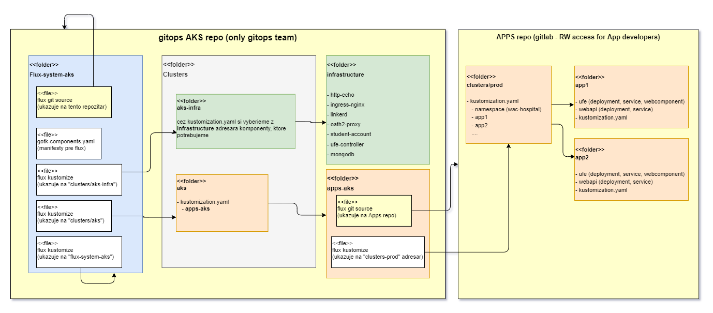

## Nasadenie aplikácie na produkčný kubernetes klaster

Z bezpečnostných dôvodov je GitOps git repozitár pre produkčný klaster privátny, zmeny v ňom môže robiť iba gitops team. Má podobnú štruktúru ako náš `webcloud-gitops` repozitár. Gitops team zabezpečí, aby produčný klaster obsahoval infraštruktúru potrebnú na nasadenie a beh našich aplikácií.

Pre účely cvičenia bol na pridávanie aplikácií do klastra vytvorený druhý git repozitár `Apps-repo` na stránke *github.com*:
[Gitops pre spoločný klaster][gitops-class]  
Bude obsahovať iba manifesty pre aplikácie a práva na zapisovanie budú mať všetci študenti.

*Obrázok ukazuje oba repozitáre, niektoré adresáre s vybranými súbormi a ich vzájomné prepojenie.*

### Pred samotným popisom krokov niekoľko dôležitých poznámok:

>warning:> 
> * **Nemeňte adresáre, ktoré nie sú vaše a ich obsah !**
>
> * Väčšinou sa aplikácia skladá z dvoch častí: Webcomponent a Webapi. Dajte ich do oddelených podadresárov.
> * Nedávajte sem manifesty na "infraštruktúru", napr. `mongodb`, `ufe-controller`,... Tie sú nasadené centrálne.
> * Uistite sa, že mená komponentov sa nezhodujú so žiadnym, ktoré sú už nasadené. **Keďže v našom prípade sa všetky nasadzujú do toho istého namespace, musia mať iné mená.**
> * Každý komit by mal byť schválený "maintainerom" git repozitára, t.j. jedným z cvičiacich.

### Postup na nasadenie aplikácie

1. Ak nemáte, vyžiadajte si prístup na `Apps-repo` u cvičiaceho.

2. Vytvorte adresár v root priestore s názvom vašej aplikácie. Štruktúra podadresárov v ňom nie je predpísaná, odporúča sa mať podadresár na webkomponent a druhý na webapi.

3. V hlavnom adresári vašej aplikácie musí byť súbor kustomization.yaml referencujúci vaše komponenty.

4. Do súboru `\clusters\prod\kustomization.yaml` pridajte odkaz na adresár s vašou aplikáciou.

5. Spravte komit.

Po komite Flux automaticky nasadí komponenty do AKS. Overte to po pár minútach [na stránke spoločnej aplikácie][common-cluster].

### Aktualizácia verzie docker obrazu

Ako nakonfigurovať automatickú aktualizáciu verziu docker obrazu v klastri sme si ukázali v kapitole [Flux - sledovanie a aplikovanie zmien verzie docker obrazu](./008b-flux-sledovanie-obrazov.md). Vytvorili sme 3 Flux-ové komponenty a upravili deployment (kustomization) pre daný pod. Analogicky by sme to mohli nakonfigurovať aj pre produkčný klaster, ale nebudeme to robiť. Dôvodov je viac:

- Bolo by to časovo náročné. Administrátor klustra by musel nasadiť 3 Flux komponenty pre každý webkomponent.
- V našom nastavení projektu (CI build) nemáme dostatočne zaručenú kvalitu. Nemáme testy v builde ani manuálny krok schválenia kvality komponentu pred "pushom" do docker repozitára.

Preto budeme zmenu verzie docker obrazu robiť **manuálne**. Po vyrobení verzie docker obrazu, ktora obsahuje novú funkcionalitu a je dostatočne pretestovaná na lokálnom klastri, zmeňte veziu v súbore `deployment.yaml` svojho komponentu v spoločnom repozitári `Apps repo` na gitlabe.

Po komite aktualizovaného súboru, sa Flux postará o jeho nasadenie do klastra. Overte to po pár minútach [na stránke aplikácie][common-cluster].
