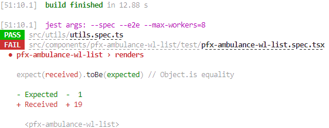
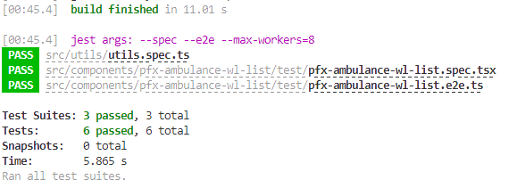
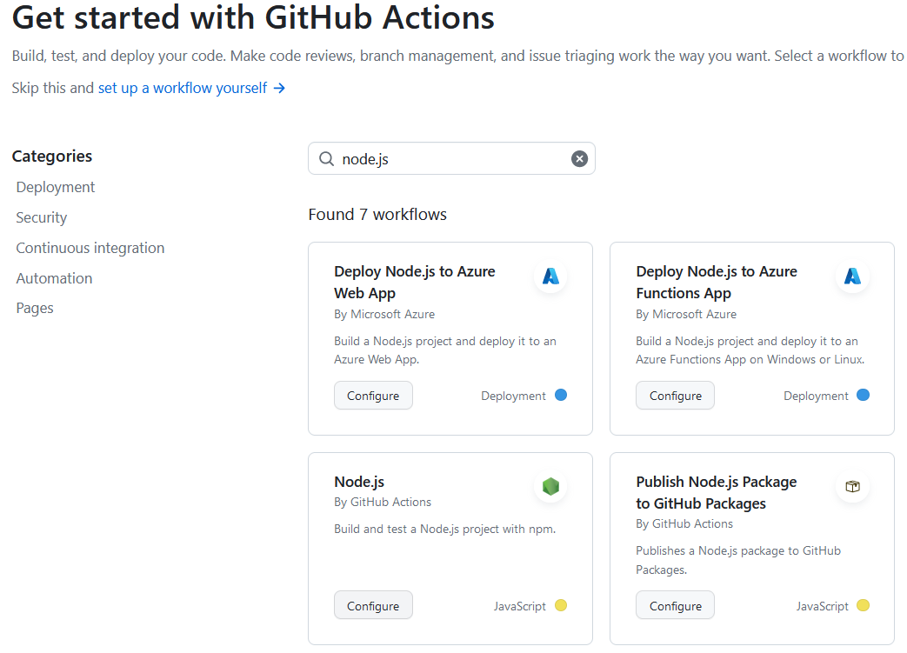
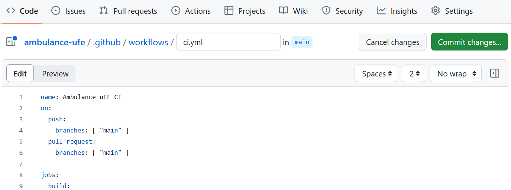
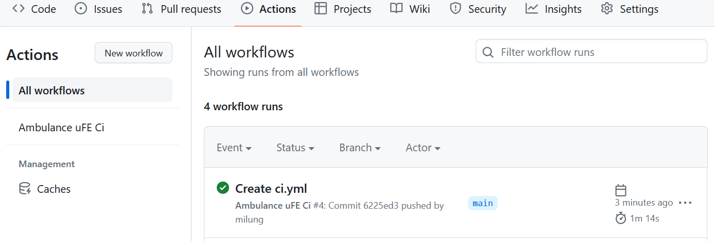

## Automatizovaná priebežná integrácia (_Continuous Integration_)

---

>info:>
Šablóna pre predvytvorený kontajner ([Detaily tu](../99.Problems-Resolutions/01.development-containers.md)):  
`registry-1.docker.io/milung/wac-ufe-020`

---

V nasledujúcich krokoch si vytvoríme postup - [Github Workflow](https://docs.github.com/en/actions/using-workflows) -
pre [automatickú priebežnú integráciu](https://docs.github.com/en/actions/automating-builds-and-tests/about-continuous-integration) projektu.
To nám zaručí, že vytvorenie funkčnej aplikácie zo zdrojového kódu je možné aj mimo nášho vývojového prostredia.

### Automatizované testy

Súčasťou priebežnej integrácie je aj overenie, že novopridaný kód je funkčný a neovplyvnil
už existujúcu a implementovanú funkcionalitu. Toto overenie zabezpečujú automatizované testy,
ktoré sa vykonávajú po každom zverejnení zmien v zdrojovom kóde.

>warning:> V tomto cvičení sa testovaniu venujeme len okrajovo, skôr z pohľadu ako automatizovať kontinuálnu integráciu. Testy sú preto len ukážkové a ich pridaná  hodnota nízka. Napriek tomu je nutné pri reálnom projekte venovať  automatizovaným testom značnú pozornosť, prednostne metódou [Test Driven  Development][tdd]. Pri ignorovaní tvorby automatizovaných a spoľahlivých testov je nutné predpokladať  navýšenie nákladov na údržbu a inováciu softvérového projektu, ktoré sú v  dôsledku zanedbania tvorby automatizovaných testov v praxi násobne vyššie než  typické náklady na proaktívnu tvorbu automatizovaných testovacích sád.  Nedostatok automatizovaných testov sa neprejavuje len vo vzniku neočakávaných chýb ale tiež v zhoršenej kvalite dizajnu a zníženej interoperabilite medzi  jednotlivými súčasťami celého softvérového diela.

Pokiaľ teraz vykonáme automatizované testy v našom projekte

```ps
npm test
```

zistíme, že nie sú funkčné a zlyhávajú s chybovou správou typu:

```plain
Jest encountered an unexpected token

Jest failed to parse a file. This happens e.g. when your code or 
its dependencies use non-standard JavaScript syntax, or when Jest 
is not configured to support such syntax.
```

Táto chyba je spôsobená skutočnosťou, že zatiaľ čo knižnica `@material/web` už plne využíva nový štandard definovania [JavaScript Modulov](https://developer.mozilla.org/en-US/docs/Web/JavaScript/Guide/Modules), knižnica [Jest], ktorú náš projekt využíva na beh testov, musí byť pre tento štandard nakonfigurovaná.  Momentálne je najjednoduchším spôsobom importovať externé webové komponenty importovať v tzv. [globálnom skripte](https://stenciljs.com/docs/config#globalscript), čím zároveň umiestnime zoznam externých web komponentov na jedno miesto. Úpravu konfigurácie si ukážeme až pri integrácii knižnice [Axios], ktorú budeme potrebovať na pripojenie sa k REST API serveru.

>build_circle:> Pokiaľ pri vykonaní príkazu vidíte chyby, ktore odkazujú na systém Puppeteer alebo Chrome, pozrite si [tento návod](../99.Problems-Resolutions/02.puppeteer.md) na riešenie problémov s Puppeteerom.

1. Vytvorte súbor `${WAC_ROOT}/ambulance-ufe/src/global/app.ts` a do neho umiestnite importy problematických modulov a exportujte prázdnu funkciu:

   ```ts
   import '@material/web/list/list' 
   import '@material/web/list/list-item'
   import '@material/web/icon/icon' 

   export default function() { // or export default async function() 
     // package initialization code 
   }  
   ```

   V súbore `${WAC_ROOT}/ambulance-ufe/src/components/pfx-ambulance-wl-list/pfx-ambulance-wl-list.tsx` odstráňte príslušné riadky s importom `@material/web/...` modulov:

   ```ts
   import { Component, Host, h } from '@stencil/core';
   import '@material/web/list/list'  @_remove_@
   import '@material/web/list/list-item'   @_remove_@
   import '@material/web/icon/icon' @_remove_@

   ...
   ```

   Následne upravte súbor `${WAC_ROOT}/ambulance-ufe/stencil.config.ts` tak, aby obsahoval  referenciu na tento globálny skript:

   ```ts
   ...
   export const config: Config = {
     globalScript: 'src/global/app.ts', @_add_@
     ...
   }
   ```

   a nakoniec opäť vykonajte testy:

   ```ps
   npm test
   ```

   Pri tomto behu, by ste mali vidieť, že očakávania testu `<pfx>-ambulance-wl-list › renders` nie sú splnené, čo vedie k zlyhaniu behu automatizovaných testov. Teraz musíme upraviť test, tak aby jeho očakávania boli splnené.

   

2. Upravíme jednotkový test v súbore `${WAC_ROOT}/ambulance-ufe/src/components/<pfx>-ambulance-wl-list/test/<pfx>-ambulance-wl-list.spec.tsx`:

   ```ts
    import { newSpecPage } from '@stencil/core/testing';
    import { <Pfx>AmbulanceWlList } from '../<pfx>-ambulance-wl-list';
 
    describe('<pfx>-ambulance-wl-list', () => {
       it('renders', async () => {
          const page = await newSpecPage({
             components: [<Pfx>AmbulanceWlList],
             html: `<<pfx>-ambulance-wl-list></<pfx>-ambulance-wl-list>`,
          });

          const wlList = page.rootInstance as PfxAmbulanceWlList; @_add_@
          const expectedPatients = wlList?.waitingPatients?.length @_add_@

         const items = page.root.shadowRoot.querySelectorAll("md-list-item"); @_add_@
         expect(items.length).toEqual(expectedPatients); @_add_@
         . @_empty_line_@
         expect(page.root).toEqualHtml(`  @_remove_@
           <pfx-ambulance-wl-list>  @_remove_@
             <mock:shadow-root>  @_remove_@
               <slot></slot> @_remove_@
             </mock:shadow-root> @_remove_@
           </pfx-ambulance-wl-list> @_remove_@
         `); @_remove_@
       });
    });
   ```

3. Overíme, že naša testovacia sada je funkčná a prechádza bez chýb vykonaním príkazu v priečinku `${WAC_ROOT}/ambulance-ufe`:

   ```ps
   npm test
   ```

   

   a následne archivujeme naše zmeny príkazmi

   ```ps
   git add .
   git commit -m "unit tests"
   git push
   ```

   Po tejto úprave je možné test namapovať na požiadavku: _Každý z čakajúcich pacientov je v komponente `<pfx>-ambulance-wl-list` zobrazený ako položka typu `md-list_item`_. V praxi je cieľom mať všetky požiadavky a všetky vetvy rozhodovania v aplikačnom kóde navzájom namapované prostredníctvom automatizovaných testov. V ideálnom prípade by sme vychádzali z vopred danej (alebo _uvedomenej si_) požiadavky, ku ktorej by sme implementovali test ako je uvedené v kroku 2, a následnou implementáciou by sme sa snažili dosiahnuť úspešné vykonanie testu. Tento prístup sa nazýva [Test Driven Development][tdd] a je jedným z najefektívnejších spôsobov ako zabezpečiť kvalitu softvérového diela.

### Vytvorenie GitHub Workflow pre automatickú integráciu

Pri vytváraní predpisu pre priebežnú integráciu môžeme začať buď na stránke [Github] v našom repozitári, alebo ju môžeme vytvoriť a upraviť priamo v našom vývojovom prostredí. V oboch prípadoch bude predpis umiestnený v priečinku `.github/workflows` v našom repozitári. V tejto kapitole si vytvoríme predpis na stránke [GitHub] a neskôr ho už budeme upravovať vo vlastnom vývojovom prostredí.
Predpis môže obsahovať množstvo rôznych krokov (_Actions_), mnohé z komplexnejších úloh sú už predpripravené a je ich možné vyhľadávať na stánkach [Github Marketplace](https://github.com/marketplace?type=actions)

1. Otvorte stránku [Github], prejdite do svojho repozitára `ambulance-ufe` a kliknite na položku _Actions_ v hornej lište. Do poľa _Search workflow_ zadajte `node.js` a potvrďte. Vo výslednom zozname stlačte tlačidlo _Configure_ uvedené v boxe pomenovanom _Node.js_.

   

2. Zobrazí sa stránka so súborom `ambulance-ufe/.github/workflows/node.js.yml`. V poli názvu súbora premenujte tento súbor na `ci.yml`.

3. V prvej časti súboru vidíte názov predpisu, ktorý je v tomto prípade `Node.js CI`. Tento názov môžete zmeniť na `Ambulance UFE CI`, čo Vám pomôže lepšie identifikovať zdroj problémov v prípade upozornení pri zlyhaní priebežnej integrácie.

   ```yaml
   name: Ambulance uFE CI
   ```

   Ďalej nasleduje sada spúšťačov _workflow_-u. V danom stave určujú, že kontinuálna integrácia bude vykonaná pri komitoch do vetvy main, ako aj pri vytvorení `pull-request` žiadostí na tejto vetve a tiež pri priradení tagu začínajúceho textom `v1`. To zabezpečí, že vetva main bude vždy obsahovať overenú verziu aplikácie. Priradenie tagu napríklad `v1.0.0` nám umožňuje určiť, že daná verzia je stabilná a môže byť použitá na vygenerovanie oficiálneho vydania.  Podrobný opis možných spúšťačov nájdete v [dokumentácii](https://docs.github.com/en/actions/reference/events-that-trigger-workflows).

   ```yaml
   ...
   on:
   push:
     branches: [ "main" ]
     tags:  @_add_@
      - 'v1*'  @_add_@
   pull_request:
     branches: [ "main" ]
   ...
   ```

   Nasleduje samotný predpis priebežnej integrácie. Sekcia `jobs` obsahuje jednotlivé sady úloh, ktoré musia byť vykonané - _job_-y môžu prebiehať paralelne na rôznych zariadeniach, zatiaľ čo jeden job typicky beží sekvenčne na jednom alokovanom zariadení. Typ zariadenia, na ktorom má tento predpis bežať je určený jeho vlastnosťou `runs-on`, v našom prípade to je `runs-on: ubuntu-latest`. Typ zariadenia v tomto prípade opisuje operačný systém, nie je to ale podmienkou. Môže napríklad opisovať či má zariadenie obsahovať grafický procesor alebo špecifikovať vlastné hostiteľské prostriedky so špecifickými vlastnosťami alebo rolami. Viac o štandardných zariadeniach nájdete v [dokumentácii](https://docs.github.com/en/actions/using-github-hosted-runners/about-github-hosted-runners).

   Blok `strategy` umožňuje vykonanť sadu úloh opísaných v tomto _job_-e so všetkými kombináciami premenných, ktoré sú v tejto sekcii uvedené. V našom prípade je to iba jedna premenná `node-version`, ktorá obsahuje zoznam verzií Node.js, ktoré sa majú použiť pri vykonávaní úloh. To je užitočné najmä pri vytváraní balíčkov, ktoré sa môžu potom použiť v rôznych prostrediach a konfiguráciách, ktoré by sme takýmto spôsobom mohli overiť. Pre našu aplikáciu takúto požiadavku nemáme a v prípade priebežnej integrácie skôr sledujeme cieľ rýchlej spätnej odozvy pri častých zmenách v zdrojovom kóde. Upravte túto sekciu tak, aby obsahovala iba jednu verziu Node.js - v tomto prípade niektorú verziu z hlavných vydaní 20.x:

   ```yaml
   ...
   strategy:
     matrix:
       node-version: [ 20.x ] @_important_@
   ...
   ```

   >info:> Sekciu `strategy` môžeme aj úplne vymazať, v tom prípade sa predpis vykoná iba raz, s prednastavenou verziou Node.js.

   Sekcia `steps` obsahuje zoznam úloh, ktoré sa majú vykonať. V našom prípade su to kroky
   * `actions/checkout@v3`, ktorý získa aktuálny stav nášho repozitára;
   * `actions/setup-node@v3`, ktorý nainštaluje, resp. pripraví prostredie pre použitie určenej verzie Node.js;
   * kroky príkazového riadka, ktoré vykonajú príkazy `npm ci`, `npm run build` a `npm test`. Voľba `ci` je ekvivalentná voľbe `install` bez overovania prítomnosti balíčkov vo vyrovnávacej pamäti.

   Uvedené kroky vyhovujú našim potrebám, preto ich nemusíme meniť. Celý predpis ma potom nasledujúci tvar:

   ```yaml
   name: Ambulance uFE CI
   on:
     push:
       branches: [ "main" ]
     pull_request:
       branches: [ "main" ]
   
   jobs:
     build:
       runs-on: ubuntu-latest
       strategy:
         matrix:
           node-version: [20.x]
       steps:
       - uses: actions/checkout@v3
       - name: Use Node.js ${{ matrix.node-version }}
         uses: actions/setup-node@v3
         with:
           node-version: ${{ matrix.node-version }}
           cache: 'npm'
       - run: npm ci
       - run: npm run build --if-present
       - run: npm test
   ```

4. Archivujte uvedené zmeny na stránke Github, stlačením tlačidla _Commit changes_. Komentár zmeny v zobrazenom dialógu môžete nechať nezmenený.

   

5. Pretože sme posledným krokom vykonali komit do vetvy `main`, priebežná integrácia sa na základe nami uvedených spúšťačov automaticky vykoná. Ešte stále na stránke [GitHub] zvoľte v hornej lište záložku _Actions_. V zozname _All Workflows_ by ste mali vidieť práve prebiehajúci alebo ukončený beh predpisu _Ambulance uFE CI_, pomenovaný podľa názvu komitu:

   

   Vyčkajte kým integrácia úspešne skončí.

6. Ako ste si všimli, nový predpis priebežnej integrácie je v skutočnosti reprezentovaný novým YAML súborom `ci.yml`, ktorý je súčasťou archívu verzií zdrojového kódu. Zosynchronizujeme preto náš lokálny repozitár nasledujúcimi príkazmi:

    ```ps
    git fetch
    git pull
    ```

    Po vykonaní týchto príkazov môžete uvedený súbor nájsť a upravovať aj vo svojom lokálnom repozitári v súbore `${WAC_ROOT}/ambulance-ufe/.github/workflows/ci.yml`.

>info:> Vo Visual Studio Code si môžete doinštalovať rozšírenie [GitHub Actions](https://marketplace.visualstudio.com/items?itemName=GitHub.vscode-github-actions), ktoré Vám umožní sledovať stav priebežnej integrácie priamo v prostredí VSCode a obsahuje aj podporu vylepšenej editácie súborov predpisov priebežnej integrácie.