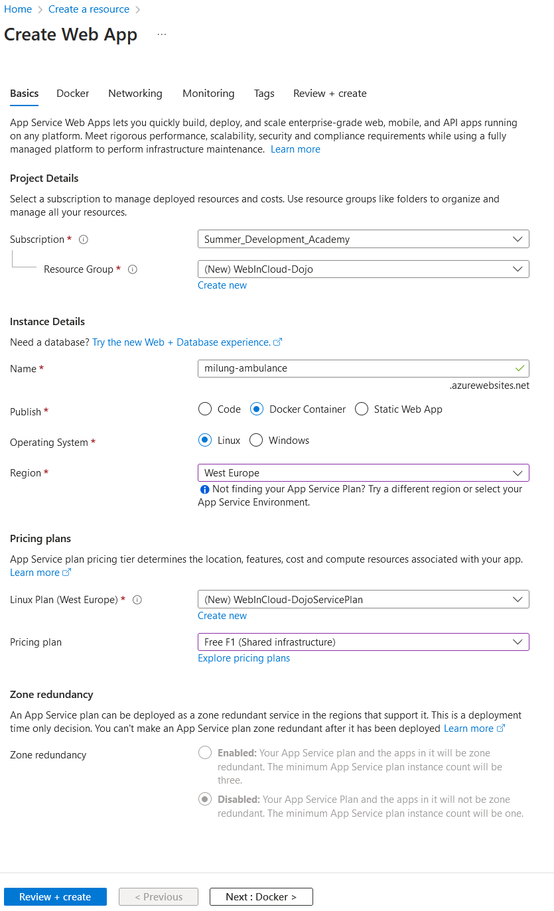
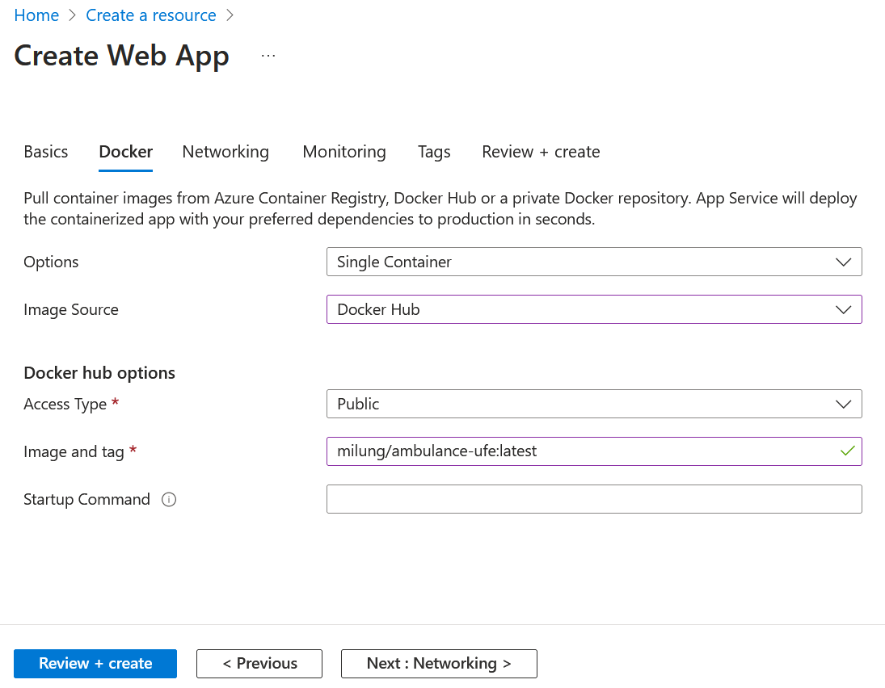
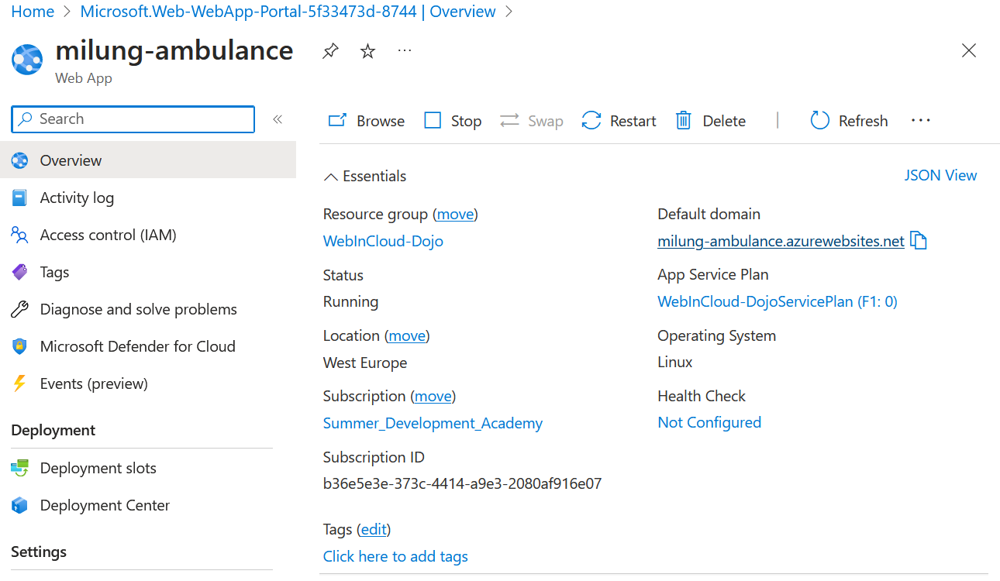

## Manuálne nasadenie aplikácie v Microsoft Azure

---

>info:>
Šablóna pre predvytvorený kontajner ([Detaily tu](../99.Problems-Resolutions/01.development-containers.md)):
`registry-1.docker.io/milung/wac-ufe-042`

---

Vývoj v krátkych cykloch a rýchla spätná väzba sú podstatou agilného vývoja.
Možnosť práce s reálnou aplikáciou - namiesto PowerPoint prezentácie - a možnosť
pristúpiť k aplikácii v ľubovoľnom čase, umožňuje získať relevantnú spätnú väzbu.
Naším cieľom je preto čo najskôr túto aplikáciu nasadiť do verejného dátového centra.

Najjednoduchší spôsob ako nasadiť aplikáciu, je manuálne prekopírovať súbory na miesto
v cloude. To je vhodné napr. v prípade, keď nemáme k dispozícii kontinuálnu integráciu
alebo vyvíjame aplikáciu lokálne. Ďalšou, čoraz častejšie využívanou možnosťou, je kontajnerizácia
aplikácie a následné nasadenie takéhoto kontajnera. Tento spôsob si ukážeme v nasledujúcich krokoch. V ďalšej kapitole si potom nakonfigurujeme automatizovaný spôsob kontinuálneho
nasadenia aplikácie.

1. Prejdite na stránku [Visual Studio Dev Essentials][vs-essentials],
  pripojte sa k službám a aktivujte si voľný účet k _Microsoft Azure_ službám.
  Pri aktivácii budete požiadaný o údaje o kreditnej karte, nebudú ale uplatnené 
  voči nej žiadne poplatky, pokiaľ sa tak explicitne nerozhodnete. Pri cvičeniach
  budeme používať len služby, ktoré sú zdarma.

   

   Po aktivácii budete presmerovaný na stránku [Azure Portal][azure-portal],
   na ktorej môžete spravovať svoje prostriedky vo verejnom dátovom centre
   _Microsoft Azure_.

2. V portáli zvoľte v ľavom paneli položku _+ Create a resource_ a zvoľte
   _Web App_.  Následne

3. Vybete novú skupinu prostriedkov - _Resource Group - Create New_ - a pomenujte ju `WebInCloud-Dojo`.

     Skupina prostriedkov združuje prostriedky patriace k jednej logickej aplikácii
     a umožňuje nakladať s viacerými prostriedkami ako s jedným celkom (zrušenie,
     vytvorenie, presun medzi účtami, riadenie prístupu, a podobne).

4. Do poľa _Name_ zadajte meno aplikácie, napr. `<pfx>-ambulance`. Toto meno bude použité ako
   názov servera, na ktorom bude vaša aplikácia vystavená, preto musí byť názov
   jedinečný.
  
5. V rámci sekcie _Instance Details_:
      * V riadku _Publish_ vyberte _Docker Container_
      * Ako _Operating System_ nastavte _Linux_.
      * V riadku _Region_ zvoľte `West Europe` (dátové centrum v Holandsku).

6. V sekcii _Pricing plan_ zvoľte nový _Linux plan_ (_Create new_). Pomenujte ho `WebInCloud-DojoServicePlan` a zmeňte štandardné nastavenie v poli _Pricing Plan_ na hodnotu _Free F1_.

   

7. Stlačte na tlačidlo _Next : Docker_ a upravte voľbu _Image Source_ na hodnotu `Docker Hub` a do políčka _Image and tag_ vložte hodnotu `<your-account>/ambulance-ufe:latest`

    

8. Teraz stlačte na tlačidlo _Review + create_, skontrolujte nastavenia webovej aplikácie a potvrďte voľbou _Create_.

    Po chvíli sa v portáli vo vašich notifikáciách zobrazí nová správa
    _Deployment succeeded_. Zvoľte voľbu _Pin to Dashboard_ (voliteľné) a potom
    _Go to Resource_. V prehľade webovej aplikácie (_Overview_) vidíte odkaz -
    _URL_- na novú aplikáciu. Otvorte tento odkaz v novom okne.

    

    V prehliadači by ste mali vidieť známy zoznam čakajúcich pacientov, tentoraz obslúžený z  dátového centra Microsoft Azure.

Naša aplikácia je nasadená.
Ako bolo spomenuté vyššie, toto je najzákladnejší manuálny spôsob nasadenia
aplikácie na cloud. V ďalších krokoch si ukážeme, ako tento proces automatizovať.

>$apple:> V prípade, že máte procesor s arm64 architektúrou, je možné, že bude v tejto chvíli Vaša aplikácia nefunkčná z dôvodu nekompatibility architektúry procesorov. Pokračujte do ďalšej kapitoly, kde bude upravený predpis priebežnej integrácie tak, aby vytváral obraz pre rôzne platformy a architektúry procesora.
