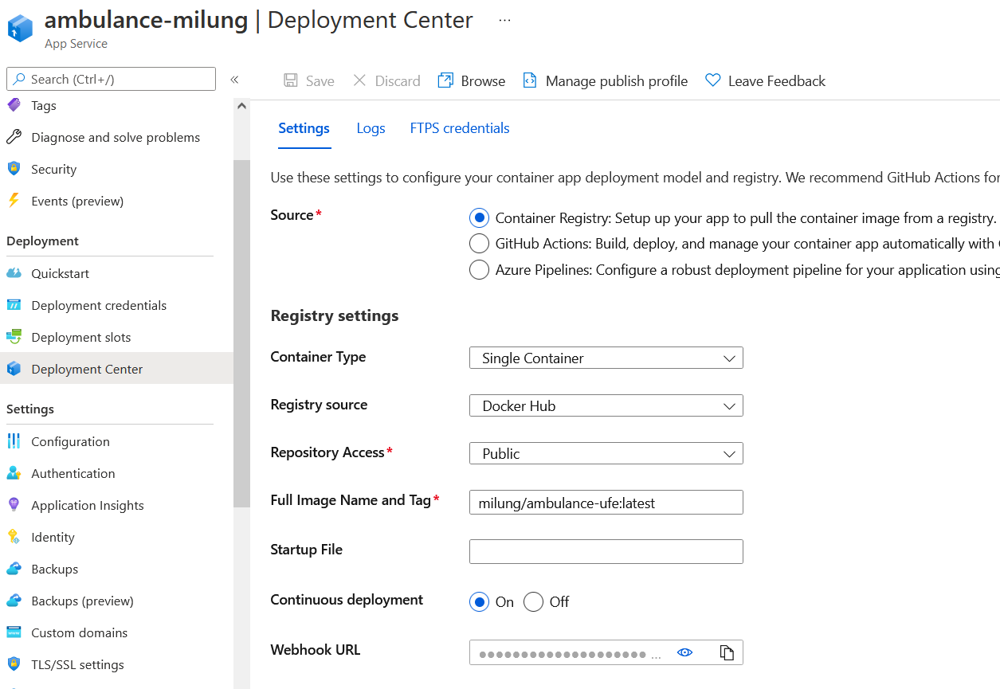
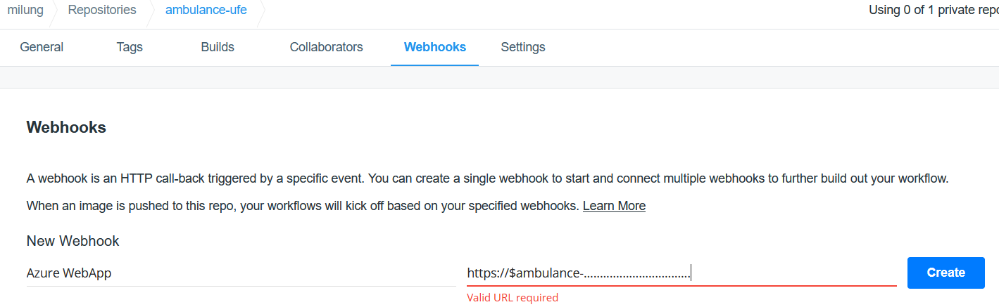
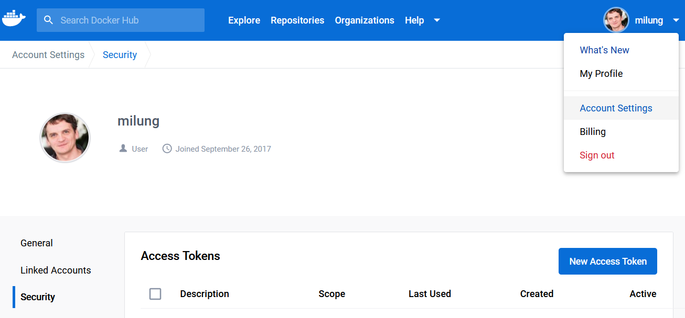
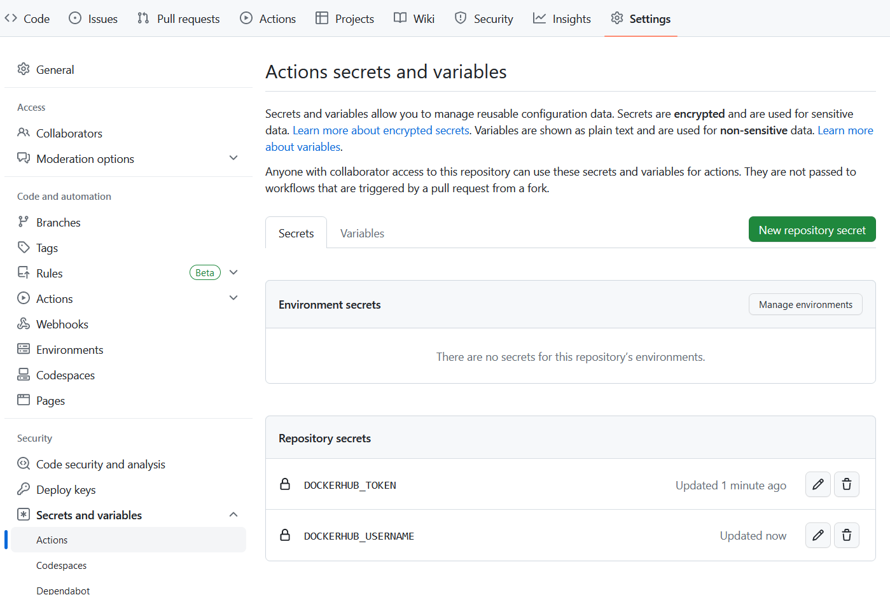

# Polo-automatické nasadenie (automatická aktualizácia docker obrazu z dockerhub)

---

>info:>
Šablóna pre predvytvorený kontajner ([Detaily tu](../99.Problems-Resolutions/01.development-containers.md)):
`registry-1.docker.io/milung/wac-ufe-042`

---

V predchádzajúcej časti sme manuálne nasadili kontajnerizovanú web aplikáciu na
Azure cloud. Teraz si ukážeme jednoduchý spôsob, ako nastaviť, aby sa aplikácia automaticky
aktualizovala, keď sa zmení jej docker obraz na Docker Hube.

1. Vráťte sa do portálu [Azure][azure-portal], do vašej web aplikácie a
   v záložke _Deployment Center_ prepnite voľbu _Continuous deployment_ na `On` a
   skopírujte hodnotu z políčka _Webhook URL_. Uložte nastavenie stlačením tlačidla _Save_:

    

    Prejdite na stránku [Docker Hub][docker-hub], otvorte detaily vášho obrazu
    `ambulance-ufe` a prejdite do záložky _Webhooks_. Vytvorte nový webhook, pomenujte ho
    _Azure WebApp_ a ako URL nastavte hodnotu skopírovanú z Azure portálu.

    

    Týmto nastavením sme zabezpečili, že kedykoľvek sa do registra Docker Hub zapíše nový
    obraz s označením `<your-dockerhub-account>/ambulance-ufe:latest`, webová služba vytvorená na
    platforme Microsoft Azure automaticky získa najnovší obraz kontajnera s týmto
    označením.

2. Do _CI pipeline_ pridáme krok na zverejnenie novej verzie docker obrazu po úspešnom
   builde. Tentoraz budeme ručne upravovať predpis priebežnej integrácie.

   V kapitole [Kontajnerizácie aplikácie](./041-ufe-containerization.md) sme vytvorili obraz pomocou príkazu `docker build`. Tento príkaz vytvoril obraz pre aktuálnu platformu nášho prostredia - `linux/amd64` v prostredí Windows alebo Linux na procesoroch Intel/AMD, alebo `linux/arm64/v8` na novších modeloch Apple Mac. Aby bol náš generovaný obraz použiteľný na rôznych platformách, musíme vytvoriť takzvanú [viac-platformovú zostavu](https://docs.docker.com/build/building/multi-platform/), ktorá vytvorí rôzne obrazy a zaregistruje ich v registri pod spoločným názvom (tzv. manifest s viacerými odkazmi). Lokálne by sme k tomu použili príkaz `docker buildx build --platform linux/amd64,linux/arm64/v8 --push -t <your-dockerhub-account>/ambulance-ufe .`. Detaily o tomto postupe nájdete [tu](https://docs.docker.com/build/building/multi-platform/).  V priebežnej integrácii budeme výtvarať práve takéto viac-platformové obrazy.

   Otvorte súbor `${WAC_ROOT}/ambulance-ufe/.github/workflows/ci.yml` a na jeho konci pridajte nové kroky predpisu:

   ```yaml
   ...
        - run: npm test

        - name: Set up QEMU @_add_@
          uses: docker/setup-qemu-action@v1  @_add_@
          @_add_@
        - name: Set up Docker Buildx @_add_@
          id: buildx @_add_@
          uses: docker/setup-buildx-action@v1   @_add_@
    ```

   Tieto kroky pridajú do pipeline podporu pre viac-platformové zostavy. V ďalšom kroku pridáme  príkaz na prihlásenie sa do registra Docker Hub:

   ```yaml
   ...
   - name: Login to DockerHub
     uses: docker/login-action@v1 
     with:
        username: ${{ secrets.DOCKERHUB_USERNAME }}
        password: ${{ secrets.DOCKERHUB_TOKEN }}
   ```

   Premenné `secrets.DOCKERHUB_USERNAME` a `secrets.DOCKERHUB_TOKEN` nastavíme v krokoch nižšie. Ďalší krok vytvorí [meta údaje](https://github.com/docker/metadata-action) pre vytvorenie obrazu, špecificky sú pre nás dôležité údaje `tags` :

   ```yaml
   ...
    - name: Docker meta
      id: meta
      uses: docker/metadata-action@v3
      with:
        images: |
          <your-dockerhub-account>/ambulance-ufe @_important_@
        tags: |
          type=schedule
          type=ref,event=branch
          type=ref,event=branch,suffix={{date '.YYYYMMDD.HHmm'}} # napr `main.20210930.1200` @_important_@
          type=ref,event=tag
          type=semver,pattern={{version}} # napr pri tagu  `v1.0.0`
          type=semver,pattern={{major}}.{{minor}} # napr `1.0`
          type=semver,pattern={{major}}
          type=raw,value=latest,enable={{is_default_branch}} # `latest` pre každý komit do main vetvy @_important_@
   ```

   >info:> V tomto cvičení vždy vytvárame obraz s tagom `<your-dockerhub-account>/ambulance-ufe:latest` pre zjednodušenie ďalšieho postupu. V reálnych projektoch sa `latest` tag vytvorí len pri oficiálnych otestovaných vydaniach novej verzie - napríklad pri pridaní tagu vo formáte `v1.0.1`.

   Ďalej pridáme krok na vytvorenie viac-platformového obrazu:

   ```yaml
    ...
    
    - uses: docker/build-push-action@v2
      with:
        context: .
        platforms: linux/amd64,linux/arm64/v8
        file: ./build/docker/Dockerfile
        push: true
        tags: ${{ steps.meta.outputs.tags }} @_important_@
        labels: ${{ steps.meta.outputs.labels }}
   ```

3. Pre úspešný beh priebežnej integrácie je nutné ešte nastaviť premenné `secrets.DOCKERHUB_USERNAME` a `secrets.DOCKERHUB_TOKEN`. Prejdite na stránku [Docker Hub], Rozbaľte menu označené názvom Vášho účtu a zvoľte _Account Settings_. V záložke _Security_ nájdete tlačidlo _New Access Token_.

   

   Vytvorte nový token s názvom `ambulance-ufe CI` a priraďte mu práva `Read, Write, Delete` a stlačte tlačidlo _Generate_. Vygenerovaný token si skopírujte do schránky.

   Teraz prejdite do Vášho repozitára `<pfx>/ambulance-ufe` na stránke [GitHub]. V hornej lište zvoľte záložku _Settings_ a následne na bočnom panely zvoľte položku _Secrets and Variables_ -> _Actions_.
   Na tejto stránke stlačte na tlačidlo _New repository secret_ a vytvorte novú premennú s názvom `DOCKERHUB_TOKEN` a ako hodnotu vložte zo schránky skopírovaný token. Opäť stlačte na tlačidlo _New repository secret_ a vytvorte premennú s názvom `DOCKERHUB_USERNAME` a ako hodnotu vložte svoje používateľské meno na Docker Hub.

   

   Vytvorené premenné sú k dispozícii pre ďaľší beh našej priebežnej integrácie.

4. V priečinku `${WAC_ROOT}/ambulance-ufe` zverejnite zmeny zdrojového kódu príkazmi:

    ```ps
    git add .
    git commit -m "ci - publish docker image"
    git push
    ```

5. Na stránke [GitHub] vo Vašom repozitári `<pfx>/ambulance-ufe` prejdite do záložky _Actions_ a skontrolujte, že sa nový beh priebežnej integrácie úspešne dokončí. Po jej ukončení si môžete overiť aj stav obrazu na stránke Docker Hub, kde môžete vidieť nové označenia verzie a platformy pre váš image.

Týmto spôsobom sme zabezpečili kontinuálne nasadenie tejto webovej aplikácie do prostredia [Azure][azure-portal]. Obdobným spôsobom by sme vedeli nasadzovať ďalšie služby respektíve využívať už existujúce služby poskytované na platforme Azure. Detailné návody ako postupovať, pokiaľ chcete primárne vytvárať riešenia nad už existujúcimi službami Azure, nájdete napríklad [tu](https://learn.microsoft.com/en-us/azure/architecture/).

Ďalej si v tomto cvičení ukážeme postup ako vytvoriť aplikáciu technikou mikro Front End a nasadiť ju do prostredia [Kubernetes] s využitím [GitOps](https://www.gitops.tech/) techniky.
