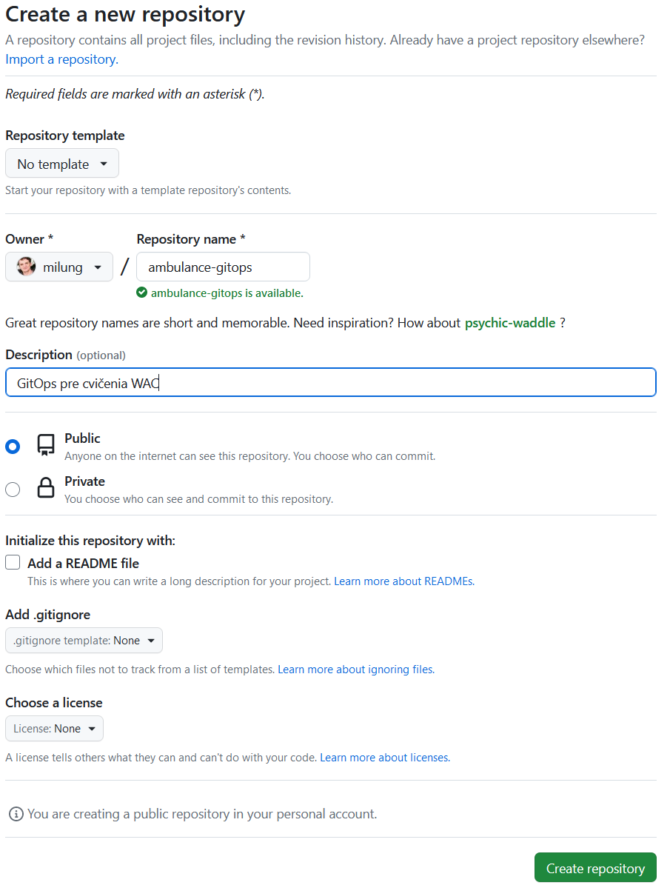
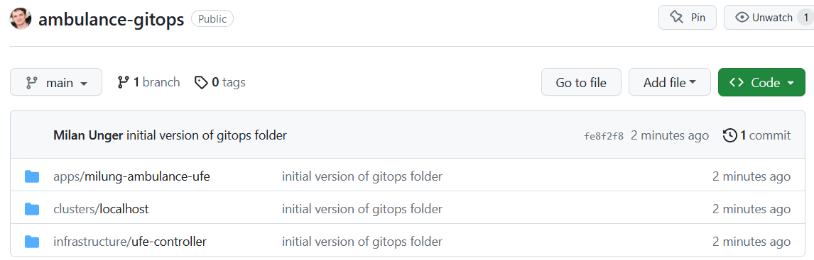

## Archivácia konfigurácie infraštruktúry

---

>info:>
Šablóna pre predvytvorený kontajner ([Detaily tu](../99.Problems-Resolutions/01.development-containers.md)):
`registry-1.docker.io/milung/wac-ufe-070`

---

Podmienkou [GitOps] a súčasne predpokladom na to, aby fungoval [Flux] je, aby bol manifest nasadenia nášho systému uložený v git repozitári.  V predchádzajúcej časti sme
vytvorili adresár _webcloud-gitops_, ktorý obsahuje popis nasadenia nášho projektu.  Ten si teraz archivujeme.

1. Na stránke [GitHub]
   sa prihláste do svojho účtu, a vytvorte nový repozitár s názvom `ambulance-gitops`. V menu odznačte _Add a README_ a
   vyberte _None_ pre _.gitignore_ súbor a stlačte `Create`.

   

2. V príkazovom riadku prejdite do priečinka `${WAC_ROOT}/ambulance-gitops` a inicializujte lokálny git repozitár príkazom:

   ```ps
   git init
   ```

3. Pridajte a odovzdajte do archívu všetky lokálne súbory

   ```ps
   git add .
   git commit -m 'initial version of gitops folder'
   ```

4. Prepojíme lokálny repozitár s [GitHub] repozitárom.

    >info:> Môžete použiť príkaz vygenerovaný na stránke vášho projektu v GitHub.

    ```ps
    git remote add origin https://github.com/<your-account>/ambulance-gitops.git
    ```

   _origin_ je meno, ktorým sme označili vzdialený repozitár.

5. Synchronizujte váš lokálny repozitár so vzdialeným repozitárom. Pri výzve zadajte svoje prihlasovacie údaje.

   ```ps
   git push --set-upstream origin main
   ```

   V prehliadači skontrolujte, že sú vaše súbory uložené vo vzdialenom repozitári.

    
