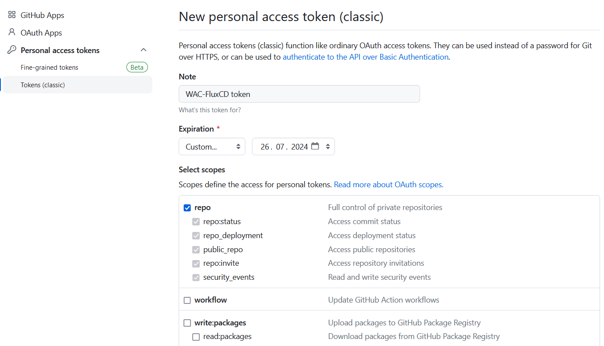
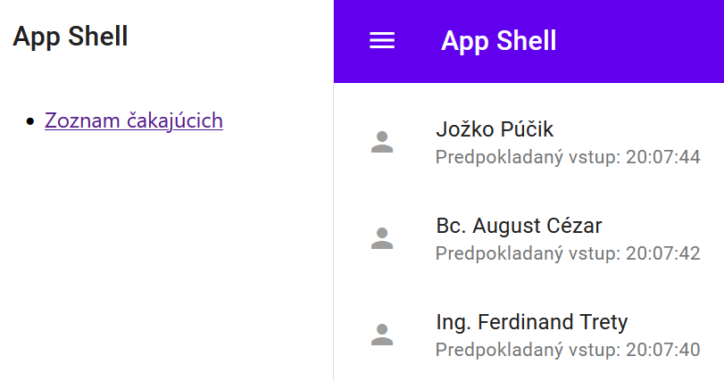

# Kontinuálne nasadenie pomocou nástroja Flux (lokálne do k8s v rámci Docker Desktop)

---

```ps
devcontainer templates apply -t registry-1.docker.io/milung/wac-ufe-070
```

---

[Flux] patrí v súčasnosti medzi najpoužívanejšie nástroje na
kontinuálne nasadenie. Funguje na princípe _Pull Deployment_ a plne podporuje metódy
[GitOps]. V skratke, GitOps sa skladá z troch hlavných komponentov:

- IaC (Infrastructure as Code) - popis infraštruktúry (_deploymentu_) je uložený v
súboroch v git repozitári a slúži ako "jediný zdroj pravdy".
- MRs (Merge requests) - zmeny infraštruktúry sa dejú v kóde pomocou merge requestov. Typicky sa tu nastavuje povinné code review.
- CI/CD (Continuous Integration and Continuous Deployment) - automatická aktualizácia infraštruktúry je zabezpečovaná pomocou CI/CD.

[Flux] je založený na sade rozšírení [kubernetes API][k8s-api], tzv. [_Custom resources_][k8s-crd], ktoré
kontrolujú, ako sa zmeny v git repozitároch aplikujú do kubernetes klastra. Dva základné objekty, s ktorými budeme pracovať, sú:

- [`GitRepository`](https://fluxcd.io/flux/components/source/gitrepositories/) objekt - zrkadlí konfigurácie z daného git repozitára
- [`Kustomization`](https://fluxcd.io/flux/components/kustomize/kustomization/) objekt - presne špecifikuje adresár v rámci repozitára a frekvenciu synchronizácie.

>warning:> `Flux Kustomization` objekt a `Kustomize Kustomization` objekt
> sú dva rôzne objekty. V ďalšom texte sa budú miešať, preto sa budeme na
> ne odvolávať vždy presne.

Na obrázku sú znázornené komponenty Flux.


Ukážeme si inštaláciu a konfiguráciu Flux na lokálnom kubernetes klastri, ktorý poskytuje aplikácia Docker Desktop.

Na kubernetes klastri v dátovom centre (Azure, AWS, Google, ...) Flux nainštaluje administrátor daného klastra.

>info:> Na konci tejto kapitoly je obrázok, ktorý znázorňuje všetky komponenty tu spominané a ich vzájomné prepojenie.

## Príprava konfigurácie

V tejto časti si najpr nakonfigurujeme všetky potrebné súbory a
uložíme do git repozitára aby boli prirpavené pre priebežné nasadenie do kubernetes klastra.

1. Vytvorte nový adresár `${WAC_ROOT}/ambulance-gitops/infrastructure/fluxcd` a v ňom vytvorte súbor `kustomization.yam` s obsahom:

   ```yaml
   apiVersion: kustomize.config.k8s.io/v1beta1
   kind: Kustomization

   resources:
   - https://github.com/fluxcd/flux2//manifests/install?ref=v2.0.1
   ```

   Týmto spôsobom sme vytvorili závislosť na konkrétnom vydaní systému [Flux CD][flux]. Do súboru
   ``${WAC_ROOT}/ambulance-gitops/clusters/localhost/prepare/kustomization.yaml` pridajte referenciu na flux cd konfiguráciu:

   ```yaml
   ...
   resources:
   - namespace.yaml
   - ../../../infrastructure/ufe-controller
   - ../../../infrastructure/fluxcd @_add_@
    ```

2. Vytvorte adresár `${WAC_ROOT}/ambulance-gitops/clusters/localhost/gitops` a v ňom súbor `git-repository.yaml`:

   ```yaml
   apiVersion: source.toolkit.fluxcd.io/v1
   kind: GitRepository
   metadata:
     name: gitops-repo
     namespace: wac-hospital
   spec:
     interval: 1m0s
     ref:
       branch: main
     secretRef:
       name: repository-pat
     timeout: 1m0s
     url: https://github.com/<your-account>/ambulance-gitops @_important_@
   ```

    Tento súbor definuje git repozitár a vetvu, ktorý bude Flux CD sledovať a zabezpečovať priebežné nasadenie podľa konfigurácie v tomto repozitári. Pre prístup bude používať _personal access token_ (PAT), ktorý si vygenerujete neskôr.

3. V tom istom priečinku vytvorte súbor `${WAC_ROOT}/ambulance-gitops/clusters/localhost/gitops/prepare.kustomization.yaml`:

   ```yaml
   apiVersion: kustomize.toolkit.fluxcd.io/v1
   kind: Kustomization
   metadata:
     name: prepare
     namespace: wac-hospital
   spec:
     wait: true
     interval: 42s
     path: clusters/localhost/prepare
     prune: true
     sourceRef:
       kind: GitRepository
       name: gitops-repo
    ```

    Tento súbor definuje, že Flux CD bude sledovať zmeny v priečinku `clusters/localhost/prepare` a ak sa zmenia, tak ich aplikuje do kubernetes klastra.

4. Vytvorte súbor `${WAC_ROOT}/ambulance-gitops/clusters/localhost/gitops/install.kustomization.yaml`:

   ```yaml
   apiVersion: kustomize.toolkit.fluxcd.io/v1
   kind: Kustomization
   metadata:
     name: install
     namespace: wac-hospital
   spec:
     wait: true
     dependsOn:  @_important_@
     - name: prepare @_important_@
     interval: 42s
     path: clusters/localhost/install
     prune: true
     sourceRef:
       kind: GitRepository
       name: gitops-repo
   ```

    Tento súbor definuje, že Flux CD bude sledovať zmeny v priečinku `clusters/localhost/install` a ak sa zmenia, tak ich aplikuje do kubernetes klastra. Všimnite si, že sme zároveň určili, že táto konfigurácia je závisla od nasadenia a pripravenosti konfigurácie `prepare`.

5. Vytvorte súbor `${WAC_ROOT}/ambulance-gitops/clusters/localhost/gitops/cd.kustomization.yaml`:

   ```yaml
   apiVersion: kustomize.toolkit.fluxcd.io/v1
   kind: Kustomization
   metadata:
     name: cd
     namespace: wac-hospital
   spec:
     wait: true
     interval: 42s
     path: clusters/localhost
     prune: true
     sourceRef:
       kind: GitRepository
       name: gitops-repo
   ```

    Tento súbor definuje, že Flux CD bude sledovať konfiguráciu v priečinku `clusters/localhost/` a ak sa zmení, tak zmeny aplikuje do kubernetes klastra - tzn ak budeme chcieť zmeniť detaily priebežnej integrácia, tak bude postačovať ak ich zapíšeme do nášho repozitára.

6. Vytvorte súbor `${WAC_ROOT}/ambulance-gitops/clusters/localhost/gitops/kustomization.yaml`, ktorý vyššie uvedené súbory zintegruje:

   ```yaml
   apiVersion: kustomize.config.k8s.io/v1beta1
   kind: Kustomization

   commonLabels:
    app.kubernetes.io/part-of: wac-hospital

   namespace: wac-hospital

   resources:
    - prepare.kustomization.yaml
    - cd.kustomization.yaml
    - install.kustomization.yaml
    - git-repository.yaml
   ```

7. V priečinku `${WAC_ROOT}/ambulance-gitops/clusters/localhost` vytvorte súbor `kustomization.yaml`:

   ```yaml
   apiVersion: kustomize.config.k8s.io/v1beta1
   kind: Kustomization
   
   
   commonLabels:
     app.kubernetes.io/name: wac-hospital
     app.kubernetes.io/instance: development
     app.kubernetes.io/version: "0.1"

   resources:
      - gitops
   ```

   Táto konfigurácia sa odkazuje na priečinok `gitops`, ktorý sme vytvorili v predchádzajúcom kroku. Znamená to, že konfigurácia klastra je riadená zdrojmi Flux CD, ktorý zabezpečuje priebežné nasadenie podľa konfigurácie v git repozitári na príslušných cestách.

8. Pokiaľ je náš repozitár verejný, mohol by FluxCD získať informácie bez potreby konfigurovania prístupových práv. Keďže v praxi je bežnejšie, že konfigurácie špecifických ňovať, predpokladáme, že je tento repozitár privátny. Musíme preto nakonfigurovať pre Flux CD prístupové údaje - viď manifest v kroku 2.

   Prejdite na stránku [GitHub], prihláste sa a následne prejdite na stránku [Developer Settings](https://github.com/settings/apps). _Z hlavnej stránky sa tu môžete dostať stlačením ikony Vášho avatara, menu "Settings" a potom "Developer settings"._ Na ľavej strane vyberte _Personal access tokens->Tokens (classic)_ a stlačte tlačidlo _Generate new token_. Prihláste sa, zadajte meno tokenu, napr. _WAC-FluxCD token_, a _Expiration_ nastavte  na _Custom defined_ (dátum aspoň do konca semestra). V časti _Scopes_ označte položku _repo_. Stlačte tlačidlo _Generate token_ a __NEZABUDNITE SI ULOŽIŤ DO SCHRÁNKY__ vygenerovaný PAT.

   

   Následne musíme toto heslo uložiť do kubernetes klastra. V kontexte GitOps máme teraz niekoľko možností ako postupovať. Tu si ukážeme zatiaľ jednoduchší postup, a to, že heslá a iné dôverné informácie nebudú súčasťou nášho repozitára, ale ich budeme mať k dispozícii len lokálne. Tento postup sa ale skomplikuje v momente, kedy budeme musieť pracovať s viac ako len s jedným heslom alebo klastrom. V takom prípade je oveľa vhodnejšie použiť tzv. [_SOPS - Service Operations_](https://fluxcd.io/flux/guides/mozilla-sops/), kedy sú šifrované heslá a verejný kľúč uložené priamo v repozitári a súkromý kľúč, potrebný na odšifrovanie dôverných informácií je prístupný len v samotnom klastri, kde ho ručne nasadzuje jeho administrátor. Druhý spôsob si preto ukážeme až v inej kapitole.

   Vytvorte priečinok `${WAC_ROOT}/ambulance-gitops/clusters/localhost/secrets` a v ňom súbor `repository-pat.yaml`:

   ```yaml
   apiVersion: v1
   kind: Secret
   metadata:
     name: repository-pat
     namespace: wac-hospital

   type: Opaque
   stringData:
     username: <yur-acount> # zvyčajne môže byť akékoľvek meno @_important_@
     password: <your-personal-access-token>  # vygenerovaný PAT @_important_@
   ```

   V tom istom priečinku vytvorte súbor `kustomization.yaml`:

   ```yaml
   apiVersion: kustomize.config.k8s.io/v1beta1
   kind: Kustomization

   commonLabels:
     app.kubernetes.io/part-of: wac-hospital

   namespace: wac-hospital

   resources:
     - repository-pat.yaml
   ```

   Nakoniec vytvorte súbor `${WAC_ROOT}/ambulance-gitops/clusters/localhost/secrets/.gitignore` s obsahom:

   ```plain
   *
   !.gitignore
   !kustomization.yaml
   ```

   Posledným krokom sme zabezpečili to, aby bol súbor `kustomization.yaml` prítomný v git repozitári, ale súbor `repository-pat.yaml` nie. Týmto spôsobom sme zabezpečili, že heslo nebude súčasťou nášho git repozitára. Nevýhodou je, že v prípade ak dôjde k strate lokálnych údajov, musíme heslo vygenerovať znova.

   >warning:> Uloženie citlivých údajov v súbore na disku je tiež vystavené riziku, že sa k nim dostane neoprávnená osoba. Uistite sa, že k Vášmu počítaču a uvedenému priečinku má prístup iba oprávnená osoba, prípadne citlivé súbory po nasadení zmažte a vytvorte nanovo až v prípade potreby.

9. Otestujte správnosť Vašej konfigurácie príkazmi vykonanými z priečnka `${WAC_ROOT}/ambulance-gitops/`:

   ```ps
   kubectl kustomize clusters/localhost
   kubectl kustomize clusters/localhost/prepare
   kubectl kustomize clusters/localhost/install
   kubectl kustomize clusters/localhost/secrets
   ```

   Pokiaľ všetky príkazy prebehli bez chybového hlásenia, archivujte svoj repozitár:

    ```ps
    git add .
    git commit -m 'fluxcd configuration'
    git push
    ```

## Bootstraping Flux

Aby sme mohli začať využívať služby [Flux], musíme ich prvotne nasadiť do klastra manuálne. Po prvom nasadení, dôjde k synchronizácii stavu medzi klastrom a našim repozitár, a pri ďalšej práci nam preto bude postačovať, keď smeny konfigurácie uložíme do repozitára. Jednou z výhod tohto prístupu je aj to, že môžeme riadiť kto z vývojového tímu potrebuje mať prístup ku jednotlivým nasadeniam/klastrom - v prípade vývoja formou DevOps predpokladáme, že to je väčšina vývojarov, a zároveň môžeme riadiť aké oprávnenia sú jednotlivým členom poskytnuté.

>info:> V tomto cvičení nasadzuje [Flux] formou referencie na zverejnené manifesty v repozitári [fluxcd/flux2](https://github.com/fluxcd/flux2). Alernatívne spôsob inštalácia je opísaný v [dokumentácii Fluxu](https://fluxcd.io/flux/installation/).

1. Nasadíme Flux operátor do nášho klastra. Uistite sa, že máte vybraný správny kontext - `kubectl config get-contexts`, predite do priečinku `${WAC_ROOT}/ambulance-gitops/` a vykonajte príkaz

   ```ps
   kubectl apply -k infrastructure/fluxcd
   ```

    Týmto príkazom sme nasadili Flux do klastra. Skontrolujte, či bol Flux nasadený a či je všetko v poriadku, prípadne počkajte kým sú všetky pody v stvar `Running`:
  
    ```ps
   kubectl get all -n flux-system
   ```

2. Do klastra potrebujeme umiestniť prístupové udáje k nášmu repozitáru. Stale v priečinku `${WAC_ROOT}/ambulance-gitops/` vykonajte príkazy:

   ```ps
   kubectl create namespace wac-hospital
   kubectl apply -k clusters/localhost/secrets
   ```

3. Teraz nasadíme našu konfiguráciu pre klaster `localhost`. V priečinku `${WAC_ROOT}/ambulance-gitops/` vykonajte príkaz:

   ```ps
   kubectl apply -k clusters/localhost
   ```

   Týmto príkazom sme do klatra priamo nasadili zdroje z priečinku `${WAC_ROOT}/ambulance-gitops/clusters/localhost\gitops`. Pomocou zdroja `gitops-repo` typu `GitRepository` vytvorí Flux lokálnu kópiu určenej vetvy nášho repozitára. Následne, v neurčenom poradí, pomocou zdroja `cd` typu `Kustomization.kustomize.toolkit.fluxcd.io` aplikuje v klastri konfiguráciu z priečinka `clusters/localhost`, čím zabezpečí obnovenie konfigurácie samotného predpisu priebežnéhi nasadenia. Zároveň pomocou zdroja `prepare` tiež typu  `Kustomization.kustomize.toolkit.fluxcd.io`, nainštaluje do klastra služby, ktoré tam naša aplikácia implicitne predpokladá. V tomto prípade to je služba `ufe-controller` a samotný operátor [Flux CD][flux], ktorý môžeme takto napríklad obnoviť na novšiu verziu.

   Po aplikovaní a priravenosti konfigurácie pomocou zdroja `prepare` sa začne aplikovať konfigurácia uvedená v zdroji `install` typu `Kustomization.kustomize.toolkit.fluxcd.io`, ktorá nasadí vlastné služby a zdroje nášho projektu.

   [Flux Cd][flux] pravidelne kontroluje či nedošlo k zmenáv v repozitári alebo či stav klastra nie je odlišný konfigurácie určenej niektorým zo zdrojov typu `Kustomization`. Pri akejkoľvek zistenej zmene sa pokúsi dosiahnuť stav totožný so stavom predpísanym v konfigurácii. V prípade, že sa zmení konfigurácia v repozitári, Flux CD automaticky zmení konfiguráciu v klastri.

   >build_circle:> Niekedy potrebujeme dočasne zmeniť stav zdrojov v klastri, napríklad pri analýze hláseného problému, môžeme chcieť dočasne zmeniť úroveň logov generovaných našou mikroslužbou. Pokiaľ pridáte v klastri zdroju anotáciu `kustomize.toolkit.fluxcd.io/reconcile: disabled`, tak stav zdroja sa nezmení až do momentu, kedy túto anotáciu odstránite. Anotáciu môžete aplokovať napríklad príkazom:
   >
   > ```ps
   > kubectl annotate deployment <name> kustomize.toolkit.fluxcd.io/reconcile=disabled
   > ```
   >
   > Nezabudnite túto anotáciu odstrániť po skončení analýzy problému.

   Priebežne overte stav Vášho nasadenia príkazom:

   ```ps
   kubectl get gitrepository -n wac-hospital
   kubectl get kustomization -n wac-hospital
   ```
  
   Výstup by mal vyzerať obdobne ako na nasledujúcom výpise:

   ```plain
   kubectl get gitrepository -n wac-hospital
   NAME          URL                                          AGE    READY   STATUS
   gitops-repo   https://github.com/milung/ambulance-gitops   119s   True    stored artifact for revision 'main@sha1:...'

   kubectl get kustomization -n wac-hospital         
   NAME      AGE   READY   STATUS
   cd        16m   True    Applied revision: main@sha1...
   install   16m   True    Applied revision: main@sha1:...
   prepare   11m   True    Applied revision: main@sha1:...
   ```

   Pokiaľ je stav `READY` na hodnote `True`, znamená to, že Flux CD úspešne
   nasadil konfiguráciu do klastra. 

   >build_circle:> Ak je stav `READY` na hodnote `False`, skontrolujte 
   položku `Status` vo výpise príkazu `kubectl describe kustomization <name> -n wac-hospital`,
   a opravte prípadnu chybu. Aplikujte opravu komitom vášich zmien do repozitára. Pokiaľ sa chyba týka
   zdroja `gitops-repo`, vykonajte aj príkaz `kubectl apply -k clusters/localhost`, v opačnom prípade je komit do repozitára postačujúci.

   Nakoniec overte, či sú všetky nasadené zdroje pripravené a či sú všetky pody v stave `Running`:

    ```ps
    kubectl get all -n wac-hospital
    ```
  
   Výstup by mal byť podobný tomuto:

    ```plain
     NAME                                            READY   STATUS    RESTARTS   AGE
     pod/ambulance-ufe-deployment-64cfc4c9db-d46vq   1/1     Running   0          78m
     pod/ambulance-ufe-deployment-64cfc4c9db-f2cm7   1/1     Running   0          78m
     pod/ufe-controller-594bc6f989-45fjn             1/1     Running   0          78m
     pod/ufe-controller-594bc6f989-5b9jd             1/1     Running   0          78m
 
     NAME                     TYPE        CLUSTER-IP       EXTERNAL-IP   PORT (S)        AGE
     service/ambulance-ufe    ClusterIP   10.105.190.116   <none>        80/ TCP         78m
     service/ufe-controller   NodePort    10.96.155.129    <none>        80:30331/ TCP   78m
 
     NAME                                       READY   UP-TO-DATE   AVAILABLE   AGE
     deployment.apps/ambulance-ufe-deployment   2/2     2            2           78m
     deployment.apps/ufe-controller             2/2     2            2           78m
 
     NAME                                                  DESIRED   CURRENT    READY   AGE
     replicaset.apps/ambulance-ufe-deployment-64cfc4c9db   2         2          2       78m
     replicaset.apps/ufe-controller-594bc6f989             2         2          2       78m
    ```

    Pre každý z našich dvoch komponentov (ambulance-ufe a ufe-controller) boli vytvorené nasledovné objekty:
    - 1x service
    - 1x deployment
    - 1x replicaset (vytvorený automaticky pre každý deployment)
    - 2x pody (v deploymente sme mali uvedené 2 repliky)

    Zadajte do prehliadača adresu [http://localhost:30331/](http://localhost:30331/).
    Mali by ste vidieť stránku s aplikačnou obálkou s integrovanou mikro aplikáciou. Po stlačení na odkaz _Zoznam čakajúcich_ by ste mali vidieť nasledujúci výstup:

    

## Overenie funkcionality priebežného nasadenia

V princípe máme prvú verziu priebežného nasadenia hotovú. Ak sa teraz zmení niektorý z yaml manifestov v `ambulance-gitops` repozitári (musí byť ale referencovaný z `${WAC_ROOT}/ambulance-gitops/clusters/localhost` adresára), tak [Flux] zabezpečí, že sa zmeny automaticky prejavia aj v klastri. Vyskúšame si to.

V súbore `${WAC_ROOT}/ambulance-gitops/apps/<pfx>-ambulance-ufe/deployment.yaml` zmeňte počet replík na 1, uložte zmeny a archivujte ich (_commit_ a _push_) do vzdialeného repozitára.

Po chvíli overte, že sa zmeny prejavili v klastri. Výstup nasledujúceho príkazu by mal ukazovať 1 pod s menom _ambulance-ufe-deployment_.

```ps
kubectl get pods -n wac-hospital
```
