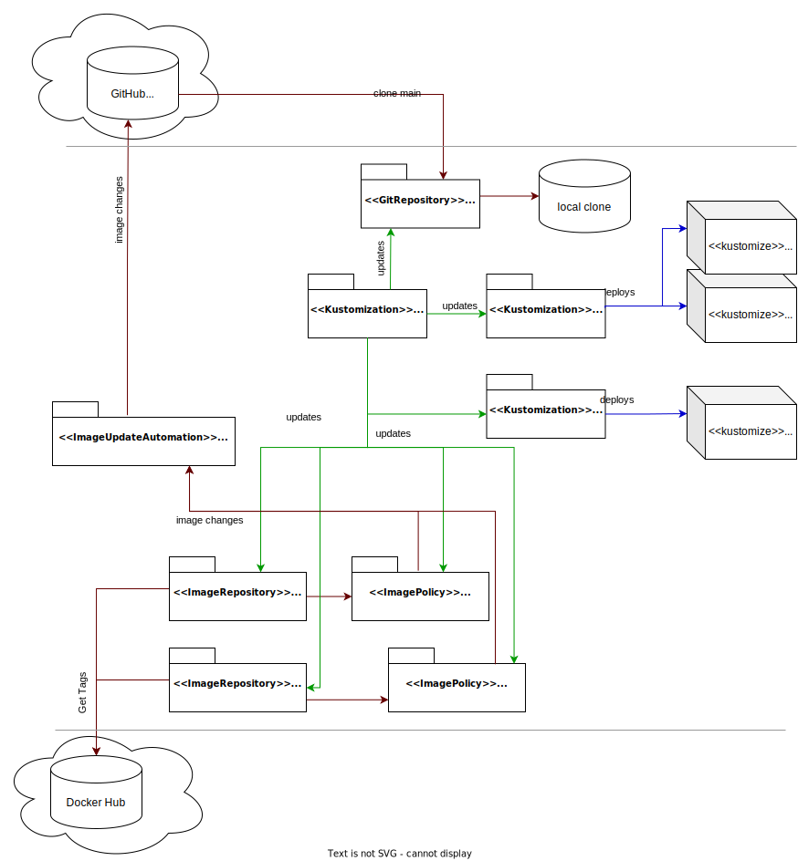

# Flux - sledovanie a aplikovanie zmien verzie docker obrazu

---

>info:>
Šablóna pre predvytvorený kontajner ([Detaily tu](../99.Problems-Resolutions/01.development-containers.md)):
`registry-1.docker.io/milung/wac-ufe-081`

---

V predchádzajúcej kapitole sme zrealizovali priebežné nasadenie podľa konfigurácie v našom repozitári. Táto konfigurácia pritom vždy nasadzuje poslednú - _latest_ - verziu obrazu nášho kontajnera (a kontajnerov závislostí, ako napr. `ufe-controller`). V prípade, že pri ďalšom vydaní niektorého z kontajnerov dôjde k zmene API, môže to ovplyvniť funkcionalitu nášho riešenia. V praxi sa preto pri produkčnom nasadení určujú vždy len špecifické vydania softvérových kontajnerov alebo dokonca špecifické varianty kontajnerov - pomocou SHA podpisu, čo pomáha zachovať stabilitu a kybernetickú bezpečnosť produkčného nasadenia. Voľbu konkrétnych verzií pre dané nasadenie je možné realizovať napr. pomocou [ImageTransformer-a](https://kubectl.docs.kubernetes.io/references/kustomize/builtins/#_imagetagtransformer_) v Kustomize konfigurácii nášho klastra.

Na rozdiel od produkčného systému chceme pri nasadení pre potreby vývojového tímu nasadzovať posledné verzie softvérových kontajnerov, ktoré úspešne prešli priebežnou integráciou. V tomto prípade nepostačuje použiť označenie `latest` (alebo iné), pretože kubernetes orchestrátor nevie, že v registri kontajnerov došlo k zmene obrazu s týmto označením. Uvádzanie špecifickej verzie obrazu by síce bolo možné, ale v prípade, že by sme chceli nasadiť novšiu verziu, museli by sme zároveň manuálne zmeniť konfiguráciu v repozitári `ambulance-gitops`, pričom najmä pri väčších tímoch by asi dochádzalo k pozabudnutiu tohto kroku. Ideálne by bolo, keby sa zmena verzie obrazu v repozitári automaticky prejavila v klastri.  V tejto kapitole si ukážeme, ako to dosiahnuť pomocou Flux-u.

Teraz máme nasadenú `latest` verziu kontajnera (viď súbor `${WAC_ROOT}/ambulance-gitops/apps/<pfx>-ambulance-ufe/deployment.yaml`). Keď vyrobíme novú verziu kontajnera, máme dve možnosti, ako ju automaticky nasadiť do klastra.

* Kontajner označíme jednoznačným tagom (napr. buildversion) a v rámci priebežnej integrácie pridáme krok, ktorý zmení spomínaný `deployment.yaml` a nastaví v ňom danú verziu kontajnera. Integračný krok upravený súbor _commit_-ne do repozitára, [Flux] zmenu zaregistruje a urobí zmeny v kubernetes klastri.
* Druhou možnosťou je, že nakonfigurujeme [Flux] tak, aby sledoval zmeny kontajnera na portáli [Docker Hub] a aby zobral novú verziu, ak je k dispozícii. [Flux] v tom prípade sám vykoná modifikáciu príslušného manifestu, nastaví v ňom poslednú vhodnú verziu kontajnera a uloží zmenu do repozitára. Týmto spôsobom stále zostáva zachovaný  princíp GitOps, ktorý určuje, že _jediný objekt konfigurácie je git repozitár_. Až po zmene verzie docker obrazu v príslušnej vetve v git repozitári nastane aktualizácia v klastri.

1. V prvom kroku určíme, ktorý [repozitár](https://fluxcd.io/flux/components/image/imagerepositories/) softvérového kontajnera má Flux sledovať. Náš _ambulance-ufe_ docker obraz je verejne prístupný, tzn. že nie je treba riešiť autentifikáciu. Vytvorte súbor `${WAC_ROOT}/ambulance-gitops/cluster/localhost/gitops/ambulance-ufe.image-repository.yaml` s obsahom:

    ```yaml
    apiVersion: image.toolkit.fluxcd.io/v1beta2
    kind: ImageRepository
    metadata:
      name: ambulance-ufe
      namespace: wac-hospital
    spec:
      image: <docker-id>/ambulance-ufe @_important_@
      interval: 1m0s
    ```

    >warning:> Zameňte \<docker-id\> !

    Vytvorte tiež súbor `${WAC_ROOT}/ambulance-gitops/cluster/localhost/gitops/ufe-controller.image-repository.yaml` s obsahom:

    ```yaml
    apiVersion: image.toolkit.fluxcd.io/v1beta2
    kind: ImageRepository
    metadata:
      name: ufe-controller
      namespace: wac-hospital
    spec:
      image: milung/ufe-controller
      interval: 15m0s
    ```

2. Ďalší Flux komponent [_ImagePolicy_](https://fluxcd.io/flux/components/image/imagepolicies/) nastavuje kritérium, podľa ktorého sa vyberie príslušná verzia docker obrazu. Vytvorte súbor `${WAC_ROOT}/ambulance-gitops/cluster/localhost/gitops/ambulance-ufe.image-policy.yaml` s obsahom:

   ```yaml
   apiVersion: image.toolkit.fluxcd.io/v1beta2
   kind: ImagePolicy
   metadata:
     name: ambulance-ufe
     namespace: wac-hospital
   spec:
     imageRepositoryRef:
       name: ambulance-ufe # referuje ImageRepository z predchádzajúceho kroku @_important_@
     filterTags:
         pattern: "main.*" # vyberie všetky verzie, ktoré začínajú na main- (napr. main-20240315.1200) @_important_@
     policy:
      alphabetical:
        order: asc
       
   ```

   a súbor  `${WAC_ROOT}/ambulance-gitops/cluster/localhost/gitops/ufe-controller.image-policy.yaml`

   ```yaml
   apiVersion: image.toolkit.fluxcd.io/v1beta2
   kind: ImagePolicy
   metadata:
     name: ufe-controller
     namespace: wac-hospital
   spec:
     imageRepositoryRef:
       name: ufe-controller # referuje ImageRepository z predchádzajúceho kroku @_important_@
     policy:
       semver:
         range: "^1.*.*" @_important_@
   ```

3. Upravíme všetky súbory, kde chceme, aby Flux aktualizoval verziu docker obrazu. To sa realizuje pridaním špeciálneho markeru `# {"$imagepolicy": "POLICY_NAMESPACE:POLICY_NAME"}` na riadok, ktorý sa má upravovať. V našom prípade by sme mohli upraviť súbor `${WAC_ROOT}/ambulance-gitops/apps/<pfx>-ambulance-ufe/deployment.yaml` a upraviť konfiguráciu v priečinku `${WAC_ROOT}/ambulance-gitops/infrastructure/ufe-controller`. Výhodnejšie je v tomto prípade ale mať všetky verzie kontajnerov na jednom mieste a zároveň mať možnosť riadiť verzie kontajnerov pre jednotlivé vydania nášho systému. K tomu využijeme takzvané [_Kustomize components_](https://kubectl.docs.kubernetes.io/guides/config_management/components/), ktoré umožňujú kombinovať jednotlivé varianty konfigurácie.

   Vytvorte súbor `${WAC_ROOT}/ambulance-gitops/components/version-developers/kustomization.yaml` s obsahom:

   ```yaml
   apiVersion: kustomize.config.k8s.io/v1alpha1  
   kind: Component 
   
   images:
   - name: <docker-id>/ambulance-ufe  @_important_@
     newName: <docker-id>/ambulance-ufe # {"$imagepolicy":  "wac-hospital:ambulance-ufe:name"} @_important_@
     newTag: main # {"$imagepolicy": "wac-hospital:ambulance-ufe:tag"} @_important_@
   
   - name: milung/ufe-controller
     newName: milung/ufe-controller # {"$imagepolicy":  "wac-hospital:ufe-controller:name"} @_important_@
     newTag: latest # {"$imagepolicy": "wac-hospital:ufe-controller:tag"} @_important_@
   ```

   Všimnite si markre v komentároch - je dôležité, aby referovali správne názvy _image police_, vytvorených v predchádzajúcom kroku.

   Teraz upravte súbory `${WAC_ROOT}/ambulance-gitops/clusters/localhost/install/kustomization.yaml` a `${WAC_ROOT}/ambulance-gitops/clusters/localhost/prepare/kustomization.yaml`. Do oboch pridajte nasledujúcu sekciu:

     ```yaml
     ...
     components: 
      - ../../../components/version-developers
     ```

    Týmto spôsobom cez kustomizáciu upravíme všetky miesta v referencovaných yaml súboroch, kde sa nachádza obraz `<docker_id>/ambulance-ufe` alebo `milung/ufe-controller`.

4. Vytvoríme nový komponent `ImageUpdateAutomation`, kde zadefinujeme miesto, kde sa nachádzajú súbory, ktoré sa majú modifikovať. Vytvorte súbor  `${WAC_ROOT}/ambulance-gitops/clusters/localhost/gitops/image-update-automation.yaml` s obsahom:

   ```yaml
   apiVersion: image.toolkit.fluxcd.io/v1beta1
   kind: ImageUpdateAutomation
   metadata:
     name: image-updater
     namespace: wac-hospital
   spec:
     interval: 1m0s
     sourceRef:
       kind: GitRepository
       name: gitops-repo # repozitár ktorý sme konfigurovali v predchádzajúcej kapitole @_important_@
     git:
       checkout:
         ref:
           branch: main @_important_@
       commit:
         author:
           email: fluxcdbot@users.noreply.github.com
           name: fluxcd_bot
         messageTemplate: |
            Automated image update
            
            Automation name: {{ .AutomationObject }}
            
            Files:
            {{ range $filename, $_ := .Updated.Files -}}
            - {{ $filename }}
            {{ end -}}
            
            Images:
            {{ range .Updated.Images -}}
            - {{.}}
            {{ end -}}
       push:
         branch: main  @_important_@
     update:
       path: ./components/version-developers  # cesta kde chceme automaticky upraviť našu konfiguráciu @_important_@
       strategy: Setters
   ```

     >warning:> Pokiaľ používate `master` vetvu alebo inú, upravte názov pri položkách `main`

    Tento objekt bude v rámci git repozitára `gitops-repo` vo vetve `main` a priečinku `/components/version-developers` aktualizovať všetky súbory, v ktorých nájde spomínaný marker. Súbory potom archivuje. Nová verzia repozitára bude obsahovať komentár špecifikovaný v časti `commit`.

    >info:> Teoreticky by mohol byť `ImageUpdateAutomation` objekt nasadený vo viacerých klastroch, mohlo by to ale vyvolať konflikty. Je preto lepšie, aby príslušnú konfiguráciu - v našom prípade `components/version-developers` - upravoval len jeden z nasadených klastrov. V našom prípade to je lokálne nasadenie, v praxi by to bol napr. vývojový klaster, ktorý by bol používaný vývojármi a testermi pre získanie rýchlej odozvy na vykonané zmeny.

5. Nakoniec upravte súbor `${WAC_ROOT}/ambulance-gitops/clusters/localhost/gitops/kustomization.yaml` a v časti `resources` uveďte novo vytvorené súbory:
  
   ```yaml
   ...
   resources: 
   ...
    - ambulance-ufe.image-repository.yaml @_add_@
    - ambulance-ufe.image-policy.yaml @_add_@
    - ufe-controller.image-repository.yaml @_add_@
    - ufe-controller.image-policy.yaml @_add_@
    - image-update-automation.yaml @_add_@
   ```
  
6. Uložte všetky súbory, a overte správnosť Vašich konfigurácii. V priečinku `${WAC_ROOT}/ambulance-gitops` vykonajte príkazy:
  
   ```ps
   kubectl kustomize clusters/localhost/install
   kubectl kustomize clusters/localhost/prepare
   kubectl kustomize clusters/localhost
   ```

   Archivujte zmeny a synchronizujte so vzdialeným repozitárom.

    ```ps
    git add .
    git commit -m "fluxcd - image update automation"
    git push
    ```

    Týmto spôsobom sme naše zmeny zároveň aplikovali do klastra. Po chvíli sa v klastri automaticky zmení verzia kontajnera na verziu `main-YYYYMMDD.HHMM` a v repozitári môžete vidieť nový komit, ktorého autorom je `fluxcd_bot`.

   

   Overíme celý CI/CD cyklus explicitne. V priečinku `${WAC_ROOT}/ambulance-ufe` zmeňte kód komponentu `ambulance-ufe`, napr. zmeňte meno pacienta v zozname, komitnite a synchronizujte zmeny. Po chvíli, keď prebehne CI a vytvorí sa nový obraz na DockerHub-e, skontrolujte históriu na stránke [GitHub] v repozitári _ambulance-gitops_ (stlačte na nápis _N commits_ na vrchu zoznamu súborov), a potom zadajte v prehliadači adresu [http://localhost:30331/](http://localhost:30331/) a pozrite si zoznam pacientov.

   Po overení si obnovte stav repozitára - flux cd do neho zapísal nové zmeny:

   ```ps
   git fetch
   git pull
   ```
  

---

>build_circle:> V prípade zlyhania Vášho klastra, napríklad pri reinštalácii počítača, môžete nasadenie obnoviť pomocou konfigurácie v repozitári. Vytvorte si lokálnu kópiu repozitára. V adresári  `${WAC_ROOT}/ambulance-gitops/clusters/localhost/secrets` vytvorte súbor `repository-pat.yaml` ako bolo uvedené v predchádzajúcej kapitole a potom postupujte podľa pokynov uvedených v predchádzajúcej kapitole v časti _Bootstrapping Flux_. Ostatné zmeny našej konfigurácie je už postačujúce vykonávať výhradne v git repozitári, nezabudnite ale naďalej priebežne sledovať stav jednotlivých objektov, čo patrí k štandardnej praxi pri vývoji softvéru pomocou DevOps. Môžete tiež využiť objekty [_Flux CD Notification Controller_-a](https://fluxcd.io/flux/components/notification/), ktoré umožňujú sledovať stav jednotlivých objektov a v prípade zmeny zaslať notifikáciu na príslušný komunikačný kanál tímu.

---

Pre lepšie pochopenie sú na nasledujúcom obrázku znázornené komponenty spomínané v tejto kapitole a ich vzájomné prepojenie.


