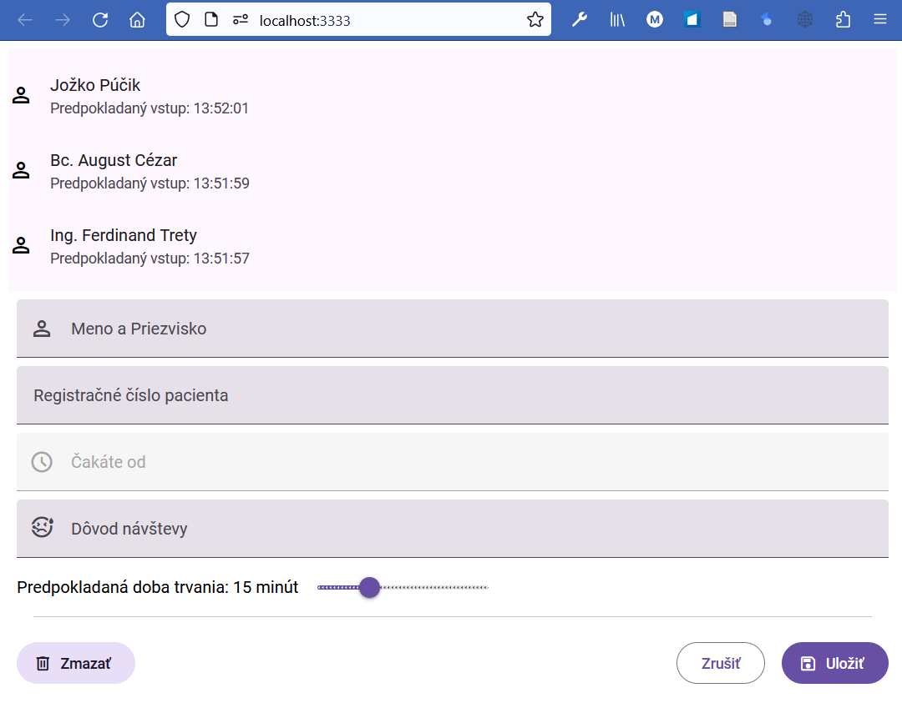

# Editor položiek a navigácia

---

>info:>
Šablóna pre predvytvorený kontajner ([Detaily tu](../99.Problems-Resolutions/01.development-containers.md)):
`registry-1.docker.io/milung/wac-ufe-090`

---

Po úvodných krokoch, ktoré nám pomôžu automatizovať našu prácu počas ďalšieho vývoja, budeme
teraz pokračovať v implementácii funkcionality našej mikro aplikácie. V tejto časti budeme riešiť pridávanie nových položiek a navigáciu medzi jednotlivými položkami.

## Komponent pre editáciu záznamov

1. Vytvoríme nový komponent pre náš editor. Prejdite do priečinku `${WAC_ROOT}/ambulance-ufe` a vykonajte nasledujúci príkaz:

     ```ps
     npm run generate
     ```

    Ako meno elementu zvoľte `<pfx>-ambulance-wl-editor` a pri ďalších otázkach zvoľte predvolené možnosti. V adresári `${WAC_ROOT}/ambulance-ufe/src/components/<pfx>-ambulance-wl-editor` máme teraz predpripravenú šablónu pre náš nový komponent.

2. V súbore `${WAC_ROOT}/ambulance-ufe/src/components/<pfx>-ambulance-wl-editor/<pfx>-ambulance-wl-editor.tsx` upravte metódu `render` do tvaru:

   ```tsx
    
    render() {
      return (
        <Host>
          <md-filled-text-field label="Meno a Priezvisko" >
            <md-icon slot="leading-icon">person</md-icon>
          </md-filled-text-field>
  
          <md-filled-text-field label="Registračné číslo pacienta" >
            <md-icon slot="leading-icon">fingerprint</md-icon>
          </md-filled-text-field>
  
          <md-filled-text-field label="Čakáte od" disabled>
            <md-icon slot="leading-icon">watch_later</md-icon>
          </md-filled-text-field>
  
          <md-filled-select label="Dôvod návštevy">
            <md-icon slot="leading-icon">sick</md-icon>
            <md-select-option value="folowup">
              <div slot="headline">Kontrola</div>
            </md-select-option>
            <md-select-option value="nausea">
              <div slot="headline">Nevoľnosť</div>
            </md-select-option>
            <md-select-option value="fever">
              <div slot="headline">Horúčka</div>
            </md-select-option>
            <md-select-option value="ache-in-throat">
              <div slot="headline">Bolesti hrdla</div>
            </md-select-option>
          </md-filled-select>
  
          <div class="duration-slider">
            <span class="label">Predpokladaná doba trvania:&nbsp; </span>
            <span class="label">{this.duration}</span>
            <span class="label">&nbsp;minút</span>
            <md-slider
              min="2" max="45" value={this.duration} ticks labeled
              oninput={this.handleSliderInput.bind(this)}></md-slider>
          </div>
  
          <md-divider></md-divider>
          <div class="actions">
            <md-filled-tonal-button id="delete"
              onClick={() => this.editorClosed.emit("delete")}>
              <md-icon slot="icon">delete</md-icon>
              Zmazať
            </md-filled-tonal-button>
            <span class="stretch-fill"></span>
            <md-outlined-button id="cancel"
              onClick={() => this.editorClosed.emit("cancel")}>
              Zrušiť
            </md-outlined-button>
            <md-filled-button id="confirm"
              onClick={() => this.editorClosed.emit("store")}>
              <md-icon slot="icon">save</md-icon>
              Uložiť
            </md-filled-button>
          </div>
        </Host>
      );
    }
   ```

   a doplňte nasledujúci kód do triedy `<Pfx>AmbulanceWlEditor`:

   ```tsx
    import { Component, Host, Prop, State, h, EventEmitter, Event } from '@stencil/core'; @_add_@
    ...
    export class <Pfx>AmbulanceWlEditor {
    
      @Prop() entryId: string; @_add_@
      @_add_@
      @Event({eventName: "editor-closed"}) editorClosed: EventEmitter<string>; @_add_@
      @_add_@
      @State() private duration = 15 @_add_@
      @_add_@
      private handleSliderInput(event: Event) {  @_add_@
        this.duration = +(event.target as HTMLInputElement).value;  @_add_@
      } @_add_@
    ...
    ```

   V kóde si všimnite premennú `duration` a spôsob, akým pri zmene hodnoty `md-slider` elementu túto vlastnosť nastavíme na aktuálnu hodnotu. Označenie premennej dekorátorom `@Prop` alebo `@State` zabezpečí, že sa pri zmene ich hodnoty znovu vykreslí náš element s aktuálnymi hodnotami. `@Prop() entryId` deklaruje, že náš element bude obsahovať atribút s menom `entry-id`, ktorý bude určovať identifikátor záznamu, ktorý chceme upraviť. Názvy vlastností sú automaticky preklopené do HTML atribútov vo formáte `lower-case` (detaily pozrite [tu](https://stenciljs.com/docs/properties#attribute-name-attribute)). Ďalej deklarujeme, že náš element bude generovať udalosti `editor-closed` typu `EventEmitter<string>`.

3. V kóde sme použili nové elementy z knižnice `@material/web`. Otvorte súbor `${WAC_ROOT}/ambulance-ufe/src/global/app.ts` a doplňte načítanie príslušných komponentov:

   ```ts
   import '@material/web/list/list'  
   import '@material/web/list/list-item'   
   import '@material/web/icon/icon'
   import '@material/web/textfield/filled-text-field'  @_add_@
   import '@material/web/select/filled-select'  @_add_@
   import '@material/web/select/select-option'  @_add_@
   import '@material/web/slider/slider'  @_add_@
   import '@material/web/button/filled-button'  @_add_@
   import '@material/web/button/filled-tonal-button'  @_add_@
   import '@material/web/button/outlined-button'  @_add_@
   import '@material/web/divider/divider'  @_add_@
   ...
   ```

4. V súbore `${WAC_ROOT}/ambulance-ufe/src/index.html`  upravte telo html stránky do podoby

    ```html
    ...
    <body>
         <<pfx>-ambulance-wl-list></<pfx>-ambulance-wl-list>
         <<pfx>-ambulance-wl-editor></<pfx>-ambulance-wl-editor> @_add_@
    </body>
    ...
    ```

    V priečinku `${WAC_ROOT}/ambulance-ufe` vykonajte príkaz:

    ```ps
    npm run start
    ```

   V prehliadači otvorte stránku [http://localhost:3333/](http://localhost:3333/). Vidíte oba naše komponenty, pričom komponent `<pfx>-ambulance-wl-editor` zatiaľ pôsobí neusporiadane.

5. Upravte súbor `${WAC_ROOT}/ambulance-ufe/src/components/<pfx>-ambulance-wl-editor/<pfx>-ambulance-wl-editor.css`:

   ```css
    :host {
      --_wl-editor_gap: var(--wl-gap, 0.5rem);

      display: flex;
      flex-direction: column;  
      gap: var(--_wl-editor_gap);
      padding: var(--_wl-editor_gap);
    }

    .duration-slider {
      display: flex;
      flex-direction: row;
      align-content: space-around;
      align-items: center;
    }

    .actions {
      display: flex;
      flex-direction: row;
      justify-content: flex-end;
      gap: 1rem;

    }

    .stretch-fill {
      flex: 10 0 0;
    }

    md-divider {
      margin-bottom: var(--_wl-editor_gap);
    } 
   ```

   Pomocou CSS štýlu [Flexbox](https://developer.mozilla.org/en-US/docs/Web/CSS/CSS_flexible_box_layout/Basic_concepts_of_flexbox) sme rozmiestnili jednotlivé prvky v našom komponente a umožnili sme nastaviť medzeru medzi jednotlivými prvkami pomocou [vlastného CSS štýlu](https://developer.mozilla.org/en-US/docs/Web/CSS/Using_CSS_custom_properties) `--wl-gap`. Po uložení a skompilovaní by ste mali vidieť nasledujúci výsledok:

  

  >info:> Ak chcete dosiahnuť responzívny dizajn Vašej stránky, odporúčame v maximálnej miere využívat [CSS Flexbox](https://developer.mozilla.org/en-US/docs/Web/CSS/CSS_flexible_box_layout/Basic_concepts_of_flexbox) a [CSS Grid](https://developer.mozilla.org/en-US/docs/Web/CSS/CSS_grid_layout/Basic_concepts_of_grid_layout), ako aj využívanie relatívnych jednotiek ako sú `rem`, `em`, `vw`, a `vh`.

   Skontrolujte funkčnosť jednotlivých elementov. Momentálne máme oba komponenty dizajnovo navrhnuté, teraz musíme naimplementovať aplikačnú logiku aplikácie. V prvom rade chceme, aby bol každý z týchto komponentov zobrazený na samostatných podstránkach (v zmysle SPA - to znamená bez načítavania stránky z web servera). Na to budeme potrebovať nový komponent, ktorý v závislosti od aktuálnej adresy stránky zobrazí príslušný komponent.

## Navigácia medzi komponentami

Momentálne zobrazujeme zoznam čakajúcich pacientov a aj editor pre jednotlivé záznamy na jednej stránke. Našim cieľom je dosiahnuť, aby sa zoznam zobrazoval na adrese [http://localhost:3333/list](http://localhost:3333/list) a editor na adrese [http://localhost:3333/entry/<id-položky>](http://localhost:3333/ambulance-wl/entry/0). Dôvodom je možnosť navigácie medzi týmito prvkami pre používateľa a zároveň zachovanie funkcie navigačných tlačidiel. Zároveň chceme, aby bolo možné našu aplikáciu obslúžiť aj keď je umiestnená na inej ako koreňovej adrese servera, ako napríklad na adrese `http://wac-hospital.wac/<pfx>-ambulance/`. K tomu budeme potrebovať nový komponent, ktorého úlohou bude zobraziť jeden z našich komponentov v závislosti od aktuálnej adresy stránky a zároveň reagovať na zmeny v navigácii.

Pre účely navigácie budeme využívať [Navigation API], ktorého cieľom je umožniť jednostránkovým aplikáciám získať kontrolu nad požiadavkami k zmene stránky a podľa potreby zabrániť alebo povoliť načítanie novej stránky. Toto API ale momentálne _(august 2023)_ nie je k dispozícii pre všetky prehliadače. Pomôžeme si vytvorením zjednodušenej [polyfill](https://developer.mozilla.org/en-US/docs/Glossary/Polyfill) implementácie. Táto implementácia nie je síce plnohodnotná, pre naše potreby je ale dostatočná.

>info:> Zabezpečenie prepojenia adresy stránky - URL jednotlivých záznamov - s aktuálnym záznamom, je pri vývoji _Single  Page Web Application_ dôležitý koncept. Používateľovi to umožňuje vytváranie záložiek, ku ktorým sa môže neskôr vrátiť, alebo zdieľanie URL, ktorá ukazuje k špecifickému záznamu.

1. Vytvorte nový súbor `${WAC_ROOT}/ambulance-ufe/src/global/navigation.ts` a vložte doňho nasledujúci kód:

   ```ts
   class PolyNavigationDestination {
        constructor(url: string) {
            this.url = url;
        }
        url: string;
   }

   class PolyNavigateEvent extends Event {
        constructor(destination: string | URL, info?: any) {
            super('navigate', { bubbles: true, cancelable: true });
            
            let rebased  = new URL(destination,  document.baseURI)
            this.canIntercept = location.protocol === rebased.protocol
            && location.host === rebased.host && location.port === rebased.port;
            this.destination = new PolyNavigationDestination(rebased.href);
            this.info = info;
        }

        destination: PolyNavigationDestination;
        canIntercept: boolean = true;
        info: any
        isIntercepted = false;

        intercept(_options?: any ) {
            this.isIntercepted = true;
            // options are ignored in this implementation, e.g. no handler or scroll
        }

        scroll(_options?: any ) {
            // not implemented 
        }
    }
   ```

   Tento kód definuje dve nové triedy, ktoré budeme používať na reprezentáciu [udalosti navigácie](https://developer.mozilla.org/en-US/docs/Web/API/NavigateEvent), ktoré budeme používať v prípade, že prehliadač nepodporuje [Navigation API].

   Ďalej do súboru doplňte nasledujúci kód:

   ```ts
   ...
   declare global {
     interface Window { navigation: any; }
   }

   export function registerNavigationApi() {
      if (!window.navigation) { // provide pollyfill only if not present @_important_@
          // simplified version of navigation api
          window.navigation = new EventTarget();
          const oldPushState = window.history.pushState.bind(window.history);

          window.history.pushState = (f => function pushState() {
              var ret = f.apply(this, arguments);
              let url = arguments[2];
              window.navigation.dispatchEvent(new PolyNavigateEvent(url));
              return ret;
          })(window.history.pushState);

          window.addEventListener("popstate", () => {
              window.navigation.dispatchEvent(new PolyNavigateEvent(document.location.href));
          });

          let previousUrl = '';
          const observer = new MutationObserver(function () {
              if (location.href !== previousUrl) {
                  previousUrl = location.href;
                  window.navigation.dispatchEvent(new PolyNavigateEvent(location.href));
              }
          });

          const config = { subtree: true, childList: true };
          observer.observe(document, config);
          window.onunload = () => {
              observer.disconnect();
          }

          window.navigation.navigate = (
              url: string, 
              options: {state?: any; info?: any; history?: "auto" | "replace" | "push";}
          ) => {
            const ev = new PolyNavigateEvent(url, options?.info);
            window.navigation.dispatchEvent(ev);
            if (ev.isIntercepted) {
                oldPushState(options?.state || {}, '', url);
            } else {
                window.open(url, "_self");
            }
          }

          window.navigation.back = (
            _options?: {info?: any;}
          ) => {
              window.history.back();
              return {
                  commited: Promise.resolve(),
                  finished: new Promise<void>( resolve => setTimeout( () => resolve()  , 0))
              }
          }
      }
   }
   ```

   Táto funkcia najprv overí, či prehliadač už podporuje [Navigation API]. Pokiaľ tomu tak nie je, tak preťaží metódu [`window.history.pushState`](https://developer.mozilla.org/en-US/docs/Web/API/History/pushStatevyužíva) - táto metóda je bežne využívaná v SPA aplikáciách na dosiahnutie obdobného účelu ako _Navigation API_. Ďalej sa zaregistrujeme na udalosť [`popstate`], ktorá je generovaná pri stlačení navigácie "Späť" v prehliadači, a nakoniec zaregistrujeme [`MutationObserver`](https://developer.mozilla.org/en-US/docs/Web/API/MutationObserver), ktorým budeme pozorovať zmeny hodnoty `href` na [Location](https://developer.mozilla.org/en-US/docs/Web/API/Location). Týmto sme obalili všetky spôsoby, ktoré môžu indikovať zmenu adresy pri činnosti našej aplikácie v prehliadači, a vo všetkých prípadoch generujeme udalosť `PolyNavigateEvent`, simulujúc tak funkcionalitu [Navigation API].

   Ďalej sme vytvorili funkciu [`navigate`](https://developer.mozilla.org/en-US/docs/Web/API/Navigation/navigate), ktorá umožňuje vyvolať navigáciu v našej aplikácii. Táto funkcia je však len obalom pre volanie `window.history.pushState` a generovanie udalosti `PolyNavigateEvent`. Ostatné metódy a udalosti [Navigation API] sme neimplementovali, pretože ich v našej aplikácii nepotrebujeme. Obdobným spôsobom je naimplementovaná aj funkcia [`back`](https://developer.mozilla.org/en-US/docs/Web/API/Navigation/back).

   Nakoniec upravte súbor `${WAC_ROOT}/ambulance-ufe/src/global/app.ts` a doplňte načítanie príslušného kódu:

   ```ts
    import { registerNavigationApi } from './navigation.js' @_add_@

    export default function() { 
        registerNavigationApi() @_add_@
    }
   ```

2. Vygenerujte nový komponent `<pfx>-ambulance-wl-app` vykonaním nasledujúceho príkazu v priečinku `${WAC_ROOT}/ambulance-ufe`:

    ```ps
    npm run generate
    ```

   V súbore `${WAC_ROOT}/ambulance-ufe/src/components/<pfx>-ambulance-wl-app/<pfx>-ambulance-wl-app.tsx` zmeňte metódu `render` do tvaru:

    ```tsx
    render() {
      let element = "list"
      let entryId = "@new"

      if ( this.relativePath.startsWith("entry/"))
      {
        element = "editor";
        entryId = this.relativePath.split("/")[1]
      }

      const navigate = (path:string) => {
        const absolute = new URL(path, new URL(this.basePath, document.baseURI)).pathname;
        window.navigation.navigate(absolute)
      }

      return (
        <Host>
          { element === "editor" 
          ? <<pfx>-ambulance-wl-editor entry-id={entryId}
              oneditor-closed={ () => navigate("./list")} >
            </<pfx>-ambulance-wl-editor>
          : <<pfx>-ambulance-wl-list></<pfx>-ambulance-wl-list>
          }
          
        </Host>
      );
    }
    ```

    Táto metóda zobrazí jeden z našich dvoch komponentov v závislosti od hodnoty vlastnosti triedy `relativePath`. V prípade, že je adresa stránky v tvare `editor/<id>`, tak zobrazíme komponent `<pfx>-ambulance-wl-editor` a nastavíme mu atribút `entry-id` na hodnotu `<id>`. Tento atribút bude slúžiť na identifikáciu záznamu, ktorý chceme upraviť. V prípade, že je adresa stránky v tvare `list`, alebo v ľubovoľnom inom tvare, tak zobrazíme komponent `<pfx>-ambulance-wl-list`. V prípade editora zaregistrujeme obsluhu udalosti `onEditor-closed`, ktorá sa vyvolá pri stlačení tlačidla "Zrušiť" alebo "Uložiť" v komponente `<pfx>-ambulance-wl-editor`. V tomto prípade zavoláme funkciu `window.navigation.navigate()`, ktorá vyvolá navigáciu na zoznam čakajúcich.

    >info:> V zásade by sme pri zavretí editora mohli volať aj metódu `window.navigation.back()`, ktorá by nám umožnila vrátiť sa na predchádzajúcu stránku. To by ale viedlo k nekonzistentnému správaniu aplikácie, pretože by sme sa mohli dostať do stavu, kedy by sme sa mohli vrátiť na stránku, ktorá nie je zoznamom čakajúcich. Preto je lepšie použiť metódu `window.navigation.navigate()`, ktorá nám explicitne umožní navigáciu na zoznam čakajúcich.

    Ďalej v tom istom súbore upravte triedu `<Pfx>AmbulanceWlApp` tak, aby obsahovala nasledujúci kód:

   ```tsx
    import { Component, Host, Prop, State, h } from '@stencil/core'; @_important_@
    @_add_@
    declare global {@_add_@
      interface Window { navigation: any; } @_add_@
    }
    ...
    export class <Pfx>AmbulanceWlApp { 

      @State() private relativePath = ""; @_add_@
      @_add_@
      @Prop() basePath: string=""; @_add_@
      @_add_@
      componentWillLoad() { @_add_@
        const baseUri = new URL(this.basePath, document.baseURI || "/").pathname; @_add_@
        @_add_@
        const toRelative = (path: string) => { @_add_@
          if (path.startsWith( baseUri)) { @_add_@
            this.relativePath = path.slice(baseUri.length) @_add_@
          } else { @_add_@
            this.relativePath = "" @_add_@
          } @_add_@
        } @_add_@
        @_add_@
        window.navigation?.addEventListener("navigate", (ev: Event) => { @_add_@
          if ((ev as any).canIntercept) { (ev as any).intercept(); }  @_add_@
          let path = new URL((ev as any).destination.url).pathname; @_add_@
          toRelative(path);   @_add_@
        }); @_add_@
        @_add_@
        toRelative(location.pathname) @_add_@
      } @_add_@

      render() {
        ...
   ```

   V metóde `componentWillLoad()` sme zaregistrovali obsluhu udalosti `navigate`, ktorá sa vyvolá pri navigácii v našej aplikácii. Volaním metódy `intercept()` sme prehliadaču dali vedieť, že zmenu URL obsluhujeme z nášho kódu. V tejto obsluhe sme potom získali cestu k aktuálnej stránke a uložili sme ju do vlastnosti `relativePath`. Táto vlastnosť bude slúžiť na rozhodnutie, ktorý z našich komponentov zobrazíme. Atribút elementu `base-path` zároveň umožňuje, aby sme našu aplikáciu mohli nasadiť aj na inej ako koreňovej adrese servera, respektíve viac vnorenej ako je `baseUri` dokumentu.

   >warning:> Nie vo všetkých aplikáciách budete chcieť volať `intercept()` pre akúkoľvek URL adresu, toto je špecifické pre naše cvičenie. V prípade, že by sme nevolali `intercept()`, tak by sa prehliadač pokúsil načítať stránku z web servera.

3. Dôležitým aspektom je práca s `document.baseURI`. Táto vlastnosť určuje, aká je bázova URL nášho dokumentu (rozumej stránky), voči ktorej sa potom určuje relatívna cesta. Za normálnych okolností je táto adresa zhodná s adresou, z ktorej sme našu stránku načítali, teda adresa ktorú sme prvotne zadali do prehliadača. Pretože v prípade jednostránkových aplikácií môže byť táto adresa odlišná od samotnej adresy aplikácie - napríklad ak by sme v prehliadači zadali adresu [http://localhost:3333/editor/id](http://localhost:3333/editor/id), tak by náš kód nepracoval správne, respektíve by musel implicitne predpokladať, na akej ceste je vlastne táto aplikácia nasadená. Pre správnu funkčnosť je preto v prípade jednostránkových aplikácií nutné nastaviť `baseUri` dokumentu a prípadne umožniť aj konfiguráciu tejto hodnoty pomocou premennej prostredia, pokiaľ plánujeme naše komponenty dodávať aj ako samostatný HTTP server.

   Potrebnú zmenu vykonáme v súbore `${WAC_ROOT}/ambulance-ufe/src/index.html` tým, že do sekcie `<head>` pridáme elemet `<base>`:

   ```html
    <!DOCTYPE html>
    <html dir="ltr" lang="en">
      <head>
        <base href="/"/> @_add_@
    ....
   ```

   následne v tom istom súbore použijeme náš nový komponent `<pfx>-ambulance-wl-app`:

   ```html
    <body>
      <<pfx>-ambulance-wl-list></<pfx>-ambulance-wl-list> @_remove_@
      <<pfx>-ambulance-wl-editor></<pfx>-ambulance-wl-editor> @_remove_@
      <!-- web application root component -->
      <<pfx>-ambulance-wl-app base-path="/ambulance-wl/"></<pfx>-ambulance-wl-app> @_add_@
     
    </body>
   ```

4. Pokiaľ nie je aktívny, tak naštartujte vývojový web server (`npm run start`) a v prehliadači prejdite na stránku  [http://localhost:3333/ambulance-wl](http://localhost:3333/ambulance-wl), kde uvidíte komponent so zoznamom čakajúcich. Následne prejdite na stránku  [http://localhost:3333/ambulance-wl/entry/0](http://localhost:3333/ambulance-wl/entry/0), kde uvidíte komponent editácie jednotlivých záznamov. Po stlačení na niektoré z tlačidiel sa dostanete späť na zoznam čakajúcich pacientov.

5. Aby bola naša interakcia úplná, upravte súbor `${WAC_ROOT}/ambulance-ufe/src/components/pfx-ambulance-wl-list/pfx-ambulance-wl-list.tsx` a doplňte nasledujúce časti kódu:

   ```tsx
   import { Component, Event, EventEmitter,  Host, h } from '@stencil/core'; @_important_@
   ...
   export class PfxAmbulanceWlList { 

    @Event({ eventName: "entry-clicked"}) entryClicked: EventEmitter<string>; @_add_@
    ...
    render() {
    return (
      <Host>
        <md-list>   
          {this.waitingPatients.map((patient, index) =>   @_important_@
            <md-list-item onClick={ () => this.entryClicked.emit(index.toString())}> @_add_@
                <div slot="headline">{patient.name}</div>
                <div slot="supporting-text">{"Predpokladaný vstup: " + this.isoDateToLocale(patient.estimatedStart)}</div>
                <md-icon slot="start">person</md-icon>
            </md-list-item>
        ...
   ```

   Tento kód zabezpečí, že pri kliknutí na záznam v zozname čakajúcich pacientov sa vyvolá udalosť `entry-clicked`, ktorá bude obsahovať index záznamu, ktorý chceme upraviť. Túto udalosť budeme obsluhovať v komponente `<pfx>-ambulance-wl-app` a vyvoláme navigáciu na stránku editora. Upravte súbor `${WAC_ROOT}/ambulance-ufe/src/components/<pfx>-ambulance-wl-app/<pfx>-ambulance-wl-app.tsx` a doplňte nasledujúce časti kódu:

   ```tsx
    ...
    render() {
      ...

      return (
       ...
          : <<pfx>-ambulance-wl-list 
              onentry-clicked={ (ev: CustomEvent<string>)=> navigate("./entry/" + ev.detail) } > @_add_@
            </<pfx>-ambulance-wl-list>
        ...
   ```

   V aplikácii teraz môžete slačiť na položku v zozname, čo vyvolá navigáciu na stránku editora.

   >info:> Zámerne obsluhujeme navigáciu len v elemente `<pfx>-ambulance-wl-app.tsx`. Element zoznam čakajúcich možno takto použiť aj v iných kontextoch a stlačenie na položku môže vyvolať alternatívnu reakciu bez nutnosti ďalej upravovať samotný element zoznamu čakajúcich. Týmto sme dosiahli znovupoužiteľnosť elementu `<pfx>-ambulance-wl-list` v iných kontextoch. Podobne možno použiť v iných kontextoch aj element editora.

6. Upravte testovacie súbory tak, aby sme mohli odovzdať naše zmeny do projektu. Otvorte súbor `${WAC_ROOT}/ambulance-ufe/src/components/<pfx>-ambulance-wl-app/test/<pfx>-ambulance-wl-app.spec.tsx` a upravte do tvaru:

    ```ts
    import { newSpecPage } from '@stencil/core/testing';
    import { <Pfx>AmbulanceWlApp } from '../<pfx>-ambulance-wl-app';
    
    describe('<pfx>-ambulance-wl-app', () => {
    
      it('renders editor', async () => {
        const page = await newSpecPage({
          url: `http://localhost/entry/@new`,
          components: [<Pfx>AmbulanceWlApp],
          html: `<<pfx>-ambulance-wl-app base-path="/"></<pfx>-ambulance-wl-app>`,
        });
        page.win.navigation = new EventTarget()
        const child = await page.root.shadowRoot.firstElementChild;
        expect(child.tagName.toLocaleLowerCase()).toEqual ("<pfx>-ambulance-wl-editor");
        
      });

      it('renders list', async () => {
        const page = await newSpecPage({
          url: `http://localhost/ambulance-wl/`,
          components: [<Pfx>AmbulanceWlApp],
          html: `<<pfx>-ambulance-wl-app base-path="/ambulance-wl/"></<pfx>-ambulance-wl-app>`,
        });
        page.win.navigation = new EventTarget()
        const child = await page.root.shadowRoot.firstElementChild;
        expect(child.tagName.toLocaleLowerCase()).toEqual("<pfx>-ambulance-wl-list");
      });
    });
    ```

   Ďalej upravte súbor `${WAC_ROOT}/ambulance-ufe/src/components/<pfx>-ambulance-wl-editor/test/<pfx>-ambulance-wl-editor.spec.tsx`

    ```ts
    import { newSpecPage } from '@stencil/core/testing';
    import { <Pfx>AmbulanceWlEditor } from '../<pfx>-ambulance-wl-editor';
    
    describe('<pfx>-ambulance-wl-editor', () => {
      it('buttons shall be of different type', async () => {
        const page = await newSpecPage({
          components: [<Pfx>AmbulanceWlEditor],
          html: `<<pfx>-ambulance-wl-editor entry-id="@new"></<pfx>-ambulance-wl-editor>`,
        });
        let items: any = await page.root.shadowRoot.querySelectorAll("md-filled-button");
        expect(items.length).toEqual(1);
        items = await page.root.shadowRoot.querySelectorAll("md-outlined-button");
        expect(items.length).toEqual(1);

        items = await page.root.shadowRoot.querySelectorAll("md-filled-tonal-button");
        expect(items.length).toEqual(1);
      });
    });
    ```

7. Archivujte zmeny a synchronizujte so vzdialeným repozitárom:

   ```ps
   git add .
   git commit -m "entry editor and navigation"
   git push
   ```

8. Poslednou zmenou je úprava web komponentu ktorý sa má zobraziť v micro Front-End aplikácii. K tomu nám postačí úprava konfigurácie. Otvorte súbor `${WAC_ROOT}/ambulance-gitops/apps/<pfx>-ambulance-ufe/webcomponent.yaml` a v sekcii `navigation` zadajte nové meno elementu:

   ```yaml
    navigation:
    - element: <pfx>-ambulance-wl-list @_remove_@

    # aplication context element
    - element: <pfx>-ambulance-wl-app    @_add_@
   ```

   Zmeny archivujte príkazmi v priečinku `${WAC_ROOT}/ambulance-gitops`:

   ```ps
    git add .
    git commit -m "entry editor and navigation"
    git push
   ```

   Pokiaľ nie je Váš [Docker Desktop] klaster aktívny, naštartujte ho. Po chvíli, keď operátor [Flux CD] obnoví všetky zmeny - obnovenie verzie obrazu, nasadenie zmien v konfigurácii, prejdite na stránku [http://localhost:30331](http://localhost:30331) a následne vyberte aplikáciu _Zoznam čakajúcich ..._. Mala by sa Vám zobraziť stránka s komponentom `<pfx>-ambulance-wl-list`. Po kliknutí na záznam by sa Vám mal zobraziť editor záznamu. Po stlačení na tlačidlo "Zrušiť" by ste sa mali vrátiť na zoznam čakajúcich. Hoci sme v súbore `${WAC_ROOT}/ambulance-gitops/apps/<pfx>-ambulance-ufe/webcomponent.yaml` explicitne nenastavili atribút `base-path`, tento je k elementu automaticky pridávaný službou `ufe-controller` na základe hodnoty atribútu `path` .

   >build_circle:> V prípade problémov s nasadením zmien v konfigurácii môžete overiť stav jednotlivých objektov v klastri príkazmi:
   >
   > ```ps
   > kubectl -n wac-hospital get gitrepository 
   > kubectl -n wac-hospital get kustomization 
   > kubectl -n wac-hospital get imagerepository
   > kubectl -n wac-hospital get imagepolicy
   > kubectl -n wac-hospital get imageupdateautomation
   > ```
   >
   > Prípadne použite obdobné príkazy, len miesto `get` použite `describe` pre detailnejší výpis. Odporúčame mať nainštalovaný nástroj [OpenLens] a využívať ho na efektívnejšiu analýzu problémov v klastri.
